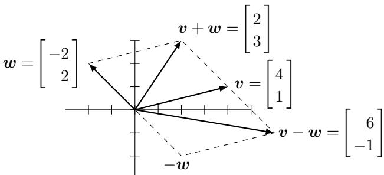
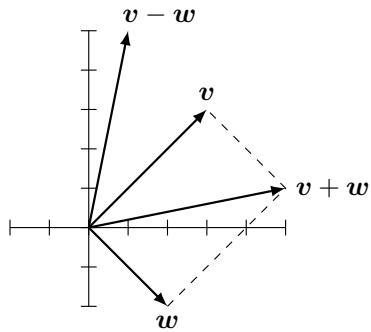
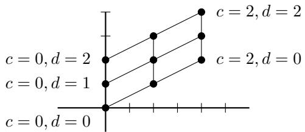
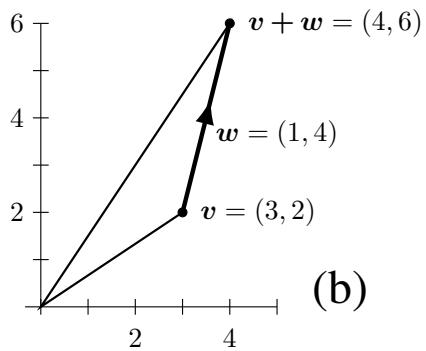
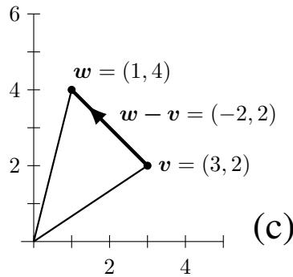
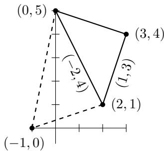
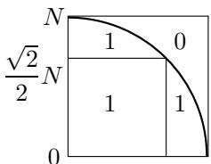

# INTRODUCTION TO LINEAR ALGEBRA

Sixth Edition

# SOLUTIONS TO PROBLEM SETS

## Gilbert Strang

Massachusetts Institute of Technology

math.mit.edu/weborder.php (orders)

math.mit.edu/linearalgebra (book website)

math.mit.edu/\~gs (author website)

www.wellesleycambridge.com (all books)

Wellesley - Cambridge Press

Box 812060

Wellesley, Massachusetts 02482

## Problem Set 1.1, page 6

1 $c = m a$ and d = mb lead to ad $= a m b = b c$ With no zeros, ad = bc is the equation for a $2 \times 2$ matrix to have rank 1.

2 The three edges going around the triangle are $\pmb { u } = ( 5 , 0 ) , \pmb { v } = ( - 5 , 1 2 ) , \pmb { w } = ( 0 , - 1 2 )$ Their sum is $u + v + w = ( 0 , 0 )$ . Their lengths are $| | \pmb { u } | | = 5 , | | \pmb { v } | | = 1 3 , | | \pmb { w } | | = 1 2$ This is a $5 - 1 2 - 1 3$ right triangle with $5 ^ { 2 } + 1 2 ^ { 2 } = 2 5 + 1 4 4 = 1 6 9 = 1 3 ^ { 2 }$ —the best numbers after the $3 - 4 - 5$ right triangle if we don't count $6 - 8 - 1 0$

3 The combinations give (a) a line in $\mathbf { R } ^ { 3 }$ (b) a plane in $\mathbf { R } ^ { 3 }$ (c) all of $\mathbf { R } ^ { 3 }$

4 $\pmb { v } + \pmb { w } = ( 2 , 3 )$ and $\pmb { v } - \pmb { w } = ( 6 , - 1 )$ will be the diagonals of the parallelogram with v and w as two sides going out from (0, 0).

5 This problem gives the diagonals $\pmb { v } + \pmb { w } = ( 5 , 1 )$ and $\pmb { v } - \pmb { w } = ( 1 , 5 )$ of the parallelogram and asks for the sides v and w : The opposite of Problem 4. In this example $\pmb { v } = ( 3 , 3 )$ and ${ \pmb w } = ( 2 , - 2 )$ . Those come from ${ \pmb v } = \frac { 1 } { 2 } ( { \pmb v } + { \pmb w } ) + \frac { 1 } { 2 } ( { \pmb v } - { \pmb w } )$ and ${ \pmb w } = \textstyle \frac { 1 } { 2 } ( { \pmb v } + { \pmb w } ) - \frac { 1 } { 2 } ( { \pmb v } - { \pmb w } )$

6 $3 v + w = ( 7 , 5 )$ and cv + dw = (2c + d, c + 2d)

7 $\pmb { u } + \pmb { v } = ( - 2 , 3 , 1 )$ and $\pmb { u } + \pmb { v } + \pmb { w } = ( 0 , 0 , 0 )$ and $2 u + 2 v + w = \textmd { i }$ (add first answers) = $( - 2 , 3 , 1 )$ . The vectors ${ \mathbf { } } u , v .$ w are in the same plane because a combination $\mathbf { \nabla } \pmb { u } + \pmb { v } + \pmb { w }$ gives $( 0 , 0 , 0 )$ . Stated another way : $\pmb { u } = - \pmb { v } - \pmb { w }$ is in the plane of v and w.

8 The components of every cv+dw add to zero because the components of $\pmb { v } = ( 1 , - 2 , 1 )$ and of ${ \pmb w } = ( 0 , 1 , - 1 )$ add to zero. $c = 3$ and $d = 9 { \mathrm { ~ g i v e ~ } } 3 v + 9 w = ( 3 , 3 , - 6 )$ . There is no solution to $c \pmb { v } + d \pmb { w } = ( 3 , 3 , 6 )$ because $3 + 3 + 6$ is not zero.

9 The nine combinations $c ( 2 , 1 ) + d ( 0 , 1 )$ with $c = 0 , 1 , 2$ and $d = 0 , 1 , 2$ will lie on a lattice. If we took all whole numbers c and $d ,$ the lattice would lie over the whole plane.

10 The question is whether $( a , b , c )$ is a combination $x _ { 1 } u + x _ { 2 } v$ . Can we solve

$$
x _ { 1 } \left[ \begin{array} { c } { 1 } \\ { 1 } \\ { 0 } \end{array} \right] + x _ { 2 } \left[ \begin{array} { c } { 0 } \\ { 1 } \\ { 1 } \end{array} \right] = \left[ \begin{array} { c } { a } \\ { b } \\ { c } \end{array} \right] ?
$$

Certainly $x _ { 1 }$ has to be a. Certainly $x _ { 2 }$ has to be c. So the middle components give the requirement $a + c = b$

11 The fourth corner can be (4, 4) or (4, 0) or (–2, 2). Draw 3 possible parallelograms !

12 Four more corners $( 1 , 1 , 0 ) , ( 1 , 0 , 1 ) , ( 0 , 1 , 1 ) , ( 1 , 1 , 1 )$ . The center point is $\left( { \frac { 1 } { 2 } } , { \frac { 1 } { 2 } } , { \frac { 1 } { 2 } } \right)$

Centers of 6 faces : $\begin{array} { r } { \left( \frac { 1 } { 2 } , \frac { 1 } { 2 } , 0 \right) , \left( \frac { 1 } { 2 } , \frac { 1 } { 2 } , 1 \right) \& \left( 0 , \frac { 1 } { 2 } , \frac { 1 } { 2 } \right) , \left( 1 , \frac { 1 } { 2 } , \frac { 1 } { 2 } \right) \& \left( \frac { 1 } { 2 } , 0 , \frac { 1 } { 2 } \right) , \left( \frac { 1 } { 2 } , 1 , \frac { 1 } { 2 } \right) } \end{array}$ .12 edges.

13 The combinations of $\pmb { i } = ( 1 , 0 , 0 )$ and $\displaystyle i + j = ( 1 , 1 , 0 )$ fill the xy plane in $x y z { \mathrm { ~ s p a c e } }$

14 (a) $\mathrm { S u m } = \mathrm { z e r o ~ v e c t o r } .$ (b) $\mathrm { S u m } = - 2 { : } 0 0 \mathrm { v e c t o r } = 8 { : } 0 0 \mathrm { v e c t o r } .$

(c) 2:00 is $3 0 ^ { \circ }$ from horizontal = $\begin{array} { r } { = \left( \cos \frac { \pi } { 6 } , \sin \frac { \pi } { 6 } \right) = ( \sqrt { 3 } / 2 , 1 / 2 ) } \end{array}$

15Moving the origin to 6:00 adds $j = ( 0 , 1 )$ to every vector. So the sum of twelve vectors changes from 0 to $1 2 j = ( 0 , 1 2 )$

16 First $\mathrm { p a r t } \colon u , v , w$ are all in the same direction.

Second part : Some combination of u, v, w gives the zero vector but those 3 vectors are not on a line. Then their combinations fill a plane in 3D.

17 The two equations are $c + 3 d = 1 4$ and $2 c + d = 8 .$ The solution is $c = 2$ and $d = 4$

18 The point ${ \frac { 3 } { 4 } } v + { \frac { 1 } { 4 } } w$ is three-fourths of the way to v starting from w. The vector ${ \frac { 1 } { 4 } } { \pmb v } + { \frac { 1 } { 4 } } { \pmb w }$ is halfway to $\pmb { u } = \frac { 1 } { 2 } \pmb { v } + \frac { 1 } { 2 } \pmb { w }$ . The vector $v + w$ is 2u (the far corner of the parallelogram).

19 The combinations $c v +$ dw with $0 \leq c \leq 1$ and $0 \leq d \leq 1 f l l$ the parallelogram with sides v and w. For example, if $\pmb { v } = ( 1 , 0 )$ and $\pmb { w } = ( 0 , 1 )$ then $c { \pm } d { \pmb w }$ fills the unit square. In a special case like $\pmb { v } = ( a , 0 )$ and ${ \pmb w } = ( b , 0 )$ these combinations only fill a segment of a line.

With $c \geq 0$ and $d \geq 0$ we get the infinite “cone" or “wedge" between v and w. For example, if $\pmb { v } = ( 1 , 0 )$ and $\pmb { w } = ( 0 , 1 )$ , then the cone is the whole first quadrant $x \ge 0 , y \ge 0$ . Question: What if $\mathbf { } w = - v \textprime$ The cone opens to a half-space. But the combinations of $\pmb { v } = ( 1 , 0 )$ and ${ \pmb w } = ( - 1 , 0 )$ only fill a line.

20 (a) $\begin{array} { r } { \frac { 1 } { 3 } u + \frac { 1 } { 3 } v + \frac { 1 } { 3 } } \end{array}$ w is the center of the triangle between u, v and w; $\begin{array} { r } { \frac { 1 } { 2 } u + \frac { 1 } { 2 } } \end{array}$ w lies halfway between u and w (b) To fill the triangle keep $c \geq 0 , d \geq 0 , e \geq 0$ , and $c + d + e = { \bf 1 }$

21 The sum is $( { \pmb v } - { \pmb u } ) + ( { \pmb w } - { \pmb v } ) + ( { \pmb u } - { \pmb w } ) = { \bf z e r o }$ vector. Those three sides of a triangle are in the same plane !

22 The vector $\begin{array} { r } { \frac { 1 } { 2 } ( { \pmb u } + { \pmb v } + { \pmb w } ) } \end{array}$ is outside the pyramid because $\begin{array} { r } { c + d + e = \frac { 1 } { 2 } + \frac { 1 } { 2 } + \frac { 1 } { 2 } > 1 } \end{array}$

23 All vectors in 3D are combinations of u, v, w as drawn (not in the same plane). Start by seeing that $c { \pm } d v$ fills a plane, then adding all the vectors ew fills all of $\mathbf { R } ^ { 3 }$ . Different answer when ${ \mathbf { } } u , v , { \mathbf { } } w$ are in the same plane.

24 A four-dimensional cube has $2 ^ { 4 } = 1 6$ corners and $2 \cdot 4 = 8$ three-dimensional faces and 24 two-dimensional faces and 32 edges.

25 Fact : For any three vectors u, v, w in the plane, some combination $c \pmb { u } + d \pmb { v } + e \pmb { w }$ is the zero vector (beyond the obvious $c = d = e = 0 )$ . So if there is one combination $C \mathbf { { u } } + D \mathbf { { v } } + E \mathbf { { w } }$ that produces b, there will be many more—just add $c , d ,$ e or 2c, 2d, 2e to the particular solution C, D, E.

The example has $3 \pmb { u } - 2 \pmb { v } + \pmb { w } = 3 ( 1 , 3 ) - 2 ( 2 , 7 ) + 1 ( 1 , 5 ) = ( 0 , 0 )$ . It also has $- 2 u + 1 v + 0 w = b = ( 0 , 1 )$ . Adding gives $\pmb { u } - \pmb { v } + \pmb { w } = ( 0 , 1 )$ . In this case $c , d ,$ e equal 3, -2, 1 and $C , D , E = - 2 , 1 , 0$

Could another example have ${ \mathbf { } } u , v , { \mathbf { } } w$ that could NOT combine to produce b? Yes. The vectors $( 1 , 1 ) , ( 2 , 2 ) , ( 3 , 3 )$ are on a line and no combination produces b. We can easily solve cu $ + d { \pmb v } + e { \pmb w } = 0$ but not $C \pmb { u } + D \pmb { v } + E \pmb { w } = \pmb { b } .$

26 The combinations of v and w fill the plane unless v and w lie on the same line through (0, 0). Four vectors whose combinations fill 4-dimensional space: one example is the “standard basis" $( 1 , 0 , 0 , 0 ) , ( 0 , 1 , 0 , 0 ) , ( 0 , 0 , 1 , 0 )$ , and (0, 0, 0, 1).

27 The equations $c \pmb { u } + d \pmb { v } + e \pmb { w } = \pmb { b }$ are

$$
\begin{array} { c c c c c c c c c c c c c c c c c c c c c c } { { 2 c } } & { { - d } } & { { } } & { { } } & { { } } & { { } } & { { } } & { { } } & { { } } & { { } } & { { } } & { { } } & { { } } & { { } } & { { } } & { { } } & { { } } & { { } } & { { } } & { { } } & { { } } & { { } } & { { } } & { { } } & { { } } & { { } } & { { } } & { { } } & { { } } & { { } } & { { } } & { { } } & { { } } & { { } } & { { } } & { { } } & { { } } & { { } } & { { } } & { { } } & { { } } & { { } } & { { } } & { { } } & { { } } & { { } } & { { } } & { { } } & { { } } & { { } } & { { } } & { { } } & { { } } & { { } } & { { } } & { { } } & { { } } & { { } } & { { } } & { { } } & { { } } & { { } } & { { } } & { { } } & { { } } & { { } } & { { } } & { { } } & { { } } & { { } } & { { } } & { { } } & { { } } & { { } } & { { } } & { { } } & { { } } & { { } } & { { } } & { { } } & { { } } & { { } } & { { } } & { { } } & { { } } & { { } } & { { } } & { { } } & { { } } & { { } } & { { } } & { { } } & { { } } & { { } } & { { } } & { { } } & { { } } & { { } } & { { } } & { { } } & { { } } & { { } } & { { } } & { { } } & { { } } & { { } } & { { } } & { { } } & { { } } & { { } } & { { } } & { } \end{array}
$$

$$
- c + 2 d - e = 0 \qquad { \mathrm { t h e n ~ } } c = 3 e \qquad d = 2 / 4
$$

$$
e ^ { - } + 2 e = 0 \qquad { \mathrm { t h e n ~ } } 4 e = 1 \qquad e = 1 / 4
$$

## Problem Set 1.2, page 15

$$
\textbf { 1 } u \cdot v = - 2 . 4 + 2 . 4 = 0 , u \cdot w = - . 6 + 1 . 6 = \mathbf { 1 } , u \cdot ( v + w ) = u \cdot v + u \cdot w = - 0 . 0 0 8
$$

$$
\mathbf { 0 } + \mathbf { 1 } , \boldsymbol { w } \cdot \boldsymbol { v } = 4 + 6 = \mathbf { 1 0 } = \boldsymbol { v } \cdot \boldsymbol { w } .
$$

2 The lengths are $\lVert \mathbf { \boldsymbol { u } } \rVert = 1$ and |v|| = 5 and $\| \mathbf { \boldsymbol { w } } \| = { \sqrt { 5 } } .$ Then $| \boldsymbol { u } \cdot \boldsymbol { v } | = 0 < ( 1 ) ( 5 )$ and $| \pmb { v } \cdot \pmb { w } | = 1 0 < 5 \sqrt { 5 } .$ , confirming the Schwarz inequality.

3 Unit vectors $\begin{array} { r } { { \pmb v } / \| { \pmb v } \| = ( \frac { 4 } { 5 } , \frac { 3 } { 5 } ) = ( 0 . 8 , 0 . 6 ) \mathrm { a n d } { \pmb w } / \| { \pmb w } \| = ( 1 / \sqrt { 5 } , 2 / \sqrt { 5 } ) } \end{array}$ . The vectors $w , ( 2 , - 1 )$ , and -w make $0 ^ { \circ } , 9 0 ^ { \circ } , 1 8 0 ^ { \circ }$ angles with w. The cosine of $\theta \ \mathrm { i s } \ { \frac { \pmb { v } } { \Vert \pmb { v } \Vert } }$ ${ \frac { w } { \| w \| } } = 1 0 / 5 { \sqrt { 5 } } = 2 / { \sqrt { 5 } } .$

4 For unit vectors u, v, w : (a) v · (−v) = −1 (b) $( { \pmb v } + { \pmb w } ) \cdot ( { \pmb v } - { \pmb w } ) = { \pmb v } \cdot { \pmb v } +$ w · v − v · w − w · w = 1 + ( ) − ( ) − 1 = 0 so θ = 90° (notice v • w = w • v) (c) $( v - 2 w ) \cdot ( v + 2 w ) = v \cdot v - 4 w \cdot w = 1 - 4 = - 3 .$

5 $\pmb { u } _ { 1 } = \pmb { v } / \Vert \pmb { v } \Vert = ( 1 , 3 ) / \sqrt { 1 0 }$ and $\pmb { u } _ { 2 } = \pmb { w } / \Vert \pmb { w } \Vert = ( 2 , 1 , 2 ) / 3 . \pmb { U } _ { 1 } = ( 3 , - 1 ) / \sqrt { 1 0 }$ is perpendicular to $\mathbf { \delta u } _ { 1 }$ (and so is $( - 3 , 1 ) / \sqrt { 1 0 } ) . \ U _ { 2 }$ could be $( 1 , - 2 , 0 ) / \sqrt { 5 } \colon$ There is a whole plane of vectors perpendicular to $\mathbf { \delta } \mathbf { u } _ { 2 }$ , and a whole circle of unit vectors in that plane.

6 All vectors $\pmb { w } = ( c , 2 c )$ are perpendicular to $\pmb { v } = ( 2 , - 1 )$ . They lie on a line. All vectors $( x , y , z )$ with $x + y + z = 0$ lie on a plane. All vectors perpendicular to both (1, 1, 1) and (1, 2, 3) lie on a line in 3-dimensional space.

7 (a) cos $\theta = v \cdot w / \| v \| \| w \| = 1 / ( 2 ) ( 1 )$ SO $\theta \ : = \ : 6 0 ^ { \circ }$ or $\pi / 3$ radians (b) cos $\theta =$ 0 so θ = 90° or $\pi / 2$ radians (c) cos $\theta = 2 / ( 2 ) ( 2 ) = 1 / 2 \ s \circ \theta = 6 0 ^ { \circ } \ \mathrm { o r } \ \pi / 3$ (d) cos $\theta = - 5 / \sqrt { 1 0 } \sqrt { 5 } = - 1 / \sqrt { 2 }$ SO $\theta = 1 3 5 ^ { \circ }$ or 3π/4 radians.

8 (a) False: v and w are any vectors in the plane perpendicular to ${ \textbf { \textit { u } } } ( { \bf { b } } )$ True : $\pmb { u } \cdot ( \pmb { v } + 2 \pmb { w } ) = \pmb { u } \cdot \pmb { v } + 2 \pmb { u } \cdot \pmb { w } = 0$ (c) True, $\| \pmb { u } - \pmb { v } \| ^ { 2 } = ( \pmb { u } - \pmb { v } ) \cdot ( \pmb { u } - \pmb { v } )$ splits into $\pmb { u } \cdot \pmb { u } + \pmb { v } \cdot \pmb { v } = \pmb { 2 }$ when $\pmb { u } \cdot \pmb { v } = \pmb { v } \cdot \pmb { u } = 0$

9 If $v _ { 2 } w _ { 2 } / v _ { 1 } w _ { 1 } = - 1$ then $\begin{array} { r } { \mathrm {  ~ \gamma ~ } _ { 2 } w _ { 2 } = - v _ { 1 } w _ { 1 } \mathrm { o r } v _ { 1 } w _ { 1 } + v _ { 2 } w _ { 2 } = { \pmb v } \cdot { \pmb w } = 0 ; } \end{array}$ perpendicular! The vectors (1, 4) and $( 1 , - { \textstyle { \frac { 1 } { 4 } } } )$ are perpendicular because 1 – 1 = 0.

10 Slopes $2 / 1$ and $- 1 / 2$ multiply to $\mathrm { g i v e \mathrm { ~ - 1 ~ } }$ . Then $\mathbf { \nabla } \mathbf { \nabla } \mathbf { v } \cdot \mathbf { \nabla } w \ = \ 0$ and the two vectors (the arrow directions) are perpendicular.

11 $\mathbf { } v \cdot w < 0$ means angle $> 9 0 ^ { \circ }$ ; these w's fill half of 3-dimensional space. Draw a picture to show v and the $\mathbf { \chi } _ { w \mathrm { ~ s ~ } }$

12 (1, 1) is perpendicular to $( 1 , 5 ) - c ( 1 , 1 ) \mathrm { i f } ( 1 , 1 ) \cdot ( 1 , 5 ) - c ( 1 , 1 ) \cdot ( 1 , 1 ) = 6 - 2 c = 0$ (then $c = 3 ) . \ { \boldsymbol v } \cdot ( { \boldsymbol w } - c { \boldsymbol v } ) = 0 \ { \mathrm { i f } } \ c = { \boldsymbol v } \cdot { \boldsymbol w } / { \boldsymbol v } \cdot { \boldsymbol v }$ Subtracting cv is the key to constructing a perpendicular vector ${ \pmb w } - c { \pmb v }$

13 One possibility among many: $\pmb { u } = ( 1 , - 1 , 0 , 0 ) , \pmb { v } = ( 0 , 0 , 1 , - 1 ) , \pmb { w } = ( 1 , 1 , - 1 , - 1 )$ and (1, 1, 1, 1) are perpendicular to each other. “We can rotate those u, v, w in their 3D hyperplane and they will stay perpendicular."

$$
\textstyle { \frac { 1 } { 2 } } ( x + y ) = ( 2 + 8 ) / 2 = { \mathsf { 5 } } { \mathrm { ~ a n d ~ } } 5 > 4 ; \cos \theta = 2 { \sqrt { 1 6 } } / { \sqrt { 1 0 } } { \sqrt { 1 0 } } = 8 / 1 0 .
$$

15 $\| { \pmb v } \| ^ { 2 } = 1 + 1 + \dots + 1 = 9 \mathrm { s o } \| { \pmb v } \| = { \bf 3 } ; { \pmb u } = { \pmb v } / 3 = ( { \frac { 1 } { 3 } } , \dots , { \frac { 1 } { 3 } } )$ is a unit vector in 9D; $\pmb { w } = ( 1 , - 1 , 0 , \dots , 0 ) / \sqrt { 2 }$ is a unit vector in the 8D hyperplane perpendicular to v.

16 COS $\alpha = 1 / { \sqrt { 2 } } , \cos \beta = 0 , \cos \gamma = - 1 / { \sqrt { 2 } } .$ For any vector $\pmb { v } = ( \pmb { v } _ { 1 } , \pmb { v } _ { 2 } , \pmb { v } _ { 3 } )$ the cosines with the 3 axes are $\cos ^ { 2 } \alpha + \cos ^ { 2 } \beta + \cos ^ { 2 } \gamma = ( v _ { 1 } ^ { 2 } + v _ { 2 } ^ { 2 } + v _ { 3 } ^ { 2 } ) / \lVert v \rVert ^ { 2 } = ~ 1$

17 $\| { \pmb v } \| ^ { 2 } = 4 ^ { 2 } + 2 ^ { 2 } = 2 0 \mathrm { ~ a n d ~ } \| { \pmb w } \| ^ { 2 } = ( - 1 ) ^ { 2 } + 2 ^ { 2 } = 5$ . Pythagoras is $\| ( 3 , 4 ) \| ^ { 2 } = 2 5 =$ $2 0 + 5$ for the length of the hypotenuse $\pmb { v } + \pmb { w } = ( 3 , 4 )$

18 $| | { \pmb v } + { \pmb w } | | ^ { 2 } = ( { \pmb v } + { \pmb w } ) \cdot ( { \pmb v } + { \pmb w } ) = { \pmb v } \cdot ( { \pmb v } + { \pmb w } ) + { \pmb w } \cdot ( { \pmb v } + { \pmb w } )$ . This expands to ${ \pmb v } \cdot { \pmb v } + 2 { \pmb v } \cdot { \pmb w } + { \pmb w } \cdot { \pmb w } = | | { \pmb v } | | ^ { 2 } + 2 | | { \pmb v } | | | | { \pmb w } | | \cos \theta + | | { \pmb w } | | ^ { 2 } .$

19 We know that $( v - w ) \cdot ( v - w ) = v \cdot v - 2 v \cdot w + w \cdot w$ . The Law of Cosines writes $\| \pmb { v } \| \| \pmb { w } \|$ cos θ for $v \cdot w$ Here θ is the angle between v and w. When $\theta < 9 0 ^ { \circ }$ this $v \cdot w$ is positive, so in this case $\pmb { v } \cdot \pmb { v } + \pmb { w } \cdot \pmb { w }$ is larger than $\| \pmb { v } - \pmb { w } \| ^ { 2 }$

Pythagoras changes from equality $a ^ { 2 } + b ^ { 2 } = c ^ { 2 }$ to inequality when $\theta < 9 0 ^ { \circ } \mathrm { o r } \theta > 9 0 ^ { \circ }$

20 $2 v \cdot w \leq 2 \| v \| \| w \|$ leads to $\begin{array} { r } { \| v + w \| ^ { 2 } = v \cdot v + 2 v \cdot w + w \cdot w \leq \| v \| ^ { 2 } + 2 \| v \| \| w \| + } \end{array}$ $\| \pmb { w } \| ^ { 2 }$ . This is $( \| \pmb { v } \| + \| \pmb { w } \| ) ^ { 2 }$ . Taking square roots gives $\| \pmb { v } + \pmb { w } \| \leq \| \pmb { v } \| + \| \pmb { w } \|$

21 $v _ { 1 } ^ { 2 } w _ { 1 } ^ { 2 } + 2 v _ { 1 } w _ { 1 } v _ { 2 } w _ { 2 } + v _ { 2 } ^ { 2 } w _ { 2 } ^ { 2 } \leq v _ { 1 } ^ { 2 } w _ { 1 } ^ { 2 } + v _ { 1 } ^ { 2 } w _ { 2 } ^ { 2 } + v _ { 2 } ^ { 2 } w _ { 1 } ^ { 2 } + v _ { 2 } ^ { 2 } w _ { 2 } ^ { 2 }$ is true (cancel 4 terms) because the difference is $v _ { 1 } ^ { 2 } w _ { 2 } ^ { 2 } + v _ { 2 } ^ { 2 } w _ { 1 } ^ { 2 } - 2 v _ { 1 } w _ { 1 } v _ { 2 } w _ { 2 }$ which is $( v _ { 1 } w _ { 2 } - v _ { 2 } w _ { 1 } ) ^ { 2 } \ge 0$

$$
\begin{array} { r } { | u _ { 1 } | | U _ { 1 } | \le \frac 1 2 ( u _ { 1 } ^ { 2 } + U _ { 1 } ^ { 2 } ) } \end{array}
$$

$$
\begin{array} { r } { | u _ { 2 } | | U _ { 2 } | \le \frac 1 2 ( u _ { 2 } ^ { 2 } + U _ { 2 } ^ { 2 } ) } \end{array}
$$

$$
\begin{array} { r } { . 9 6 \leq ( . 6 ) ( . 8 ) + ( . 8 ) ( . 6 ) \leq \frac { 1 } { 2 } ( . 6 ^ { 2 } + . 8 ^ { 2 } ) + \frac { 1 } { 2 } ( . 8 ^ { 2 } + . 6 ^ { 2 } ) = 1 } \end{array}
$$

$$
. 9 6 < 1
$$

23 The cosine of θ is $x / \sqrt { x ^ { 2 } + y ^ { 2 } }$ , near side over hypotenuse. Then $| \cos \theta | ^ { 2 }$ is not greater than $1 : x ^ { 2 } / ( x ^ { 2 } + y ^ { 2 } ) \leq 1$

24 These two lines add to $2 | | \pmb { v } | | ^ { 2 } + 2 | | \pmb { w } | | ^ { 2 }$

$$
| | \pmb { v } + \pmb { w } | | ^ { 2 } = ( \pmb { v } + \pmb { w } ) \cdot ( \pmb { v } + \pmb { w } ) = \pmb { v } \cdot \pmb { v } + \pmb { v } \cdot \pmb { w } + \pmb { w } \cdot \pmb { v } + \pmb { w } \cdot \pmb { w }
$$

$$
| | v - w | | ^ { 2 } = ( v - w ) \cdot ( v - w ) = v \cdot v - v \cdot w - w \cdot v + w \cdot w
$$

25 The length $\lVert \pmb { v } - \pmb { w } \rVert$ is between 2 and 8 (triangle inequality when $\| \pmb { v } \| = 5 \mathrm { a n d } \| \pmb { w } \| =$ 3). The dot product $v \cdot w$ is between —15 and 15 by the Schwarz inequality.

26 Three vectors in the plane could make angles greater than $9 0 °$ with each other: for example $( 1 , 0 ) , ( - 1 , 4 ) , ( - 1 , - 4 )$ . Four vectors could not do this $( 3 6 0 ^ { \circ }$ total angle). How many can can be perpendicular to each other in $\mathbf { R } ^ { 3 }$ or $\mathbf { R } ^ { n } \mathbf { \hat { \xi } }$ Ben Harris and Greg Marks showed me that the answer is $n + 1$ . The vectors from the center of a regular simplex in $\mathbf { R } ^ { n }$ to its $n { \mathrel { + { 1 } } }$ vertices all have negative dot products. If $n + 2$ vectors in $\mathbf { R } ^ { n }$ had negative dot products, project them onto the plane orthogonal to the last one. Now you have $n + 1$ vectors in $\mathbf { R } ^ { n - 1 }$ with negative dot products. Keep going to 4 vectors in $\mathbf { R } ^ { 2 }$ : no way!

27 The columns of the 4 by 4 “Hadamard matrix" (times $\textstyle { \frac { 1 } { 2 } } )$ are perpendicular unit vectors:

$$
\frac 1 2 H = \frac 1 2 \left[ \begin{array} { c c c c } { 1 } & { 1 } & { 1 } & { 1 } \\ { 1 } & { - 1 } & { 1 } & { - 1 } \\ { 1 } & { 1 } & { - 1 } & { - 1 } \\ { 1 } & { - 1 } & { - 1 } & { 1 } \\ { 1 } & { - 1 } & { - 1 } & { 1 } \end{array} \right] \qquad \begin{array} { c } { \mathrm { T h e ~ c o l u m n s ~ h a v e } } \\ { \frac 1 4 + \frac 1 4 + \frac 1 4 + \frac 1 4 = 1 . } \\ { \mathrm { T h e i r ~ d o t ~ p r o d u c t s } } \\ { \mathrm { a r e ~ a l l ~ z e r o } . } \end{array} .
$$

28 The commands $V = \mathbf { r a n d n } ( 3 , 3 0 ) ; D = \mathbf { s q r t } ( \mathbf { d i a g } \left( V ^ { \prime } * V \right) ) ; U = V { \setminus } D ;$ will give 30 random unit vectors in the columns of U. Then ${ \bf { \Omega } } _ { { \pmb { u } } } ^ { \prime } * U$ is a row matrix of 30 dot products whose average absolute value should be close to $2 / \pi$

29 The four vectors ${ \pmb v } _ { 1 } , { \pmb v } _ { 2 } , { \pmb v } _ { 3 } , { \pmb v } _ { 4 }$ must add to zero. Then the four corners of the quadrilateral could be 0 and ${ \pmb v } _ { 1 }$ and ${ \pmb v } _ { 1 } + { \pmb v } _ { 2 }$ and $\pmb { v } _ { 1 } + \pmb { v } _ { 2 } + \pmb { v } _ { 3 }$ . We are allowing the side vectors v to cross each other—can you answer if that is not allowed ?

## Problem Set 1.3, page 24

1 The column space $\mathbf { C } ( A _ { 1 } )$ is a plane in ${ \bf R } ^ { 3 }$ : the two columns of $A _ { 1 }$ are independent The column space $\mathbf { C } ( A _ { 2 } )$ is all of $\mathbf { R } ^ { 3 }$ The column space $\mathbf { C } ( A _ { 3 } )$ is a line in ${ \bf R } ^ { 3 }$

2 The combination Ax = column 1 – 2 (column 2) + column 3 is zero for both matrices. This leaves 2 independent columns. So $\mathbf { C } ( A )$ is a (2-dimensional) plane in $\mathbf { R } ^ { 3 }$

3 B has 2 independent columns so its column space is a plane. The matrix C has the same 2 independent columns and the same column space as B.

$$
4 \ A { \boldsymbol { x } } = { \left[ \begin{array} { l } { 1 4 } \\ { 2 8 } \\ { 2 } \end{array} \right] } \quad { \mathrm { T y p i c a l d o t ~ p r o d u c t ~ i s } }
$$

$$
B { \pmb y } = \left[ \begin{array} { c } { { 4 } } \\ { { 8 } } \\ { { 1 8 } } \end{array} \right] \qquad I z = z = \left[ \begin{array} { c } { { z _ { 1 } } } \\ { { z _ { 2 } } } \\ { { z _ { 3 } } } \end{array} \right]
$$

$$
{ \textbf { 5 } } A x = 1 { \left[ \begin{array} { l } { 2 } \\ { 4 } \\ { 0 } \end{array} \right] } + 2 { \left[ \begin{array} { l } { 1 } \\ { 2 } \\ { 1 } \end{array} \right] } + 5 { \left[ \begin{array} { l } { 2 } \\ { 4 } \\ { 0 } \end{array} \right] } = { \left[ \begin{array} { l } { 1 4 } \\ { 2 8 } \\ { 2 } \end{array} \right] }
$$

$$
B \pmb { y } = 4 \left[ \begin{array} { c } { 1 } \\ { 1 } \\ { 1 } \\ { 1 } \end{array} \right] + 4 \left[ \begin{array} { c } { 0 } \\ { 1 } \\ { 1 } \\ { 1 } \end{array} \right] + 1 0 \left[ \begin{array} { c } { 0 } \\ { 0 } \\ { 1 } \end{array} \right] = \left[ \begin{array} { c } { 4 } \\ { 8 } \\ { 1 8 } \end{array} \right]
$$

$$
I z = z _ { 1 } \left[ \begin{array} { l } { 1 } \\ { 0 } \\ { 0 } \end{array} \right] + z _ { 2 } \left[ \begin{array} { l } { 0 } \\ { 1 } \\ { 0 } \end{array} \right] + z _ { 3 } \left[ \begin{array} { l } { 0 } \\ { 0 } \\ { 1 } \end{array} \right] = \left[ \begin{array} { l } { z _ { 1 } } \\ { z _ { 2 } } \\ { z _ { 3 } } \end{array} \right]
$$

6 A has 2 independent columns, B has 3, and $A + B$ has 3. These are the ranks of A and

B and $A + B$ . The rule is that rank $( A + B ) \leq \mathrm { r a n k } ( A ) + \mathrm { r a n k } ( B )$

$$
{ \mathrm { ~ 7 ~ } } \left( { \mathrm { a } } \right) A = { \left[ \begin{array} { l l } { 1 } & { 3 } \\ { 2 } & { 4 } \end{array} \right] }
$$

$$
B = { \left[ \begin{array} { l l } { 3 } & { 1 } \\ { 4 } & { 2 } \end{array} \right] }
$$

$$
A + B = { \left[ \begin{array} { l l } { 4 } & { 4 } \\ { 6 } & { 6 } \end{array} \right] } = \operatorname { r a n k } 1
$$

$$
\left( \mathbf { b } \right) A = { \left[ \begin{array} { l l } { 1 } & { 3 } \\ { 2 } & { 4 } \end{array} \right] }
$$

$$
B = { \left[ \begin{array} { l l } { - 1 } & { - 3 } \\ { - 2 } & { - 4 } \end{array} \right] }
$$

$$
A + B = { \left[ \begin{array} { l l } { 0 } & { 0 } \\ { 0 } & { 0 } \end{array} \right] } = \operatorname { r a n k } 0
$$

$$
\begin{array} { r } { \left( \mathbf { c } \right) A = \left[ \begin{array} { l l l l } { 1 } & { 0 } & { 0 } & { 0 } \\ { 0 } & { 1 } & { 0 } & { 0 } \\ { 0 } & { 0 } & { 0 } & { 0 } \\ { 0 } & { 0 } & { 0 } & { 0 } \end{array} \right] \qquad B = \left[ \begin{array} { l l l l } { 0 } & { 0 } & { 0 } & { 0 } \\ { 0 } & { 0 } & { 0 } & { 0 } \\ { 0 } & { 0 } & { 1 } & { 0 } \\ { 0 } & { 0 } & { 0 } & { 1 } \end{array} \right] \qquad A + B = I = \operatorname { r a n k } 4 } \end{array}
$$

8 The column space of A is all of $\mathbf { R } ^ { 3 } .$ The column space of B is a line in $\mathbf { R } ^ { 3 }$ The column space of C is a 2-dimensional plane in ${ \bf R } ^ { 3 }$ . If C had an additional row of zeros, its column space would be a 2-dimensional plane in ${ \bf R } ^ { 4 }$

$$
{ \mathfrak { g } } \ A = { \left[ \begin{array} { l l l } { 1 } & { 1 } & { 2 } \\ { 1 } & { 1 } & { 1 } \\ { 1 } & { 2 } & { 1 } \end{array} \right] }
$$

Seven ones is the maximum for rank 3. With eight ones, two columns will be equal

$A = { \left[ \begin{array} { l l } { 3 } & { 9 } \\ { 5 } & { 1 5 } \end{array} \right] }$ has rank 1 : 1 independent column, 10 1 independent row

$$
B = \left[ { \begin{array} { r r r } { 1 } & { 2 } & { - 5 } \\ { 4 } & { 8 } & { - 2 0 } \end{array} } \right]
$$

has 1 independent column in ${ \bf R } ^ { 2 }$ 1 independent row in $\mathbf { R } ^ { 3 }$

11 (a) If B has an extra zero column, A and B have the same column space. Different row spaces because of different row lengths !

(b) If column 3 = column 2 – column 1, A and B have the same column spaces.

(c) If the new column 3 in B is (1, 1, 1), then the column space is not changed or changed depending whether (1, 1, 1) was already in $\mathbf { C } ( A )$

12 If b is in the column space of A, then b is a combination of the columns of A and the numbers in that combination give a solution x to $A x = b$ . The examples are solved by $( x _ { 1 } , x _ { 2 } ) = ( 1 , 1 )$ and $( 1 , - 1 )$ and $\left( - { \frac { 1 } { 2 } } , { \frac { 1 } { 2 } } \right)$

$$
1 3 \ A = { \left[ \begin{array} { l l } { \ 1 } & { \ 0 } \\ { - 1 } & { \ 1 } \\ { \ 0 } & { - 1 } \end{array} \right] } \qquad B = { \left[ \begin{array} { l l } { \ 1 } & { \ 0 } \\ { \ 0 } & { \ 2 } \\ { \ - 1 } & { \ - 2 } \end{array} \right] } \qquad A + B = { \left[ \begin{array} { l l } { \ 2 } & { \ 0 } \\ { - 1 } & { \ 3 } \\ { - 1 } & { \ - 3 } \end{array} \right] }
$$

same column space as A and B (other examples could have a smaller column space : for example if $B = - A$ in which case $A + B = \operatorname { z e r o } \operatorname* { m a t r i x } )$

$$
1 4 A = { \left[ \begin{array} { l l l } { 1 } & { 0 } & { 2 } \\ { 3 } & { 1 } & { 9 } \\ { 5 } & { 0 } & { 1 0 } \end{array} \right] } { \mathrm { ~ h a s ~ c o l u m n ~ } } 3 = 2 ( { \mathrm { c o l u m n ~ } } 1 ) + 3 ( { \mathrm { c o l u m n ~ } } 2 )
$$

$$
A = { \left[ \begin{array} { l l l } { 1 } & { 4 } & { 7 } \\ { 2 } & { 5 } & { 8 } \\ { 3 } & { 6 } & { 9 } \end{array} \right] } { \mathrm { h a s ~ c o l u m n ~ } } 3 = - 1 ( { \mathrm { c o l u m n ~ } } 1 ) + 2 ( { \mathrm { c o l u m n ~ } } 2 )
$$

$$
A = { \left[ \begin{array} { l l l } { 1 } & { 1 } & { 2 } \\ { 2 } & { 2 } & { 4 } \\ { 0 } & { 0 } & { q } \end{array} \right] }
$$

$$
q \neq \mathbf { 0 }
$$

15 If $A x = b$ then the extra column b in $\left[ { \begin{array} { l l } { A } & { b } \end{array} } \right]$ is a combination of the first columns, so the column space and the rank are not changed by including the b column.

16 (a) $F a l s e \colon B$ could be $- A$ then $A + B$ has rank zero.

(b) True : If the n columns of A are independent, they could not be in a space $\mathbf { R } ^ { m }$ with $m < n$ Therefore $m \geq n$

(c) True : If the entries are random and the matrix has $m = n ( \operatorname { o r } m \geq n )$ , then the columns are almost surely independent.

17 rank 2

$$
\left[ \begin{array} { l l } { 1 } & { 0 } \\ { 0 } & { 0 } \end{array} \right] + \left[ \begin{array} { l l } { 0 } & { 0 } \\ { 0 } & { 1 } \end{array} \right]
$$

$$
\mathbf { r a n k 1 } : { \left[ \begin{array} { l l } { 1 } & { 0 } \\ { 0 } & { 0 } \end{array} \right] } + { \left[ \begin{array} { l l } { 1 } & { 0 } \\ { 0 } & { 0 } \end{array} \right] }
$$

rank

$$
\mathbf { 0 } : \left[ \begin{array} { l l } { 1 } & { 0 } \\ { 0 } & { 0 } \end{array} \right] - \left[ \begin{array} { l l } { 1 } & { 0 } \\ { 0 } & { 0 } \end{array} \right]
$$

$$
1 8 \ 3 \left[ \begin{array} { c } { 1 } \\ { 1 } \\ { 1 } \\ { 1 } \end{array} \right] + 4 \left[ \begin{array} { c } { 0 } \\ { 1 } \\ { 1 } \\ { 1 } \end{array} \right] + 5 \left[ \begin{array} { c } { 0 } \\ { 0 } \\ { 1 } \end{array} \right] = \left[ \begin{array} { c } { 3 } \\ { 7 } \\ { 1 2 } \end{array} \right] = S \pmb { x } = b
$$

$$
S = { \left[ \begin{array} { l l l } { 1 } & { 0 } & { 0 } \\ { 1 } & { 1 } & { 0 } \\ { 1 } & { 1 } & { 1 } \end{array} \right] }
$$

and the 3 dot products in Sx are 3, 7, 12

19 Suppose $a = m c$ and $b = m d$ (all nonzero). Then amd = bmc. Then $a / b = c / d .$ If those ratios are M, then $( a , c ) = M ( b , d )$

20 $S { \pmb y } = { \left[ \begin{array} { l l l } { 1 } & { 0 } & { 0 } \\ { 1 } & { 1 } & { 0 } \\ { 1 } & { 1 } & { 1 } \end{array} \right] } { \left[ \begin{array} { l } { y _ { 1 } } \\ { y _ { 2 } } \\ { y _ { 3 } } \end{array} \right] } = { \left[ \begin{array} { l } { c _ { 1 } } \\ { c _ { 2 } } \\ { c _ { 3 } } \end{array} \right] }$ is solved by $\pmb { y } = \left[ \begin{array} { c } { c _ { 1 } } \\ { c _ { 2 } - c _ { 1 } } \\ { c _ { 3 } - c _ { 2 } } \end{array} \right]$ . This is

$\pmb { y } = S ^ { - 1 } \pmb { c } = \left[ \begin{array} { r r r } { 1 } & { 0 } & { 0 } \\ { - 1 } & { 1 } & { 0 } \\ { 1 } & { - 1 } & { 1 } \end{array} \right] \left[ \begin{array} { l } { c _ { 1 } } \\ { c _ { 2 } } \\ { c _ { 3 } } \end{array} \right]$ . S is square with independent columns. So S has an inverse with $S S ^ { - 1 } = S ^ { - 1 } S = I .$

21 To solve $A { \pmb x } = \mathbf { 0 }$ we can simplify the 3 equations (this is the subject of Chapter 2).

$$
\begin{array} { r l r } & { x _ { 1 } + 2 x _ { 2 } + 3 x _ { 3 } = 0 } & { x _ { 1 } + 2 x _ { 2 } + 3 x _ { 3 } = 0 } \\ & { } & { \mathrm { S t a r t ~ f r o m ~ } A x = \mathbf { 0 } \quad 3 x _ { 1 } + 5 x _ { 2 } + 6 x _ { 3 } = 0 } & { \mathrm { R o w ~ } 2 - 3 ( \mathrm { r o w ~ 1 } ) } \\ & { } & { \mathrm { 4 } x _ { 1 } + 7 x _ { 2 } + 9 x _ { 3 } = 0 } & { \mathrm { r o w ~ 3 - 4 ( r o w ~ 1 ) } } & { - x _ { 2 } - 3 x _ { 3 } = 0 } \end{array}
$$

If $x _ { 3 } = 1$ then $x _ { 2 } = - 3$ and $x _ { 1 } = 3$ Any answer $\pmb { x } = ( 3 c , - 3 c , c )$ is correct.

22

$$
\left[ \begin{array} { c c c } { 1 } & { 1 } & { 0 } \\ { 3 } & { 2 } & { 1 } \\ { 7 } & { 4 } & { c = 3 } \end{array} \right] \left[ \begin{array} { c c c } { 1 } & { 0 } & { c = - 1 } \\ { 1 } & { 1 } & { 0 } \\ { 0 } & { 1 } & { 1 } \end{array} \right] \left[ \begin{array} { c c c } { 0 } & { 0 } & { 0 } \\ { 2 } & { 1 } & { 5 } \\ { 3 } & { 3 } & { 6 } \end{array} \right] \left[ \begin{array} { c c c } { 2 } & { 1 } \\ { 4 } & { 2 } \\ { - 2 } & { 1 } \\ { 4 } & { - 2 } \end{array} \right]
$$

23 The equation Ax = 0 says that x is perpendicular to each row of A (three dot products are zero). So x is perpendicular to all combinations of those rows. In other words, x is perpendicular to the row space (here a plane).

An important fact for linear algebra: Every x in the nullspace of A (meaning $A { \pmb x } = { \bf 0 } )$ is perpendicular to every vector in the row space.

## Problem Set 1.4, page 35

1 Here are the 4 ways to multiply AB and the operation counts. A is m by $n , B$ is n by p.

Row i times column k Matrix A times column k Row i times matrix B

mp dot products, n multiplications each p columns, mn multiplications each m rows, np multiplications each

Column j of A times row j of B n (columns) (rows), mp multiplications each

2 $A = { \left[ \begin{array} { l l l } { \mathbf { a } } & { \mathbf { a } } & { \mathbf { a } } \end{array} \right] }$ factors into $C R = \left[ \begin{array} { l } { \mathbf { a } } \\ { \mathbf { \square } } \end{array} \right] \left[ \begin{array} { l l l } { 1 } & { 1 } & { 1 } \end{array} \right]$

$$
\left[ { \begin{array} { r r r } { 1 } & { 0 } & { 0 } \\ { 1 } & { 1 } & { 0 } \\ { 1 } & { 1 } & { 1 } \end{array} } \right] \left[ { \begin{array} { r r r } { 1 } & { 0 } & { 0 } \\ { - 1 } & { 1 } & { 0 } \\ { 1 } & { - 1 } & { 1 } \end{array} } \right] = \left[ { \begin{array} { r r r } { 1 } & { 0 } & { 0 } \\ { 0 } & { 1 } & { 0 } \\ { 1 } & { 0 } & { 1 } \end{array} } \right]
$$

$$
{ \begin{array} { r l } { { \left[ \begin{array} { l l l } { 1 } & { 2 } & { 3 } \end{array} \right] } { \left[ \begin{array} { l } { 4 } \\ { 5 } \\ { 6 } \end{array} \right] } = { \left[ \begin{array} { l } { 3 2 } \end{array} \right] } \quad } & { { \left[ \begin{array} { l } { 4 } \\ { 5 } \\ { 6 } \end{array} \right] } } \end{array} } \quad = { \left[ \begin{array} { l l l } { 1 } & { 2 } & { 3 } \end{array} \right] } \quad = { \left[ \begin{array} { l l l } { 4 } & { 8 } & { 1 2 } \\ { 5 } & { 1 0 } & { 1 5 } \\ { 6 } & { 1 2 } & { 1 8 } \end{array} \right] }
$$

$$
{ \begin{array} { r l r l } { { 4 } { \mathrm { ~ ( a ) ~ } } } & { { \left[ \begin{array} { l l } { 1 } & { 1 } \end{array} \right] } { \left[ \begin{array} { l } { 1 } \\ { 1 } \end{array} \right] } { \left[ \begin{array} { l l l } { 1 } & { 1 } & { 1 } \end{array} \right] } = 2 { \left[ \begin{array} { l l l } { 1 } & { 1 } & { 1 } \end{array} \right] } } & { \qquad } & { = { \left[ \begin{array} { l l l } { 2 } & { 2 } & { 2 } \end{array} \right] } } \end{array} }
$$

$$
{ \left[ \begin{array} { l l } { 1 } & { 1 } \end{array} \right] } { \left[ \begin{array} { l } { 1 } \\ { 1 } \\ { 1 } \\ { 1 } \end{array} \right] } { \left[ \begin{array} { l l l } { 1 } & { 1 } & { 1 } \end{array} \right] } = { \left[ \begin{array} { l l } { 1 } & { 1 } \end{array} \right] } { \left[ \begin{array} { l l l } { 1 } & { 1 } & { 1 } \\ { 1 } & { 1 } & { 1 } \\ { 1 } & { 1 } & { 1 } \end{array} \right] } = { \left[ \begin{array} { l l l } { 2 } & { 2 } & { 2 } \end{array} \right] }\tag{b}
$$

$$
{ \left[ \begin{array} { l l } { 1 } & { 2 } \\ { 0 } & { 1 } \end{array} \right] } { \left[ \begin{array} { l l } { 1 } & { 3 } \\ { 0 } & { 1 } \end{array} \right] } { \left[ \begin{array} { l l } { 1 } & { 4 } \\ { 0 } & { 1 } \end{array} \right] } = { \left[ \begin{array} { l l } { 1 } & { 5 } \\ { 0 } & { 1 } \end{array} \right] } { \left[ \begin{array} { l l } { 1 } & { 4 } \\ { 0 } & { 1 } \end{array} \right] } = { \left[ \begin{array} { l l } { 1 } & { 9 } \\ { 0 } & { 1 } \end{array} \right] }
$$

$$
{ \left[ \begin{array} { l l } { 1 } & { 2 } \\ { 0 } & { 1 } \end{array} \right] } { \left[ \begin{array} { l l } { 1 } & { 3 } \\ { 0 } & { 1 } \end{array} \right] } { \left[ \begin{array} { l l } { 1 } & { 4 } \\ { 0 } & { 1 } \end{array} \right] } = { \left[ \begin{array} { l l } { 1 } & { 2 } \\ { 0 } & { 1 } \end{array} \right] } { \left[ \begin{array} { l l } { 1 } & { 7 } \\ { 0 } & { 1 } \end{array} \right] } = { \left[ \begin{array} { l l } { 1 } & { 9 } \\ { 0 } & { 1 } \end{array} \right] }
$$

5 A has 7 columns and 4 rows. Those columns are vectors in 4-dimensional space. We cannot have 5 independent column vectors because we cannot have 5 independent vectors in 4-dimensional space. (This is really just a restatement of the problem. The proof

comes in Section 3.2 : Every m by n matrix C, with $m < n$ has a nonzero solution to $C { \boldsymbol { x } } = \mathbf { 0 } .$ Here $m = 4$ and $n = 5$ and 5 columns of C cannot be independent.)

$$
{ \textbf { 6 } } A = { \left[ \begin{array} { l l l l l } { 2 } & { - 2 } & { 1 } & { 6 } & { 0 } \\ { 1 } & { - 1 } & { 0 } & { 2 } & { 0 } \\ { 3 } & { - 3 } & { 0 } & { 6 } & { 1 } \end{array} \right] } \qquad C = { \left[ \begin{array} { l l l } { 2 } & { 1 } & { 0 } \\ { 1 } & { 0 } & { 0 } \\ { 3 } & { 0 } & { 1 } \end{array} \right] }
$$

$$
{ \overset { \triangledown } {  \begin{array} { l l l } { { \mathord { [ \begin{array} { l l l } { 2 } & { 1 } & { 0 } \\ { 1 } & { 0 } & { 0 } \\ { 3 } & { 0 } & { 1 } \end{array} ] } [ \begin{array} { l l l l l } { 1 } & { - 1 } & { 0 } & { 2 } & { 0 } \\ { 0 } & { 0 } & { 1 } & { 2 } & { 0 } \\ { 0 } & { 0 } & { 0 } & { 0 } & { 1 } \end{array} ] } = A { \mathrm { i n P r o b l e m } } 6 . } } \end{array} }
$$

$$
\begin{array} { r } { \textbf { 8 } A = \left[ \begin{array} { l l l } { 2 } & { 2 } & { 2 } \\ { 0 } & { 4 } & { 4 } \\ { 0 } & { 0 } & { 6 } \end{array} \right] = \left[ \begin{array} { l l l } { 2 } & { 2 } & { 2 } \\ { 0 } & { 4 } & { 4 } \\ { 0 } & { 0 } & { 6 } \end{array} \right] \left[ \begin{array} { l l l } { 1 } & { } & { A = C } \\ { } & { 1 } & { } \\ { } & { } & { 1 } \end{array} \right] = A I \qquad \mathrm { a n d } } \\ { \boldsymbol { \mathrm { R } } = \boldsymbol { \mathrm { 0 } } \cdot \boldsymbol { \mathrm { 0 } } \cdot \boldsymbol { \mathrm { 0 } } } & { } \end{array}
$$

$$
B = { \left[ \begin{array} { l l l } { 2 } & { 2 } & { 2 } \\ { 0 } & { 0 } & { 4 } \\ { 0 } & { 0 } & { 6 } \end{array} \right] } = { \left[ \begin{array} { l l } { 2 } & { 2 } \\ { 0 } & { 4 } \\ { 0 } & { 6 } \end{array} \right] } { \left[ \begin{array} { l l l } { 1 } & { 1 } & { 0 } \\ { 0 } & { 0 } & { 1 } \end{array} \right] } = C R
$$

9 A random 4 by 4 matrix has independent columns $( C = A { \mathrm { ~ a n d ~ } } R = I )$ with probability 1. (We could be choosing the 16 entries of A between 0 and 1 with uniform probability by $A = { \bf r a n d } ( 4 , 4 )$ . We could be choosing those 16 entries of A from a “bell-shaped" normal distribution by $A = { \bf r a n d } ( 4 , 4 )$ . If we were choosing those 16 entries from a finite list of numbers, then there is a nonzero probability that the columns of A are dependent. In fact a nonzero probability that all 16 numbers are the same.)

10 If A is a random 4 by 5 matrix, then (using rand or randn as above) with probability 1 the first 4 columns are independent and go into C. With probability zero (this does not mean it can't happen !) the first 4 columns will be dependent and C will be different (C will have r columns with $r \leq 4 )$

$$
1 1 \ A = { \left[ \begin{array} { l l l l } { 1 } & { 0 } & { a } & { c } \\ { 0 } & { 1 } & { b } & { d } \\ { 0 } & { 0 } & { 0 } & { 0 } \\ { 0 } & { 0 } & { 0 } & { 0 } \end{array} \right] } = { \left[ \begin{array} { l l } { 1 } & { 0 } \\ { 0 } & { 1 } \\ { 0 } & { 0 } \\ { 0 } & { 0 } \end{array} \right] } { \left[ \begin{array} { l l l l } { 1 } & { 0 } & { a } & { c } \\ { 0 } & { 1 } & { b } & { d } \end{array} \right] } = C R . \ \mathrm { M a n y \ o t h e r \ p o s s i b i l i t i e s } \ 1
$$

$$
1 2 A _ { 1 } = { \left[ \begin{array} { l l } { 1 } & { 2 } \\ { 1 } & { 3 } \end{array} \right] } { \left[ \begin{array} { l l l } { 1 } & { 0 } & { 1 } \\ { 0 } & { 1 } & { 1 } \end{array} \right] }
$$

$$
A _ { 2 } = { \left[ \begin{array} { l l } { 1 } & { 2 } \\ { 1 } & { 3 } \end{array} \right] } { \left[ \begin{array} { l l l l } { 0 } & { 1 } & { 0 } & { - 1 } \\ { 0 } & { 0 } & { 1 } & { 2 } \end{array} \right] }
$$

$$
A _ { 3 } = { \left[ \begin{array} { l } { 2 } \\ { 6 } \end{array} \right] } { \left[ \begin{array} { l l l } { 1 } & { 0 . 5 } & { 1 . 5 } \end{array} \right] }
$$

$$
A _ { 4 } = { \left[ \begin{array} { l l } { 1 } & { 0 } \\ { 0 } & { 2 } \end{array} \right] } { \left[ \begin{array} { l l l l } { 1 } & { 0 } & { 0 } & { 4 } \\ { 0 } & { 1 } & { 1 } & { 0 } \end{array} \right] }
$$

$$
1 3 \ C = { \left[ \begin{array} { l } { 1 } \\ { 3 } \end{array} \right] } { \mathrm { ~ a n d ~ } } R = { \left[ \begin{array} { l l } { 2 } & { 4 } \end{array} \right] } { \mathrm { ~ h a v e ~ } } C R = { \left[ \begin{array} { l l } { 2 } & { 4 } \\ { 6 } & { 1 2 } \end{array} \right] } { \mathrm { ~ a n d ~ } } R C = { \left[ \begin{array} { l } { 1 4 } \end{array} \right] }
$$

$$
\mathrm { { a n d } } C R C = { \left[ \begin{array} { l } { 1 4 } \\ { 4 2 } \end{array} \right] } \mathrm { { a n d } } R C R = { \left[ \begin{array} { l l } { 2 8 } & { 5 6 } \end{array} \right] } .
$$

Here is an interesting fact when A is m by n and B is n by m. The m numbers on the main diagonal of AB have the same total as the n numbers on the main diagonal of $B A$ . Example :

$$
A = { \left[ \begin{array} { l l l } { 1 } & { 2 } & { 3 } \\ { 4 } & { 5 } & { 6 } \end{array} \right] } \quad B = { \left[ \begin{array} { l l } { 0 } & { 3 } \\ { 1 } & { 4 } \\ { 2 } & { 5 } \end{array} \right] } \quad A B = { \left[ \begin{array} { l l } { 8 } & { 2 6 } \\ { 1 7 } & { 6 2 } \end{array} \right] } \quad B A = { \left[ \begin{array} { l l l } { 1 2 } & { 1 5 } & { 1 8 } \\ { 1 7 } & { 2 2 } & { 2 7 } \\ { 2 2 } & { 2 9 } & { 3 6 } \end{array} \right] }
$$

$$
8 + 6 2 = 1 2 + 2 2 + 3 6
$$

14

$$
\left[ \begin{array} { l l } { 3 } & { 6 } \\ { 5 } & { 1 0 } \end{array} \right]
$$

$$
\left[ { \begin{array} { r r } { 6 } & { - 7 } \\ { 7 } & { 6 } \end{array} } \right]
$$

rank one

$$
\left[ { \begin{array} { r r } { 2 } & { 0 } \\ { 3 } & { 6 } \end{array} } \right] \quad \left[ { \begin{array} { r r } { 3 } & { 4 } \\ { - 2 } & { - 3 } \end{array} } \right]
$$

orthogonal columns

rank 2

$$
A ^ { 2 } = I
$$

15 1. Column j of A equals the matrix C times column j of R. This is a combination of the columns of C.

2. Row i of A is row i of C times the matrix R. This is a combination of the rows of R.

3. (row i of C) · (column j of R) gives $A _ { i j }$

That dot product requires the number of columns of C to equal the number of rows of R.

4. C has r columns so R has r rows (to multiply C R). Those columns of C are independent (by construction). Those rows of R are independent (because R contains the r by r identity matrix).

16 (a) The vector ABx is the matrix A times the vector Bx. So it is a combination of the columns of A. Therefore $\mathbf { C } ( A B ) \subseteq \mathbf { C } ( A )$

(b) $A { = } { \left[ \begin{array} { l l } { 1 } & { 0 } \\ { 0 } & { 0 } \end{array} \right] } B { = } { \left[ \begin{array} { l l } { 0 } & { 0 } \\ { 0 } & { 1 } \end{array} \right] }$ give AB = zero matrix and $\mathbf { C } ( A B ) = \operatorname { z e r o } { \mathrm { v e c t o r s } } .$

17 (a) If A and B have rank 1, then AB has rank 1 or 0. $A = u v ^ { \mathrm { T } }$ and $B = { \pmb x } { \pmb y } ^ { \mathrm { T } }$ give $A B = { \pmb u } ( { \pmb v } ^ { \mathrm { T } } { \pmb x } ) { \pmb y } ^ { \mathrm { T } } \ \mathrm { s o } \ A B = \mathrm { z e r o }$ matrix if the dot product $v ^ { \mathrm { T } } x$ happens to be zero.

(b) If A and B are 3 by 3 matrices of rank 3, then it is true that AB has rank 3.   
One approach: If $A B { \pmb x } = { \bf 0 }$ then $B { \boldsymbol { x } } = \mathbf { 0 }$ because A has 3 independent columns.   
But $B { \pmb x } = { \bf 0 }$ only when x = 0, because B has 3 independent columns.

(c) Suppose $A B = B A$ for all 2 by 2 matrices B. Choose $B = { \left[ \begin{array} { l l } { 1 } & { 0 } \\ { 0 } & { 0 } \end{array} \right] }$ so that

$A B = { \left[ \begin{array} { l l } { c } & { d } \\ { e } & { f } \end{array} \right] } { \left[ \begin{array} { l l } { 1 } & { 0 } \\ { 0 } & { 0 } \end{array} \right] } = { \left[ \begin{array} { l l } { 1 } & { 0 } \\ { 0 } & { 0 } \end{array} \right] } { \left[ \begin{array} { l l } { c } & { d } \\ { e } & { f } \end{array} \right] }$ . This tells us that ${ \left[ \begin{array} { l l } { c } & { 0 } \\ { e } & { 0 } \end{array} \right] } = { \left[ \begin{array} { l l } { c } & { d } \\ { 0 } & { 0 } \end{array} \right] }$

and therefore $d = e = 0$ . Now choose $B = { \left\lceil \begin{array} { l l } { 0 } & { 1 } \\ { 0 } & { 0 } \end{array} \right\rceil }$ so that $A B = { \left[ \begin{array} { l l } { c } & { 0 } \\ { 0 } & { f } \end{array} \right] } { \left[ \begin{array} { l l } { 0 } & { 1 } \\ { 0 } & { 0 } \end{array} \right] }$

${ \bf \Gamma } = \left[ \begin{array} { c c } { { 0 } } & { { 1 } } \\ { { } } & { { } } \\ { { 0 } } & { { 0 } } \end{array} \right] \left[ \begin{array} { c c } { { c } } & { { 0 } } \\ { { 0 } } & { { f } } \end{array} \right]$ 0 C 0 f . This tells us that 二 and c = f and A = cI. 00 00

18 (a) $A B = { \left[ \begin{array} { l l } { 3 } & { 4 } \\ { 1 } & { 2 } \end{array} \right] } { \mathrm { ~ a n d ~ } } B C = { \left[ \begin{array} { l l } { 2 } & { 1 } \\ { 4 } & { 3 } \end{array} \right] }$

(b) (AB)C = column exchange of $A B = { \left[ \begin{array} { l l } { 4 } & { 3 } \\ { 2 } & { 1 } \end{array} \right] }$

A(BC) = row exchange of $B C = { \left[ \begin{array} { l l } { 4 } & { 3 } \\ { 2 } & { 1 } \end{array} \right] } = { \mathrm { s a m e ~ r e s u l t ~ } } A B C .$

Solutions to Problem Sets

$$
1 9 ~ A B = { \left[ \begin{array} { l l l } { 1 } & { 0 } & { 0 } \\ { 1 } & { 1 } & { 0 } \\ { 1 } & { 1 } & { 1 } \end{array} \right] } { \left[ \begin{array} { l l l } { 1 } & { 1 } & { 1 } \\ { 0 } & { 1 } & { 1 } \\ { 0 } & { 0 } & { 1 } \end{array} \right] } = { \left[ \begin{array} { l } { 1 } \\ { 1 } \\ { 1 } \\ { 1 } \end{array} \right] } { \left[ \begin{array} { l l l } { 1 } & { 1 } & { 1 } \end{array} \right] } + { \left[ \begin{array} { l l l } { 0 } \\ { 1 } \\ { 1 } \\ { 1 } \end{array} \right] } { \left[ \begin{array} { l l l } { 0 } & { 1 } & { 1 } \end{array} \right] } + { \left[ \begin{array} { l l l } { 0 } & { 0 } & { 0 } \\ { 0 } & { 1 } & { 1 } \end{array} \right] } + { \left[ \begin{array} { l l l } { 1 } & { 0 } & { 0 } \\ { 1 } & { 1 } & { 1 } \\ { 1 } & { 1 } \end{array} \right] } = { \left[ \begin{array} { l l l } { 0 } & { 0 } & { 0 } \\ { 0 } & { 1 } & { 1 } \end{array} \right] } .
$$

$$
= { \left[ \begin{array} { l l l } { 1 } & { 1 } & { 1 } \\ { 1 } & { 1 } & { 1 } \\ { 1 } & { 1 } & { 1 } \\ { 1 } & { 1 } & { 1 } \end{array} \right] } + { \left[ \begin{array} { l l l } { 0 } & { 0 } & { 0 } \\ { 0 } & { 1 } & { 1 } \\ { 0 } & { 1 } & { 1 } \end{array} \right] } + { \left[ \begin{array} { l l l } { 0 } & { 0 } & { 0 } \\ { 0 } & { 0 } & { 0 } \\ { 0 } & { 0 } & { 1 } \end{array} \right] } = { \left[ \begin{array} { l l l } { 1 } & { 1 } & { 1 } \\ { 1 } & { 2 } & { 2 } \\ { 1 } & { 2 } & { 3 } \end{array} \right] }
$$

$$
B A = { \left[ \begin{array} { l } { 1 } \\ { 0 } \\ { 0 } \\ { 0 } \end{array} \right] } { \left[ \begin{array} { l l l } { 1 } & { 0 } & { 0 } \end{array} \right] } + { \left[ \begin{array} { l } { 1 } \\ { 1 } \\ { 0 } \\ { 0 } \end{array} \right] } { \left[ \begin{array} { l l l } { 1 } & { 1 } & { 0 } \end{array} \right] } + { \left[ \begin{array} { l } { 1 } \\ { 1 } \\ { 1 } \\ { 1 } \end{array} \right] } { \left[ \begin{array} { l l l } { 1 } & { 1 } & { 1 } \end{array} \right] } = { \left[ \begin{array} { l l l } { 3 } & { 2 } & { 1 } \\ { 2 } & { 2 } & { 1 } \\ { 1 } & { 1 } & { 1 } \end{array} \right] }
$$

20 AB = (4 × 3) (3 × 2) needs mnp = (4) (3) (2) = 24 multiples.

Then $( A B ) C = ( 4 \times 2 ) ( 2 \times 1 )$ needs (4) (2) (1) = 8 more : TOTAL 32.

BC = (3 × 2) (2 × 1) needs mnp = (3) (2) (1) = 6 multiplies.

Then $A ( B C ) = ( 4 \times 3 ) ( 3 \times 1 )$ needs (4) $B ) \left( 1 \right) = 1 2 { \mathrm { ~ m o r e : ~ T O T A L ~ } } 1 8 .$

Best to start with $C = \mathrm { v e c t o r } .$ Multiply by B to get the vector BC, and then the vector $A ( B C )$ . Vectors need less computing time than matrices !

## Problem Set 2.1, page 46

1 Multiply equation 1 by $\begin{array} { r } { \ell _ { 2 1 } = \frac { 1 0 } { 2 } = { \bf 5 } } \end{array}$ and subtract from equation 2 to find $2 x + 3 y = 1$ (unchanged) and $- 6 y = 6$ . The pivots to circle are 2 and —6. Back substitution in $- 6 y = 6 \mathrm { g i v e s } y = - 1$ . Then $2 x + 3 y = 1$ gives x = 2.

2 The row picture and column picture and coefficient matrix are changed. The solution has not changed

3 Subtract $- { \frac { 1 } { 2 } } \ ( \mathrm { o r \ a d d \ } { \frac { 1 } { 2 } } )$ times equation 1. The new second equation is $\mathbf { 3 } y = \mathbf { 3 }$ Then $y = 1$ and x = 5. If the right sides change sign, so does the solution: $( x , y ) = ( - 5 , - 1 )$

4 Subtract $\textstyle \ell = { \frac { c } { a } }$ times equation 1 from equation 2. The new second pivot multiplying y is $d - ( c b / a )$ or $( a d - b c ) / a$ . Then $y = ( a g - c f ) / ( a d - b c )$ . Notice the “determinant of $A ^ { \prime \prime } = a d - b c$ . It must be nonzero for this division.

5 $6 x + 4 y$ is 2 times $3 x + 2 y$ . There is no solution unless the right side is $2 \cdot 1 0 = 2 0$ Then all the points on the line $3 x + 2 y = 1 0$ are solutions, including (0, 5) and $( 4 , - 1 )$ The two lines in the row picture are the same line, containing all solutions.

6 Singular system if b = 4, because $4 x + 8 y$ is 2 times $2 x + 4 y$ . Then $g = 3 2$ makes the lines $2 x + 4 y = 1 6$ and $4 x + 8 y = 3 2$ become the same: infinitely many solutions like (8, 0) and (0, 4).

7 If $a = 2$ elimination must fail (two parallel lines in the row picture). The equations have no solution. With a = 0, elimination will stop for a row exchange. Then $3 y = - 3$ gives y = −1 and 4x + 6y = 6 gives x = 3.

8 If $k = 3$ elimination must fail: no solution. If $k = - 3 ,$ elimination gives $0 = 0$ in equation 2: infinitely many solutions. $\mathrm { I f } \ k = 0$ a row exchange is needed: one solution.

9 On the left side, $6 x - 4 y$ is 2 times $( 3 x - 2 y )$ . Therefore we need $b _ { 2 } = 2 b _ { 1 }$ on the right side. Then there will be infinitely many solutions (two parallel lines become one single line in the row picture). The column picture has both columns along the same line.

10 The equation y = 1 comes from elimination (subtract x + y = 5 from $x + 2 y = 6 )$

Then x = 4 and 5x − 4y = 20 − 4 = c = 16.

11 (a) Another solution is ${ \scriptstyle \frac { 1 } { 2 } } ( x + X , y + Y , z + Z ) .$ (b) If 25 planes meet at two points, they meet along the whole line through those two points.

12 Elimination leads to an upper triangular system; then comes back substitution

$$
\begin{array} { l c r } { { 2 x + 3 y + ~ z = 8 ~ } } & { { ~ x = 2 } } \end{array}
$$

y + 3z = 4 gives y = 1 If a zero is at the start of row 2 or row 3,

8z = 8 z = 1 that avoids a row operation.

$$
\begin{array} { r l r l } { { 2 } x - 3 y } & { { } } & { } & { { } = 3 } \end{array}
$$

$$
2 x - 3 y = 3
$$

$$
2 x - 3 y = 3
$$

$$
x = 3
$$

$$
4 x - 5 y + \ z = 7
$$

$$
y + \ z = 1
$$

$$
y + \ z = 1 \quad { \mathrm { a n d } } \quad y = 1
$$

$$
2 x - \ y - 3 z = 5
$$

$$
2 y + 3 z = 2
$$

$$
- 5 z = 0
$$

$$
z = 0
$$

13 Subtract 2 times row 1 from row 2 to reach (d – 10)y − z = 2 along with $y - z = 3 .$ If d = 10 exchange rows 2 and 3. If d = 11 the system becomes singular.

14 The second pivot position will contain —2 — b. If b = —2 we exchange with row 3. If b = −1 (singular case) the second equation is −y − z = 0. But equation (3) is the same so there is a line of solutions $( x , y , z ) = ( 1 , 1 , - 1 )$ when b = −1.

Example of

$$
\begin{array} { r } { 0 x + 0 y + 2 z = 4 } \\ { x + 2 y + 2 z = 5 } \\ { 0 x + 3 y + 4 z = 6 } \end{array}
$$

Exchange

$$
0 x + 3 y + 4 z = 4
$$

15 (a) 2 exchanges

(b)

but then

$$
x + 2 y + 2 z = 5
$$

breakdown

$$
0 x + 3 y + 4 z = 6
$$

(exchange 1 and 2, then 2 and 3)

(rows 1 and 3 are not consistent)

16 If row 1 = row 2, then row 2 is zero after the first step; exchange the zero row with row   
3. The new row 3 has no pivot. If column 2 = column 1, then column 2 has no pivot.

17 Example $x + 2 y + 3 z = 0 , 4 x + 8 y + 1 2 z = 0 , 5 x + 1 0 y + 1 5 z = 0$ has 9 different coefficients but rows 2 and 3 become 0 = 0: infinitely many solutions to $A { \boldsymbol { x } } = \mathbf { 0 }$ but almost surely no solution to Ax = b for a random b.

18 Row 2 becomes $3 y - 4 z = 5$ , then row 3 becomes $( q + 4 ) z = t - 5 . \ \operatorname { I f } q = - 4$ the system is singular—no third pivot. Then if $t = 5$ the third equation is $0 = 0$ which allows infinitely many solutions. Choosing $z = 1$ the equation $3 y - 4 z = 5 \mathrm { g i v e s } y = 3$ and equation 1 gives $x = - 9$

19 Elimination fails on $\left[ \begin{array} { l l } { a } & { 2 } \\ { a } & { a } \end{array} \right] \mathrm { i f } a = \mathbf { 2 } \mathrm { o r } a = \mathbf { 0 } .$ (You could notice that the determinant $a ^ { 2 } - 2 a$ is zero for $a = 2$ and a = 0.)

20 $a \ : = \ : 2$ gives equal columns, $a = ~ 4$ gives equal rows, $a = 0$ gives a zero column.

21 Solvable for $s = 1 0$ (add the two pairs of equations to get $a + b + c + d$ on the left sides, 12 and $2 + s$ on the right sides). So 12 must agree with $2 + s ,$ which makes $s = 1 0$ . The four equations for $a , b , c , d$ are singular! Two solutions are $\left[ { \begin{array} { l l } { 1 } & { 3 } \\ { 1 } & { 7 } \end{array} } \right]$ and $\left[ { \begin{array} { l l } { 0 } & { 4 } \\ { 2 } & { 6 } \end{array} } \right]$

$$
A = { \left[ \begin{array} { l l l l } { 1 } & { 1 } & { 0 } & { 0 } \\ { 1 } & { 0 } & { 1 } & { 0 } \\ { 0 } & { 0 } & { 1 } & { 1 } \\ { 0 } & { 1 } & { 0 } & { 1 } \end{array} \right] } { \mathrm { ~ a n d ~ } } b = { \left[ \begin{array} { l } { 4 } \\ { 2 } \\ { 8 } \\ { 8 } \\ { s } \end{array} \right] } { \mathrm { ~ a n d ~ } } U = { \left[ \begin{array} { l l l l } { 1 } & { 1 } & { 0 } & { 0 } \\ { 0 } & { - 1 } & { 1 } & { 0 } \\ { 0 } & { 0 } & { 1 } & { 1 } \\ { 0 } & { 0 } & { 0 } & { 0 } \end{array} \right] } .
$$

22 $A ( 2 , : ) = A ( 2 , : ) - 3 * A ( 1 , : )$ subtracts 3 times all of row 1 from all of row 2.

23 The average pivots for rand(3) without row exchanges were $\scriptstyle { \frac { 1 } { 2 } } , 5$ , 10 in one experiment— but pivots 2 and 3 can be arbitrarily large. Their averages are actually infinite ! With row exchanges in ${ \mathsf { M A T L A B } } ^ { \prime } { \mathrm { s } }$ lu code, the averages .75 and .50 and .365 are much more stable (and should be predictable, also for randn with normal instead of uniform probability distribution for the numbers in A).

24 If $A ( 5 , 5 )$ is 7 not 11, then the last pivot will be 0 not 4.

25Row j of U is a combination of rows $1 , \ldots , j$ of A (when there are no row exchanges). If $A { \pmb x } = \mathbf { 0 }$ then $U { \pmb x } = \mathbf { 0 }$ (not true if b replaces 0). U just keeps the diagonal of A when A is lower triangular, all entries below that diagonal go to zero.

26 The question deals with 100 equations $A { \boldsymbol { x } } = \mathbf { 0 }$ when A is singular.

(a) Some linear combination of the 100 columns is the column of zeros.

(b) A very singular matrix has all ones: $A = \mathbf { o n e s } \left( 1 0 0 \right)$ . A better example has 99 random rows (or the numbers $1 ^ { i } , \dots , 1 0 0 ^ { i }$ in those rows). The 100th row could be the sum of the first 99 rows (or any other combination of those rows with no zeros).

(c) The row picture has 100 planes meeting along a common line through 0. The column picture has 100 vectors all in the same 99-dimensional hyperplane.

## Problem Set 2.2, page 53

0 If columns 1 and 2 of A are exchanged then rows 1 and 2 of $A ^ { - 1 }$ are exchanged. To keep $A ^ { - 1 } A = I ,$ we have to keep

$$
( { \mathrm { r o w ~ } } i { \mathrm { ~ o f ~ } } A ^ { - 1 } ) \cdot ( { \mathrm { c o l u m n ~ } } i { \mathrm { ~ o f ~ } } A ) = 1 \qquad ( { \mathrm { r o w ~ } } i { \mathrm { ~ o f ~ } } A ^ { - 1 } ) \cdot ( { \mathrm { c o l u m n ~ } } j { \mathrm { ~ o f ~ } } A ) = \mathbf { 0 } { \mathrm { ~ i f ~ } } i \neq j 
$$

$$
{ \textbf { 1 } } E _ { 2 1 } = { \left[ \begin{array} { l l l } { { \textbf { 1 } } } & { { \boldsymbol { 0 } } } & { { \boldsymbol { 0 } } } \\ { - { \textbf { 5 } } } & { { \boldsymbol { 1 } } } & { { \boldsymbol { 0 } } } \\ { { \textbf { 0 } } } & { { \boldsymbol { 0 } } } & { { \boldsymbol { 1 } } } \end{array} \right] } , E _ { 3 2 } = { \left[ \begin{array} { l l l } { { \textbf { 1 } } } & { { \boldsymbol { 0 } } } & { { \boldsymbol { 0 } } } \\ { { \boldsymbol { 0 } } } & { { \boldsymbol { 1 } } } & { { \boldsymbol { 0 } } } \\ { { \boldsymbol { 0 } } } & { { \boldsymbol { 7 } } } & { { \boldsymbol { 1 } } } \end{array} \right] } , P = { \left[ \begin{array} { l l l } { { \boldsymbol { 1 } } } & { { \boldsymbol { 0 } } } & { { \boldsymbol { 0 } } } \\ { { \boldsymbol { 0 } } } & { { \boldsymbol { 0 } } } & { { \boldsymbol { 1 } } } \\ { { \boldsymbol { 0 } } } & { { \boldsymbol { 1 } } } & { { \boldsymbol { 0 } } } \end{array} \right] } { \left[ \begin{array} { l l l } { { \boldsymbol { 0 } } } & { { \boldsymbol { 1 } } } & { { \boldsymbol { 0 } } } \\ { { \boldsymbol { 1 } } } & { { \boldsymbol { 0 } } } & { { \boldsymbol { 0 } } } \\ { { \boldsymbol { 0 } } } & { { \boldsymbol { 0 } } } & { { \boldsymbol { 1 } } } \end{array} \right] } = { \left[ \begin{array} { l l l } { { \boldsymbol { 0 } } } & { { \mathbf { 1 } } } & { { \boldsymbol { 0 } } } \\ { { \boldsymbol { 0 } } } & { { \boldsymbol { 0 } } } & { { \mathbf { 1 } } } \\ { { \boldsymbol { 1 } } } & { { \boldsymbol { 0 } } } & { { \boldsymbol { 0 } } } \end{array} \right] } .
$$

2 $E _ { 3 2 } E _ { 2 1 } \boldsymbol { b } = ( 1 , - 5 , - 3 5 )$ but $E _ { 2 1 } E _ { 3 2 } \pmb { b } = ( 1 , - 5 , 0 )$ . When $E _ { 3 2 }$ comes first, row 3 feels no effect from row 1.

$$
\ 3 \ [ { \begin{array} { l l l } { 1 } & { 0 } & { 0 } \\ { - 4 } & { 1 } & { 0 } \\ { 0 } & { 0 } & { 1 } \end{array} } ] , \ [ { \begin{array} { l l l } { 1 } & { 0 } & { 0 } \\ { 0 } & { 1 } & { 0 } \\ { 2 } & { 0 } & { 1 } \end{array} } ] , \ [ { \begin{array} { l l l } { 1 } & { 0 } & { 0 } \\ { 0 } & { 1 } & { 0 } \\ { 0 } & { - 2 } & { 1 } \end{array} } ] \  E _ { 2 1 } , E _ { 3 1 } E _ { 3 2 } \ = \ [ { \begin{array} { l l l } { 1 } & { 0 } & { 0 } \\ { - 4 } & { 1 } & { 0 } \\ { 1 0 } & { - 2 } & { 1 } \end{array} } ] \ .
$$

Those E’s are in the right order to give $E A = U$

$$
E ^ { - 1 } = E _ { 2 1 } ^ { - 1 } E _ { 3 1 } ^ { - 1 } E _ { 3 2 } ^ { - 1 } = L = { \left[ \begin{array} { l l l } { \ 1 } & { 0 } & { 0 } \\ { \ 4 } & { 1 } & { 0 } \\ { - 2 } & { 2 } & { 1 } \end{array} \right] }
$$

4 Elimination on column 4: $b = { [ 0 ] } { [ \begin{array} { l } { 1 } \\ { E _ { 2 1 } } \\ {  } \\ { 0 } \end{array} ] } - 4 { [ \begin{array} { l } { 1 } \\ { E _ { 3 1 } } \\ {  } \\ { 0 } \end{array} ] } - 4 { [ \begin{array} { l } { 1 } \\ { E _ { 3 2 } } \\ {  } \\ { 2 } \end{array} ] } - 4 { [ \begin{array} { l } { 1 } \\ { - 4 } \\ { 1 0 } \end{array} ] }$ .The

original $A { \pmb x } = { \pmb b } = ( 1 , 0 , 0 )$ has become $U \pmb { x } = \pmb { c } = ( \mathbf { 1 } , - \mathbf { 4 } , \mathbf { 1 0 } )$ . Then back substitution gives $\textstyle z = - 5 , y = { \frac { 1 } { 2 } } , x = { \frac { 1 } { 2 } }$ . This solves $A { \pmb x } = ( 1 , 0 , 0 )$

5 Changing $a _ { 3 3 }$ from 7 to 11 will change the third pivot from 5 to 9. Changing $a _ { 3 3 }$ from 7 to 2 will change the pivot from 5 to no pivot.

6 Example: ${ \left[ \begin{array} { l l l } { 2 } & { 3 } & { 7 } \\ { 2 } & { 3 } & { 7 } \\ { 2 } & { 3 } & { 7 } \\ { 2 } & { 3 } & { 7 } \end{array} \right] } { \left[ \begin{array} { l } { 1 } \\ { 3 } \\ { - 1 } \end{array} \right] } = { \left[ \begin{array} { l } { 4 } \\ { 4 } \\ { 4 } \\ { 4 } \end{array} \right] }$ . If all columns are multiples of column 1, there

is no second pivot.

7 To reverse $E _ { 3 1 }$ , add 7 times row 1 to row 3. The inverse of the elimination matrix

$E = { \left[ \begin{array} { l l l } { 1 } & { 0 } & { 0 } \\ { 0 } & { 1 } & { 0 } \\ { - 7 } & { 0 } & { 1 } \end{array} \right] } { \mathrm { ~ i s ~ } } E ^ { - 1 } = { \left[ \begin{array} { l l l } { 1 } & { 0 } & { 0 } \\ { } & { } & { } \\ { 0 } & { 1 } & { 0 } \\ { 7 } & { 0 } & { 1 } \end{array} \right] }$ . Multiplication confirms $E E ^ { - 1 } = I$

$$
{ \begin{array} { r l } & { \mathbf { 8 } { \mathrm { ~  ~ { \cal ~ M } ~ } } = { \left[ \begin{array} { l l } { a } & { b } \\ { c } & { d } \end{array} \right] } { \mathrm { ~ a n d ~ } } M ^ { * } = { \left[ \begin{array} { l l } { a } & { b } \\ { c - \ell a } & { d - \ell b } \end{array} \right] } . { \mathrm { ~ d e t } } M ^ { * } = a ( d - \ell b ) - b ( c - \ell a ) } \\ & { { \mathrm { ~ r e d u c e s ~ t o ~ } } a d - b c ! { \mathrm { ~ { S u b t r a c t i n g ~ r o w ~ 1 ~ f r o m ~ r o w ~ 2 ~ d o e s n } } } { \mathrm { ~ t ~ c h a n g e ~ d e t } } M . } \end{array} }
$$

$M = \left[ \begin{array} { c c c } { { 1 } } & { { 0 } } & { { 0 } } \\ { { } } & { { } } & { { } } \\ { { 0 } } & { { 0 } } & { { 1 } } \\ { { } } & { { } } & { { } } \\ { { - 1 } } & { { 1 } } & { { 0 } } \end{array} \right]$ for both parts (a) and (b).   
9 After the exchange, we need $E _ { 3 1 }$ (not $E _ { 2 1 } )$ to act on the new row 3.

10 At the same time $\left[ \begin{array} { l l l } { 1 } & { 0 } & { 1 } \\ { 0 } & { 1 } & { 0 } \\ { 1 } & { 0 } & { 1 } \end{array} \right] ; E _ { 3 1 } E _ { 1 3 } = \left[ \begin{array} { l l l } { 2 } & { 0 } & { 1 } \\ { 0 } & { 1 } & { 0 } \\ { 1 } & { 0 } & { 1 } \end{array} \right]$ . Test on the identity matrix!

11 An example with two negative pivots is $A = { \left[ \begin{array} { l l l } { 1 } & { 2 } & { 2 } \\ { 1 } & { 1 } & { 2 } \\ { 1 } & { 2 } & { 1 } \end{array} \right] }$ . The diagonal entries can change sign during elimination.

12 For the first, a simple row exchange has $P ^ { 2 } = I { \mathrm { ~ s o ~ } } P ^ { - 1 } = P$ . For the second,

$P ^ { - 1 } = { \left[ \begin{array} { l l l } { 0 } & { 0 } & { 1 } \\ { 1 } & { 0 } & { 0 } \\ { 0 } & { 1 } & { 0 } \end{array} \right] }$ . Always $P ^ { - 1 } =$ “transpose" of P, coming in Section 2.4.

x .5 t -.2 $A ^ { - 1 } = { \frac { 1 } { 1 0 } } { \left[ \begin{array} { l l } { 5 } & { - 2 } \\ { - 2 } & { 1 } \end{array} \right] }$ 二 and SO This question y -.2 z .1

solved $A A ^ { - 1 } = I$ column by column, the main idea of Gauss-Jordan elimination.

14 An upper triangular U with $U ^ { 2 } = I \operatorname { i s } U = { \left[ \begin{array} { l l } { 1 } & { a } \\ { 0 } & { - 1 } \end{array} \right] }$ for any a. And also —U.

15 (a) Multiply AB = AC by $A ^ { - 1 }$ to find $B = C$ (since A is invertible) (b) As long as $B - C$ has the form $\left[ \begin{array} { l l } { x } & { y } \\ { - x } & { - y } \end{array} \right]$ , we have $A B = A C$ for $A = { \left[ \begin{array} { l l } { 1 } & { 1 } \\ { 1 } & { 1 } \end{array} \right] } .$

16 (a) If $A { \pmb x } = ( 0 , 0 , 1 )$ then equation 1 + equation 2 - equation 3 is $0 ~ = ~ 1$

(b) Right sides must satisfy $b _ { 1 } + b _ { 2 } = b _ { 3 }$

(c) In elimination, Row 3 becomes a row of zeros—no third pivot.

17 (a) The vector ${ \pmb x } = ( 1 , 1 , - 1 )$ solves $A { \pmb x } = { \bf 0 } \qquad ( { \bf b } )$ After elimination, columns 1 and 2 end in zeros. Then so does column 3 = column 1 + 2: no third pivot.

18 Yes, B is invertible (A was just multiplied by a permutation matrix P). If you exchange rows 1 and 2 of A to reach B, you exchange columns 1 and 2 of $A ^ { - 1 }$ to reach $B ^ { - 1 }$ . In matrix notation, $B = P A$ has $B ^ { - 1 } = A ^ { - 1 } P ^ { - 1 } = A ^ { - 1 } P$ for this P.

19 (a) If $B = - A$ then A, B can be invertible but $A + B = \tt z e r o$ matrix is not invertible.

(b) $A = { \left[ \begin{array} { l l } { 1 } & { 0 } \\ { 0 } & { 0 } \end{array} \right] } { \mathrm { ~ a n d ~ } } B = { \left[ \begin{array} { l l } { 0 } & { 0 } \\ { 0 } & { 1 } \end{array} \right] }$ are both singular but $A + B = I$ is invertible.

20 Multiply $C = A B$ on the left by $A ^ { - 1 }$ and on the right by $C ^ { - 1 }$ . Then $A ^ { - 1 } = B C ^ { - 1 }$

21 $M ^ { - 1 } = C ^ { - 1 } B ^ { - 1 } A ^ { - 1 }$ so multiply on the left by C and the right by $A : B ^ { - 1 } =$ $C M ^ { - 1 } A .$

22 $B ^ { - 1 } = A ^ { - 1 } \left[ { \LARGE 1 } \ { \LARGE 0 } \right] ^ { - 1 } = A ^ { - 1 } \left[ { \LARGE 1 } \ { \LARGE 0 } \right]$ : subtract column 2 of $A ^ { - 1 }$ from column 1.

23 If A has a column of zeros, so does BA. Then $B A = I$ is impossible. There is no $A ^ { - 1 }$

$\left[ \begin{array} { c c } { { a } } & { { b } } \\ { { c } } & { { d } } \end{array} \right] \left[ \begin{array} { c c } { { d } } & { { - b } } \\ { { - c } } & { { a } } \end{array} \right] = \left[ \begin{array} { c c } { { a d - b c } } & { { 0 } } \\ { { 0 } } & { { a d - b c } } \end{array} \right]$ The inverse of each matrix is 24 the other divided by ad — bc

Solutions to Problem Sets

$$
E _ { 3 2 } E _ { 3 1 } E _ { 2 1 } = \left[ \begin{array} { c c } { 1 } & \\ & { 1 } \\ & { - 1 } & { 1 } \end{array} \right] \left[ \begin{array} { c c } { 1 } & \\ & { 1 } \\ { - 1 } & { 1 } \end{array} \right] \left[ \begin{array} { c c } { 1 } & \\ { - 1 } & { 1 } \\ & & { 1 } \end{array} \right] = \left[ \begin{array} { c c } { 1 } & \\ { - 1 } & { 1 } \\ { 0 } & { - 1 } & { 1 } \end{array} \right] = E .
$$

Reverse the order and change —1 to +1 to get inverses $\begin{array} { r } { \phantom { \frac { 1 } { 2 } } E _ { 2 1 } ^ { - 1 } E _ { 3 1 } ^ { - 1 } E _ { 3 2 } ^ { - 1 } = \left[ \begin{array} { l l l } { 1 } & { } & { } \\ { 1 } & { 1 } & { } \\ { 1 } & { 1 } & { 1 } \end{array} \right] = \phantom { \frac { 1 } { 2 } } } \end{array}$

$L = E ^ { - 1 }$ . The off-diagonal 1's are unchanged by multiplying inverses in this order.

26 $A ^ { 2 } B = I$ can also be written as $A ( A B ) = I $ Therefore $A ^ { - 1 } \mathrm { i s } A B$

$$
{ \begin{array} { r l } & { { 2 } { \mathsf { 7 } } { \mathsf {  { A } } } * { \mathsf { o n e s } } ( 4 , 1 ) = { \left[ \begin{array} { l l l l } { 4 } & { 4 } & { 4 } & { 4 } \end{array} \right] } ^ { \mathsf { T } } - { \left[ \begin{array} { l l l l } { 4 } & { 4 } & { 4 } \end{array} \right] } ^ { \mathsf { T } } = { \left[ \begin{array} { l l l l } { 0 } & { 0 } & { 0 } & { 0 } \end{array} \right] } { \mathrm { \bmod { \ell } } } } \\ & { { \mathrm { c a n n o t ~ b e ~ i n v e r t i b l e } } . } \end{array} }
$$

28 Six of the sixteen 0 — 1 matrices are invertible : I and $P$ and all four with three $1 \mathrm { { } ^ { \bullet } s . }$

29

$$
{ \left[ \begin{array} { l l l l } { 1 } & { 3 } & { 1 } & { 0 } \\ { 2 } & { 7 } & { 0 } & { 1 } \end{array} \right] } \to { \left[ \begin{array} { l l l l } { 1 } & { 3 } & { 1 } & { 0 } \\ { 0 } & { 1 } & { - 2 } & { 1 } \end{array} \right] } \to { \left[ \begin{array} { l l l l } { 1 } & { 0 } & { 7 } & { - 3 } \\ { 0 } & { 1 } & { - 2 } & { 1 } \end{array} \right] } = { \left[ \begin{array} { l l } { I } & { A ^ { - 1 } } \end{array} \right] } ;
$$

$$
\begin{array} { r } { \biggr [ 1 { \small \begin{array} { c c c c } { 1 } & { 4 } & { 1 } & { 0 } \\ { 3 } & { 9 } & { 0 } & { 1 } \end{array} } \biggr ] \to \left[ { \small \begin{array} { c c c c } { 1 } & { 4 } & { 1 } & { 0 } \\ { 0 } & { - 3 } & { - 3 } & { 1 } \end{array} } \right] \to \left[ { \small \begin{array} { c c c c } { 1 } & { 0 } & { - 3 } & { 4 / 3 } \\ { 0 } & { 1 } & { 1 } & { - 1 / 3 } \end{array} } \right] = \left[ { \small \begin{array} { c c } { I } & { A ^ { - 1 } } \end{array} } \right] . } \end{array}
$$

30 A can be invertible with diagonal zeros (example to find). B is singular because each

row adds to zero. The all-ones vector $\pmb { x } = ( 1 , 1 , 1 , 1 )$ has $B { \pmb x } = { \bf 0 }$

31

$$
{ \left[ \begin{array} { l l l } { 2 } & { 1 } & { 1 } \\ { 1 } & { 2 } & { 1 } \\ { 1 } & { 1 } & { 2 } \end{array} \right] } ^ { - 1 } = { \frac { 1 } { 4 } } { \left[ \begin{array} { l l l } { 3 } & { - 1 } & { - 1 } \\ { - 1 } & { 3 } & { - 1 } \\ { - 1 } & { - 1 } & { 3 } \end{array} \right] } ; B  &  { \left[ \begin{array} { l } { 1 } \\ { 1 } \\ { 1 } \\ { 1 } \end{array} \right] } = { \left[ \begin{array} { l l l } { 2 } & { - 1 } & { - 1 } \\ { - 1 } & { 2 } & { - 1 } \\ { - 1 } & { - 1 } & { 2 } \end{array} \right] } { \left[ \begin{array} { l } { 1 } \\ { 1 } \\ { 1 } \\ { 1 } \end{array} \right] } = { \left[ \begin{array} { l } { 0 } \\ { 0 } \\ { 0 } \\ { 0 } \end{array} \right] }
$$

SO $B ^ { - 1 }$ does not exist.

$$
3 2 \ [ U \quad I ] = [ \begin{array} { c c c c c } { { 1 } } & { { a } } & { { b } } & { { 1 } } & { { 0 } } & { { 0 } } \\ { { } } & { { } } & { { } } & { { } } & { { } } \\ { { 0 } } & { { 1 } } & { { c } } & { { 0 } } & { { 1 } } & { { 0 } } \\ { { } } & { { } } & { { } } & { { } } & { { } } \end{array} ]  [ \begin{array} { c c c c c } { { 1 } } & { { a } } & { { 0 } } & { { 1 } } & { { 0 } } & { { - b } } \\ { { } } & { { 1 } } & { { 0 } } & { { 0 } } & { { 1 } } & { { - c } } \\ { { } } & { { } } & { { } } & { { } } & { { } } & { { } } \\ { { 0 } } & { { 0 } } & { { 1 } } & { { 0 } } & { { 0 } } & { { 1 } } \end{array} ]
$$

$$
 { [ \begin{array} { l l l l l l l } { 1 } & { 0 } & { 0 } & { 1 } & { - a } & { a c - b } \\ { 0 } & { 1 } & { 0 } & { 0 } & { 1 } & { - c } \\ { 0 } & { 0 } & { 1 } & { 0 } & { 0 } & { 1 } \end{array} ] } = { \Big [ } I \quad U ^ { - 1 } { \Big ] } .
$$

33 (a) True (If A has a row of zeros, then so does every AB, and $A B = I$ is impossible).

(b) False (the matrix of all ones is singular even with diagonal $\mathbf { \xi } _ { 1 } \mathbf { \cdot } _ { \mathbf { s } } )$

(c) True (the inverse of $A ^ { - 1 }$ is A and the inverse of $A ^ { 2 }$ is $( A ^ { - 1 } ) ^ { 2 } )$

34 Elimination produces the pivots a and $a - b$ and $a - b . ~ A ^ { - 1 } = \frac { 1 } { a ( a - b ) } \left[ \begin{array} { c c c } { { a } } & { { 0 - b } } \\ { { } } & { { } } \\ { { - a } } & { { a } } & { { 0 } } \\ { { } } & { { } } & { { } } \\ { { 0 - a } } & { { a } } \end{array} \right]$

The matrix C is not invertible if $c = 0 \mathrm { o r } c = 7 \mathrm { o r } c = 2$

15 $A ^ { - 1 } = { \left[ \begin{array} { l l l l } { 1 } & { 1 } & { 0 } & { 0 } \\ { 0 } & { 1 } & { 1 } & { 0 } \\ { 0 } & { 0 } & { 1 } & { 1 } \\ { 0 } & { 0 } & { 0 } & { 1 } \end{array} \right] }$ and $\begin{array} { r } { \boldsymbol { x } = \boldsymbol { A } ^ { - 1 } \left[ \begin{array} { l } { 1 } \\ { 1 } \\ { 1 } \\ { 1 } \\ { 1 } \end{array} \right] = \left[ \begin{array} { l } { 2 } \\ { 2 } \\ { 2 } \\ { 1 } \\ { 1 } \end{array} \right] } \end{array}$ . When the triangular A alternates

1 and —1 on its diagonals, $A ^ { - 1 }$ has 1's on the main diagonal and next diagonal

36 $\pmb { x } = ( 1 , 1 , \dots , 1 )$ has ${ \pmb x } = P { \pmb x } = Q { \pmb x } \ \mathrm { s o } \ ( P - Q ) { \pmb x } = \mathbf { 0 }$ . Permutations do not change this all-ones vector. Then $P - Q$ is not invertible.

37 The block inverses are $\left[ \begin{array} { r r } { \boldsymbol { I } } & { \boldsymbol { 0 } } \\ { - \boldsymbol { C } } & { \boldsymbol { I } } \end{array} \right]$ and $\left[ \begin{array} { c c } { { A ^ { - 1 } } } & { { 0 } } \\ { { } } & { { } } \\ { { - D ^ { - 1 } C A ^ { - 1 } } } & { { D ^ { - 1 } } } \end{array} \right]$ and $\left[ { \begin{array} { r r } { - D } & { I } \\ { I } & { 0 } \end{array} } \right] .$

38 A is invertible when elimination (with row exchanges allowed) produces 3 nonzero pivots.

$$
\begin{array} { r l } & { 3 9 \ \left( I - \pmb { u } \pmb { v } ^ { \operatorname { T } } \right) \left( I + \pmb { u } \pmb { v } ^ { \operatorname { T } } \left( I - \pmb { v } ^ { \operatorname { T } } \pmb { u } \right) ^ { - 1 } \right) } \\ & { \quad = I - \pmb { u } \pmb { v } ^ { \operatorname { T } } + \pmb { u } \pmb { v } ^ { \operatorname { T } } \big ( I - \pmb { v } ^ { \operatorname { T } } \pmb { u } \big ) ^ { - 1 } - \left( \pmb { v } ^ { \operatorname { T } } \pmb { u } \right) \pmb { u } \pmb { v } ^ { \operatorname { T } } \big ( I - \pmb { v } ^ { \operatorname { T } } \pmb { u } \big ) ^ { - 1 } } \\ & { \quad = I - \pmb { u } \pmb { v } ^ { \operatorname { T } } + \pmb { u } \pmb { v } ^ { \operatorname { T } } = I } \end{array}
$$

## Problem Set 2.3, page 61

1 $\ell _ { 2 1 } = { \bf 1 }$ multiplied row 1 and subtracted from row $2 ;$ in reverse $L = { \left[ \begin{array} { l l } { 1 } & { 0 } \\ { 1 } & { 1 } \end{array} \right] }$ times

$$
U \mathbf { x } \ = \ \left[ { \begin{array} { c c } { 1 } & { 0 } \\ { 1 } & { 1 } \end{array} } \right] { \left[ \begin{array} { l } { x } \\ { y } \end{array} \right] } \ = \ { \left[ \begin{array} { l } { 5 } \\ { 2 } \end{array} \right] } \ = \ c { \mathrm { ~ i s ~ } } \ A x \ = \ b \ = \ \left[ { \begin{array} { l l } { 1 } & { 1 } \\ { 1 } & { 2 } \end{array} } \right] { \left[ \begin{array} { l } { x } \\ { y } \end{array} \right] } \ = \ { \left[ \begin{array} { l } { 5 } \\ { 7 } \end{array} \right] } .
$$

In letters, L multiplies $U x = c$ to give $A x = b .$

1 C1 5 $\begin{array} { r } { \pmb { c } = \begin{array} { c } { \left[ \pmb { 5 } \right] } \\ { \left[ \pmb { 2 } \right] } \end{array} } \end{array}$ 2 Lc = b is 二 , solved by as elimination goes forward. 1 1 C2 7

$$
U \mathbf { x } = \mathbf { c } \mathrm { i s } [ { | \begin{array} { l l } { 1 } & { 1 } \\ { 0 } & { 1 } \end{array} ] } [ { \begin{array} { l } { x } \\ { y } \end{array} | } = { [ \begin{array} { l } { 5 } \\ { 2 } \end{array} ] }
$$

$$
{ \textbf { 3 } } E A = { \left[ \begin{array} { l l l } { 1 } & { } & { } \\ { 0 } & { 1 } & { } \\ { - 3 } & { 0 } & { 1 } \end{array} \right] } { \left[ \begin{array} { l l l } { 2 } & { 1 } & { 0 } \\ { 0 } & { 4 } & { 2 } \\ { 6 } & { 3 } & { 5 } \end{array} \right] } = { \left[ \begin{array} { l l l } { 2 } & { 1 } & { 0 } \\ { 0 } & { 4 } & { 2 } \\ { 0 } & { 0 } & { 5 } \end{array} \right] } = U .
$$

$$
{ \mathrm { W i t h ~ } } E ^ { - 1 } { \mathrm { ~ a s ~ } } L , A = L U = { \left[ \begin{array} { l l l } { 1 } & { } \\ { 0 } & { 1 } \\ { 3 } & { 0 } & { 1 } \end{array} \right] } { \left[ \begin{array} { l l l } { 2 } & { 1 } & { 0 } \\ { 0 } & { 4 } & { 2 } \\ { 0 } & { 0 } & { 5 } \end{array} \right] } = { \left[ \begin{array} { l l l } { 2 } & { 1 } & { 0 } \\ { 0 } & { 4 } & { 2 } \\ { 6 } & { 3 } & { 5 } \end{array} \right] } .
$$

$$
4 { \left[ \begin{array} { l l l } { 1 } & { } & { } \\ { 0 } & { 1 } & { } \\ { 0 } & { - 2 } & { 1 } \end{array} \right] } { \left[ \begin{array} { l l l } { 1 } & { } & { } \\ { - 2 } & { 1 } & { } \\ { 0 } & { 0 } & { 1 } \end{array} \right] } A = { \left[ \begin{array} { l l l } { 1 } & { 1 } & { 1 } \\ { 0 } & { 2 } & { 3 } \\ { 0 } & { 0 } & { - 6 } \end{array} \right] } = U . \operatorname { T h e n } A = { \left[ \begin{array} { l l l } { 1 } & { 0 } & { 0 } \\ { 2 } & { 1 } & { 0 } \\ { 0 } & { 2 } & { 1 } \end{array} \right] } U { \mathrm { ~ i s ~ } }
$$

the same as $E _ { 2 1 } ^ { - 1 } E _ { 3 2 } ^ { - 1 } U = L U$ . The multipliers $\ell _ { 2 1 } = \ell _ { 3 2 } = 2$ fall into place in $L .$

$$
{ \textbf { 5 } } E _ { 3 2 } E _ { 3 1 } E _ { 2 1 } { \textbf { \em A } } = { \left[ \begin{array} { l l l } { 1 } & & \\ & & \\ & { 1 } & \\ & { - { \textbf { 2 } } } & { 1 } \end{array} \right] } { \left[ \begin{array} { l l l } { 1 } & & \\ & { 1 } & \\ { - { \textbf { 3 } } } & & { 1 } \end{array} \right] } { \left[ \begin{array} { l l l } { 1 } & & \\ { - { \textbf { 2 } } } & { 1 } & \\ & & { 1 } \end{array} \right] } { \left[ \begin{array} { l l l } { 1 } & { 0 } & { 1 } \\ { 2 } & { 2 } & { 2 } \\ { 3 } & { 4 } & { 5 } \end{array} \right] }
$$

This is

1 0 1 $A = { \left[ \begin{array} { l l l } { 1 } & { 0 } & { 0 } \\ { 2 } & { 1 } & { 0 } \\ { 3 } & { 2 } & { 1 } \end{array} \right] } U = L U .$   
0 2 0 = U. Put those multipliers 2, 3, 2 into L. Then   
0 0 2

$$
{ \textbf { 6 } } A = { \left[ \begin{array} { l l } { 2 } & { 4 } \\ { 4 } & { 1 1 } \end{array} \right] } = { \left[ \begin{array} { l l } { 1 } & { 0 } \\ { 2 } & { 1 } \end{array} \right] } { \left[ \begin{array} { l l } { 2 } & { 4 } \\ { 0 } & { 3 } \end{array} \right] } = { \left[ \begin{array} { l l } { \mathbf { 1 } } & { 0 } \\ { 2 } & { \mathbf { 1 } } \end{array} \right] } { \left[ \begin{array} { l l } { 2 } & { 0 } \\ { 0 } & { 3 } \end{array} \right] } { \left[ \begin{array} { l l } { \mathbf { 1 } } & { 2 } \\ { 0 } & { \mathbf { 1 } } \end{array} \right] } = L D U ; U \mathbf { i } \mathbf { s } L ^ { \mathrm { T } }
$$

$$
\begin{array} { r } { \left[ \begin{array} { l l l } { 1 } & & \\ & { 1 } & \\ { 4 } & { 1 } & \\ { 0 } & { - 1 } & { 1 } \end{array} \right] \left[ \begin{array} { l l l } { 1 } & { 4 } & { 0 } \\ { 0 } & { - 4 } & { 4 } \\ { 0 } & { 0 } & { 4 } \end{array} \right] = \left[ \begin{array} { l l l } { 1 } & & \\ { 4 } & { 1 } & \\ { 0 } & { - 1 } & { 1 } \end{array} \right] \left[ \begin{array} { l l l } { 1 } & & \\ & { - 4 } & \\ & & { 4 } \end{array} \right] \left[ \begin{array} { l l l } { 1 } & { 4 } & { 0 } \\ { 0 } & { 1 } & { - 1 } \\ & & { 0 } & { 1 } \end{array} \right] = L D L ^ { \mathrm { T } } . } \end{array}
$$

$$
{ \left[ \begin{array} { l l l } { a } & { a } & { a } \\ { a } & { b } & { b } \\ { a } & { b } & { c } \\ { a } & { b } & { c } \end{array} \right] } = { \left[ \begin{array} { l l l l l } { 1 } & & & & { a } & & { a } \\ { 1 } & { 1 } & \\ { 1 } & { 1 } & \\ { 1 } & { 1 } & { 1 } \\ { 1 } & { 1 } & { 1 } \end{array} \right] } { \left[ \begin{array} { l l l l l } { a } & { a } & & { a } & & \\ & { b - a } & { b - a } & { b - a } & \\ & & { c - b } & { c - b } & \\ & & & { d - c } \end{array} \right] }
$$

Need

$$
\begin{array} { l } { a \neq 0 \ \mathrm { A l l \ o f \ t h e } } \\ { \quad b \neq a \ \mathrm { m u l t i p l i e r s } } \\ { \quad c \neq b \ \mathrm { a r e } \ \ell _ { i j } = 1 } \\ { \quad d \neq c \ \mathrm { f o r \ t h i s } \ A } \end{array}
$$

8 Correction: Problem 8 has the same L as Problem 7.

$$
{ \left[ \begin{array} { l l l l } { a } & { r } & { r } & { r } \\ { a } & { b } & { s } & { s } \\ { a } & { b } & { c } & { t } \\ { a } & { b } & { c } & { d } \end{array} \right] } = { \left[ \begin{array} { l l l l l } { 1 } & & & \\ { 1 } & & \\ { 1 } & { 1 } & & \\ { 1 } & { 1 } & { 1 } \\ { 1 } & { 1 } & { 1 } & { 1 } \end{array} \right] } { \left[ \begin{array} { l l l l l } { a } & { r } & & { r } & \\ & { b - r } & { s - r } & { s - r } & \\ & & { c - s } & { t - s } \\ & & & { d - t } \end{array} \right] } . { \mathrm { ~ N e e d ~ } } \ { a \neq } \ 
$$

$$
{ \mathfrak { P } } \left[ 1 \quad 0 \right] \subset = \left[ { 2 \atop 1 1 } \right] { \mathrm { g i v e s ~ } } c = \left[ 2 \right] . { \mathrm { T h e n } } \left[ 2 \quad 4 \right] \ x = \left[ 2 \right] { \mathrm { ~ g i v e s ~ } } x = \left[ { - 5 \atop 3 } \right] .
$$

$$
A x = b { \mathrm { ~ i s ~ } } L U x = { \left[ { \begin{array} { l l } { 2 } & { 4 } \\ { 8 } & { 1 7 } \end{array} } \right] } x = { \left[ { \begin{array} { l } { 2 } \\ { 1 1 } \end{array} } \right] } . { \mathrm { ~ E l i m i n a t e ~ t o ~ } } { \left[ { \begin{array} { l l } { 2 } & { 4 } \\ { 0 } & { 1 } \end{array} } \right] } x = { \left[ { 2 } \right] } = c .
$$

10

$$
\begin{array} { r } { \left[ \begin{array} { l l l } { 1 } & { 0 } & { 0 } \\ { 1 } & { 1 } & { 0 } \\ { 1 } & { 1 } & { 1 } \end{array} \right] c = \left[ \begin{array} { l } { 4 } \\ { 5 } \\ { 6 } \end{array} \right] \mathrm { ~ g i v e s ~ } c = \left[ \begin{array} { l } { 4 } \\ { 1 } \\ { 1 } \\ { 1 } \end{array} \right] . \mathrm { T h e n } \left[ \begin{array} { l l l } { 1 } & { 1 } & { 1 } \\ { 0 } & { 1 } & { 1 } \\ { 0 } & { 0 } & { 1 } \end{array} \right] x = \left[ \begin{array} { l } { 4 } \\ { 1 } \\ { 1 } \\ { 1 } \end{array} \right] \mathrm { ~ g i v e s ~ } x = \left[ \begin{array} { l } { 3 } \\ { 0 } \\ { 1 } \\ { 1 } \end{array} \right] . } \end{array}
$$

1 1 1 4   
Those are forward elimination and back substitution for 1 2 2 x = 5   
1 2 3 6

11 (a)L goes to I (b)I goes to $L ^ { - 1 }$ (c) LU goes to U. Elimination multiplies by ${ \pmb { L } } ^ { - 1 }$

12 (a) Multiply $L D U = L _ { 1 } D _ { 1 } U _ { 1 }$ by inverses to get $L _ { 1 } ^ { - 1 } L D = D _ { 1 } U _ { 1 } U ^ { - 1 }$ . The left side is lower triangular, the right side is upper triangular ⇒ both sides are diagonal.

(b) $L , U , L _ { 1 } , U _ { 1 }$ have diagonal 1's so $D = D _ { 1 }$ . Then $L _ { 1 } ^ { - 1 } L$ and $U _ { 1 } U ^ { - 1 }$ are both I.

Solutions to Problem Sets

$$
\begin{array} { r } { 1 3 \left[ \begin{array} { l l l } { 1 } & & \\ & { 1 } & \\ { 1 } & { 1 } & \\ { 0 } & { 1 } & { 1 } \end{array} \right] \left[ \begin{array} { l l l } { 1 } & { 1 } & { 0 } \\ & { 1 } & { 1 } \\ & & { 1 } \\ & & { 1 } \end{array} \right] = L I U ; \left[ \begin{array} { l l l } { a } & { a } & { 0 } \\ { a } & { a + b } & { b } \\ & & { b } & { b + c } \end{array} \right] = L \left[ \begin{array} { l l l } { a } & & \\ & { b } & \\ & & { c } \end{array} \right] U . } \end{array}
$$

A tridiagonal matrix A has bidiagonal factors $L$ and $U$

14 For the first matrix A, L keeps the 3 zeros at the start of rows. But $U$ may not have the upper zero where $A _ { 2 4 } = 0$ . For the second matrix $B , L$ keeps the bottom left zero at the start of row 4. U keeps the upper right zero at the start of column 4. One zero in A and two zeros in B are filled in.

15 The 2 by 2 upper submatrix $A _ { 2 }$ has the first two pivots 5, 9. Reason: Elimination on A starts in the upper left corner with elimination on $A _ { 2 }$

$$
{ \left[ \begin{array} { l l l } { 1 } & { 2 } & { 0 } \\ { 1 } & { 2 } & { 0 } \\ { 0 } & { 0 } & { 0 } \end{array} \right] } + { \left[ \begin{array} { l l l } { 0 } & { 0 } & { 0 } \\ { 0 } & { 3 } & { 1 } \\ { 0 } & { 6 } & { 2 } \end{array} \right] } + { \left[ \begin{array} { l l l } { 0 } & { 0 } & { 0 } \\ { 0 } & { 0 } & { 0 } \\ { 0 } & { 0 } & { 2 } \end{array} \right] } = A = { \left[ \begin{array} { l l l } { 1 } & { 2 } & { 0 } \\ { 1 } & { 5 } & { 1 } \\ { 0 } & { 6 } & { 4 } \end{array} \right] }
$$

$$
 1 7 \ L ^ { \mathrm { T } } L = { \left[ \begin{array} { l l l } { 1 } & { 1 } & { 1 } \\ { 0 } & { 1 } & { 1 } \\ { 0 } & { 0 } & { 1 } \end{array} \right] } { \left[ \begin{array} { l l l } { 1 } & { 0 } & { 0 } \\ { 1 } & { 1 } & { 0 } \\ { 1 } & { 1 } & { 1 } \end{array} \right] } = { \left[ \begin{array} { l l l } { 3 } & { 2 } & { 1 } \\ { 2 } & { 2 } & { 1 } \\ { 1 } & { 1 } & { 1 } \end{array} \right] } { \mathrm { ~ a n d ~ } } L L ^ { \mathrm { T } } = { \left[ \begin{array} { l l l } { 1 } & { 0 } & { 0 } \\ { 1 } & { 1 } & { 0 } \\ { 1 } & { 1 } & { 1 } \end{array} \right] } { \left[ \begin{array} { l l l } { 1 } & { 1 } & { 0 } \\ { 0 } & { 1 } & { 1 } \\ { 0 } & { 0 } & { 1 } \end{array} \right] }
$$

$$
= { \left[ \begin{array} { l l l } { 1 } & { 1 } & { 1 } \\ { 1 } & { 2 } & { 2 } \\ { 1 } & { 2 } & { 3 } \end{array} \right] }
$$

## Problem Set 2.4, page 71

$$
\begin{array} { r l r } { \textbf { 1 } A = } & { { } \Bigg [ \mathbf { 1 } } & { 0 } \\ { \mathbf { 9 } } & { { } 3 \Bigg ] \mathrm { ~ h a s ~ } A ^ { \mathrm { T } } = } & { { } \Bigg [ \mathbf { 1 } } & { \mathbf { 9 } } \\ { \mathbf { 0 } } & { { } 3 \Bigg ] \mathrm { ~ } , A ^ { - 1 } = } & { { } \Bigg [ \mathbf { 1 } } & { 0 \Bigg ] , ( A ^ { - 1 } ) ^ { \mathrm { T } } = ( A ^ { \mathrm { T } } ) ^ { - 1 } = } \end{array}
$$

$$
\left[ { \begin{array} { r r } { 1 } & { - 3 } \\ { 0 } & { 1 / 3 } \end{array} } \right] ; \quad A = \left[ { \begin{array} { r r } { 1 } & { c } \\ { c } & { 0 } \end{array} } \right] \mathrm { { h a s } } A ^ { \mathrm { T } } = A \mathrm { { a n d } } A ^ { - 1 } = { \frac { 1 } { c ^ { 2 } } } \left[ { \begin{array} { r r } { 0 } & { c } \\ { c } & { - 1 } \end{array} } \right] = ( A ^ { - 1 } ) ^ { \mathrm { T } } .
$$

2 $( A B ) ^ { \mathrm { T } } \ = \ \left[ { 1 2 } \right] \ = \ B ^ { \mathrm { T } } A ^ { \mathrm { T } } .$ This answer is different from $A ^ { \mathrm { T } } B ^ { \mathrm { T } } \ = \ { \left[ \begin{array} { l l } { 7 } & { 2 } \\ { 3 } & { 1 } \end{array} \right] }$ 1 0 2 1 1 2 5 2   
(except when AB = BA). AAT = 二 and ATA = 2 1 0 1 2 2

3 (a) $( ( A B ) ^ { - 1 } ) ^ { \mathrm { T } } \ = \ ( B ^ { - 1 } A ^ { - 1 } ) ^ { \mathrm { T } } \ = \ ( A ^ { - 1 } ) ^ { \mathrm { T } } ( B ^ { - 1 } ) ^ { \mathrm { T } }$ . This is also $( A ^ { \mathrm { T } } ) ^ { - 1 } ( B ^ { \mathrm { T } } ) ^ { - 1 }$

(b) If U is upper triangular, so is $U ^ { - 1 }$ : then $( U ^ { - 1 } ) ^ { \mathrm { T } }$ is lower triangular.

4 $A = { \left[ \begin{array} { l l } { 0 } & { 1 } \\ { 0 } & { 0 } \end{array} \right] }$ has $A ^ { 2 } = 0$ . But the diagonal of $A ^ { \mathrm { T } } A$ has dot products of columns of A with themselves. If $A ^ { \mathrm { T } } A = 0$ , zero dot products ⇒ zero columns ⇒ A = zero matrix.

$$
 \begin{array} { c c c c c c } { { } } & { { } } & { { } } & { { } } & { { } } & { { } } \\ { { } } & { { } } & { { } } &  { x ^ { \mathrm { T } } A y = [ 0 } & { { 1 } ] ~ [ 1 } & { { 2 } } & { { 3 } } \\ { { 4 } } & { { 5 } } & { { 6 } } & { { 9 } } & { { [ 0 ] } } & { { = 5 } } \\ { { } } & { { } } & { { } } & { { } } & { { } } & { { } } \end{array} 
$$

(b) This answer 5 is the row $\begin{array} { r } { \pmb { x } ^ { \mathrm { T } } A = \left[ 4 \quad 5 \quad 6 \right] \mathrm { t i m e s } \ \pmb { y } \left[ 0 \right] . } \end{array}$

(c) This is also the row $\pmb { x } ^ { \mathrm { T } } = \left[ 0 \quad 1 \right]$ times $A \pmb { y } = \left[ 2 \atop 5 \right]$

6 $M ^ { \mathrm { T } } = { \left[ \begin{array} { l l } { A ^ { \mathrm { T } } } & { C ^ { \mathrm { T } } } \\ { B ^ { \mathrm { T } } } & { D ^ { \mathrm { T } } } \end{array} \right] } ; M ^ { \mathrm { T } } = M$ needs $A ^ { \mathrm { T } } = A a n d B ^ { \mathrm { T } } = C a n d D ^ { \mathrm { T } } = D$

7 (a) False: $\left[ \begin{array} { l l } { 0 } & { A } \\ { A } & { 0 } \end{array} \right]$ is symmetric only if $A = A ^ { \mathrm { T } }$

(b) False: The transpose of AB is $B ^ { \mathrm { T } } A ^ { \mathrm { T } } = B A .$ So $( A B ) ^ { \mathrm { T } } = A B$ needs $B A = A B$

(c) True: Invertible symmetric matrices have symmetric inverses ! Easiest proof is to transpose $A A ^ { - 1 } = I $ So unsymmetric A has unsymmetric $A ^ { - 1 }$

(d) True: $( A B C ) ^ { \mathrm { T } }$ is $C ^ { \mathrm { T } } B ^ { \mathrm { T } } A ^ { \mathrm { T } } ( = C B A$ for symmetric matrices A, B, and C).

8 The 1 in row 1 has n choices; then the 1 in row 2 has $n - 1$ choices $\cdots ^ { ( n ! }$ overall).

$$
\begin{array} { r l r } { \textbf { \textup { \texttt { 9 } } } P _ { 1 } P _ { 2 } } & { = } & { \left[ \begin{array} { l l l } { 0 } & { 1 } & { 0 } \\ { 0 } & { 0 } & { 1 } \\ { 1 } & { 0 } & { 0 } \end{array} \right] \left[ \begin{array} { l l l } { 1 } & { 0 } & { 0 } \\ { 0 } & { 0 } & { 1 } \\ { 0 } & { 1 } & { 0 } \end{array} \right] \ = \ \begin{array} { l l } { \left[ 0 \right]} & { 0 } & { 1 } \\ { 0 } & { 1 } & { 0 } \\ { 1 } & { 0 } & { 0 } \end{array}  \ \mathrm { ~ b u t ~ } P _ { 2 } P _ { 1 } } & { = } & { \left[ \begin{array} { l l l } { 0 } & { 1 } & { 0 } \\ { 1 } & { 0 } & { 0 } \\ { 0 } & { 0 } & { 1 } \end{array} \right] . } \end{array}
$$

If $P _ { 3 }$ and $P _ { 4 }$ exchange different pairs of rows, then $P _ { 3 } P _ { 4 } = P _ { 4 } P _ { 3 } =$ both exchanges.

10 (3, 1, 2, 4) and (2, 3, 1, 4) keep 4 in place; 6 more even $P ^ { * } { \bf s }$ keep 1 or 2 or 3 in place; (2, 1, 4, 3) and (3, 4, 1, 2) and (4, 3, 2, 1) exchange 2 pairs. (1, 2, 3, 4) makes 12 evens.

11 The “reverse identity" P takes $( 1 , \ldots , n )$ into $( n , \ldots , 1 )$ . When rows and also columns are reversed, the 1, 1 and $n , n$ entries of A change places in PAP. So do the 1, n and $n , 1$ entries. In general $( P A P ) _ { i j } \mathrm { ~ i s ~ } ( A ) _ { n - i + 1 , n - j + 1 } .$

12 $( P \pmb { x } ) ^ { \operatorname { T } } ( P \pmb { y } ) { = } \pmb { x } ^ { \operatorname { T } } P ^ { \operatorname { T } } P \pmb { y } { = } \pmb { x } ^ { \operatorname { T } } \pmb { y }$ since $P ^ { \mathrm { T } } P = I .$ In general $P { \pmb x } { \cdot } { \pmb y } = { \pmb x } { \cdot } P ^ { \mathrm { T } } { \pmb y } \neq { \pmb x } { \cdot } P { \pmb y }$

Non-equality where

$$
P \neq P ^ { \mathrm { T } } ; { \left[ \begin{array} { l l l } { 0 } & { 1 } & { 0 } \\ { 0 } & { 0 } & { 1 } \\ { 1 } & { 0 } & { 0 } \end{array} \right] } { \left[ \begin{array} { l } { 1 } \\ { 2 } \\ { 3 } \end{array} \right] } \cdot { \left[ \begin{array} { l } { 1 } \\ { 1 } \\ { 2 } \\ { 2 } \end{array} \right] } \neq { \left[ \begin{array} { l } { 1 } \\ { 2 } \\ { 3 } \end{array} \right] } \cdot { \left[ \begin{array} { l l l } { 0 } & { 1 } & { 0 } \\ { 0 } & { 0 } & { 1 } \\ { 1 } & { 0 } & { 0 } \end{array} \right] } { \left[ \begin{array} { l } { 1 } \\ { 1 } \\ { 1 } \\ { 2 } \end{array} \right] } .
$$

13 $P A = { \left[ \begin{array} { l l l } { 0 } & { 1 } & { 0 } \\ { 0 } & { 0 } & { 1 } \\ { 1 } & { 0 } & { 0 } \end{array} \right] } { \left[ \begin{array} { l l l } { 0 } & { 0 } & { 6 } \\ { 1 } & { 2 } & { 3 } \\ { 0 } & { 4 } & { 5 } \end{array} \right] } = { \left[ \begin{array} { l l l } { 1 } & { 2 } & { 3 } \\ { 0 } & { 4 } & { 5 } \\ { 0 } & { 0 } & { 6 } \end{array} \right] }$ is upper triangular. Multiplying A

on the right by a permutation matrix $P _ { 2 }$ exchanges the columns of A. To make this A lower triangular, we also need $P _ { 1 }$ to exchange rows 2 and 3:

$$
P _ { 1 } A P _ { 2 } = { \left[ \begin{array} { l l } { 1 } & { } \\ { } & { } \\ { } & { 1 } \end{array} \right] } ~ A { \left[ \begin{array} { l l } { } & { 1 } \\ { } & { 1 } \\ { 1 } & { } \end{array} \right] } = { \left[ \begin{array} { l l l } { 6 } & { 0 } & { 0 } \\ { 5 } & { 4 } & { 0 } \\ { 3 } & { 2 } & { 1 } \end{array} \right] } .
$$

14 A cyclic $P = { \left[ \begin{array} { l l l } { 0 } & { 1 } & { 0 } \\ { 0 } & { 0 } & { 1 } \\ { 1 } & { 0 } & { 0 } \end{array} \right] }$ or its transpose will have $P ^ { 3 } = I : ( 1 , 2 , 3 )  ( 2 , 3 , 1 ) $ $( 3 , 1 , 2 )  ( 1 , 2 , 3 )$ . The permutation $\widehat { P } = \left\lceil \begin{array} { l l } { 1 } & { 0 } \\ { 0 } & { P } \end{array} \right\rceil$ for the same P has $\widehat P ^ { 4 } = \widehat P \neq I$ Simple row exchanges have $P ^ { 2 } = I$ and $P ^ { 3 } = P$

15 (a) If P sends row 1 to row 4, then $P ^ { \mathrm { T } }$ sends row 4 to row 1 (b) $P = { \left[ \begin{array} { l l } { E } & { 0 } \\ { 0 } & { E } \end{array} \right] } =$ $P ^ { \mathrm { T } }$ with $E = { \left[ \begin{array} { l l } { 0 } & { 1 } \\ { 1 } & { 0 } \end{array} \right] }$ moves all rows: 1 and 2 are exchanged, 3 and 4 are exchanged.

16 $A ^ { 2 } - B ^ { 2 }$ and also ABA are symmetric if A and B are symmetric. But $( A + B ) ( A - B )$ and ABAB are generally not symmetric. Transposes $\left( A - B \right) \left( A + B \right)$ and BABA.

17 (a) $5 + 4 + 3 + 2 + 1 = 1 5$ independent entries if $S = S ^ { \mathrm { T } }$ (b) L has 10 and D has 5; total 15 in $L D L ^ { \mathrm { T } }$ (c) Zero diagonal if $A ^ { \mathrm { T } } = - A$ , leaving $4 + 3 + 2 + 1 = 1 0 { \mathrm { c h o i c e s } }$ (d) The diagonal of $A ^ { \mathrm { T } } A$ contains |row 1||2, ||row $2 | | ^ { 2 } , \dots \Rightarrow$ never negative.

18

$$
{ \begin{array} { r l } & { { \left[ \begin{array} { l l } { 1 } & { 3 } \\ { 3 } & { 2 } \end{array} \right] } = { \left[ \begin{array} { l l } { 1 } & { 0 } \\ { 3 } & { 1 } \end{array} \right] } { \left[ \begin{array} { l l } { 1 } & { 0 } \\ { 0 } & { - 7 } \end{array} \right] } { \left[ \begin{array} { l l } { 1 } & { 3 } \\ { 0 } & { 1 } \end{array} \right] } ; \quad { \left[ \begin{array} { l l } { 1 } & { b } \\ { b } & { c } \end{array} \right] } = { \left[ \begin{array} { l l } { 1 } & { 0 } \\ { b } & { 1 } \end{array} \right] } { \left[ \begin{array} { l l } { 1 } & { 0 } \\ { 0 } & { c - b ^ { 2 } } \end{array} \right] } { \left[ \begin{array} { l l } { 1 } & { b } \\ { 0 } & { 1 } \end{array} \right] } } \\ & { { \left[ \begin{array} { l l l } { 2 } & { - 1 } & { 0 } \\ { - 1 } & { 2 } & { - 1 } \\ { 0 } & { - 1 } & { 2 } \end{array} \right] } = { \left[ \begin{array} { l l l } { 1 } & { 1 } & { 0 } \\ { - { \frac { 1 } { 2 } } } & { 1 } & { 1 } \end{array} \right] } { \left[ \begin{array} { l l l } { 2 } & { 3 } & { 0 } \\ { 0 } & { { \frac { 2 } { 2 } } } & { 1 } \end{array} \right] } { \left[ \begin{array} { l l } { 1 } & { - { \frac { 1 } { 2 } } } & { 0 } \\ { 1 } & { - { \frac { 2 } { 3 } } } \\ & { 1 } & { - { \frac { 2 } { 3 } } } \end{array} \right] } = L D L ^ { \mathrm { T } } . } \end{array} }
$$

$$
\begin{array} { r } { 1 9 \left[ \begin{array} { c } { 1 } \\ { 1 } \\ { 1 } \\ { 1 } \end{array} \right] A = \left[ \begin{array} { c c c } { 1 } & { 0 } & { 1 } \\ { 0 } & { 1 } & { 1 } \\ { 2 } & { 3 } & { 4 } \end{array} \right] = \left[ \begin{array} { c c c } { 1 } & & \\ { 0 } & { 1 } & \\ { 0 } & { 1 } & \\ { 2 } & { 3 } & { 1 } \end{array} \right] \left[ \begin{array} { c c c } { 1 } & { 0 } & { 1 } \\ & { 1 } & { 1 } \\ & & { - 1 } \end{array} \right] ; } \end{array}
$$

$$
{ \left[ \begin{array} { l l } { 1 } & { } \\ { } & { 1 } \\ { } & { 1 } \end{array} \right] } \ A = { \left[ \begin{array} { l l l } { 1 } & { 2 } & { 0 } \\ { 1 } & { 1 } & { 1 } \\ { 2 } & { 4 } & { 1 } \end{array} \right] } = { \left[ \begin{array} { l l l } { 1 } & { } & { } \\ { 1 } & { 1 } & { } \\ { 2 } & { 0 } & { 1 } \end{array} \right] } { \left[ \begin{array} { l l l } { 1 } & { 2 } & { 0 } \\ { } & { - 1 } & { 1 } \\ { } & { } & { 1 } \end{array} \right] }
$$

$A = { \left[ \begin{array} { l l l l } { 0 } & { 0 } & { 0 } & { 1 } \\ { 1 } & { 0 } & { 0 } & { 0 } \\ { 0 } & { 1 } & { 0 } & { 0 } \\ { 0 } & { 0 } & { 1 } & { 0 } \end{array} \right] } = P { \mathrm { ~ a n d ~ } } L = U = I .$ Elimination on this A = P exchanges 20 rows 1-2 then rows 2-3 then rows 3-4.

21 One way to decide even vs. odd is to count all pairs that P has in the wrong order. Then P is even or odd when that count is even or odd. Hard step: Show that an exchange always switches that count! Then 3 or 5 exchanges will leave that count odd.

22 $A = { \left[ \begin{array} { l l l l } { 0 } & { 1 } & { 2 } & { 3 } \\ { 1 } & { 2 } & { 3 } & { 0 } \\ { 2 } & { 3 } & { 0 } & { 1 } \\ { 3 } & { 0 } & { 1 } & { 2 } \end{array} \right] } = A ^ { \operatorname { T } }$ has 0, 1, 2, 3 in every row. I don't know any rules for a symmetric construction like this “Hankel matrix" with constant antidiagonals.

23 Reordering the rows and/or the columns of $\left[ \begin{array} { l l } { \mathbf { a } \ \mathbf { b } } \\ { \mathbf { c } \ \mathbf { d } } \end{array} \right]$ will move the entry a. So the result cannot be the transpose (which doesn't move a).

24 (a) Total currents are $\begin{array} { r l r } { A ^ { \mathrm { T } } \pmb { y } } & { = } & { \left[ \begin{array} { c c c } { 1 } & { 0 } & { 1 } \\ { - 1 } & { 1 } & { 0 } \\ { 0 } & { - 1 } & { - 1 } \end{array} \right] \left[ \begin{array} { c } { y _ { B C } } \\ { y _ { C S } } \\ { y _ { B S } } \end{array} \right] \ = \ \left[ \begin{array} { c } { y _ { B C } + y _ { B S } } \\ { - y _ { B C } + y _ { C S } } \\ { - y _ { C S } - y _ { B S } } \end{array} \right] . } \end{array}$

(b) Either way $( A x ) ^ { \mathrm { { T } } } y = x ^ { \mathrm { { T } } } ( A ^ { \mathrm { { T } } } y ) = x _ { B } y _ { B C } + x _ { B } y _ { B S } - x _ { C } y _ { B C } + x _ { C } y _ { C S } -$ $x _ { S } y _ { C S } - x _ { S } y _ { B S } .$ Six terms.

25 $P = { \left[ \begin{array} { l l l } { 0 } & { 1 } & { 0 } \\ { 0 } & { 0 } & { 1 } \\ { 1 } & { 0 } & { 0 } \end{array} \right] }$ and $P ^ { 3 } = I$ so three rotations for 360°; P rotates every v around the (1, 1, 1) line by $1 2 0 ^ { \circ }$

26 $L ( U ^ { \mathrm { T } } ) ^ { - 1 }$ is lower triangular times lower triangular, so lower triangular. The transpose of $U ^ { \mathrm { T } } D U \mathrm { i s } U ^ { \mathrm { T } } D ^ { \mathrm { T } } U ^ { \mathrm { T } } = U ^ { \mathrm { T } } D U$ again, so $U ^ { \mathrm { T } } D U$ is symmetric. The factorization multiplies lower triangular by symmetric to get LDU which is A.

27 These are groups: Lower triangular with diagonal 1's, diagonal invertible D, permutations P, orthogonal matrices with $Q ^ { \mathrm { T } } = Q ^ { - 1 }$

28 There are n! permutation matrices of order n. Eventually two powers of P must be

the same permutation. And if $P ^ { r } = P ^ { s }$ then $P ^ { r - s } = I$ Certainly $r - s \leq n !$

$$
P = { \Bigg [ } P _ { 2 }  \\  P _ { 3 } { \Bigg ] } { \mathrm { ~ i s ~ 5 ~ b y ~ 5 ~ w i t h ~ } } P _ { 2 } = { \Bigg [ } 0 1 { \Bigg ] } { \mathrm { ~ a n d ~ } } P _ { 3 } = { \left[ \begin{array} { l l l } { 0 } & { 1 } & { 0 } \\ { 0 } & { 0 } & { 1 } \\ { 1 } & { 0 } & { 0 } \end{array} \right] } { \mathrm { ~ a n d ~ } } P ^ { 6 } = I .
$$

29 To split the matrix M into (symmetric S) + (anti-symmetric $A )$ , the only choice is $S = { \textstyle \frac { 1 } { 2 } } ( M + M ^ { \mathrm { T } } )$ and $A = { \textstyle \frac { 1 } { 2 } } ( M - M ^ { \mathrm { T } } )$

30 Start from $Q ^ { \mathrm { T } } Q = I$ , as in $\begin{array} { r } { \left[ \begin{array} { l } { \pmb { q } _ { 1 } ^ { \mathrm { T } } } \\ { \pmb { q } _ { 2 } ^ { \mathrm { T } } } \end{array} \right] \left[ \pmb { q } _ { 1 } \pmb { q } _ { 2 } \right] = \left[ \begin{array} { l l } { 1 } & { 0 } \\ { 0 } & { 1 } \end{array} \right] } \end{array}$

(a) The diagonal entries give $\pmb q _ { 1 } ^ { \mathrm { T } } \pmb q _ { 1 } = 1$ and $\begin{array} { r } { \pmb q _ { 2 } ^ { \mathrm { T } } \pmb q _ { 2 } = 1 \textnormal { \ -- } } \end{array}$ unit vectors

(b) The off-diagonal entry is $\pmb q _ { 1 } ^ { \mathrm { T } } \pmb q _ { 2 } = 0$ (and in general $\mathbf { \nabla } q _ { i } ^ { \mathrm { T } } q _ { j } = 0 )$

(c) The leading example for Q is the rotation matrix $\left[ \begin{array} { l l } { \cos \theta } & { - \sin \theta } \\ { \sin \theta } & { \phantom { - } \cos \theta } \end{array} \right]$

## Problem Set 2.5, page 81

1 $\Delta y = y ( x + h ) - y ( x ) = ( x + h ) ^ { 3 } - x ^ { 3 }$ = x3 + 3x2h + 3xh2 + h3 − x3

First order term $= 3 x h ^ { 2 }$ matches h dy/dx.

Second order $\mathrm { t e r m } = 3 x h ^ { 2 }$ matches $\textstyle { \frac { 1 } { 2 } } h ^ { 2 } d ^ { 2 } y / d x ^ { 2 } = { \frac { 1 } { 2 } } h ^ { 2 } ( 6 x )$

2 $y = e ^ { x }$ has $d y / d x = e ^ { x } = 1$ at the point $x = 0 .$ The tangent line at x = 0 is $y = 1 + x$

3 $\boldsymbol { y } \ = \ e ^ { x }$ has $d ^ { 2 } y / d x ^ { 2 } \ = \ e ^ { x } \ = \ 1$ at $x \ = \ 0$ . The tangent parabola at $x \ = \ 0$ is $\textstyle y = 1 + x + { \frac { 1 } { 2 } } x ^ { 2 } . { \mathrm { A t ~ } } x = h $ this parabola is $1 + h + { \textstyle { \frac { 1 } { 2 } } } h ^ { 2 } = e ^ { h }$ to second order.

4 $y = e ^ { x }$ has all $d ^ { n } y / d x ^ { n } = e ^ { x } = e ^ { 0 } = 1 { \mathrm { ~ a t ~ } } x = 0$ . So the Taylor series is $y ( h ) = e ^ { h } =$ $\textstyle 1 + h + { \frac { 1 } { 2 } } h ^ { 2 } + \cdots + { \frac { 1 } { n ! } } h ^ { n } + \cdots .$

5 sin $\begin{array} { r } { h = h - \frac { 1 } { 6 } h ^ { 3 } + \frac { 1 } { 5 ! } h ^ { 5 } - \cdot \cdot \cdot } \end{array}$ so the error in sin $h - h$ is order $h ^ { 3 }$

6 Separate the real and imaginary parts of $e ^ { i x }$ (even and odd powers of i). Those two parts are exactly the Taylor series for cos x and sin x. So comparing Taylor series produces $e ^ { i x } = \cos x + i \sin x .$

7 Centered $\frac { ( 1 / 1 0 ) ^ { 3 } - ( - 1 / 1 0 ) ^ { 3 } } { 2 / 1 0 } = \frac { 1 } { 1 0 0 }$ is approximating ${ \frac { d y } { d x } } = 3 x ^ { 2 } = 0 \operatorname { a t } x = 0 .$ Forward ${ \frac { ( 1 / 1 0 ) ^ { 3 } - 0 } { 1 / 1 0 } } = { \frac { 1 } { 1 0 0 } }$ Backward ${ \frac { 0 - ( - 1 / 1 0 ) ^ { 3 } } { 1 / 1 0 } } = { \frac { 1 } { 1 0 0 } } .$

By chance all three give the same answer.

8 Substitute y(h) and also $y ( - h )$ in the 3 options of Problem 7,:

Centered gives $\frac { 2 h d y / d x ( 0 ) } { 2 h }$ = exact through the $h ^ { 2 }$ term.

Forward gives ${ \frac { d y } { d x } } ( 0 ) + { \frac { 1 } { 2 } } h { \frac { d ^ { 2 } y } { d x ^ { 2 } } } ( 0 ) = { \mathrm { e r r o r ~ o f ~ o r d e r } }$ h.

Backward gives ${ \frac { d y } { d x } } ( 0 ) - { \frac { 1 } { 2 } } h { \frac { d ^ { 2 } y } { d x ^ { 2 } } } ( 0 )$ = error of order h.

9 Compare $\frac { e - e ^ { - 1 } } { 2 }$ and $\frac { e - 1 } { 1 }$ and $\frac { 1 - e ^ { - 1 } } { 1 }$ as approximations to $d y / d x ( 0 ) = e ^ { 0 } = 1$ Taking $e \approx 2 . 8$ and $e ^ { - 1 } \approx$ .35, the first (centered) difference wins easily.

10 $( e - 2 + e ^ { - 1 } ) \approx ( 2 . 7 8 - 2 + 0 . 3 6 ) = 1 . 1 4$ .The correct second derivative of $e ^ { x }$ at x = 0 is 1.00 : 14% error.

11 The 3rd difference uses numbers $1 , - 3 , 3 , - 1$

Test or $\mid y = x ^ { 3 } \qquad 3 ^ { 3 } - 3 ( 2 ^ { 3 } ) + 3 ( 1 ^ { 3 } ) - ( 0 ^ { 3 } ) = 2 7 - 2 4 + 3 = 0 = \mathbf { c o r r e c t } \mathbf { a } \mathbf { t } x = \mathbf { 0 } .$

$$
\mathrm { T e s t \ o n \ } y = x ^ { 4 } \qquad 3 ^ { 4 } - 3 ( 2 ^ { 4 } ) + 3 ( 1 ^ { 4 } ) - ( 0 ^ { 4 } ) = 8 1 - 4 8 + 3 \neq 0 \mathrm { \ a t \ } x = 0 .
$$

12 $\sum _ { - \infty } ^ { \infty } f _ { i } g _ { i + 1 } = \sum _ { - \infty } ^ { \infty } f _ { i - 1 } g _ { i }$ (just shifting i by 1 in infinite series).

$$
\sum _ { - \infty } ^ { \infty } f _ { i } g _ { i - 1 } = \sum _ { - \infty } ^ { \infty } f _ { i + 1 } g _ { i } { \mathrm { ~ ( s a m e ~ i d e a ) } } .
$$

Summation by parts is true : Subtract second line from first line.

13 Test $\begin{array} { c c c } { { u = x ^ { 2 } } } & { { } } & { { - 4 + 8 - 8 + 4 = 0 } } \end{array}$ = correct derivative ${ \frac { d u } { d x } } = 2 x \operatorname { a t } x = 0 .$ Test $u = x ^ { 4 } \qquad - 2 ^ { 4 } + 8 \cdot 1 ^ { 4 } - 8 ( - 1 ) ^ { 4 } + ( - 2 ) ^ { 4 } = 0 = \mathrm { a l s o \ c o r r e c t } { \frac { d u } { d x } } = 4 x ^ { 3 } = 0$ at $x = 0 .$

14 The pattern of determinants indicates det $K _ { 5 } = 6 ( \mathrm { c o r r e c t } ! )$ . The inverse is

$$
K ^ { - 1 } = { \frac { 1 } { 6 } } \left[ { \begin{array} { l l l l } { 5 } & { 4 } & { 3 } & { 2 } & { 1 } \\ { 4 } & { } & { 2 } & { } \\ { 3 } & { } & { } & { 3 } \\ { 2 } & { } & { } & { 4 } \\ { 1 } & { 2 } & { 3 } & { 4 } & { 5 } \end{array} } \right] = { \frac { 1 } { 6 } } \left[ { \begin{array} { l l l l } { 5 } & { 4 } & { 3 } & { 2 } & { 1 } \\ { 4 } & { 8 } & { 6 } & { 4 } & { 2 } \\ { 3 } & { 6 } & { } & { 6 } & { 3 } \\ { 2 } & { 4 } & { 6 } & { 8 } & { 4 } \\ { 1 } & { 2 } & { 3 } & { 4 } & { 5 } \end{array} } \right] = { \frac { 1 } { 6 } } \left[ { \begin{array} { l l l l } { 5 } & { 4 } & { 3 } & { 2 } & { 1 } \\ { 4 } & { 8 } & { 6 } & { 4 } & { 2 } \\ { 3 } & { 6 } & { 9 } & { 6 } & { 3 } \\ { 2 } & { 4 } & { 6 } & { 8 } & { 4 } \\ { 1 } & { 2 } & { 3 } & { 4 } & { 5 } \end{array} } \right]
$$

15 Remove column 1 of $A _ { 0 }$ to produce $A _ { 1 }$ with $T = A _ { 1 } ^ { \mathrm { T } } A _ { 1 }$ . Remove columns 1 and 4 to produce $A _ { 2 }$ with $K = A _ { 2 } ^ { \mathrm { T } } A _ { 2 }$ . Check :

$$
A _ { 2 } ^ { \mathrm { T } } = \left[ \begin{array} { r r r } { 1 } & { - 1 } & { 0 } \\ { 0 } & { 1 } & { - 1 } \end{array} \right] \left[ \begin{array} { r r } { 1 } & { 0 } \\ { - 1 } & { 1 } \\ { 0 } & { - 1 } \end{array} \right] = \left[ \begin{array} { r r } { 2 } & { - 1 } \\ { - 1 } & { 2 } \end{array} \right] .
$$

2 -1 0 -1 -1 2 -1 0 16 D4DT = = C4 = periodic circulant matrix (not invertible) 0 -1 2 -1 -1 0-1 2

17 The solution to $- { \frac { d ^ { 2 } u } { d x ^ { 2 } } } = \cos 4 \pi x { \mathrm { ~ i s ~ } } u ( x ) = \left( { \frac { 1 } { 4 \pi } } \right) ^ { 2 } \cos 4 \pi x + A + B x .$

The boundary conditions $u = 0$ at $x = 0$ and $x = 1$ give

$$
u ( 0 ) = \left( { \frac { 1 } { 4 \pi } } \right) ^ { 2 } + A = 0 { \mathrm { ~ a n d ~ } } u ( 1 ) = \left( { \frac { 1 } { 4 \pi } } \right) ^ { 2 } + A + B = 0 .
$$

$$
\mathrm { T h e n } \ A = - \left( { \frac { 1 } { 4 \pi } } \right) ^ { 2 } \mathrm { a n d } \ B = 0 \mathrm { a n d } u ( x ) = \left( { \frac { 1 } { 4 \pi } } \right) ^ { 2 } ( \cos 4 \pi x - 1 ) .
$$

18 $\Delta _ { 3 } = \left[ \begin{array} { r r r } { { 0 } } & { { 1 } } & { { 0 } } \\ { { - 1 } } & { { 0 } } & { { 1 } } \\ { { 0 } } & { { - 1 } } & { { 0 } } \end{array} \right]$ has column 3 = — column 1 : not invertible.

$\Delta _ { 4 } = \left[ \begin{array} { r r r r } { { 0 } } & { { 1 } } & { { 0 } } & { { 0 } } \\ { { - 1 } } & { { 0 } } & { { 1 } } & { { 0 } } \\ { { 0 } } & { { - 1 } } & { { 0 } } & { { 1 } } \\ { { 0 } } & { { 0 } } & { { - 1 } } & { { 0 } } \end{array} \right]$ has 4 independent columns: invertible.

## Problem Set 3.1, page 79

Note An interesting “max-plus"vector space comes from the real numbers R combined with —∞. Change addition to give $x + y = \mathbf { m a x } ( x , y )$ and change multiplication to $x y = \mathbf { u s u a l } x + y$ . Which y is the zero vector that gives $x + \mathbf { 0 } = \operatorname* { m a x } ( x , \mathbf { 0 } ) = x$ for every x?

$$
x + y \neq y + x { \mathrm { ~ a n d ~ } } x + ( y + z ) \neq ( x + y ) + z { \mathrm { ~ a n d ~ } } ( c _ { 1 } + c _ { 2 } ) x \neq c _ { 1 } x + c _ { 2 } x .
$$

2 When $c ( x _ { 1 } , x _ { 2 } ) = ( c x _ { 1 } , 0 )$ , the only broken rule is 1 times x equals x. Rules (1)-(4) for addition $\mathbf x + \mathbf y$ still hold since addition is not changed.

3 (a) cx may not be in our set: not closed under multiplication. Also no 0 and ${ \bf n 0 } - { \bf x }$ (b) $c ( { \pmb x } + { \pmb y } )$ is the usual $( x y ) ^ { c }$ , while $c { \pmb x } + c { \pmb y }$ is the usual $( x ^ { c } ) ( y ^ { c } )$ . Those are equal With $c = 3 , x = 2 , y = 1$ this is $3 ( \mathbf { 2 } + \mathbf { 1 } ) = 8$ The zero vector is the number 1.

4 The zero vector in matrix space M is $\left[ { \begin{array} { c c } { 0 } & { 0 } \\ { 0 } & { 0 } \end{array} } \right] ; { \frac { 1 } { 2 } } A = \left[ { \begin{array} { c c } { 1 } & { - 1 } \\ { } & { - 1 } \end{array} } \right]$ and $- A = { \left[ \begin{array} { l l } { - 2 } & { 2 } \\ { - 2 } & { 2 } \end{array} \right] }$ The smallest subspace of M containing the matrix A consists of all matrices cA.

5 (a) One possibility: The matrices cA form a subspace not containing B (b) Yes: the subspace must contain $A - B = I \quad ( { \mathsf { c } } )$ Matrices whose main diagonal is all zero.

6 When $f ( x ) \ = \ x ^ { 2 }$ and $\begin{array} { r } { \pmb { g } ( \pmb { x } ) \ = \ 5 \pmb { x } . } \end{array}$ the combination $3 f - 4 g$ in function space is $\pmb { h } ( x ) = 3 \pmb { f } ( x ) - 4 \pmb { g } ( x ) = 3 x ^ { 2 } - 2 0 x .$

7 Rule 8 is broken: If $c f ( x )$ is defined to be the usual $\pmb { f } ( c x )$ then $( c _ { 1 } + c _ { 2 } ) f ~ =$ $\pmb { f } ( ( c _ { 1 } + c _ { 2 } ) x )$ is not generally the same as $c _ { 1 } { f } + c _ { 2 } { f } = f ( c _ { 1 } x ) + f ( c _ { 2 } x )$

8 (a) The vectors with integer components allow addition, but not multiplication by $\textstyle { \frac { 1 } { 2 } }$ (b) Remove the x axis from the xy plane (but leave the origin). Multiplication by any c is allowed but not all vector additions : $( 1 , 1 ) + ( - 1 , 1 ) = ( 0 , 2 )$ is removed.

9 The only subspaces are (a) the plane with $b _ { 1 } = b _ { 2 }$ (d) the linear combinations of v and w (e) the plane with $b _ { 1 } + b _ { 2 } + b _ { 3 } = 0$

10 (a) All matrices $\left[ \begin{array} { l l } { a } & { b } \\ { 0 } & { 0 } \end{array} \right]$ (b) All matrices $\left[ \begin{array} { l l } { a } & { a } \\ { 0 } & { 0 } \end{array} \right]$

(c) All diagonal matrices.

11 For the plane $x + y - 2 z = 4$ , the sum of $( 4 , 0 , 0 )$ and (0, 4, 0) is not on the plane. (The key is that this plane does not go through (0, 0, 0).)

12 The parallel plane $\mathbf { P } _ { 0 }$ has the equation $x + y - 2 z = 0$ . Pick two points, for example (2, 0, 1) and (0, 2, 1), and their sum (2, 2, 2) is in $\mathbf { P } _ { 0 }$

13 The smallest subspace containing a plane P and a line L is either P (when the line L is in the plane $\mathbf { P } ) o r \mathbf { R } ^ { 3 }$ (when L is not in P).

14 (a) The invertible matrices do not include the zero matrix, so they are not a subspace

(b) The sum of singular matrices $\left[ { \begin{array} { l l } { 1 } & { 0 } \\ { 0 } & { 0 } \end{array} } \right] + \left[ { \begin{array} { l l } { 0 } & { 0 } \\ { 0 } & { 1 } \end{array} } \right]$ is not singular: not a subspace.

15 (a) True: The symmetric matrices do form a subspace (b) True: The matrices with $A ^ { \mathrm { T } } = - A$ do form a subspace (c) True: Any set of vectors from a vector space will span a subspace of that space.

16 The column space of A is the x-axis = all vectors $( x , 0 , 0 ) \colon { \mathfrak { a } }$ line. The column space of B is the xy plane = all vectors $( x , y , 0 )$ . The column space of C is the line of vectors $( x , 2 x , 0 )$

17 (a) Elimination leads to $0 ~ = ~ b _ { 2 } - 2 b _ { 1 }$ and $0 ~ = ~ b _ { 1 } + b _ { 3 }$ in equations 2 and 3: Solution only if $b _ { 2 } = 2 b _ { 1 }$ and $b _ { 3 } = - b _ { 1 }$ (b) Elimination leads to $0 = b _ { 1 } + b _ { 3 }$ in equation 3: Solution only if $b _ { 3 } = - b _ { 1 }$

18 A combination of the columns of C is also a combination of the columns of $A .$ Then $C = { \left\lfloor \begin{array} { l l } { 1 } & { 3 } \\ { 2 } & { 6 } \end{array} \right\rfloor }$ and $A = { \left\lfloor \begin{array} { l l } { 1 } & { 2 } \\ { 2 } & { 4 } \end{array} \right\rfloor }$ have the same column space. $B = { \left\lfloor \begin{array} { l l } { 1 } & { 2 } \\ { 3 } & { 6 } \end{array} \right\rfloor }$ has a different column space. The key word is “space".

19 (a) Solution for every b (b) Solvable only if $b _ { 3 } = 0 \quad ( \mathrm { c ) }$ Solvable only if $b _ { 3 } = b _ { 2 }$

20 The extra column b enlarges the column space unless b is already in the column space.

$[ A \ \pmb { b } ] = \left[ \begin{array} { c c c } { 1 } & { 0 } & { \mathbf { 1 } } \\ { 0 } & { 0 } & { \mathbf { 1 } } \end{array} \right]$ (larger column space) $\left[ { \begin{array} { l l l } { 1 } & { 0 } & { \mathbf { 1 } } \\ { 0 } & { 1 } & { \mathbf { 1 } } \end{array} } \right]$ (b is in column space) (no solution to Ax = b) (Ax = b has a solution)

21 The column space of AB is contained in (possibly equal to) the column space of A. The example $B = \mathrm { z e r o }$ matrix and $A \neq 0$ is a case when AB = zero matrix has a smaller column space (it is just the zero space Z) than A.

22 The solution to $\boldsymbol { A } \boldsymbol { z } = \boldsymbol { b } + \boldsymbol { b } ^ { * }$ is ${ z } = { \pmb { x } } + { \pmb { y } }$ If b and $\pmb { b } ^ { * }$ are in $\mathbf { C } ( A )$ so is $b + b ^ { * }$

23 The column space of any invertible 5 by 5 matrix is $\mathbf { R } ^ { 5 }$ . The equation $A x = b$ is always solvable (by $x = A ^ { - 1 } b )$ so every b is in the column space of that invertible matrix.

24 (a) False: Vectors that are not in a column space don't form a subspace.

(b) True: Only the zero matrix has $\mathbf { C } ( { \cal A } ) \ = \ \{ \mathbf { 0 } \} . ( \mathrm { c } )$ True: $\mathbf { C } ( A ) \ = \ \mathbf { C } ( 2 A )$

(d) False: $\mathbf { C } ( A - I ) \neq \mathbf { C } ( A )$ when $A = I \operatorname { o r } A = { \left\lfloor \begin{array} { l l } { 1 } & { 0 } \\ { 0 } & { 0 } \end{array} \right\rfloor }$ (or other examples).

$$
2 5 \ { \overset { A } { A } } = { \left[ \begin{array} { l l l } { 1 } & { 1 } & { 0 } \\ { 1 } & { 0 } & { 0 } \\ { 0 } & { 1 } & { 0 } \end{array} \right] } { \mathrm { ~ a n d ~ } } { \left[ \begin{array} { l l l } { 1 } & { 1 } & { 2 } \\ { 1 } & { 0 } & { 1 } \\ { 0 } & { 1 } & { 1 } \end{array} \right] } { \mathrm { ~ d o ~ n o t ~ h a v e ~ } } { \left[ \begin{array} { l } { 1 } \\ { 1 } \\ { 1 } \\ { 1 } \end{array} \right] } { \mathrm { ~ i n ~ } } \mathbf { C } ( A ) . { \overset { A } { A } } = { \left[ \begin{array} { l l l } { 1 } & { 2 } & { 0 } \\ { 2 } & { 4 } & { 0 } \\ { 3 } & { 6 } & { 0 } \end{array} \right] } { \mathrm { ~ h a s ~ } }
$$

26 When Ax = b is solvable for all $^ { b , }$ every b is in the column space of A. So that space is $\mathbf { C } ( A ) = \mathbf { R } ^ { 9 }$

27 (a) If u and v are both in $\mathbf { S } + \mathbf { T } ,$ then $\pmb { u } = \pmb { s } _ { 1 } + \pmb { t } _ { 1 }$ and $\pmb { v } = \pmb { s } _ { 2 } + \pmb { t } _ { 2 }$ . So ${ \pmb u } + { \pmb v } =$ $( \pmb { s } _ { 1 } + \pmb { s } _ { 2 } ) + ( \pmb { t } _ { 1 } + \pmb { t } _ { 2 } )$ is also in $\mathbf { S } + \mathbf { T } .$ And so is $c \pmb { u } = c \pmb { s } _ { 1 } + c t _ { 1 } : \mathbf { S } + \mathbf { T } = s u b s p a c e$

(b) If S and T are different lines, then $\mathbf { s } \cup \mathbf { T }$ is just the two lines (not a subspace) but $\mathbf { S } + \mathbf { T }$ is the whole plane that they span.

28 If $\mathbf { S } = \mathbf { C } ( A )$ and $\mathbf { T } = \mathbf { C } ( B )$ then $\mathbf { S } + \mathbf { T }$ is the column space of $M = [ A B ]$

29 The columns of AB are combinations of the columns of A. So all columns of [A AB] are already in C(A). But $A = { \left[ \begin{array} { l l } { 0 } & { 1 } \\ { 0 } & { 0 } \end{array} \right] }$ has a larger column space than $A ^ { 2 } = { \left[ \begin{array} { l l } { 0 } & { 0 } \\ { 0 } & { 0 } \end{array} \right] }$ For square matrices, the column space is $\mathbf { R } ^ { n }$ exactly when A is invertible.

30 $y - e ^ { - x }$ and $y = e ^ { x }$ are independent solutions to $d ^ { 2 } y / d x ^ { 2 } = y .$ Also $y = \cos x $ and $y = \sin x$ are independent solutions to $d ^ { 2 } y / d x ^ { 2 } = - y$ . The solution space contains all combinations A cos x + B sin x.

31 If x and y are in the vector space $\mathbf { V } \cap \mathbf { W }$ , then they are in both V and W. So all combinations $c { \pmb x } + d { \pmb y }$ are in both V and W. So all combinations are in $\mathbf { V } \cap \mathbf { W }$

## Problem Set 3.2, page 100

1 If Ax = 0 then $E A x \ = \ \mathbf { 0 }$ . If EAx = 0, multiply by $E ^ { - 1 }$ to find $A x \ = \ \mathbf { 0 }$

2 (a) If c = 4 then A has rank 1 and column 1 is its pivot column and $( - 2 , 1 , 0 )$ and $( - 1 , 0 , 1 )$ are special solutions to $A { \pmb x } = \mathbf 0 . \operatorname { I f } c \neq 4$ then A has rank 2 and columns 1 and 3 are pivot columns and (—2, 1, 0) is a special solution. $\mathrm { ~ I f ~ } c = 0$ then $B = \mathrm { z e r o }$ matrix with rank 0 and (1, 0) and (0, 1) are special solutions to $B { \pmb x } = { \bf 0 } . \operatorname { I f } c \neq 0$ then B has rank 1 and column 1 is its pivot column and $( - 1 , 1 )$ is the special solution to $B { \pmb x } = { \bf 0 }$

3 $R = { \left[ \begin{array} { l l l l } { 1 } & { 3 } & { 0 } & { 2 } \\ { 0 } & { 0 } & { 1 } & { 6 } \end{array} \right] }$ . All matrices A = C R with C = 2 by 2 invertible matrix have the same nullspace as R.

$R { = } \left[ \begin{array} { l l l l l } { { 1 } } & { { 2 } } & { { 0 } } & { { 0 } } & { { 0 } } \\ { { } } & { { } } & { { } } & { { } } & { { } } \\ { { 0 } } & { { 0 } } & { { 1 } } & { { 2 } } & { { 3 } } \end{array} \right]$ Free variables $x _ { 2 } , x _ { 4 } , x _ { 5 }$ $R { = } { \left[ \begin{array} { l l l } { 1 } & { 0 } & { - 1 } \\ { 0 } & { 1 } & { 1 } \end{array} \right] }$ Free x3 4 (a) (b) Pivot variables $x _ { 1 } , x _ { 3 }$ Pivot x1, x2

5 Free variables $x _ { 2 } , x _ { 4 } , x _ { 5 }$ and solutions $( - 2 , 1 , 0 , 0 , 0 ) , ( 0 , 0 , - 2 , 1 , 0 ) , ( 0 , 0 , - 3 , 0 , 1 )$

6 (a) False: Any singular square matrix would have free variables (b) True: An invertible square matrix has no free variables. (c) True (only n columns to hold pivots) (d) True (only m rows to hold pivots)

7 $A = { \left[ \begin{array} { l } { C } \end{array} \right] } { \left[ \begin{array} { l l } { I } & { I } \end{array} \right] }$ (notice that $F = I )$ . The r special solutions to Ax = 0 are the r columns of $\left[ { \begin{array} { l } { - I } \\ { I } \end{array} } \right]$

$$
\begin{array} { r } { \textbf { 8 } \ R = \left[ \begin{array} { l l l l l l l l l } { \mathbf { 1 } } & { \mathbf { 1 } } & { \mathbf { 0 } } & { \mathbf { 1 } } & { \mathbf { 1 } } & { \mathbf { 1 } } & { \mathbf { 0 } } & { \mathbf { 0 } } \\ { \mathbf { 0 } } & { \mathbf { 0 } } & { \mathbf { 1 } } & { \mathbf { 1 } } & { \mathbf { 1 } } & { \mathbf { 1 } } & { \mathbf { 0 } } & { \mathbf { 0 } } \\ { \mathbf { 0 } } & { \mathbf { 0 } } & { \mathbf { 0 } } & { \mathbf { 0 } } & { \mathbf { 0 } } & { \mathbf { 0 } } & { \mathbf { 1 } } & { \mathbf { 0 } } \\ { \mathbf { 0 } } & { \mathbf { 0 } } & { \mathbf { 0 } } & { \mathbf { 0 } } & { \mathbf { 0 } } & { \mathbf { 0 } } & { \mathbf { 0 } } & { \mathbf { 1 } } \end{array} \right] , \left[ \begin{array} { l l l l l l l l l } { \mathbf { 0 } } & { \mathbf { 1 } } & { \mathbf { 1 } } & { \mathbf { 0 } } & { \mathbf { 0 } } & { \mathbf { 1 } } & { \mathbf { 1 } } & { \mathbf { 1 } } \\ { \mathbf { 0 } } & { \mathbf { 0 } } & { \mathbf { 0 } } & { \mathbf { 1 } } & { \mathbf { 0 } } & { \mathbf { 1 } } & { \mathbf { 1 } } & { \mathbf { 1 } } \\ { \mathbf { 0 } } & { \mathbf { 0 } } & { \mathbf { 0 } } & { \mathbf { 1 } } & { \mathbf { 1 } } & { \mathbf { 1 } } & { \mathbf { 1 } } \\ { \mathbf { 0 } } & { \mathbf { 0 } } & { \mathbf { 0 } } & { \mathbf { 1 } } & { \mathbf { 1 } } & { \mathbf { 1 } } & { \mathbf { 1 } } \\ { \mathbf { 0 } } & { \mathbf { 0 } } & { \mathbf { 0 } } & { \mathbf { 0 } } & { \mathbf { 0 } } & { \mathbf { 0 } } & { \mathbf { 0 } } \end{array} \right] . } \end{array}
$$

Notice the identity matrix in the pivot columns of these reduced row echelon forms R.

9 If column 4 of a 3 by 5 matrix is all zero then $x _ { 4 }$ is $_ { \textrm { a } f r e e }$ variable. Its special solution is $\pmb { x } = ( 0 , 0 , 0 , 1 , 0 )$ , because 1 will multiply that zero column to give $A { \pmb x } = \mathbf { 0 }$

10 If column $1 = \mathrm { c o l u m n } 5$ then $x _ { 5 }$ is a free variable. Its special solution is $( - 1 , 0 , 0 , 0 , 1 )$

11 The nullspace contains only ${ \pmb x } = { \bf 0 }$ when A has 5 pivots. Also the column space is $\mathbf { R } ^ { 5 }$ because we can always solve $A x = b$ and every b is in the column space.

12 If a matrix has n columns and r pivots, there are $\mathbf { \delta } _ { n - r }$ special solutions. The nullspace contains only ${ \pmb x } = { \bf 0 }$ when $\mathbf { \nabla } _ { \mathbf { r } } = \mathbf { \nabla } _ { \mathbf { n } }$ . The column space is all of $\mathbf { R } ^ { m }$ when $r = m$ . All those statements are important!

13 Fill in 12 then 3 then 1 to get the complete solution in ${ \bf R } ^ { 3 }$ to $x \mathrm { ~ - ~ } 3 y \mathrm { ~ - ~ } z \mathrm { ~ = ~ } 1 2$

x 12 3 1   
y 二 0 + y 1 + z 0 = one particular solution + all nullspace solutions. z 0 0 1

14 Column 5 is sure to have no pivot since it is a combination of earlier columns. With 4 pivots in the other columns, the special solution is $\pmb { s } = ( 1 , 0 , 1 , 0 , 1 )$ . The nullspace contains all multiples of this vector s (this nullspace is a line in $\mathbf { R } ^ { 5 } )$

15 To produce special solutions (2, 2, 1, 0) and $( 3 , 1 , 0 , 1 )$ with free variables $x _ { 3 } , x _ { 4 } \mathrm { : }$ $R = { \left[ \begin{array} { l l l l } { 1 } & { 0 } & { - 2 } & { - 3 } \\ { } & { } & { } & { } \\ { 0 } & { 1 } & { - 2 } & { - 1 } \end{array} \right] }$ and A can be any invertible 2 by 2 matrix times this R.

$A = { \left[ \begin{array} { l l l l } { 1 } & { 0 } & { 0 } & { - 4 } \\ { 0 } & { 1 } & { 0 } & { - 3 } \\ { 0 } & { 0 } & { 1 } & { - 2 } \end{array} \right] }$ The rank is 3 16 The nullspace of is the line through the special solution

$$
\begin{array} { r } { \left[ 4 \right] } \\ { 3 } \\ { 2 } \\ { 1 } \end{array}
$$

$$
\begin{array} { r } { \mathbf { 1 7 } ~ A = \left[ \begin{array} { l l l } { 1 } & { 0 } & { - 1 / 2 } \\ { 1 } & { 3 } & { - 2 } \\ { 5 } & { 1 } & { - 3 } \end{array} \right] \mathrm { ~ h a s ~ } \left[ \begin{array} { l } { 1 } \\ { 1 } \\ { 5 } \end{array} \right] \mathrm { ~ a n d ~ } \left[ \begin{array} { l } { 0 } \\ { 0 } \\ { 3 } \\ { 1 } \end{array} \right] \mathrm { ~ i n ~ } \mathbf { C } ( A ) \mathrm { ~ a n d ~ } \left[ \begin{array} { l } { 1 } \\ { 1 } \\ { 2 } \\ { 2 } \end{array} \right] \mathrm { ~ i n ~ } \mathbf { N } ( A ) . W h i c h \ o t h e r \ A ^ { \ast } \mathbf { s } \mathbf { 2 } . } \end{array}
$$

$$
1 8 A = { \left[ \begin{array} { l l l } { 1 } & { 0 } & { - 1 } \\ { 1 } & { 1 } & { - 1 } \\ { 0 } & { 1 } & { 0 } \end{array} \right] }
$$

$A = { \left[ \begin{array} { l l } { 0 } & { 1 } \\ { 0 } & { 0 } \end{array} \right] } { \mathrm { ~ h a s ~ } } \mathbf { N } ( A ) = \mathbf { C } ( A )$ 1 0 19 . Notice that rref(AT) = is not AT. [0 0]

20 If nullspace = column space (with r pivots) then $n - r = r$ If $n = 3$ then $3 = 2 r$ is impossible. Only possible when n is even.

21 If A times every column of B is zero, the column space of B is contained in the nullspace of A. An example is $A = { \left[ \begin{array} { l l } { 1 } & { 1 } \\ { 1 } & { 1 } \end{array} \right] }$ and $B = \left[ \begin{array} { r r } { { 1 } } & { { 1 } } \\ { { } } & { { } } \\ { { - 1 } } & { { - 1 } } \end{array} \right]$ . Here C(B) equals $\mathbf { N } ( A )$ For $B = 0 , { \bf C } ( B )$ is smaller than $\mathbf { N } ( A )$

22 For A = random 3 by 3 matrix, R is almost sure to be I. For 4 by 3, R is most likely to be I with a fourth row of zeros. What is R for a random 3 by 4 matrix?

23 If N(A) = line through $\pmb { x } = ( 2 , 1 , 0 , 1 )$ , A has three pivots (4 columns and 1 special

solution). Its reduced echelon form can be $R = \left[ \begin{array} { r r r r } { 1 } & { 0 } & { 0 } & { - 2 } \\ { } & { } & { } & { } \\ { 0 } & { 1 } & { 0 } & { - 1 } \\ { } & { } & { } & { } \\ { 0 } & { 0 } & { 1 } & { 0 } \end{array} \right]$ (add any zero rows).

24 $R = [ 1 - 2 - 3 ] , R = { \left[ \begin{array} { l l l } { 1 } & { 0 } & { 0 } \\ { 0 } & { 1 } & { 0 } \end{array} \right] }$ , R = I. Any zero rows come after those rows.

25 (a) ${ \left[ \begin{array} { l l } { 1 } & { 0 } \\ { 0 } & { 1 } \end{array} \right] } , \ { \left[ \begin{array} { l l } { 1 } & { 0 } \\ { 0 } & { 0 } \end{array} \right] } , \ { \left[ \begin{array} { l l } { 1 } & { 1 } \\ { 0 } & { 0 } \end{array} \right] } , \ { \left[ \begin{array} { l l } { 0 } & { 1 } \\ { 0 } & { 0 } \end{array} \right] } , \ { \left[ \begin{array} { l l } { 0 } & { 0 } \\ { 0 } & { 0 } \end{array} \right] }$ (b) All 8 matrices are $R \mathrm { : } \mathrm { : }$

26 The nullspace of $B = [ A \ A ]$ contains all vectors $\pmb { x } = \left[ \begin{array} { r } { { \pmb y } } \\ { { - \pmb y } } \end{array} \right] \mathrm { f o r } { \pmb y } \mathrm { i n } { \bf R } ^ { 4 }$

One reason that R is the same for A and —A: They have the same nullspace. (They also have the same row space. They also have the same column space, but that is not required for two matrices to share the same R. R tells us the nullspace and row space.)

27 If $C { \pmb x } = \mathbf { 0 }$ then $A { \pmb x } = \mathbf { 0 }$ and $B { \pmb x } = \mathbf { 0 } . \operatorname { S o } \mathbf { N } ( C ) = \mathbf { N } ( A ) \cap \mathbf { N } ( B ) = i n t e r s e c t i o n .$

28 A has $R _ { 0 } = { \left[ \begin{array} { l l l } { 1 } & { 2 } & { 3 } \\ { 0 } & { 0 } & { 0 } \end{array} \right] }$ and $R = { \left[ \begin{array} { l l l } { 1 } & { 2 } & { 3 } \end{array} \right] }$ . B and C have $R _ { 0 } = { \left[ \begin{array} { l l l l l l } { 1 } & { 2 } & { 3 } & { 0 } & { 0 } & { 0 } \\ { 0 } & { 0 } & { 0 } & { 1 } & { 2 } & { 3 } \\ { 0 } & { 0 } & { 0 } & { 0 } & { 0 } & { 0 } \\ { 0 } & { 0 } & { 0 } & { 0 } & { 0 } & { 0 } \end{array} \right] }$

$$
\operatorname { A n d } R = { \left[ \begin{array} { l l l l l l } { 1 } & { 2 } & { 3 } & { 0 } & { 0 } & { 0 } \\ { 0 } & { 0 } & { 0 } & { 1 } & { 2 } & { 3 } \end{array} \right] } .
$$

$$
R = { \left[ \begin{array} { l l l } { 0 } & { 1 } & { 0 } \\ { 0 } & { 0 } & { 1 } \end{array} \right] } { \mathrm { ~ a n d ~ } } N = { \left[ \begin{array} { l } { 1 } \\ { 0 } \\ { 0 } \\ { 0 } \end{array} \right] }
$$

30 A and $A ^ { \mathrm { T } }$ have the same rank r = number of pivots. But the pivot column is column 2

for this matrix A and column 1 for $A ^ { \mathrm { T } }$ $A = { \left[ \begin{array} { l l l } { 0 } & { 1 } & { 0 } \\ { 0 } & { 0 } & { 0 } \\ { 0 } & { 0 } & { 0 } \end{array} \right] } .$

31 The new entries keep rank 1 : $A = { \left[ \begin{array} { l l l } { a } & { b } & { c } \\ { d } & { { \frac { b d } { a } } } & { { \frac { c d } { a } } } \\ { g } & { { \frac { b g } { a } } } & { { \frac { c g } { a } } } \end{array} \right] } { \mathrm { ~ i f ~ } } a \neq 0$ $B = { \left[ \begin{array} { l l l } { 3 } & { 9 } & { - 4 . 5 } \\ { 1 } & { 3 } & { - 1 . 5 } \\ { 2 } & { 6 } & { - 3 } \end{array} \right] }$

$$
M = { \left[ a \qquad b \right] } \operatorname { i f } a \neq 0 .
$$

32 With rank 1, the second row of R does not exist !

Invertible r by r submatrices $S = { \left[ \begin{array} { l l } { 1 } & { 3 } \\ { 1 } & { 4 } \end{array} \right] }$ $S = \left[ \begin{array} { l l } { 1 } & { 0 } \\ { 0 } & { 1 } \end{array} \right] .$ 33 and $S = [ 1 ]$ and Use pivot rows and columns

34 (a) A and B will both have the same nullspace and row space as the R they share.

(b) A equals an invertible matrix times B, when they share the same R. A key fact!

35 CORRECTED : $A ^ { \mathrm { T } } y = { \bf 0 } : y _ { 1 } - y _ { 3 } + y _ { 4 } = - y _ { 1 } + y _ { 2 } + y _ { 5 } = - y _ { 2 } + y _ { 3 } + y _ { 6 } =$ $- y _ { 4 } - y _ { 5 } - y _ { 6 } = 0 .$

These equations add to $0 = 0$ Free variables $y _ { 3 } , y _ { 5 } , y _ { 6 } ;$ watch for flows around loops. The solutions to $A ^ { \mathrm { T } } y = \mathbf { 0 }$ are combinations of $( - 1 , 0 , 0 , 1 , - 1 , 0 ) \mathrm { a n d } ( 0 , 0 , - 1 , - 1 , 0 , 1 )$ and $( 0 , - 1 , 0 , 0 , 1 , - 1 )$ . Those are flows around the 3 small loops.

36 $\begin{array} { r } { C = \left[ { \begin{array} { l l } { 1 } & { 3 } \\ { 2 } & { 6 } \\ { 2 } & { 7 } \end{array} } \right] C ^ { \mathrm { T } } } \end{array}$ has pivot columns $\left[ { \begin{array} { l l } { 1 } & { 2 } \\ { 3 } & { 7 } \end{array} } \right]$ . The invertible S inside C $\mathrm { i s } \left[ \begin{array} { l l } { 1 } & { 3 } \\ { 2 } & { 7 } \end{array} \right]$

37 The column space of AB contains all vectors $( A B ) \pmb { x }$ . Those vectors are the same as $A ( B { \pmb x } )$ so they are also in the column space of A.

38 By matrix multiplication, each column of AB is A times the corresponding column of B. So if column j of B is a combination of earlier columns of B, then column j of AB is the same combination of earlier columns of AB. Then rank $( A B ) \le \mathrm { r a n k } \left( B \right)$ . No new pivot columns !

39 We are given $A B = I$ which has rank n. Then rank $( A B ) \leq \mathrm { r a n k } ( A )$ forces rank $( A ) =$ n. This means that A is invertible. The right-inverse B is also a left-inverse: $B A = I$ and $B = A ^ { - 1 }$

40 Certainly A and B have at most rank 2. Then their product AB has at most rank 2. Since BA is 3 by 3, it cannot be I even if $A B = I$ . Example $A = { \left[ \begin{array} { l l l } { 1 } & { 0 } & { 0 } \\ { 0 } & { 1 } & { 0 } \end{array} \right] }$

$$
B = \left[ { \begin{array} { r r } { 1 } & { 0 } \\ { 0 } & { 1 } \\ { 0 } & { 0 } \end{array} } \right] , B A = \left[ { \begin{array} { r r r } { 1 } & { 0 } & { 0 } \\ { 0 } & { 1 } & { 0 } \\ { 0 } & { 0 } & { 0 } \end{array} } \right] .
$$

41 $\boldsymbol { A } = \left[ \begin{array} { l l } { \boldsymbol { I } } & { \boldsymbol { I } } \end{array} \right]$ has $N = { \left[ \begin{array} { l } { I } \\ { - I } \end{array} \right] } ; B = { \left[ \begin{array} { l l } { I } & { I } \\ { 0 } & { 0 } \end{array} \right] }$ has the same N; $\boldsymbol { C } = \left[ \begin{array} { l l l } { \boldsymbol { I } } & { \boldsymbol { I } } & { \boldsymbol { I } } \end{array} \right]$ has $N = \left[ \begin{array} { l l } { - I } & { - I } \\ { I } & { \phantom { - } 0 } \\ { 0 } & { I } \end{array} \right] .$

42 The m by n matrix $Z$ has r ones to start its main diagonal. Otherwise $Z$ is all zeros.

$$
{ \textbf { 3 } } R _ { 0 } =  \left[ \begin{array} { l } { I { \begin{array} { l } { F } \\ { 0 } \end{array} \right] } } = { \left[ \begin{array} { l l } { r { \mathrm { ~ b y ~ } } r } & { r { \mathrm { ~ b y ~ } } n - r } \\ { m - r { \mathrm { ~ b y ~ } } r } & { m - r { \mathrm { ~ b y ~ } } n - r } \end{array} \right] } ; ( { \mathrm { b } } ) \ B = \ { \left[ \begin{array} { l } { I } \\ { 0 } \end{array} \right] } \qquad { \mathrm { ( c ) } } \ C = { \left[ \begin{array} { l l } { I } & { 0 } \end{array} \right] } . \end{array}
$$

$$
{ \mathbf { r r e f } } ( R _ { 0 } ^ { \mathrm { T } } ) = { \left[ \begin{array} { l } { I } \\ { 0 } \end{array} \right] } ; { \mathbf { r r e f } } ( R _ { 0 } ^ { \mathrm { T } } R _ { 0 } ) = { \mathrm { s a m e } } R _ { 0 }
$$

44

$\begin{array} { r } { R _ { 0 } ^ { \mathrm { T } } R _ { 0 } = \left[ \begin{array} { l l l } { 1 } & { 2 } & { 0 } \\ { 2 } & { 4 } & { 0 } \\ { 0 } & { 0 } & { 1 } \end{array} \right] } \end{array}$ 1 2 0 [1 2 0] . R0 = has and this matrix row reduces to 0 0 1 二 00 1 [0 0 0] $\left[ \begin{array} { c } { { R _ { 0 } } } \\ { { } } \\ { { z e r o \ r o w } } \end{array} \right]$ . Always $R _ { 0 } ^ { \mathrm { T } } R _ { 0 }$ has the same nullspace as $R _ { 0 }$ , so its row reduced form

must be $R _ { 0 }$ with $n - m$ extra zero rows. $R _ { 0 }$ is determined by its nullspace and shape!

$$
4 5 \ A = { \left[ \begin{array} { l l l } { 1 } & { 4 } & { 7 } \\ { 2 } & { 5 } & { 8 } \\ { 3 } & { 6 } & { 9 } \end{array} \right] } = { \left[ \begin{array} { l l } { 1 } & { 4 } \\ { 2 } & { 5 } \\ { 3 } & { 6 } \end{array} \right] } { \left[ \begin{array} { l l l } { 1 } & { 0 } & { - 1 } \\ { 0 } & { 1 } & { 2 } \end{array} \right] } = { \left[ \begin{array} { l l } { 1 } & { 4 } \\ { 2 } & { 5 } \\ { 3 } & { 6 } \end{array} \right] } { \left[ \begin{array} { l l } { 1 } & { 4 } \\ { 2 } & { 5 } \end{array} \right] } ^ { - 1 } { \left[ \begin{array} { l l l } { 1 } & { 4 } & { 7 } \\ { 2 } & { 5 } & { 8 } \end{array} \right] }
$$

Notice $2$ rows of A are in the matrix $B .$

46 Multiply block row 1 by $J W ^ { - 1 }$ to produce row $2 .$

## Problem Set 3.3, page 111

$$
\begin{array} { r } { \small \textbf { 1 } [ \begin{array} { l l l l } { 2 } & { 4 } & { 6 } & { 4 } & { \mathbf { b } _ { 1 } } \\ { 2 } & { 5 } & { 7 } & { 6 } & { \mathbf { b } _ { 2 } } \\ { 2 } & { 3 } & { 5 } & { 2 } & { \mathbf { b } _ { 3 } } \end{array} ]  [ \begin{array} { l l l l } { 2 } & { 4 } & { 6 } & { 4 } & { \mathbf { b } _ { 1 } } \\ { 0 } & { 1 } & { 1 } & { 2 } & { \mathbf { b } _ { 2 } - \mathbf { b } _ { 1 } } \\ { 0 - 1 - 1 - 2 } & { \mathbf { b } _ { 3 } - \mathbf { b } _ { 1 } } \end{array} ]  [ \begin{array} { l l l l } { 2 } & { 4 } & { 6 } & { 4 } & { \mathbf { b } _ { 1 } } \\ { 0 } & { 1 } & { 1 } & { 2 } & { \mathbf { b } _ { 2 } - \mathbf { b } _ { 1 } } \\ { 0 } & { 0 } & { 0 } & { \mathbf { b } _ { 3 } + \mathbf { b } _ { 2 } - 2 \mathbf { b } _ { 1 } } \end{array} ] ^ { 4 } = 1 [ \begin{array} { l l l l } { 4 } & { 5 } & { 5 } & { 5 } \\ { 5 } & { 5 } & { 5 } & { 6 } \\ { 0 } & { 1 } & { 1 } & { 2 } & { \ddots } \end{array} ] , } \end{array}
$$

$$
A x = b
$$

$$
b _ { 3 } + b _ { 2 } - 2 b _ { 1 } = 0 ;
$$

nations of (2, 2, 2) and (4, 5, 3). This is the plane $b _ { 3 } + b _ { 2 } - 2 b _ { 1 } = 0 \left( ! \right)$ . The nullspace contains all combinations of $\pmb { \mathscr { s } } _ { 1 } = ( - 1 , - 1 , 1 , 0 )$ and ${ \pmb s } _ { 2 } = ( 2 , - 2 , 0 , 1 ) ; { \pmb x } _ { c o m p l e t e } =$ ${ \pmb x } _ { p } + c _ { 1 } { \pmb s } _ { 1 } + c _ { 2 } { \pmb s } _ { 2 } ;$

$\left[ R _ { 0 } \quad d \right] = \left[ \begin{array} { c c c c c } { { 1 } } & { { 0 } } & { { 1 } } & { { - 2 } } & { { 4 } } \\ { { } } & { { } } & { { } } & { { } } & { { } } \\ { { 0 } } & { { 1 } } & { { 1 } } & { { 2 } } & { { - 1 } } \\ { { } } & { { } } & { { } } & { { } } & { { } } \\ { { 0 } } & { { 0 } } & { { 0 } } & { { 0 } } & { { 0 } } \end{array} \right]$ gives the particular solution $x _ { p } = ( 4 , - 1 , 0 , 0 )$

$$
\begin{array} { r } { \ge [ \begin{array} { l l l l } { 2 } & { 1 } & { 3 } & { \mathbf { b } _ { 1 } } \\ { 6 } & { 3 } & { 9 } & { \mathbf { b } _ { 2 } } \\ { 4 } & { 2 } & { 6 } & { \mathbf { b } _ { 3 } } \end{array} ]  [ \begin{array} { l l l l } { 2 } & { 1 } & { 3 } & { \mathbf { b } _ { 1 } } \\ { 0 } & { 0 } & { 0 } & { \mathbf { b } _ { 2 } - 3 \mathbf { b } _ { 1 } } \\ { 0 } & { 0 } & { 0 } & { \mathbf { b } _ { 3 } - 2 \mathbf { b } _ { 1 } } \end{array} ] \quad \mathrm { T h e n } [ R _ { 0 } \begin{array} { l l } { d } \\ { 0 } \end{array} ] = [ \begin{array} { l l l l } { 1 } & { 1 / 2 } & { 3 / 2 } & { 5 } \\ { 0 } & { 0 } & { 0 } & { 0 } \\ { 0 } & { 0 } & { 0 } & { 0 } \end{array} ] } \end{array}
$$

$A x = b$ has a solution when $b _ { 2 } - 3 b _ { 1 } = 0$ and $b _ { 3 } - 2 b _ { 1 } = 0 ; \mathbf { C } ( A ) =$ line through $( 2 , 6 , 4 )$ which is the intersection of the planes $b _ { 2 } \ - \ 3 b _ { 1 } \ = \ 0$ and $b _ { 3 } - 2 b _ { 1 } = 0 ;$ the nullspace contains all combinations of $\pmb { s } _ { 1 } = ( - 1 / 2 , 1 , 0 )$ and $\pmb { s } _ { 2 } = ( - 3 / 2 , 0 , 1 )$ particular solution $\pmb { x } _ { p } = \pmb { d } = ( 5 , 0 , 0 )$ and complete solution ${ \pmb x } _ { p } + c _ { 1 } { \pmb s } _ { 1 } + c _ { 2 } { \pmb s } _ { 2 }$

$$
\begin{array} { r l r l r l r l } { { 3 } } & { ( \mathbf { a } ) } & { x + 3 y = { \textnormal { \textsf { T } } } } & & { x + 3 y = 7 } & & { x _ { p } = { \left[ \begin{array} { l } { 7 } \\ { 0 } \end{array} \right] } } & & { x _ { n } = c s = c \left[ \begin{array} { l } { - 3 } \\ { 1 } \end{array} \right] \mathrm { f o r ~ a n y ~ } c . } \\ & { 2 x + 6 y = 1 4 } & & { 0 = 0 } & & { } \end{array}
$$

$$
( \mathbf { b } ) \mathbf { x } _ { \mathrm { c o m p l e t e } } = { \left[ \begin{array} { l } { 7 } \\ { 0 } \end{array} \right] } + c { \left[ \begin{array} { l } { - 3 } \\ { 1 } \end{array} \right] } ;
$$

$$
\begin{array} { r } { x _ { \mathrm { c o m p l e t e } } = \left[ \begin{array} { c } { - 2 } \\ { 0 } \\ { 1 } \end{array} \right] + c \left[ \begin{array} { c } { - 3 } \\ { 1 } \\ { 0 } \end{array} \right] . } \end{array}
$$

$$
\begin{array} { r } { \textbf { 4 } \boldsymbol { x } _ { \mathrm { c o m p l e t e } } = \boldsymbol { x } _ { p } + \boldsymbol { x } _ { n } = ( \frac { 1 } { 2 } , 0 , \frac { 1 } { 2 } , 0 ) + \boldsymbol { x } _ { 2 } ( - 3 , 1 , 0 , 0 ) + \boldsymbol { x } _ { 4 } ( 0 , 0 , - 2 , 1 ) . } \end{array}
$$

$$
\begin{array} { r }  \mathsf { \Sigma } \mathsf { \Sigma } \left[ \begin{array} { l l l l } { 1 } & { 2 } & { - 2 } & { b _ { 1 } } \\ { 2 } & { 5 } & { - 4 } & { b _ { 2 } } \\ { 4 } & { 9 } & { - 8 } & { b _ { 3 } } \end{array} \right] \to \left[ \begin{array} { l l l l } { 1 } & { 2 } & { - 2 } & { b _ { 1 } } \\ { 0 } & { 1 } & { 0 } & { b _ { 2 } - 2 b _ { 1 } } \\ { 0 } & { 0 } & { 0 } & { b _ { 3 } - 2 b _ { 1 } - b _ { 2 } } \end{array} \right] \mathrm { s o l v a b l e \ i f \} b _ { 3 } - 2 b _ { 1 } - b _ { 2 } = 0 . } \end{array}
$$

Back-substitution gives the particular solution to $A x = b$ and the special solution to

$$
A x = 0 : x = [ \begin{array} { c } { 5 b _ { 1 } - 2 b _ { 2 } } \\ { b _ { 2 } - 2 b _ { 1 } } \\ { 0 } \end{array} ] + x _ { 3 } [ \begin{array} { c } { 2 } \\ { 0 } \\ { 1 } \end{array} ] . \quad [ \begin{array} { c c c c } { 2 } & { 0 } & { 2 } & { b _ { 1 } } \\ { 4 } & { 4 } & { 0 } & { b _ { 2 } } \\ { 8 } & { 8 } & { 0 } & { b _ { 3 } } \end{array} ]  [ \begin{array} { c c c c } { 1 } & { 0 } & { 1 } & { b _ { 1 } / 2 } \\ { 0 } & { 1 } & { - 1 } & { b _ { 2 } / 4 - b _ { 1 } / 2 } \\ { 0 } & { 0 } & { 0 } & { b _ { 3 } - 2 b _ { 2 } } \end{array} ]
$$

is solvable if $\dot { b } _ { 3 } = 2 b _ { 2 }$ . Th $\mathrm { e n } \ x = \left[ { b _ { 1 } } / 2 \atop { b _ { 2 } } / 4 - { b _ { 1 } } / 2 \right] + x _ { 3 } \left[ { - 1 \atop 1 } \right] .$

6 (a) Solvable if $b _ { 2 } = 2 b _ { 1 }$ and $3 b _ { 1 } - 3 b _ { 3 } + b _ { 4 } = 0 \quad$ Then $\pmb { x } = \left[ \begin{array} { c } { 5 b _ { 1 } - 2 b _ { 3 } } \\ { b _ { 3 } - 2 b _ { 1 } } \end{array} \right] = \pmb { x } _ { p }$

$$
\mathrm { ( b ) ~ S o l v a b l e ~ i f ~ } b _ { 2 } = 2 b _ { 1 } \mathrm { ~ a n d ~ } 3 b _ { 1 } - 3 b _ { 3 } + b _ { 4 } = 0 . \ x = \left[ \begin{array} { c } { 5 b _ { 1 } - 2 b _ { 3 } } \\ { b _ { 3 } - 2 b _ { 1 } } \\ { 0 } \end{array} \right] + x _ { 3 } \left[ \begin{array} { c } { - 1 } \\ { - 1 } \\ { - 1 } \\ { 1 } \end{array} \right] .
$$

$$
{ \left[ \begin{array} { l l l l } { 1 } & { 3 } & { 1 } & { b _ { 1 } } \\ { 3 } & { 8 } & { 2 } & { b _ { 2 } } \\ { 2 } & { 4 } & { 0 } & { b _ { 3 } } \end{array} \right] } \to { \left[ \begin{array} { l l l l } { 1 } & { 3 } & { 1 } & { b _ { 2 } } \\ { 0 } & { - 1 } & { - 1 } & { b _ { 2 } - 3 b _ { 1 } } \\ { 0 } & { - 2 } & { - 2 } & { b _ { 3 } - 2 b _ { 1 } } \end{array} \right] } { \mathrm { ~ } } { \mathrm { ~ O n e ~ m o r e ~ s t e p ~ g i v e s ~ } } [ { \mathrm { ~ 0 ~ ~ 0 ~ 0 ~ 0 ~ } } ] = { \mathrm { ~ i ~ f ~ t h e e e ~ } } { \mathrm { ~ a ~ 0 ~ 0 ~ } } 
$$

8 (a) Every b is in C(A): independent rows, only the zero combination gives 0.

(b) We need $b _ { 3 } = 2 b _ { 2 }$ , because $\mathbf { ( r o w 3 ) - 2 ( r o w 2 ) = 0 }$

$$
{ \mathfrak { g } } { \mathfrak { \Gamma } } ( { \mathfrak { a } } ) \left[ x \right] = { \left[ 0 \right] } + y \left[ { \begin{array} { l } { - 1 } \\ { 1 } \\ { 0 } \\ { 0 } \end{array} } \right] + z \left[ { \begin{array} { l l l } { - 1 } \\ { 0 } \\ { 1 } \end{array} } & { ( { \mathfrak { b } } ) } &  { \left[ { x  } } = { \\right]left[ 0 \right] } + { \left[ \begin{array} { l } { 4 } \\ { 0 } \\ { 0 } \\ { 1 } \end{array} \right] } \right] + z \left[ { \begin{array} { l } { - 1 } \\ { - 1 } \\ { 0 } \\ { 1 } \end{array} } \right] .
$$

equation in part (b) removed one special solution from the nullspace.

1 0 -1 2 10 x = has $\pmb { x } _ { p } = ( 2 , 4 , 0 )$ and $\boldsymbol { x } _ { \mathrm { n u l l } } = ( c , c , c )$ . Many possible A ! 0 1 -1 4

11 A 1 by 3 system has at least two free variables. But ${ \bf { x } } _ { \mathrm { { n u l l } } }$ in Problem 10 only has one.

12 (a) If $A { \pmb x } _ { 1 } = { \pmb b }$ and $A x _ { 2 } = b$ then ${ \pmb x } = { \pmb x } _ { 1 } - { \pmb x } _ { 2 }$ and also ${ \pmb x } = { \bf 0 }$ solve $A { \pmb x } = \mathbf { 0 }$

$$
{ \bf ( b ) } A ( 2 { \bf x } _ { 1 } - 2 { \bf x } _ { 2 } ) = { \bf 0 } , A ( 2 { \bf x } _ { 1 } - { \bf x } _ { 2 } ) = b
$$

13 (a) The particular solution $\boldsymbol { x } _ { p }$ is always multiplied by 1. $2 \mathbfit { x } _ { p }$ would solve $A x = 2 b$

(b) Any solution can be $\mathbf { \boldsymbol { x } } _ { p }$ . If A has rank = m, the only $\mathbf { \boldsymbol { x } } _ { p }$ is 0.

(c) ${ \left[ \begin{array} { l l } { 3 } & { 3 } \\ { 3 } & { 3 } \\ { 3 } & { 3 } \end{array} \right] } { \left[ \begin{array} { l } { x } \\ { y } \\ { y } \end{array} \right] } = { \left[ \begin{array} { l } { 6 } \\ { 6 } \\ { 6 } \end{array} \right] }$ . Then $\left[ 1 \right]$ is shorter (length ${ \sqrt { 2 } } ) \operatorname { t h a n } { \left[ \begin{array} { l } { 2 } \\ { 0 } \end{array} \right] } \ ( \operatorname { l e n g t h } 2 )$

(d) The only “homogeneous" solution in the nullspace is ${ \pmb x } _ { n } = { \bf 0 }$ when A is invertible.

14 If column 5 has no pivot, $x _ { 5 }$ is a free variable. The zero vector is not the only solution to $A { \pmb x } = \mathbf { 0 }$ . If this system $A x = b$ has a solution, it has infinitely many solutions.

15 If row 3 of U has no pivot, that is a zero row. $U { \pmb x } = { \pmb c }$ is only solvable provided $c _ { 3 } = 0$ . Ax = b might not be solvable, because U may have other zero rows needing more $c _ { i } = 0$

16 The largest rank is 3. Then there is a pivot in every row. The solution always exists. The column space is ${ \bf R } ^ { 3 }$ . An example is $\boldsymbol { A } = \left[ \boldsymbol { I } \boldsymbol { F } \right]$ for any 3 by 2 matrix $F .$

17 The largest rank of a 6 by 4 matrix is 4. Then there is a pivot in every column. The columns are independent. The solution is unique (if there is a solution). The nullspace contains only the zero vector. Then $\mathbf { R _ { 0 } } = \mathbf { r r e f } ( A ) = { \left[ \begin{array} { l } { I { \mathrm { ~ } } ( 4 { \mathrm { b y } } 4 ) } \\ { 0 { \mathrm { ~ } } ( 2 { \mathrm { b y } } 4 ) } \end{array} \right] }$

18 Rank = 2; rank = 3 unless q = 2 (then rank = 2). Transpose has the same rank!

19 If $A { \pmb x } _ { 1 } = { \pmb b }$ and also $A x _ { 2 } = b$ then $A ( \pmb { x } _ { 1 } - \pmb { x } _ { 2 } ) = \mathbf { 0 }$ and we can add ${ \pmb x } _ { 1 } - { \pmb x } _ { 2 }$ to any solution of $A x = B$ : the solution x is not unique. But there will be no solution to Ax = B if B is not in the column space.

20 For $A , q = 3$ gives rank 1, every other q gives rank 2. For $B , q = 6$ gives rank 1, every other q gives rank 2. These matrices cannot have rank 3.

21 (a) ${ \left[ \begin{array} { l } { 1 } \\ { 1 } \end{array} \right] } \left[ x \right] = { \left[ \begin{array} { l } { b _ { 1 } } \\ { b _ { 2 } } \end{array} \right] }$ has 0 or 1 solutions, depending on b (b) ${ \left[ \begin{array} { l l } { 1 } & { 1 } \end{array} \right] } { \left[ \begin{array} { l } { x _ { 1 } } \\ { x _ { 2 } } \end{array} \right] } =$ [ b] has infinitely many solutions for every $\boldsymbol { b } _ { \mathrm { ~ \scriptsize ~ \left( c \right) ~ } }$ There are 0 or ∞ solutions when A has rank $r < m$ and $r < n \colon$ the simplest example is a zero matrix. (d) one solution for all b when A is square and invertible (like $A = I )$

22 (a) $r < m$ , always r ≤ n (b) r = m, r < n (c) r < m, r = n (d) $r = m = n$

23

$$
{ \left[ \begin{array} { l l l } { 2 } & { 4 } & { 4 } \\ { 0 } & { 3 } & { 6 } \\ { 0 } & { 0 } & { 0 } \end{array} \right] } \to R _ { 0 } = { \left[ \begin{array} { l l l } { 1 } & { 0 } & { - 2 } \\ { 0 } & { 1 } & { 2 } \\ { 0 } & { 0 } & { 0 } \end{array} \right] } { \mathrm { ~ a n d ~ } } { \left[ \begin{array} { l l l } { 2 } & { 4 } & { 4 } \\ { 0 } & { 3 } & { 6 } \\ { 0 } & { 0 } & { 5 } \end{array} \right] } \to R _ { 0 } = I = R { \mathrm { ~ a n d ~ } }
$$

$$
{ [ 0 \quad 0 \quad 4 ] }  R _ { 0 } = { [ 0 \quad 1 \quad 0 ] } = R .
$$

24 $R _ { 0 } = I$ when $A$ is square and invertible—so for a triangular matrix, all diagonal entries must be nonzero.

25

$$
\begin{array} { r } { \bigg [ 1 \begin{array} { c c c } { 2 } & { 3 } & { \mathbf { 0 } } \\ { 0 } & { 0 } & { 4 } & { \mathbf { 0 } } \end{array} \bigg ]  [ \begin{array} { c c c } { 1 } & { 2 } & { 0 } & { \mathbf { 0 } } \\ { 0 } & { 0 } & { 1 } & { \mathbf { 0 } } \end{array} ] ; \ x _ { n } = [ \begin{array} { c } { - 2 } \\ { 1 } \\ { 0 } \end{array} ] ; \ [ \begin{array} { c c c } { 1 } & { 2 } & { 3 } & { \mathbf { 5 } } \\ { 0 } & { 0 } & { 4 } & { \mathbf { 8 } } \end{array} ]  [ \begin{array} { c } { 1 } & { 2 } & { 0 } & { - \mathbf { 1 } } \\ { 0 } & { 0 } & { 1 } & { \mathbf { 2 } } \end{array} ] . } \end{array}
$$

Free $x _ { 2 } = 0$ gives $\pmb { x } _ { p } = ( - 1 , 0 , 2 )$ because the pivot columns contain I. Note : $R _ { 0 } = R$

26

$$
[ R _ { 0 } \ d ] \ = \ \left[ { \begin{array} { l l l l } { 1 } & { 0 } & { 0 } & { 0 } \\ { 0 } & { 0 } & { 1 } & { 0 } \\ { 0 } & { 0 } & { 0 } & { 0 } \end{array} } \right]
$$

leads

to

$$
\begin{array} { r } { \pmb { x } _ { n } = \begin{array} { l } { \left[ 0 \right] } \\ { 1 } \\ { 0 } \\ { 0 } \end{array} ; [ R _ { 0 } \pmb { d } ] = \begin{array} { l } { \left[ 1 \quad 0 \quad 0 \quad - \bf { 1 } \right] } \\ { 0 \quad 0 \quad 1 \quad \pmb { 2 } } \\ { 0 \quad 0 \quad 0 \quad 5 } \end{array} } \end{array}
$$

leads to no solution because of the 3rd equation 0 = 5.

$$
{ \mathfrak { Z } } { \left[ \begin{array} { l l l l } { 1 } & { 0 } & { 2 } & { 3 } & { { \mathfrak { Z } } } \\ { 1 } & { 3 } & { 2 } & { 0 } & { 5 } \\ { 2 } & { 0 } & { 4 } & { 9 } & { 1 0 } \end{array} \right] } \to { \left[ \begin{array} { l l l l } { 1 } & { 0 } & { 2 } & { 3 } & { { \mathfrak { Z } } } \\ { 0 } & { 3 } & { 0 } & { - 3 } & { 3 } \\ { 0 } & { 0 } & { 0 } & { 3 } & { { \mathfrak { G } } } \end{array} \right] } \to { \left[ \begin{array} { l l l l } { 1 } & { 0 } & { 2 } & { 0 } & { - 4 } \\ { 0 } & { 1 } & { 0 } & { 0 } & { 3 } \\ { 0 } & { 0 } & { 0 } & { 1 } & { 2 } \end{array} \right] } ; { \left[ \begin{array} { l } { - 4 } \\ { 3 } \\ { 0 } \\ { 0 } \\ { 2 } \end{array} \right] } ; x _ { n } = x _ { 3 } { \left[ \begin{array} { l } { - 2 } \\ { 0 } \\ { 1 } \\ { 0 } \end{array} \right] } .
$$

28 For $A = { \left[ \begin{array} { l l } { 1 } & { 1 } \\ { 0 } & { 2 } \\ { 0 } & { 3 } \end{array} \right] }$ , the only solution to $A { \pmb x } = { \left[ \begin{array} { l } { 1 } \\ { 2 } \\ { 3 } \end{array} \right] } { \mathrm { ~ i s ~ } } { \pmb x } = { \left[ \begin{array} { l } { 0 } \\ { 1 } \end{array} \right] } .$

B cannot exist since 2 equations in 3 unknowns cannot have a unique solution.

1 3 1 $L U = \left[ \begin{array} { r r r } { 1 } & { } & { } \\ { } & { } & { } \\ { 1 } & { 1 } & { } \\ { 2 } & { 2 } & { 1 } \\ { } & { } & { } \\ { 1 } & { 2 } & { 0 } & { 1 } \end{array} \right] \left[ \begin{array} { r r r } { 1 } & { 3 } & { 1 } \\ { } & { - 1 } & { 2 } \\ { 0 } & { 0 } & { 0 } \\ { } & { } & { 0 } \\ { 0 } & { 0 } & { 0 } \end{array} \right]$ 1 2 3 29 A = factors into and the rank is 2 4 6 1 1 5

$r \ = \ 2 .$ The special solution to $A x \ = \ \mathbf { 0 }$ and $U { \pmb x } = { \pmb 0 }$ is $\pmb { \mathscr { s } } = ( - 7 , 2 , 1 )$ . Since $\pmb { b } = ( 1 , 3 , 6 , 5 )$ is also the last column of A, a particular solution to $A x \ = \ b$ is $( 0 , 0 , 1 )$ and the complete solution is $\pmb { x } = ( 0 , 0 , 1 ) + c \pmb { s }$ . (Another particular solution is $\pmb { x } _ { p } = ( 7 , - 2 , 0 )$ with free variable $x _ { 3 } = 0 . )$

For $\pmb { b } = ( 1 , 0 , 0 , 0 )$ elimination leads to $U \mathbf { x } = ( 1 , - 1 , 0 , 1 )$ and the fourth equation is $0 = 1$ . No solution for this b.

30 If the complete solution to $A { \pmb x } = { \left[ \begin{array} { l } { 1 } \\ { 3 } \end{array} \right] } { \mathrm { ~ i s ~ } } { \pmb x } = { \left[ \begin{array} { l } { 1 } \\ { 0 } \end{array} \right] } + { \left[ \begin{array} { l } { 0 } \\ { c } \end{array} \right] }$ then $A = { \left[ \begin{array} { l l } { 1 } & { 0 } \\ { 3 } & { 0 } \end{array} \right] } .$

31 (a) If $\pmb { s } = ( 2 , 3 , 1 , 0 )$ is the only special solution to $A { \boldsymbol { x } } = \mathbf { 0 }$ , the complete solution is ${ \pmb x } = c { \pmb s }$ (a line of solutions). The rank of A must be $4 - 1 = 3$

(b) The fourth variable $x _ { 4 }$ is not free in s, and $R _ { 0 }$ must be $\left[ { \begin{array} { r r r r } { 1 } & { 0 } & { - 2 } & { 0 } \\ { 0 } & { 1 } & { - 3 } & { 0 } \\ { 0 } & { 0 } & { 0 } & { 1 } \end{array} } \right] .$

(c) $A x = b$ can be solved for all $^ { b , }$ because A and $R _ { 0 }$ have full row rank $r = 3$

32 If Ax = b and $C { \boldsymbol { \mathbf { \mathit { x } } } } = \mathbf { \boldsymbol { \mathbf { b } } }$ have the same solutions, A and C have the same shape and the same nullspace (take $\mathbf { \nabla } b = \mathbf { \nabla } \mathbf { 0 } )$ . If b = column 1 of A, $\pmb { x } = ( 1 , 0 , \dots , 0 )$ solves $A x = b \mathrm { s o }$ it solves $C { \boldsymbol { \mathbf { x } } } = \mathbf { \boldsymbol { b } } .$ Then A and C share column 1. Other columns too: $\mathbf { { } } A = C !$

33 The column space of $R _ { 0 }$ (m by n with rank r) is spanned by its r pivot columns (the first r columns of an m by m identity matrix). The column space of R (after $m - r$ zero rows are removed from $R _ { 0 } )$ is r-dimensional space $\mathbf { R } ^ { r }$

Problem Set 3.4, page 124

C1 = 0 gives $c _ { 3 } = c _ { 2 } = c _ { 1 } = 0$ So those 3 column vectors are 0 1 1 C2 independent: no other combination gives 0 0 0 1 C3

$$
{ \left[ \begin{array} { l l l l } { 1 } & { 1 } & { 1 } & { 2 } \\ { 0 } & { 1 } & { 1 } & { 3 } \\ { 0 } & { 0 } & { 1 } & { 4 } \end{array} \right] } c = { \left[ \begin{array} { l } { 0 } \\ { 0 } \\ { 0 } \\ { 0 } \end{array} \right] }
$$

$$
\boldsymbol { c } = \left[ \begin{array} { c } { 1 } \\ { 1 } \\ { - 4 } \\ { - 1 } \end{array} \right]
$$

$$
\pmb { v } _ { 1 } + \pmb { v } _ { 2 } - 4 \pmb { v } _ { 3 } + \pmb { v } _ { 4 } = \pmb { 0 }
$$

2 ${ \pmb v } _ { 1 } , { \pmb v } _ { 2 } , { \pmb v } _ { 3 }$ are independent (the —1's are in different positions). All six vectors in ${ \bf R } ^ { 4 }$ are on the plane $( 1 , 1 , 1 , 1 ) \cdot v = 0$ so no four of these six vectors can be independent.

3 If $a = 0$ then column 1 = 0; if d = 0 then b(column 1) − a(column 2) = 0; if f = 0 then all columns end in zero (they are all in the xy plane, they must be dependent).

a b C x 0 4 Ux = 0 d e y 二 0 gives $z ~ = ~ 0$ then $y = 0$ then x = 0 (by back 0 0 f z 0

substitution). A square triangular matrix has independent columns (invertible matrix) when its diagonal has no zeros.

5 (a)

$$
\left[ { \begin{array} { r r r r } { 1 } & { 2 } & { 3 } \\ { 3 } & { 1 } & { 2 } \\ { 2 } & { 3 } & { 1 } \end{array} } \right] \to \left[ { \begin{array} { r r r r } { 1 } & { 2 } & { 3 } \\ { 0 } & { - 5 } & { - 7 } \\ { 0 } & { - 1 } & { - 5 } \end{array} } \right] \to \left[ { \begin{array} { r r r r } { 1 } & { 2 } & { 3 } \\ { 0 } & { - 5 } & { - 7 } \\ { 0 } & { 0 } & { - 1 8 / 5 } \end{array} } \right]\tag{b}
$$

$$
[ { \begin{array} { r r r r } { 1 } & { 2 } & { - 3 } \\ { - 3 } & { 1 } & { 2 } \\ { 2 } & { - 3 } & { 1 } \end{array} } ]  [ { \begin{array} { r r r } { 1 } & { 2 } & { - 3 } \\ { 0 } & { 7 } & { - 7 } \\ { 0 } & { - 7 } & { 7 } \end{array} } ]  [ { \begin{array} { r r r } { 1 } & { 2 } & { - 3 } \\ { 0 } & { 7 } & { - 7 } \\ { 0 } & { 0 } & { 0 } \end{array} } ] ; A [ { \begin{array} { r r r } { 1 } \\ { 1 } \\ { 1 } \\ { 1 } \end{array} } ] = [ { \begin{array} { r r r } { 0 } \\ { 0 } \\ { 0 } \end{array} } ] { \mathrm { ~ c o l u m n s ~ } }
$$

6 Columns 1, 2, 4 are independent. Also 1, 3, 4 and 2, 3, 4 and others (but not 1, 2, 3). Same column numbers (not same columns!) for A. This is because $E A = U$ for the matrix E that subtracts 2 times row 1 from row 4. So A and U have the same nullspace (same dependencies of columns).

7 The sum ${ \pmb v } _ { 1 } - { \pmb v } _ { 2 } + { \pmb v } _ { 3 } = { \pmb 0 }$ because $( { \pmb w } _ { 2 } - { \pmb w } _ { 3 } ) - ( { \pmb w } _ { 1 } - { \pmb w } _ { 3 } ) + ( { \pmb w } _ { 1 } - { \pmb w } _ { 2 } ) = { \bf 0 }$ . So the differences are dependent and the difference matrix is singular: $A = \left[ \begin{array} { r r r } { { 0 } } & { { 1 } } & { { 1 } } \\ { { 1 } } & { { 0 } } & { { - 1 } } \\ { { - 1 } } & { { - 1 } } & { { 0 } } \end{array} \right]$   
8 If $\overset { \cdot } { c } _ { 1 } ( \pmb { w } _ { 2 } + \pmb { w } _ { 3 } ) + c _ { 2 } ( \pmb { w } _ { 1 } + \pmb { w } _ { 3 } ) + c _ { 3 } ( \pmb { w } _ { 1 } + \pmb { w } _ { 2 } ) = \pmb { 0 }$ then $( c _ { 2 } + c _ { 3 } ) { \pmb w } _ { 1 } + ( c _ { 1 } + c _ { 3 } ) { \pmb w } _ { 2 } +$ $( c _ { 1 } + c _ { 2 } ) { \pmb w } _ { 3 } = { \pmb 0 }$ . Since the w's are independent, $c _ { 2 } + c _ { 3 } = c _ { 1 } + c _ { 3 } = c _ { 1 } + c _ { 2 } = 0$ The only solution is $c _ { 1 } = c _ { 2 } = c _ { 3 } = 0$ . Only this combination of ${ \pmb v } _ { 1 } , { \pmb v } _ { 2 } , { \pmb v } _ { 3 }$ gives 0. (changing —1's to 1's for the matrix A in solution 7 above makes A invertible.)

9 (a) The four vectors in $\mathbf { R } ^ { 3 }$ are the columns of a 3 by 4 matrix A. There is a nonzero solution to $A { \pmb x } = { \bf 0 }$ because there is at least one free variable (b) Two vectors are dependent $\mathrm { i f } \ [ \pmb { v } _ { 1 } \ \pmb { v } _ { 2 } ]$ has rank 0 or 1. (OK to say “they are on the same line" or “one is a multiple of the other" but not ${ \ " } v _ { 2 }$ is a multiple of ${ \pmb v } _ { 1 } \stackrel { \ r ^ { \prime } } { }$ —since ${ \pmb v } _ { 1 }$ might be 0.) (c) A nontrivial combination of ${ \pmb v } _ { 1 }$ and 0 gives 0: $0 { \pmb v } _ { 1 } + 3 ( 0 , 0 , 0 ) = ( 0 , 0 , 0 )$

10 The plane is the nullspace of $A = \left[ 1 \ 2 \ - 3 \ - 1 \right]$ . Three free variables give three independent solutions $( x , y , z , t ) ~ = ~ ( - 2 , 1 , 0 , 0 )$ and $( 3 , 0 , 1 , 0 )$ and $( 1 , 0 , 0 , 1 )$ Combinations of those special solutions give more solutions (all solutions).

11 (a) Line in ${ \bf R } ^ { 3 }$ (b) Plane in ${ \mathbf { R } } ^ { 3 }$ (c) All of ${ \bf R } ^ { 3 }$ (d) $\mathbf { A l l o f R ^ { 3 } }$

12 b is in the column space when $A x = b$ has a solution; c is in the row space when $A ^ { \mathrm { T } } y = c$ has a solution. False because the zero vector is always in the row space.

13 The column space and row space of A and U all have the same dimension = 2. The row spaces of A and U are the same, because the rows of U are combinations of the rows of A (and vice versa!).

14 $\begin{array} { r } { \pmb { v } = \frac { 1 } { 2 } ( \pmb { v } + \pmb { w } ) + \frac { 1 } { 2 } ( \pmb { v } - \pmb { w } ) } \end{array}$ and ${ \pmb w } = \textstyle \frac { 1 } { 2 } ( { \pmb v } + { \pmb w } ) - \frac { 1 } { 2 } ( { \pmb v } - { \pmb w } )$ . The two pairs span the same space. They are a basis for the same space when v and w are independent.

15 The n independent vectors span a space of dimension n. They are a basis for that space. If they are the columns of A then m is not less than n $( m \geq n )$ . Invertible if $m = n$

16 These bases are not unique! (a) (1, 1, 1, 1) for the space of all constant vectors $( c , c , c , c )$ (b) $( 1 , - 1 , 0 , 0 ) , ( 1 , 0 , - 1 , 0 ) , ( 1 , 0 , 0 , - 1 )$ for the space of vectors with sum of components = 0 (c) (1, −1, −1, 0), (1, −1, 0, −1) for the space perpendicular to (1, 1, 0, 0) and (1, 0, 1, 1) (d) The columns of I are a basis for its column space, the empty set is a basis (by convention) for $\mathbf { N } ( I ) = \mathbf { Z } = \{ \mathrm { z e r o v e c t o r } \}$

17 The column space of $U = { \left[ \begin{array} { l l l l l } { 1 } & { 0 } & { 1 } & { 0 } & { 1 } \\ { 0 } & { 1 } & { 0 } & { 1 } & { 0 } \end{array} \right] }$ is $\mathbf { R } ^ { 2 }$ so take any bases for $\mathbf { R } ^ { 2 } \mathbf { \Phi }$ (row 1 and row 2) or (row 1 and row 1 + row 2) or (row 1 and – row 2) are bases for the row space of U.

18 (a) The 6 vectors might not span ${ \bf R } ^ { 4 }$ (b) The 6 vectors are not independent (c) Any four might be a basis.

19 n independent columns ⇒ rank n. Columns span $\mathbf { R } ^ { m } \Rightarrow \mathrm { r a n k } m$ Columns are basis for $\mathbf { R } ^ { m } \Rightarrow r a n k = m = n$ . The rank counts the number of independent columns.

20 One basis is (2, 1, 0), (—3, 0, 1). A basis for the intersection with the xy plane is $( 2 , 1 , 0 )$ . The normal vector $( 1 , - 2 , 3 )$ is a basis for the line perpendicular to the plane.

21 (a) The only solution to Ax = 0 is x = 0 because the columns are independent (b) Ax = b is solvable because the columns span $\mathbf { R } ^ { 5 }$ . Their combinations give every b. Key point: A basis gives exactly one solution for every b.

22 (a) True (b) False because the basis vectors for $\mathbf { R } ^ { 6 }$ might not be in S.

23 Columns 1 and 2 are bases for the (different) column spaces of A and U; rows 1 and 2 are bases for the (equal) row spaces of A and $U ; ( 1 , - 1 , 1 )$ is a basis for the (equal) nullspaces. Row spaces and nullspaces stay fixed in elimination.

24 (a) False $A = \left[ 1 \ 1 \right]$ has dependent columns, independent row (b) False Column space ≠ row space for $A = { \begin{array} { l } { { \bigg [ } 0 \quad 1 { \bigg ] } } \\ { { \bigg [ } 0 \quad 0 { \bigg ] } } \end{array} }$ (c) True: Both dimensions = 2 if A is invertible, dimensions $: = 0 \operatorname { i f } A { \bar { = } } 0 .$ , otherwise dimensions = 1 (d) False, columns may be dependent, in that case not a basis for C(A).

25 (a) Make $\pmb { v } _ { 1 } , \ldots , \pmb { v } _ { k }$ the columns of A. Then find the first n independent columns (we are told they span $\mathbf { R } ^ { n } )$ 1

(b) Make $\pmb { v } _ { 1 } , \ldots , \pmb { v } _ { j }$ the rows of A and then include the n rows of the identity matrix. Row elimination will keep the first j independent rows and find $n - j$ more rows to form a basis for $\mathbf { R } ^ { n }$

26 A has rank 2 if $c = 0$ and $d = 2 ; B = { \Bigg [ } c \quad d { \Bigg ] }$ has rank 2 except when $c = d$ or $c = - d .$

27 (a) Basis for all diagonal matrices : $\left[ { \begin{array} { c c c } { 1 } & { 0 } & { 0 } \\ { 0 } & { 0 } & { 0 } \\ { 0 } & { 0 } & { 0 } \end{array} } \right] , \ \left[ { \begin{array} { c c c } { 0 } & { 0 } & { 0 } \\ { 0 } & { 1 } & { 0 } \\ { 0 } & { 0 } & { 0 } \end{array} } \right] , \ \left[ { \begin{array} { c c c } { 0 } & { 0 } & { 0 } \\ { 0 } & { 0 } & { 0 } \\ { 0 } & { 0 } & { 1 } \end{array} } \right]$

(b) Add $\left[ { \begin{array} { c c c } { 0 } & { 1 } & { 0 } \\ { 1 } & { 0 } & { 0 } \\ { 0 } & { 0 } & { 0 } \end{array} } \right] , \ \left[ { \begin{array} { c c c } { 0 } & { 0 } & { 1 } \\ { 0 } & { 0 } & { 0 } \\ { 1 } & { 0 } & { 0 } \end{array} } \right] , \ \left[ { \begin{array} { c c c } { 0 } & { 0 } & { 0 } \\ { 0 } & { 0 } & { 1 } \\ { 0 } & { 1 } & { 0 } \end{array} } \right]$ = basis for symmetric matrices.

$$
\left[ { \begin{array} { c c c } { 0 } & { 1 } & { 0 } \\ { - 1 } & { 0 } & { 0 } \\ { 0 } & { 0 } & { 0 } \end{array} } \right] , \left[ { \begin{array} { c c c } { 0 } & { 0 } & { 1 } \\ { 0 } & { 0 } & { 0 } \\ { - 1 } & { 0 } & { 0 } \end{array} } \right] , \left[ { \begin{array} { c c c } { 0 } & { 0 } & { 0 } \\ { 0 } & { 0 } & { 1 } \\ { 0 } & { - 1 } & { 0 } \end{array} } \right] .
$$

These are simple bases (among many others) for (a) diagonal matrices (b) symmetric

matrices (c) skew-symmetric matrices. The dimensions are 3, 6, 3.

28

$$
\begin{array} { r } { \left[ { \begin{array} { c c c } { 1 } & { 0 } & { 0 } \\ { 0 } & { 1 } & { 0 } \\ { 0 } & { 0 } & { 1 } \end{array} } \right] , \left[ { \begin{array} { c c c } { 1 } & { 0 } & { 0 } \\ { 0 } & { 1 } & { 0 } \\ { 0 } & { 0 } & { 2 } \end{array} } \right] , \left[ { \begin{array} { c c c } { 1 } & { 0 } & { 0 } \\ { 0 } & { 2 } & { 0 } \\ { 0 } & { 0 } & { 1 } \end{array} } \right] , \left[ { \begin{array} { c c c } { 1 } & { 1 } & { 0 } \\ { 0 } & { 1 } & { 0 } \\ { 0 } & { 0 } & { 1 } \end{array} } \right] , \left[ { \begin{array} { c c c } { 1 } & { 0 } & { 1 } \\ { 0 } & { 1 } & { 0 } \\ { 0 } & { 0 } & { 1 } \end{array} } \right] , \left[ { \begin{array} { c c c } { 1 } & { 0 } & { 0 } \\ { 0 } & { 1 } & { 1 } \\ { 0 } & { 0 } & { 1 } \end{array} } \right] ; } \end{array}
$$

Echelon matrices do not form a subspace; they span the upper triangular matrices (not

every U is an echelon matrix).

29

$$
\begin{array} { r l r } & { \left[ \begin{array} { l l l } { 1 } & { 0 } & { 0 } \\ { - 1 } & { 0 } & { 0 } \end{array} \right] , \ \left[ \begin{array} { l l l } { 0 } & { 1 } & { 0 } \\ { 0 } & { - 1 } & { 0 } \end{array} \right] , \ \left[ \begin{array} { l l l } { 0 } & { 0 } & { 1 } \\ { 0 } & { 0 } & { - 1 } \end{array} \right] ; \ \left[ \begin{array} { l l l } { 1 } & { - 1 } & { 0 } \\ { - 1 } & { 1 } & { 0 } \end{array} \right] \ \mathrm { a n d } \ \left[ \begin{array} { l l l } { 1 } & { 0 } & { - 1 } \\ { - 1 } & { 0 } & { 1 } \end{array} \right] . } \end{array}
$$

30 (a) The invertible matrices span the space of all 3 by 3 matrices (b) The rank one matrices also span the space of all 3 by 3 matrices (c) I by itself spans the space of all multiples cI.

$$
\left[ \begin{array} { r r r } { - 1 } & { 2 } & { 0 } \\ { 0 } & { 0 } & { 0 } \end{array} \right] , \left[ \begin{array} { r r r } { - 1 } & { 0 } & { 2 } \\ { 0 } & { 0 } & { 0 } \end{array} \right] , \left[ \begin{array} { r r r } { 0 } & { 0 } & { 0 } \\ { - 1 } & { 2 } & { 0 } \end{array} \right] , \left[ \begin{array} { r r r } { 0 } & { 0 } & { 0 } \\ { - 1 } & { 0 } & { 2 } \end{array} \right] . \mathbf { D i m e n s i o n } = 4 .
$$

32 (a) $y ( x ) = \operatorname { c o n s t a n t } C$ (b) $y ( x ) = 3 x .$ (c) $y ( x ) { = } 3 x + C { = } y _ { p } + y _ { n }$ solves $y ^ { \prime } = 3 .$

33 y(0) = 0 requires $A + B + C = 0$ . One basis is cos x — cos 2x and cos $x - \cos 3 x$

34 (a) $y ( x ) = e ^ { 2 x }$ is a basis for all solutions to $y ^ { \prime } = 2 y \left( \mathbf { b } \right) \ y = x$ is a basis for all solutions to $d y / d x = y / x$ (First-order linear equation ⇒ 1 basis function in solution space).

35 $y _ { 1 } ( x ) , y _ { 2 } ( x ) , y _ { 3 } ( x )$ can be x, 2x, 3x (dim 1) or x, 2x, x2 (dim 2) or x, x2, x3 (dim 3).

36 Basis $1 , x , x ^ { 2 } , x ^ { 3 }$ , for cubic polynomials; basis $x - 1 , x ^ { 2 } - 1 , x ^ { 3 } - 1$ for the subspace with $p ( 1 ) = 0$ .(4-dimensional space and 3-dimensional subspace).

37 Basis for $\mathbf { S } \colon ( 1 , 0 , - 1 , 0 ) , ( 0 , 1 , 0 , 0 ) , ( 1 , 0 , 0 , - 1 )$ ; basis for T: (1, −1, 0, 0) and (0, 0, 2, 1); S∩T= multiples of $( 3 , - 3 , 2 , 1 ) =$ nullspace for 3 equations in $\mathbf { R } ^ { 4 }$ has dimension 1.

38 If the 5 by 5 matrix $\left[ \begin{array} { l l } { A } & { b } \end{array} \right]$ is invertible, b is not a combination of the columns of A : no solution to ${ \mathit { A } } { \mathit { 1 } } { \mathit { 1 } } = { \mathit { b . \ I f \ [ A \ b ] } }$ is singular, and the 4 columns of A are independent (rank 4), b is a combination of those columns. In this case $A x = b$ has a solution.

39 One basis for $y ^ { \prime \prime } = y { \mathrm { ~ i s ~ } } y = e ^ { x } { \mathrm { ~ a n d ~ } } y = e ^ { - x }$ . One basis for $y ^ { \prime \prime } = - y { \mathrm { ~ i s ~ } } y = \cos x$ and $y = \sin x .$

$$
4 0 ~ I = { \left[ \begin{array} { l } { 1 } \\ { 1 } \\ { 1 } \end{array} \right] } - { \left[ \begin{array} { l } { 1 } \\ { 1 } \\ { 1 } \end{array} \right] } + { \left[ \begin{array} { l } { 1 } \\ { 1 } \\ { 1 } \end{array} \right] } + { \left[ \begin{array} { l l } { 1 } \\ { 1 } \\ { 1 } \end{array} \right] } - { \left[ \begin{array} { l l } { 1 } \\ { 1 } \\ { 1 } \\ { 1 } \end{array} \right] } + { \left[ \begin{array} { l l } { 1 } \\ { 1 } \\ { 1 } \end{array} \right] } + { \left[ \begin{array} { l l } { 1 } \\ { 1 } \\ { 1 } \\ { 1 } \end{array} \right] } + { \left[ \begin{array} { l l } { 1 } \\ { 1 } \\ { 1 } \\ { 1 } \end{array} \right] } .
$$

Those five are independent: The 4th has $P _ { 1 1 } = 1$ and cannot be a combination of the others. Then the 3rd cannot be (from $P _ { 2 2 } = 1 )$ and also 1st $( P _ { 3 3 } = 1 )$ . Continuing, a nonzero combination of all five could not be zero. Further challenge: How many independent 4 by 4 permutation matrices?

41 The dimension of S spanned by all rearrangements of x is (a) zero when ${ \boldsymbol { \mathbf { \mathit { x } } } } = { \boldsymbol { \mathbf { 0 } } }$ (b) one when $\pmb { x } = ( 1 , 1 , 1 , 1 )$ (c) three when $\pmb { x } = ( 1 , 1 , - 1 , - 1 )$ because all rearrangements of this x are perpendicular to $( 1 , 1 , 1 , 1 ) \qquad ( { \mathrm { d } } )$ four when the x's are not equal and don't add to zero. No x gives dim $S = 2$ . I owe this nice problem to Mike Artin—the answers are the same in higher dimensions: 0 or 1 or n — 1 or n.

42 The problem is to show that the u's, v's, w's together are independent. We know the u's and v's together are a basis for V, and the u's and w's together are a basis for W. Suppose a combination of $\mathbf { \vec { \mu } } \mathbf { \vec { \sigma } } \mathbf { \vec { \sigma } } \mathbf { \vec { \sigma } } \mathbf { \vec { \sigma } } \mathbf { \vec { \sigma } } \mathbf { \vec { \sigma } } \mathbf { \vec { \sigma } } \mathbf { \vec { \sigma } } \mathbf { \vec { \sigma } } \mathbf { \vec { \sigma } } \mathbf { \vec { \sigma } } \mathbf { \vec { \sigma } } \mathbf { \vec { \sigma } } \mathbf { \vec { \sigma } } \mathbf { \vec { \sigma } } \mathbf { \vec { \sigma } } \mathbf { \vec { \sigma } } \mathbf { \vec { \sigma } } \mathbf { \vec { \sigma } } \mathbf { \vec { \sigma } } \mathbf { \vec { \sigma } } \mathbf { \vec { \sigma } } \mathbf { \vec { \sigma } } \mathbf { \vec { \sigma } } \mathbf { \vec \sigma } \mathbf { \vec { \sigma } } \mathbf { \vec \sigma } \mathbf { \vec \sigma } \mathbf { \vec \sigma } \mathbf { \vec \sigma } \mathbf { \sigma } \mathbf \mathbf { \vec \sigma } \mathbf \mathbf { \vec \sigma } \mathbf \mathbf { \sigma } \mathbf \mathbf { \sigma \vec } \mathbf \mathbf { \sigma \sigma } \mathbf \mathbf \mathbf \mathbf { \sigma \sigma } \mathbf \mathbf \mathbf \mathbf  \sigma \sigma \sigma \sigma \sigma \mathbf \sigma \mathbf \sigma \mathbf \sigma \mathbf \sigma \mathbf \sigma \mathbf \sigma \mathbf \sigma \mathbf \sigma \mathbf \sigma \mathbf \sigma \mathbf \sigma \mathbf \mathbf \sigma \mathbf \sigma \mathbf \sigma \mathbf \mathbf \sigma \mathbf \sigma \mathbf \mathbf \sigma \mathbf \mathbf \sigma \mathbf \mathbf \sigma \mathbf \mathbf \mathbf \sigma \mathbf \mathbf \sigma \mathbf \sigma \mathbf \mathbf \mathbf \mathbf \sigma \mathbf \mathbf \mathbf \sigma \mathbf \mathbf \sigma \mathbf \mathbf \mathbf \mathbf \sigma \mathbf \mathbf \mathbf \mathbf \mathbf \mathbf \mathbf \mathbf \sigma \mathbf \mathbf \mathbf \mathbf \mathbf \mathbf \mathbf \mathbf \mathbf \mathbf \mathbf \mathbf \mathbf \mathbf \mathbf \mathbf \mathbf \mathbf \mathbf \mathbf \mathbf \mathbf \mathbf \mathbf \mathbf \mathbf \mathbf \mathbf \mathbf \mathbf \mathbf \mathbf \mathbf \mathbf \mathbf \mathbf \mathbf \mathbf \mathbf \mathbf \mathbf \mathbf \mathbf \mathbf \mathbf \mathbf \mathbf \mathbf \mathbf \mathbf \mathbf \mathbf \mathbf \mathbf \mathbf \mathbf \mathbf \mathbf \mathbf \mathbf \mathbf \mathbf \mathbf \mathbf \mathbf \mathbf \mathbf \mathbf \mathbf \mathbf \mathbf \mathbf \mathbf \mathbf \mathbf \mathbf \mathbf \mathbf \mathbf \mathbf \mathbf \mathbf \mathbf \mathbf \mathbf \mathbf \mathbf \mathbf \mathbf \mathbf \mathbf \mathbf \mathbf \mathbf \mathbf \mathbf \mathbf \mathbf \mathbf \mathbf \mathbf \mathbf \mathbf \mathbf \mathbf \mathbf \mathbf \mathbf \mathbf \mathbf \mathbf \mathbf \mathbf \mathbf \mathbf \mathbf \mathbf \mathbf \mathbf \mathbf \mathbf \mathbf \mathbf \mathbf \mathbf \mathbf \mathbf \mathbf \mathbf \mathbf \mathbf \mathbf \mathbf \mathbf \mathbf \mathbf \mathbf \mathbf \mathbf \mathbf \mathbf \mathbf \mathbf \mathbf \mathbf \mathbf \mathbf \mathbf \mathbf \mathbf \mathbf \mathbf \mathbf \mathbf \mathbf$ v's, w's gives 0. To be proved: All coefficients = zero. Key idea: In that combination giving 0, the part x from the u's and v's is in V. So the part from the $\mathbf { \chi } _ { w \mathrm { ~ s ~ } }$ is −x. This part is now in V and also in W. But if —x is in V ∩ W it is a combination of $\pmb { u } ^ { \prime } \mathbf { s }$ only. Now the combination giving 0 uses only $\pmb { u } ^ { \prime } \mathbf { s }$ and $v ' s$ (independent in V!) so all coefficients of u's and $v ' s$ must be zero. Then ${ \pmb x } = { \bf 0 }$ and the coefficients of the $\mathbf { \chi } _ { w \mathrm { ~ s ~ } }$ are also zero.

43 If the left side of dim $( \mathbf { V } ) + \dim ( \mathbf { W } ) = \dim ( \mathbf { V } \cap \mathbf { W } ) + \dim ( \mathbf { V } + \mathbf { W } )$ is greater than $n ,$ then dim(V∩ W) must be greater than zero. So V∩ W contains nonzero vectors. Here is a more basic approach : Put a basis for V and then a basis for W in the columns of a matrix A. Then A has more columns than rows and there is a nonzero solution to Ax = 0. That x gives a combination of the V columns = a combination of the W columns.

44 If $A ^ { 2 } =$ zero matrix, this says that each column of A is in the nullspace of A. If the column space has dimension r, the nullspace has dimension $1 0 - r$ by the Counting Theorem. So we must have $r \leq 1 0 - r$ and this leads to $r \leq 5$

## Problem Set 3.5, page 137

1 (a) Row and column space dimensions $9 - 5 = 5$ , nullspace dimension = 4, $\mathrm { d i m } ( \mathbf { N } ( A ^ { \mathrm { T } } ) )$

$$
= 9 - 7 = 2 \ \mathrm { \ s u m } 5 + 5 + 4 + 2 = 1 6 = m + n
$$

(b) Column space is $\mathbf { R } ^ { 3 } ;$ left nullspace contains only 0 (dimension zero).

2 A: Row space basis = row $1 = ( 1 , 2 , 4 ) ;$ nullspace $( - 2 , 1 , 0 )$ and $( - 4 , 0 , 1 )$ ; column space $\mathsf { b a s i s } = \mathsf { c o l u m n 1 } = ( 1 , 2 )$ ; left nullspace (-2, 1). B: Row space basis = both $\mathrm { r o w s } = ( 1 , 2 , 4 )$ and $( 2 , 5 , 8 ) ;$ column space basis = two columns = (1, 2) and $( 2 , 5 )$ ; nullspace $( - 4 , 0 , 1 )$ ; left nullspace basis is empty because the space contains only $\mathbf { \nabla } _ { \mathbf { y } } = \mathbf { 0 }$ : the rows of B are independent.

3 Row space basis = first two rows of R; column space basis = pivot columns (of A not R) $\mathbf { \Sigma } = ( 1 , 1 , 0 )$ and $( 3 , 4 , 1 )$ ; nullspace basis $( 1 , 0 , 0 , 0 , 0 ) , ( 0 , 2 , - 1 , 0 , 0 ) , ( 0 , 2 , 0 , - 2 , 1 )$ •0 left nullspace $( 1 , - 1 , 1 )$ = last row of the elimination matrix $E ^ { - 1 } = L$

$$
\begin{array} { r } { \left[ \begin{array} { l l } { 1 } & { 0 } \\ { 1 } & { 0 } \\ { 0 } & { 1 } \end{array} \right] } \end{array}
$$

(b) Impossible: $r { + } ( n { - } r )$ must be 3 (c) [1 1] (d) $\left[ 9 \quad - 3 \right]$

(e) Impossible Row space = column space requires $m = n$ Then $m - r = n - r ;$ nullspaces have the same dimension. Section 4.1 will prove $\mathbf { N } ( A )$ and $\mathbf { N } ( A ^ { \mathrm { T } } )$ orthogonal to the row and column spaces respectively—here those are the same space.

5 $A = { \left[ \begin{array} { l l l } { 1 } & { 1 } & { 1 } \\ { 2 } & { 1 } & { 0 } \end{array} \right] }$ has those rows spanning its row space. $B = { \left[ \begin{array} { l l l } { 1 } & { - 2 } & { 1 } \end{array} \right] }$ has the same vectors spanning its nullspace and $A B ^ { \mathrm { T } }$ = zero matrix (not AB).

6 A: dim 2,2,2,1: Rows (0,3,3,3) and (0,1,0,1); columns $( 3 , 0 , 1 )$ and $( 3 , 0 , 0 )$ nullspace $( 1 , 0 , 0 , 0 )$ and $( 0 , - 1 , 0 , 1 ) ; \mathbf { N } ( A ^ { \mathrm { T } } ) \left( 0 , 1 , 0 \right)$ . B: dim 1,1, 0, 2 Row space (1), column space (1, 4, 5), nullspace: empty basis, ${ \bf N } ( A ^ { \mathrm { T } } ) ( - 4 , 1 , 0 )$ and (−5, 0, 1).

7 Invertible 3 by 3 matrix A: row space basis = column space basis $\mathbf { \xi } = ( 1 , 0 , 0 ) , ( 0 , 1 , 0 )$ $( 0 , 0 , 1 )$ ; nullspace basis and left nullspace basis are empty. Matrix $B = { \bigg [ } A \quad A { \bigg ] }$ : row space basis $( 1 , 0 , 0 , 1 , 0 , 0 ) , ( 0 , 1 , 0 , 0 , 1 , 0 )$ and $( 0 , 0 , 1 , 0 , 0 , 1 )$ ; column space basis $( 1 , 0 , 0 ) , ( 0 , 1 , 0 ) , ( 0 , 0 , 1 )$ ; nullspace basis $( - 1 , 0 , 0 , 1 , 0 , 0 )$ and $( 0 , - 1 , 0 , 0 , 1 , 0 )$ and $( 0 , 0 , - 1 , 0 , 0 , 1 )$ ; left nullspace basis is empty.

8 $\begin{array} { r l } { \bigg [ I } & { { } 0 \bigg ] \ \mathrm { a n d } \ \bigg [ I } & { { } I ; \ 0 ^ { \mathrm { T } } \quad 0 ^ { \mathrm { T } } \bigg ] \ \mathrm { a n d } \ \bigg [ 0 \bigg ] = 3 } \end{array}$ by 2 have row space dimension $s = 3 , 3 , 0 =$ column space dimensions; nullspace dimensions 2, 3, 2; left nullspace dimensions 0, 2, 3.

9 (a) Same row space and nullspace. So rank (dimension of row space) is the same (b) Same column space and left nullspace. Same rank (dimension of column space).

10 For rand(3), almost surely rank= 3, nullspace and left nullspace contain only (0, 0, 0). For rand(3, 5) the rank is almost surely 3 and the dimension of the nullspace is 2.

11 (a) No solution means that $r \ < \ m$ . Always $r \leq n$ . Can't compare m and n here. (b) Since $m - r > 0$ , the left nullspace must contain a nonzero vector.

12 A neat choice is ${ \left[ \begin{array} { l l } { 1 } & { 1 } \\ { 0 } & { 2 } \\ { 1 } & { 0 } \end{array} \right] } { \left[ \begin{array} { l l l } { 1 } & { 0 } & { 1 } \\ { 1 } & { 2 } & { 0 } \end{array} \right] } = { \left[ \begin{array} { l l l } { 2 } & { 2 } & { 1 } \\ { 2 } & { 4 } & { 0 } \\ { 1 } & { 0 } & { 1 } \end{array} \right] } ; \ r + ( n - r ) = n = 3$ does

not match $2 + 2 = 4 . { \mathrm { O n l y } } v = \mathbf { 0 }$ is in both $\mathbf { N } ( A )$ and $\mathbf { C } ( A ^ { \mathrm { T } } )$

13 (a) False: Usually row space ≠ column space.

(b) True: A and –A have the same four subspaces

(c) False (choose A and B same size and invertible: then they have the same four subspaces)

14 Row space basis can be the nonzero rows of U: (1, 2,3, 4), (0, 1, 2,3), (0, 0, 1, 2); nullspace basis (0, 1, −2, 1) as for U; column space basis (1, 0, 0), (0, 1, 0), (0, 0, 1) (happen to have $\mathbf { C } ( A ) = \mathbf { C } ( U ) = \mathbf { R } ^ { 3 } )$ ; left nullspace has empty basis.

15 After a row exchange, the row space and nullspace stay the same; $( 2 , 1 , 3 , 4 )$ is in the new left nullspace after the row exchange.

16 If $A v = \mathbf { 0 }$ and v is a row of A then $\pmb { v } \cdot \pmb { v } = 0$ . So v is perpendicualr to v : $\mathbf { \nabla } _ { v } = \mathbf { 0 }$

17 Row space of $A = y z$ plane; column space of $A = x y$ plane; nullspace = x axis; left nullspace = z axis. For $I + A { : }$ Row space = column space $\mathbf { \mu } = \mathbf { R } ^ { 3 }$ , both nullspaces contain only the zero vector.

18 $a _ { 1 1 } = 1 , a _ { 1 2 } = 0 , a _ { 1 3 } = 1 , a _ { 2 2 } = 0 , a _ { 3 2 } = 1 , a _ { 3 1 } = 0 , a _ { 2 3 } = 1 , a _ { 3 3 } = 0 , a _ { 2 1 } = 1 .$ (Need to specify the five moves).

19 Row 3—2 row 2+ row 1 = zero row so the vectors $c ( 1 , - 2 , 1 )$ are in the left nullspace. The same vectors happen to be in the nullspace (an accident for this matrix).

20 The steps from A to $R _ { 0 }$ are described on page 96 (Section 3.2). I don't think I can do better—but you could put those ideas into different words. By all means give an example that needs row exchanges.

21 (a) u and w (b) v and $z \_ { \mathrm { ~ \normalfont ~ \left( c \right) ~ } }$ rank $< 2$ if u and w are dependent or if v and z are dependent (d) The rank of $\mathbf { \boldsymbol { u } } \mathbf { \boldsymbol { v } } ^ { \mathrm { T } } + \mathbf { \boldsymbol { w } } \mathbf { \boldsymbol { z } } ^ { \mathrm { T } }$ is 2.

$$
\begin{array} { r } { A = \left[ { \pmb { \imath } } \quad { \pmb { w } } \right] \left[ \begin{array} { l } { { \pmb { v } } ^ { \operatorname { T } } } \\ { { \pmb { z } } ^ { \operatorname { T } } } \end{array} \right] = \left[ \begin{array} { l l } { 1 } & { 2 } \\ { 2 } & { 2 } \\ { 4 } & { 1 } \end{array} \right] \left[ \begin{array} { l l } { 1 } & { 0 } \\ { 1 } & { 1 } \end{array} \right] = \left[ \begin{array} { l l } { 3 } & { 2 } \\ { 4 } & { 2 } \\ { 5 } & { 1 } \end{array} \right] } \end{array}
$$

23 As in Problem 22: Row space basis $( 3 , 0 , 3 ) , ( 1 , 1 , 2 )$ ; column space basis (1, 4, 2), $( 2 , 5 , 7 )$ ; the rank of (3 by 2) times (2 by 3) cannot be larger than the rank of either factor, so rank $\leq 2$ and the 3 by 3 product is not invertible.

24 $A ^ { \mathrm { T } } y = d$ puts d in the row space of $A ;$ unique solution if the left nullspace (nullspace of $A ^ { \mathrm { T } } )$ contains only $\mathbf { \nabla } _ { \mathbf { y } } = \mathbf { 0 }$

25 (a) True (A and $A ^ { \mathrm { T } }$ have the same rank) (b) False $A = \left[ 1 \ 0 \right]$ and $A ^ { \mathrm { T } }$ have very different left nullspaces (c) False (A can be invertible and unsymmetric even if $C ( A ) = C ( A ^ { \mathrm { T } } ) )$ (d) True (The subspaces for A and —A are always the same. If $A ^ { \mathrm { T } } = A { \mathrm { o r } } A ^ { \mathrm { T } } = - A$ they are also the same for $A ^ { \mathrm { T } } )$

26 Choose $d = b c / a$ to make $\left[ \begin{array} { l l } { \mathbf { a } } & { \mathbf { b } } \\ { \mathbf { c } } & { \mathbf { d } } \end{array} \right]$ a rank-1 matrix. Then the row space has basis $( a , b )$ and the nullspace has basis $( - b , a )$ . Those two vectors are perpendicular !

27 B and C (checkers and chess) both have rank $2 \mathrm { i f } p \neq 0$ Row 1 and 2 are a basis for the row space of $C , B ^ { \mathrm { T } } { \pmb y } = { \bf 0 }$ has 6 special solutions with —1 and 1 separated by a zero; $\mathbf { N } ( C ^ { \mathrm { T } } )$ has $( - 1 , 0 , 0 , 0 , 0 , 0 , 0 , 1 )$ and $( 0 , - 1 , 0 , 0 , 0 , 0 , 1 , 0 )$ and columns 3, 4, 5, 6 of $I ; \mathbf { N } ( C )$ is a challenge: one vector in N(C) is $( 1 , 0 , \ldots , 0 , - 1 )$ •

28 The subspaces for $A = u v ^ { \mathrm { T } }$ are pairs of orthogonal lines (v and $v ^ { \perp }$ , u and $u ^ { \perp } )$ 1 If B has those same four subspaces then $B = c A$ with $c \neq 0$

29 (a) AX = 0 if each column of X is a multiple of (1, 1, 1); dim(nullspace) = 3. (b) If AX = B then all columns of B add to zero; dimension of the $B ^ { \prime } { \mathrm { s } } \ = \ 6$ $\mathrm {  ~ \cdot ~ } ) 3 + 6 = \mathrm { d i m } ( M ^ { 3 \times 3 } ) = 9$ entries in a 3 by 3 matrix.

30 The key is equal row spaces. First row of A = combination of the rows of B: the only possible combination (notice I) is 1 (row 1 of B). Same for each row so $F = G$

$$
{ \bf 3 1 } \ A = \left[ \begin{array} { r r r r r r } { - 1 } & { 1 } & { 0 } & { 0 } \\ { - 1 } & { 0 } & { 1 } & { 0 } \\ { 0 } & { - 1 } & { 1 } & { 0 } \\ { 0 } & { - 1 } & { 0 } & { 1 } \\ { 0 } & { 0 } & { - 1 } & { 1 } \\ { 0 } & { 0 } & { 0 } & { 1 } \end{array} \right] \qquad { \bf N } ( A ) \left[ \begin{array} { r } { 1 } \\ { 1 } \\ { 1 } \\ { 1 } \\ { 1 } \end{array} \right] \qquad \mathrm { R o w ~ s p a c e ~ } { \bf C } ( A ^ { \mathrm { T } } ) \left[ \begin{array} { r } { - 1 } \\ { 1 } \\ { 0 } \\ { 0 } \end{array} \right]
$$

$$
\mathbf { C } ( A ) \left[ \begin{array} { c } { 0 } \\ { 0 } \\ { 0 } \\ { 1 } \\ { 1 } \\ { 1 } \\ { 1 } \end{array} \right] \quad \mathbf { N } ( A ^ { \mathrm { T } } ) \left[ \begin{array} { c } { 1 } \\ { - 1 } \\ { 1 } \\ { 1 } \\ { 0 } \\ { 0 } \\ { 0 } \end{array} \right]
$$

32 (a) N(BA) contains N(A).

(b) C(AB) is contained in $\mathbf { C } ( A )$

33 (a) N(A) and N(B) contain N(T).

(b) Row spaces of A and B are contained in the row space of $T$

34 Fundamental subspaces for $\begin{array} { r l } { A } & { { } ( { \boldsymbol { m } } \times { \boldsymbol { n } } ) } \end{array}$

Row space $\mathbf { C } ( A ^ { \mathrm { T } } )$ perpendicular to Nullspace $\mathbf { N } ( A )$ : Dimensions r and $n - r .$

Column space $\mathbf { C } ( A )$ perpendicular to $\mathbf { N } ( A ^ { \mathrm { T } } )$ : Dimensions r and $m - r$

Subspaces for $W = \left[ \begin{array} { l l } { A } & { A } \end{array} \right] .$ – same rank r.

Row space of W contains all $\left[ \begin{array} { l l } { \boldsymbol { v } } & { \boldsymbol { v } } \end{array} \right]$ v in $\mathbf { C } ( A ^ { \mathrm { T } } )$ (Dimension r).

Nullspace of W contains all $\left[ \begin{array} { l } { \pmb { y } } \\ { \pmb { z } } \end{array} \right] \mathrm { w i t h } \pmb { y } + z \mathrm { i n } \mathbf { N } ( W )$ (Dimension 2n − r).

Column space of W = Column space of A (Dimension r).

Nullspace of $W ^ { \mathrm { T } } = \mathrm { N u l l s p a c e }$ of A (Dimension $m - r )$

35 Please send a proof or counterexample. Thank you.

## Problem Set 4.1, page 148

1 Both nullspace vectors will be orthogonal to the row space vector in $\mathbf { R } ^ { 3 }$ . The column space of A and the nullspace of $A ^ { \mathrm { T } }$ are perpendicular lines in $\mathbf { R } ^ { 2 }$ because rank = 1.

2 The nullspace of a 3 by 2 matrix with rank 2 is Z (only the zero vector because the 2 columns are independent). So ${ \pmb x } _ { n } = { \bf 0 }$ , and row $\mathbf { s p a c e = R ^ { 2 } }$ . Column space = plane perpendicular to left nullspace = line in $\mathbf { R } ^ { 3 }$ (because the rank is 2).

3 (a) One way is to use these two columns directly $A = { \left[ \begin{array} { l l l } { 1 } & { 2 } & { - 3 } \\ { 2 } & { - 3 } & { 1 } \\ { - 3 } & { 5 } & { - 2 } \end{array} \right] }$ and make col 3 = − col 1− col 2.

Impossible because N(A) and $\begin{array} { r l } { \mathbf { C } ( A ^ { \mathrm { T } } ) } & { { } \left[ \begin{array} { l } { 2 } \\ { - 3 } \\ { 5 } \end{array} \right] } \end{array}$ $\begin{array} { r } { \left[ 1 \right] } \\ { 1 } \\ { 1 } \end{array}$ (b) is not orthogonal to are orthogonal subspaces :

(c) $[ 1 ] \mathrm { { a n d } } [ 0 ] \begin{array} { l } { { } } \\ { { } } \\ { { 1 } } \\ { { } } \\ { { 1 } } \end{array} ] \begin{array} { l } { { } } \\ { { } } \end{array}$ in $\mathbf { C } ( A )$ and $\mathbf { N } ( A ^ { \mathrm { T } } )$ is impossible: not perpendicular

(d) Rows orthogonal to columns makes A times A = zero matrix. An example is $A =$ $\left[ \begin{array} { l l } { \mathbf { 1 } } & { - \mathbf { 1 } } \\ { \mathbf { 1 } } & { - \mathbf { 1 } } \end{array} \right]$

(e) $( 1 , 1 , 1 )$ in the nullspace (columns add to the zero vector) and also $( 1 , 1 , 1 )$ is in the row space: no such matrix.

4 If $A B = 0$ , the columns of B are in the nullspace of A and the rows of A are in the $l e f t$ nullspace of B. If rank = 2, all those four subspaces have dimension at least 2 which is impossible for 3 by 3.

5 (a) If $A { \boldsymbol { x } } = \mathbf { \boldsymbol { b } }$ has a solution and $A ^ { \mathrm { T } } y = \mathbf { 0 } .$ then y is perpendicular to b. ${ \pmb { b } } ^ { \mathrm { T } } { \pmb y } =$ $( A { \pmb x } ) ^ { \mathrm { T } } { \pmb y } = { \pmb x } ^ { \mathrm { T } } ( A ^ { \mathrm { T } } { \pmb y } ) = 0$ .This says again that $\mathbf { C } ( A )$ is orthogonal to $\mathbf { N } ( A ^ { \mathrm { T } } )$ (b) If $A ^ { \mathrm { T } } { \pmb y } = ( 1 , 1 , 1 )$ has a solution, $( 1 , 1 , 1 )$ is a combination of the rows of A. It is in the row space and is orthogonal to every x in the nullspace.

6 Multiply the equations by $y _ { 1 } , y _ { 2 } , y _ { 3 } = 1 , 1 , - 1$ . Now the equations add to $0 = 1$ SO there is no solution. In subspace language, $\pmb { y } = ( 1 , 1 , - 1 )$ is in the left nullspace. Ax = b would need $0 = ( \pmb { y } ^ { \mathrm { T } } A ) \pmb { x } = \pmb { y } ^ { \mathrm { T } }$ b but here $\begin{array} { r } { y ^ { \mathrm { T } } b = 1 } \end{array}$

7 Multiply the 3 equations by $\pmb { y } = ( 1 , 1 , - 1 )$ . Then $x _ { 1 } - x _ { 2 } = 1$ plus $x _ { 2 } - x _ { 3 } = 1$ minus $x _ { 1 } - x _ { 3 } = 1 { \mathrm { i s } } 0 = 1$ . Key point: This y in $\mathbf { N } ( A ^ { \mathrm { T } } )$ is not orthogonal to $\pmb { b } = ( 1 , 1 , 1 )$ so b is not in the column space and $A x = b$ has no solution.

8 Figure 4.1 has ${ \pmb x } = { \pmb x } _ { r } + { \pmb x } _ { n }$ , where ${ \pmb x } _ { r }$ is in the row space and ${ \pmb x } _ { n }$ is in the nullspace. Then $A { \pmb x } _ { n } = { \bf 0 }$ and $A { \pmb x } = A { \pmb x } _ { r } + A { \pmb x } _ { n } = A { \pmb x } _ { \ u { \tau } }$ . The example has ${ \pmb x } = ( 1 , 0 )$ and row space = line through (1, 1) so the splitting is $\begin{array} { r } { \pmb { x } = \pmb { x } _ { r } + \pmb { x } _ { n } = \left( \frac { 1 } { 2 } , \frac { 1 } { 2 } \right) + \left( \frac { 1 } { 2 } , - \frac { 1 } { 2 } \right) } \end{array}$ . All Ax are in $\mathbf { C } ( A )$

9 Ax is always in the column space of A. If $A ^ { \mathrm { T } } A x = \mathbf { 0 }$ then Ax is also in the nullspace of $A ^ { \mathrm { T } }$ . Those subspaces are perpendicular. So Ax is perpendicular to itself. Conclusion: $\ A { \pmb x } = \mathbf { 0 } \ { \mathrm { i f } } \ A ^ { \mathrm { T } } A { \pmb x } = \mathbf { 0 }$

10 (a) With $A ^ { \mathrm { T } } = A ,$ the column space and row space are the same. The nullspace is always perpendicular to the row space. (b) x is in the nullspace and z is in the column space = row space: so these “eigenvectors" x and z have $\pmb { x } ^ { \mathrm { T } } z = 0$

11 For A: The nullspace is spanned by (—2, 1), the row space is spanned by (1, 2). The column space is the line through (1, 3) and $\mathbf { N } ( A ^ { \mathrm { T } } )$ is the perpendicular line through $( 3 , - 1 )$ . For B: The nullspace of B is spanned by (0, 1), the row space is spanned by (1, 0). The column space and left nullspace are the same as for A.

12 $\pmb { x } = ( 2 , 0 )$ splits into ${ \pmb x } _ { r } + { \pmb x } _ { n } = ( 1 , - 1 ) + ( 1 , 1 )$

13 $V ^ { \mathrm { T } } W = \tt z e r o$ matrix makes each column of V orthogonal to each column of W. This means : each basis vector for V is orthogonal to each basis vector for W. Then every v in V (combinations of the basis vectors) is orthogonal to every w in W.

14 $A { \pmb x } = B { \widehat { \pmb x } }$ means that $[ A B ] \left[ { \begin{array} { r } { \quad \mathbf { x } } \\ { \quad - { \widehat { \mathbf { x } } } } \end{array} } \right] = \mathbf { 0 }$ . Three homogeneous equations (zero right hand sides) in four unknowns always have a nonzero solution. Here $\mathbf { { \mathfrak { x } } = \left( 3 , 1 \right) }$ and ${ \boldsymbol { \widehat x } } = ( 1 , 0 )$ and $A { \pmb x } = B \widehat { \pmb x } = ( 5 , 6 , 5 )$ is in both column spaces. Two planes in $\mathbf { R } ^ { 3 }$ must share a line.

15 A p-dimensional and a q-dimensional subspace of $\mathbf { R } ^ { n }$ share at least a line if $p + q > n$ (The $p + q$ basis vectors of V and W cannot be independent, so some combination of the basis vectors of V is also a combination of the basis vectors of W.)

16 $A ^ { \mathrm { T } } y = \mathbf { 0 }$ leads to $( A { \pmb x } ) ^ { \mathrm { T } } { \pmb y } = { \pmb x } ^ { \mathrm { T } } A ^ { \mathrm { T } } { \pmb y } = 0$ Then y ⊥ Ax and N(AT) ⊥ C(A).

17 If S is the subspace of $\mathbf { R } ^ { 3 }$ containing only the zero vector, then $\mathbf { S } ^ { \perp }$ is all of $\mathbf { R } ^ { 3 }$ If S is spanned by $( 1 , 1 , 1 )$ , then $\mathbf { S } ^ { \perp }$ is the plane spanned by $( 1 , - 1 , 0 )$ and $( 1 , 0 , - 1 )$ • If S is spanned by (1, 1, 1) and $( 1 , 1 , - 1 )$ , then $\mathbf { S } ^ { \perp }$ is the line spanned by $( 1 , - 1 , 0 )$

18 $\mathbf { S } ^ { \perp }$ contains all vectors perpendicular to those two given vectors. So $\mathbf { S } ^ { \perp }$ is the nullspace of $A = { \left[ \begin{array} { l l l } { 1 } & { 5 } & { 1 } \\ { 2 } & { 2 } & { 2 } \end{array} \right] }$ . Therefore $\mathbf { S } ^ { \perp }$ is a subspace even if S is not.

19 ${ \bf L } ^ { \perp }$ is the 2-dimensional subspace (a plane) in $\mathbf { R } ^ { 3 }$ perpendicular to L. Then $( \mathbf { L } ^ { \perp } ) ^ { \perp }$ is a 1-dimensional subspace (a line) perpendicular to ${ \bf L } ^ { \perp }$ . In fact $( \mathbf { L } ^ { \perp } ) ^ { \perp } \mathrm { i s } \mathbf { L }$

20 If V is the whole space $\mathbf { R } ^ { 4 }$ , then $\mathbf { V } ^ { \perp }$ contains only the zero vector. Then $( { \bf V } ^ { \perp } ) ^ { \perp } =$ all vectors perpendicular to the zero vector $\mathbf { \Sigma } = \mathbf { R } ^ { 4 } = \mathbf { V }$

21 For example $( - 5 , 0 , 1 , 1 )$ and (0, 1, −1, 0) span S+ =nullspace of $A { = } \left[ { \begin{array} { l l l l } { 1 } & { 2 } & { 2 } & { 3 } \\ { } & { } & { } & { } \\ { 1 } & { 3 } & { 3 } & { 2 } \end{array} } \right]$

22 (1, 1, 1, 1) is a basis for the line $\mathbf { P } ^ { \perp }$ orthogonal to the hyperplane P.

$A = { \left[ \begin{array} { l l l l } { 1 } & { 1 } & { 1 } & { 1 } \end{array} \right] }$ has P as its nullspace and $\mathbf { P } ^ { \perp }$ as its row space.

23 x in $\mathbf { V } ^ { \perp }$ is perpendicular to every vector in V. Since V contains all the vectors in S, x is perpendicular to every vector in S. So every x in $\mathbf { V } ^ { \perp }$ is also in $\mathbf { S } ^ { \perp }$ 」

24 $A A ^ { - 1 } = I { \mathrm { : } }$ Column 1 of $A ^ { - 1 }$ is orthogonal to rows $2 , 3 , \ldots , n$ of A and therefore it is orthogonal to the space spanned by those rows.

25If the columns of A are unit vectors, all mutually perpendicular, then $A ^ { \mathrm { T } } A = I $ Simple but important! We write $Q$ for such a matrix.

2 2 This example shows a matrix with perpendicular columns. 26 A = -1 2 2 AT A = 9I is diagonal: $( A ^ { \mathrm { T } } A ) _ { i j } = ( \operatorname { c o l u m n } i \operatorname { o f } A ) \cdot ( \operatorname { c o l u m n } j \operatorname { o f } A )$ 2 -1 2 When the columns are unit vectors, then $A ^ { \mathrm { T } } A = I .$

27 The lines 3x $+ \ y \ = \ b _ { 1 }$ and $6 x + 2 y = b _ { 2 }$ are parallel. They are the same line if $b _ { 2 } = 2 b _ { 1 }$ . In that case $( b _ { 1 } , b _ { 2 } )$ is perpendicular to $( - 2 , \bf { 1 } )$ . The nullspace of the 2 by 2 matrix is the line $3 x + y = \mathbf { 0 }$ . One particular vector in the nullspace is $( - \mathbf { 1 } , \mathbf { 3 } )$

28 (a) $( 1 , - 1 , 0 )$ is in both planes. Normal vectors are perpendicular to each other, but planes can still intersect! Two planes in $\mathbf { R } ^ { 3 }$ can't be orthogonal

(b) Need three orthogonal vectors to span the whole orthogonal complement in $\mathbf { R } ^ { 5 }$

(c) Lines in $\mathbf { R } ^ { 3 }$ can meet at the zero vector without being orthogonal.

$A = \left[ \begin{array} { r r r } { 1 } & { 2 } & { 3 } \\ { 2 } & { 1 } & { 0 } \\ { 3 } & { 0 } & { 1 } \end{array} \right] , B = \left[ \begin{array} { r r r } { 1 } & { 1 } & { - 1 } \\ { 2 } & { - 1 } & { 0 } \\ { 3 } & { 0 } & { - 1 } \end{array} \right] ;$ A has $\pmb { v } = ( 1 , 2 , 3 )$ in row and column spaces 29 ;B has v in its column space and nullspace. v can not be in the nullspace and row space, or in the left nullspace and column space. These spaces are orthogonal and ${ \pmb v } ^ { \mathrm { T } } { \pmb v } \neq 0$

30 When $A B = 0$ , every column of B is multiplied by A to give zero. So the column space of B is contained in the nullspace of A. Therefore the dimension of $\mathbf { C } ( B ) \leq$ dimension of $\mathbf { N } ( A )$ . This means rank $( B ) \leq 4 - \operatorname { r a n k } ( A )$

31 null $( N ^ { \prime } )$ produces a basis for the row space of A (perpendicular to $\mathbf { N } ( A ) )$

32 We need $\pmb { r } ^ { \mathrm { T } } \pmb { n } = 0$ and $c ^ { \mathrm { T } } \ell = 0$ . All possible examples have the form $A = a c r ^ { \mathrm { T } }$ with a $\neq 0$

33 Both $r _ { \mathrm { ~ s ~ } }$ must be orthogonal to both $\mathbf { \vec { \nabla } } \mathbf { \vec { \nabla } } \mathbf { \vec { \nabla } } \mathbf { \vec { \nabla } } \mathbf { \vec { \nabla } } \mathbf { \vec { \nabla } } \mathbf { \vec { \nabla } } \mathbf { \vec { \nabla } } \mathbf { \vec { \nabla } } \mathbf { \vec { \nabla } } \mathbf { \vec { \nabla } } \mathbf { \vec { \nabla } } \mathbf { \vec { \nabla } } \mathbf { \vec { \nabla } } \mathbf { \vec { \nabla } } \mathbf { \vec { \nabla } } \mathbf { \vec { \nabla } } \mathbf { \vec { \nabla } } \mathbf { \vec { \nabla } } \mathbf { \vec { \nabla } } \mathbf { \vec { \nabla } } \mathbf { \vec { \nabla } } \mathbf { \vec { \nabla } } \mathbf { \vec { \nabla \nabla } } \mathbf { \vec { \nabla \nabla } } \mathbf { \vec { \nabla \nabla } } \mathbf { \vec { \nabla \nabla } } \mathbf { \vec \nabla } \mathbf { \vec { \nabla \nabla } } \mathbf \mathbf { \vec { \nabla \nabla } }$ both c's must be orthogonal to both $\ell ^ { \bullet } ,$ each pair $( r ^ { \prime } \mathrm { s } , n ^ { \prime } \mathrm { s } , c ^ { \prime } \mathrm { s } ,$ and $\ell \mathrm { ^ s } )$ must be independent. Fact: All A's with these subspaces have the form $[ \pmb { c } _ { 1 } \pmb { c } _ { 2 } ] \boldsymbol { M } [ \pmb { r } _ { 1 } \pmb { r } _ { 2 } ] ^ { \mathrm { T } }$ for a 2 by 2 invertible M.

## Problem Set 4.2, page 159

0 (a) $P ^ { 2 } = P$ is true but $P ^ { \mathrm { T } } \neq P$ . This question is about nonsymmetric projections (the error e is no longer perpendicular to the projection p). Same for $I - P$

1 1 (b) v = is in C(P) and w = is in $\mathbf { C } ( I - P )$ . But v is not perpendicular to w. 1 0

(c) If $P ^ { 2 } = P$ and $P ^ { \mathrm { T } } = P$ , then the column spaces of P and $I - P$ are perpendicular:

$$
( P v ) ^ { \mathrm { T } } ( I - P ) w = v ^ { \mathrm { T } } P ( I - P ) w = 0 \ \mathrm { s i n c e } \ P - P ^ { 2 } = 0 .
$$

1 (a) ${ { a } ^ { \mathrm { T } } } b / { { a } ^ { \mathrm { T } } } a = 5 / 3$ projection $\pmb { p } = 5 \pmb { a } / 3 = ( 5 / 3 , 5 / 3 , 5 / 3 ) ; \pmb { e } = ( - 2 , 1 , 1 ) / 3$

(b) ${ { a } ^ { \mathrm { T } } } b / { { a } ^ { \mathrm { T } } } a = - 1$ projection $\pmb { p } \mathrm { = } - \pmb { a } \mathrm { ; } e \mathrm { = } \mathbf { 0 } .$

2 (a) The projection of $\boldsymbol { \mathsf { \Sigma } } \boldsymbol { b } \ = \ \left( \cos \theta , \sin \theta \right)$ onto $\textbf { \textit { a } } = \mathbf { \beta } ( 1 , 0 )$ is $\textbf { \textit { p } } = \mathrm { ~ \ } ( \cos \theta , 0 )$

(b) The projection of $\pmb { b } = ( 1 , 1 )$ onto $\pmb { a } = ( 1 , - 1 )$ is $\pmb { p } = ( 0 , 0 )$ since ${ \pmb a } ^ { \mathrm { T } } { \pmb b } = 0$

The picture for part (a) has the vector b at an angle θ with the horizontal a. The picture for part (b) has vectors a and b at a 90° angle.

$$
\textbf { 3 } P _ { 1 } = \frac { 1 } { 3 } \left[ \begin{array} { l l l } { 1 } & { 1 } & { 1 } \\ { 1 } & { 1 } & { 1 } \\ { 1 } & { 1 } & { 1 } \end{array} \right] \mathrm { ~ a n d ~ } P _ { 1 } b = \frac { 1 } { 3 } \left[ \begin{array} { l } { 5 } \\ { 5 } \\ { 5 } \\ { 5 } \end{array} \right] . P _ { 2 } = \frac { 1 } { 1 1 } \left[ \begin{array} { l l l } { 1 } & { 3 } & { 1 } \\ { 3 } & { 9 } & { 3 } \\ { 1 } & { 3 } & { 1 } \end{array} \right] \mathrm { ~ a n d ~ } P _ { 2 } b = \left[ \begin{array} { l } { 1 } \\ { 3 } \\ { 1 } \\ { 1 } \end{array} \right] .
$$

$$
4 ~ P _ { 1 } = { \left[ \begin{array} { l l } { 1 } & { 0 } \\ { 0 } & { 0 } \end{array} \right] } , P _ { 2 } = { \frac { a a ^ { \mathrm { T } } } { a ^ { \mathrm { T } } a } } = { \frac { 1 } { 2 } } \left[ { \begin{array} { l l } { 1 } & { - 1 } \\ { - 1 } & { 1 } \end{array} } \right] . P _ { 1 } \operatorname { P r o j e c t s o n t o } \left( 1 , 0 \right) , P _ { 2 } \operatorname { p r o j e c t s o n t o } \left( 1 , - 1 \right)
$$

$$
{ \textbf { 5 } } P _ { 1 } = { \frac { 1 } { 9 } } \left[ { \begin{array} { r r r r } { 1 } & { - 2 } & { - 2 } \\ { - 2 } & { 4 } & { 4 } \\ { - 2 } & { 4 } & { 4 } \end{array} } \right] \qquad { \mathrm { ~ a n d ~ } } \qquad P _ { 2 } = { \frac { 1 } { 9 } } \left[ { \begin{array} { r r r r } { 4 } & { 4 } & { - 2 } \\ { 4 } & { 4 } & { - 2 } \\ { - 2 } & { - 2 } & { 1 } \end{array} } \right] .
$$

$P _ { 1 }$ and $P _ { 2 }$ are the projection matrices onto the lines through ${ \bf { a } } _ { 1 } ~ = ~ ( - 1 , 2 , 2 )$ and $\pmb { a } _ { 2 } = ( 2 , 2 , - 1 ) . P _ { 1 } P _ { 2 } = z e r o$ matrix because $\mathbf { a } _ { 1 } \perp \mathbf { a } _ { 2 }$

6 $\pmb { p } _ { 1 } = ( \frac { 1 } { 9 } , - \frac { 2 } { 9 } , - \frac { 2 } { 9 } )$ and p2 = (4, 4, −%) and p3 = (4, −2, µ). So p1 + p2 + p3 = b.

$$
\textbf { 7 } P _ { 1 } + P _ { 2 } + P _ { 3 } = \frac { 1 } { 9 } \left[ - 2 \quad \begin{array} { l l l } { 1 } & { - 2 } & { - 2 } \\ { - 2 } & { 4 } & { 4 } \\ { - 2 } & { 4 } & { 4 } \end{array} \right] + \frac { 1 } { 9 } \left[ \begin{array} { l l l } { 4 } & { 4 } & { - 2 } \\ { 4 } & { 4 } & { - 2 } \\ { - 2 } & { - 2 } & { 1 } \end{array} \right] + \frac { 1 } { 9 } \left[ \begin{array} { l l l } { 4 } & { - 2 } & { 4 } \\ { - 2 } & { 1 } & { - 2 } \\ { 4 } & { - 2 } & { 4 } \end{array} \right] = I .
$$

We can add projections onto orthogonal vectors to get the projection matrix onto the larger space. This is important.

8 The projections of (1, 1) onto (1, 0) and (1, 2) are ${ \pmb p } _ { 1 } = ( 1 , 0 )$ and $\textstyle p _ { 2 } = { \frac { 3 } { 5 } } ( 1 , 2 )$ . Then ${ \pmb p } _ { 1 } + { \pmb p } _ { 2 } \neq { \pmb b }$ . The sum of projections is not a projection onto the space spanned by (1, 0) and (1, 2) because those vectors are not orthogonal.

9 Since A is invertible, $P = A ( A ^ { \mathrm { T } } A ) ^ { - 1 } A ^ { \mathrm { T } }$ separates into $A A ^ { - 1 } ( A ^ { \mathrm { T } } ) ^ { - 1 } A ^ { \mathrm { T } } = I$ And I is the projection matrix onto all of $\mathbf { R } ^ { 2 }$

$$
\begin{array} { r l } & { \mathbf { 1 0 } P _ { 2 } = \frac { a _ { 2 } a _ { 2 } ^ { \mathrm { T } } } { a _ { 2 } ^ { \mathrm { T } } a _ { 2 } } = \left[ 0 . 2 \quad 0 . 4 \right] , P _ { 2 } a _ { 1 } = \left[ 0 . 2 \right] , P _ { 1 } = \frac { a _ { 1 } a _ { 1 } ^ { \mathrm { T } } } { a _ { 1 } ^ { \mathrm { T } } a _ { 1 } } = \left[ 1 \quad 0 \right] , P _ { 1 } P _ { 2 } a _ { 1 } = 0 , } \\ & { \left[ 0 . 2 \right] \mathrm { . ~ T h i s ~ i s ~ n o t } a _ { 1 } = ( 1 , 0 ) } \\ &  \left[ 0 \right] \end{array}
$$

11 Here $P$ is the usual projection $( P ^ { 2 } = P = P ^ { \mathrm { T } } )$ of the whole space $\mathbf { R } ^ { m }$ onto its subspace S.

S is the row space and column space of $P .$

$S ^ { \perp }$ is the nullspace of $P$ and $P ^ { \mathrm { T } }$

$$
{ \bf 1 2 } ( \mathrm { a } ) ~ p = A ( A ^ { \mathrm { T } } A ) ^ { - 1 } A ^ { \mathrm { T } } b = ( 2 , 3 , 0 ) , e = ( 0 , 0 , 4 ) , A ^ { \mathrm { T } } e = { \bf 0 }
$$

(b) $\pmb { p } = ( 4 , 4 , 6 )$ and e = 0 because b is in the column space of A.

13 $P _ { 1 } = { \left[ \begin{array} { l l l } { 1 } & { 0 } & { 0 } \\ { 0 } & { 1 } & { 0 } \\ { 0 } & { 0 } & { 0 } \end{array} \right] }$ = projection matrix onto the column space of A (the xy plane)

0.5 0.5 0 Projection matrix $A ( A ^ { \mathrm { T } } A ) ^ { - 1 } A ^ { \mathrm { T } }$ onto the second column space. P2 = 0.5 0.5 0 二 Certainly (P2)2 = P2. A true projection matrix. 0 0 1

$$
1 4 A = { \left[ \begin{array} { l l l } { 1 } & { 0 } & { 0 } \\ { 0 } & { 1 } & { 0 } \\ { 0 } & { 0 } & { 1 } \\ { 0 } & { 0 } & { 1 } \\ { 0 } & { 0 } & { 0 } \end{array} \right] } , P = { \mathrm { s q u a r e ~ m a t r i x } } = { \left[ \begin{array} { l l l l } { 1 } & { 0 } & { 0 } & { 0 } \\ { 0 } & { 1 } & { 0 } & { 0 } \\ { 0 } & { 0 } & { 1 } & { 0 } \\ { 0 } & { 0 } & { 0 } & { 0 } \end{array} \right] } , p = P  { \left[ \begin{array} { l } { 1 } \\ { 2 } \\ { 3 } \\ { 4 } \end{array} \right] } = { \left[ \begin{array} { l } { 1 } \\ { 2 } \\ { 3 } \\ { 0 } \\ { 0 } \end{array} \right] } .
$$

15 The projection of this b onto the column space of A is b itself because b is in that column space. But P is not necessarily I. Here $b = 2 ( \operatorname { c o l u m n } 1 \operatorname { o f } A )$

$$
A = { \left[ \begin{array} { l l } { 0 } & { 1 } \\ { 1 } & { 2 } \\ { 2 } & { 0 } \end{array} \right] } { \mathrm { ~ g i v e s ~ } } P = { \frac { 1 } { 2 1 } } { \left[ \begin{array} { l l l } { 5 } & { 8 } & { - 4 } \\ { 8 } & { 1 7 } & { 2 } \\ { - 4 } & { 2 } & { 2 0 } \end{array} \right] } { \mathrm { ~ a n d ~ } } b = P b = p = { \left[ \begin{array} { l } { 0 } \\ { 2 } \\ { 4 } \end{array} \right] } .
$$

16 2A has the same column space as A. Then $P$ is the same for A and 2A, but $\widehat { \mathbf { x } }$ for 2A is half of x for A.

17 $\begin{array} { r } { \frac { 1 } { 2 } ( 1 , 2 , - 1 ) + \frac { 3 } { 2 } ( 1 , 0 , 1 ) = ( 2 , 1 , 1 ) } \end{array}$ . So b is in the plane. Projection shows $P b = b$

18 If $P ^ { 2 } = P \operatorname { t h e n } ( I - P ) ^ { 2 } = ( I - P ) ( I - P ) = I - P I - I P + P ^ { 2 } = I - P .$ When P projects onto the column space, I — P projects onto the left nullspace.

19 (a) $I - P$ is the projection matrix onto (1, —1) in the perpendicular direction to (1, 1)

(b) I – P projects onto the plane $x + y + z = 0$ perpendicular to (1, 1, 1).

$$
\begin{array} { r l } { { 2 } 0 } & { \mathrm { F o r ~ a n y ~ b a s i s ~ v e c t o r s ~ i n ~ t h e ~ p l a n e ~ } x - y - 2 z = 0 , } \\ { \mathrm { ~ } } & { \mathrm { s a y ~ ( 1 , 1 , 0 ) ~ a n d ~ ( 2 , 0 , 1 ) , t h e ~ m a t r i x ~ } P = A ( A ^ { \mathrm { T } } A ) ^ { - 1 } A ^ { \mathrm { T } } \mathrm { ~ i s ~ } \left[ \begin{array} { l l l } { \mathrm { 5 / 6 ~ } } & { \mathrm { 1 / 6 ~ } } & { \mathrm { 1 / 3 } } \\ { \mathrm { 1 / 6 ~ } } & { \mathrm { 5 / 6 ~ } - \mathrm { 1 / 3 } } \\ { \mathrm { 1 / 3 ~ } - \mathrm { 1 / 3 } } & { \mathrm { 1 / 3 } } \end{array} \right] . } \end{array}
$$

$$
\mathbf { 2 1 } ~ e = { \left[ \begin{array} { l } { 1 } \\ { - 1 } \\ { - 2 } \end{array} \right] } , ~ Q = { \frac { e e ^ { \mathrm { T } } } { e ^ { \mathrm { T } } e } } = { \left[ \begin{array} { c c c } { 1 / 6 } & { - 1 / 6 } & { - 1 / 3 } \\ { - 1 / 6 } & { 1 / 6 } & { 1 / 3 } \\ { - 1 / 3 } & { 1 / 3 } & { 2 / 3 } \end{array} \right] } , ~ I - Q = { \left[ \begin{array} { l l l } { 5 / 6 } & { 1 / 6 } & { 1 / 3 } \\ { 1 / 6 } & { 5 / 6 } & { - 1 / 3 } \\ { 1 / 3 } & { - 1 / 3 } & { 1 / 3 } \end{array} \right] } .
$$

$$
{ \ 2 2 \ \left( { \cal A } ( A ^ { \mathrm { T } } A ) ^ { - 1 } A ^ { \mathrm { T } } \right) ^ { 2 } = { \cal A } ( A ^ { \mathrm { T } } A ) ^ { - 1 } ( A ^ { \mathrm { T } } A ) ( A ^ { \mathrm { T } } A ) ^ { - 1 } A ^ { \mathrm { T } } = { \cal A } ( A ^ { \mathrm { T } } A ) ^ { - 1 } A ^ { \mathrm { T } } . \mathrm { S o } P ^ { 2 } = { \cal P } . }
$$

Pb is in the column space (where P projects). Then its projection $P ( P b )$ is also Pb.

23 $P ^ { \mathrm { { T } } } = ( A ( A ^ { \mathrm { { T } } } A ) ^ { - 1 } A ^ { \mathrm { { T } } } ) ^ { \mathrm { { T } } } = A ( ( A ^ { \mathrm { { T } } } A ) ^ { - 1 } ) ^ { \mathrm { { T } } } A ^ { \mathrm { { T } } } = A ( A ^ { \mathrm { { T } } } A ) ^ { - 1 } A ^ { \mathrm { { T } } } = P . \ ( A ^ { \mathrm { { T } } } A { \mathrm { ~ i s ~ s y m } } . )$ metric!)

24 If A is invertible then its column space is all of $\mathbf { R } ^ { n }$ . So $P = I$ and $e = { \bf 0 }$

25 The nullspace of $A ^ { \mathrm { T } }$ is orthogonal to the column space $C ( A )$ . So if $A ^ { \mathrm { T } } b = \mathbf { 0 }$ , the projection of b onto $C ( A )$ should be $\pmb { p } = \mathbf { 0 }$ . Check $P b = A ( A ^ { \mathrm { T } } A ) ^ { - 1 } A ^ { \mathrm { T } } b = A ( A ^ { \mathrm { T } } A ) ^ { - 1 } \mathbf { 0 }$

26 The column space of P is the space that P projects onto. The column space of A always contains all outputs Ax and here the outputs Px fill the subspace S. Then rank of $P = \mathrm { d i m e n s i o n }$ of $S = n$

27 $A ^ { - 1 }$ exists since the rank is $r = m$ . Multiply $A ^ { 2 } = A$ by $A ^ { - 1 }$ to get $A = I .$

28 If $A ^ { \mathrm { T } } A x = \mathbf { 0 }$ then Ax is in the nullspace of $A ^ { \mathrm { T } }$ . But Ax is always in the column space of A. To be in both of those perpendicular spaces, Ax must be zero. So A and $A ^ { \mathrm { T } } A$ have the same nullspace : $A ^ { \mathrm { T } } A x = \mathbf { 0 }$ exactly when $A { \pmb x } = \mathbf { 0 }$

29 Start from $P ^ { 2 } = P$ . The (2, 2) entry of $P ^ { 2 }$ is the dot product (row 2 of P) · (column 2 of P). Since P is symmetric this is row 2 of $P | | ^ { 2 }$

$$
P = { \frac { 1 } { 2 } } \left[ { \begin{array} { l l } { 1 } & { 1 } \\ { 1 } & { 1 } \end{array} } \right] { \mathrm { ~ h a s ~ } } P ^ { 2 } = P { \mathrm { ~ a n d ~ } } P _ { 2 2 } = { \frac { 1 } { 2 } } { \mathrm { ~ a n d ~ c o l u m n ~ } } 2 = \left[ { \begin{array} { l } { 1 / 2 } \\ { 1 / 2 } \end{array} } \right] { \mathrm { ~ h a s ~ } } | | { \mathrm { c o l u m n ~ } } 2 | | ^ { 2 } = { \frac { 1 } { 2 } }
$$

30 If $B B ^ { \mathrm { T } } { \pmb x } = { \bf 0 }$ then $0 = \pmb { x } ^ { \mathrm { T } } B B ^ { \mathrm { T } } \pmb { x } = | | B ^ { \mathrm { T } } \pmb { x } | | ^ { 2 }$ . But then $B ^ { \mathrm { T } } x = { \bf 0 }$ . Since B has independent rows, this only happens if ${ \pmb x } = { \bf 0 }$ .So $B B ^ { \mathrm { T } }$ is invertible.

## Problem Set 4.3, page 161

$$
\textbf { 1 } A = \left[ \begin{array} { l l } { 1 } & { 0 } \\ { 1 } & { 1 } \\ { 1 } & { 3 } \\ { 1 } & { 4 } \end{array} \right] \mathrm { ~ a n d ~ } b = \left[ \begin{array} { l } { 0 } \\ { 0 } \\ { 8 } \\ { 8 } \\ { 2 0 } \end{array} \right] \mathrm { ~ g i v e ~ } A ^ { \mathrm { T } } A = \left[ \begin{array} { l l } { 4 } & { 8 } \\ { 8 } & { 2 6 } \end{array} \right] \mathrm { ~ a n d ~ } A ^ { \mathrm { T } } b = \left[ \begin{array} { l } { 3 6 } \\ { 1 1 2 } \end{array} \right] .
$$

$$
A ^ { \mathrm { T } } A { \widehat { \boldsymbol { x } } } = A ^ { \mathrm { T } } b { \mathrm { ~ g i v e s ~ } } { \widehat { \boldsymbol { x } } } = { \left[ \begin{array} { l } { 1 } \\ { 1 } \\ { 4 } \end{array} \right] } { \mathrm { ~ a n d ~ } } p = A { \widehat { \boldsymbol { x } } } = { \left[ \begin{array} { l } { 1 } \\ { 5 } \\ { 1 3 } \\ { 1 7 } \end{array} \right] } { \mathrm { ~ a n d ~ } } e = b - p = { \left[ \begin{array} { l } { - 1 } \\ { 3 } \\ { - 5 } \\ { 3 } \end{array} \right] }
$$

$$
\begin{array}{c} \begin{array} { r } { \mathbf { 2 } } \\ { \mathbf { 1 } } \\ { \mathbf { 1 } } \\ { \mathbf { L } } \end{array} \left[ \begin{array} { l } { 1 } \\ { 1 } \\ { D } \\ { \mathbf { \Phi } } \\ { D } \end{array} \right] = \left[ \begin{array} { l } { 0 } \\ { 8 } \\ { 8 } \\ { 8 } \\ { 2 0 } \end{array} \right] \mathrm { . T h i s ~ } A x = b \mathrm { ~ i s ~ u n s o l v a b l e } \left[ \begin{array} { l } { 1 } \\ { 1 } \\ { 5 } \\ { 1 3 } \\ { 1 7 } \end{array} \right] ; \mathrm { W h e n ~ } p \mathrm { ~ r e p l a c e ~ } b ,  \end{array}
$$

$$
{ \widehat { \pmb { x } } } = { \left[ \begin{array} { l } { 1 } \\ { 4 } \end{array} \right] } \operatorname { e x a c t l y } \operatorname { s o l v e s } A { \widehat { \pmb { x } } } = p .
$$

3 In Problem $2 , \boldsymbol { p } = A ( \boldsymbol { A } ^ { \mathrm { T } } \boldsymbol { A } ) ^ { - 1 } \boldsymbol { A } ^ { \mathrm { T } } \boldsymbol { b } = ( 1 , 5 , 1 3 , 1 7 )$ and $\pmb { e = b - p = ( - 1 , 3 , - 5 , 3 ) }$ This e is perpendicular to both columns of A. This shortest distance $\lVert e \rVert$ is $\sqrt { 4 4 }$

4 $E = ( C + \bf 0 D ) ^ { 2 } + ( C + 1 D - 8 ) ^ { 2 } + ( C + 3 D - 8 ) ^ { 2 } + ( C + 4 D - 2 0 ) ^ { 2 }$ Then $\partial E / \partial C = 2 C + 2 ( C + D - 8 ) + 2 ( C + 3 D - 8 ) + 2 ( C + 4 D - 2 0 ) = 0$ and $\partial E / \partial D = 1 \cdot 2 ( C + D - 8 ) + 3 \cdot 2 ( C + 3 D - 8 ) + 4 \cdot 2 ( C + 4 D - 2 0 ) = 0 .$ These two normal equations are again ${ \Bigg [ } 4 \quad 8 { \Bigg ] } ~ { \Bigg [ } C { \Bigg ] } = { \Bigg [ } 3 6 { \Bigg ] }$

$\textbf { 5 } E = ( C - 0 ) ^ { 2 } + ( C - 8 ) ^ { 2 } + ( C - 8 ) ^ { 2 } + ( C - 2 0 ) ^ { 2 } . A ^ { \mathrm { T } } = [ 1 \quad 1 \quad 1 \quad 1 ] \mathrm { a n d } A ^ { \mathrm { T } } A = [ 4 ] .$ $A ^ { \mathrm { T } } b ~ = ~ \left[ 3 6 \right]$ and $( A ^ { \mathrm { T } } A ) ^ { - 1 } A ^ { \mathrm { T } } b \ = \ { \bf 9 } \ =$ best height C for the horizontal line. Errors $\pmb { e = b - p = ( - 9 , - 1 , - 1 , 1 1 ) }$ still add to zero.

6 $\pmb { a } = ( 1 , 1 , 1 , 1 )$ and $\pmb { b } = ( 0 , 8 , 8 , 2 0 )$ give $\widehat { \pmb { x } } = \pmb { a } ^ { \mathrm { T } } \pmb { b } / \pmb { a } ^ { \mathrm { T } } \pmb { a } = 9$ and the projection is $\pmb { \hat { x } } \pmb { a } = \pmb { p } = ( 9 , 9 , 9 , 9 )$ . Then $e ^ { \mathrm { T } } { \pmb { a } } = ( - 9 , - 1 , - 1 , 1 1 ) ^ { \mathrm { T } } ( 1 , 1 , 1 , 1 ) = 0$ and the shortest distance from b to the line through a is $\| e \| = { \sqrt { 2 0 4 } }$

7 Now the 4 by 1 matrix in Ax = b is $A = { \left[ 0 \ 1 \ 3 \ 4 \right] } ^ { \mathrm { T } }$ . Then $A ^ { \mathrm { T } } A = [ 2 6 ]$ and $A ^ { \mathrm { T } } b = [ 1 1 2 ] .$ Best $D = 1 1 2 / 2 6 = 5 6 / 1 3$

8 $\widehat { \pmb { x } } = \pmb { a } ^ { \mathrm { T } } \pmb { b } / \pmb { a } ^ { \mathrm { T } } \pmb { a } = 5 6 / 1 3$ and $\pmb { p } = ( 5 6 / 1 3 ) ( 0 , 1 , 3 , 4 ) . ~ ( C , D ) = ( 9 , 5 6 / 1 3 )$ don't match $( C , D ) = ( 1 , 4 )$ from Problems 1-4. Columns of A were not perpendicular so we can't project separately to find C and D.

Parabola 9 Project b 4D to 3D

$$
\left[ \begin{array} { l l l } { 1 } & { 0 } & { 0 } \\ { 1 } & { 1 } & { 1 } \\ { 1 } & { 3 } & { 9 } \\ { 1 } & { 4 } & { 1 6 } \end{array} \right] \left[ \begin{array} { l } { C } \\ { D } \\ { E } \\ { E } \end{array} \right] = \left[ \begin{array} { l } { 0 } \\ { 8 } \\ { 8 } \\ { 8 } \\ { 2 0 } \end{array} \right] . A ^ { \mathrm { T } } A \widehat { x } = \left[ \begin{array} { l l l } { 4 } & { 8 } & { 2 6 } \\ { 8 } & { 2 6 } & { 9 2 } \\ { 2 6 } & { 9 2 } & { 3 3 8 } \end{array} \right] \left[ \begin{array} { l } { C } \\ { D } \\ { E } \end{array} \right] = \left[ \begin{array} { l } { 3 6 } \\ { 1 1 2 } \\ { 4 0 0 } \end{array} \right] .
$$

Figure 4.9 (a) is fitting 4 points and 4.9 (b) is a projection in $\mathbf { R } ^ { 4 } \mathbf { \hat { \mathbf { \Phi } } }$ same problem !

10

$$
\left[ \begin{array} { c c c c } { 1 } & { 0 } & { 0 } & { 0 } \\ { 1 } & { 1 } & { 1 } & { 1 } \\ { 1 } & { 3 } & { 9 } & { 2 7 } \\ { 1 } & { 4 } & { 1 6 } & { 6 4 } \end{array} \right] \left[ \begin{array} { l } { C } \\ { D } \\ { E } \\ { F } \\ { F } \end{array} \right] = \left[ \begin{array} { l } { 0 } \\ { 8 } \\ { 8 } \\ { 8 } \\ { 2 0 } \end{array} \right] . \left[ \begin{array} { l } { C } \\ { D } \\ { E } \\ { F } \end{array} \right] = \frac { 1 } { 3 } \left[ \begin{array} { l } { 0 } \\ { 4 7 } \\ { - 2 8 } \\ { 5 } \end{array} \right] .
$$

Exact cubic so $\pmb { p } = \pmb { b } , e = \pmb { 0 }$ This Vandermonde matrix gives exact interpolation by a cubic at 0, 1, 3, 4

11 (a) The best line $x = 1 + 4 t$ gives the center point $\widehat { \pmb { b } } = 9$ at center time, $\widehat { t } = 2$

(b) The first equation $C m + D \textstyle \sum ~ t _ { i } = \sum ~ b _ { i }$ divided by m gives $C + D \widehat { t } = \widehat { b }$ This shows : The best line goes through $\widehat { \boldsymbol { b } }$ at time t.

12 (a) $\pmb { a } = ( 1 , \ldots , 1 )$ has $\pmb { a } ^ { \mathrm { T } } \pmb { a } = m , \pmb { a } ^ { \mathrm { T } } \pmb { b } = b _ { 1 } + \cdot \cdot \cdot + b _ { m }$ . Therefore ${ \widehat { x } } = a ^ { \mathrm { T } } b / m$ is the mean of the b's (their average value)

(b) e = b − xa and $\| e \| ^ { 2 } = ( b _ { 1 } - \mathrm { ~ m e a n ~ } ) ^ { 2 } + \cdot \cdot \cdot + ( b _ { m } - \mathrm { ~ m e a n ~ } ) ^ { 2 } = \mathrm { v a r i a n c e }$ (denoted by $\pmb { \sigma } ^ { 2 } )$

$$
{ \mathrm { ( c ) ~ } } p = ( 3 , 3 , 3 ) { \mathrm { ~ a n d ~ } } e = ( - 2 , - 1 , 3 ) p ^ { \operatorname { T } } e = 0 . { \mathrm { P r o j e c t i o n ~ m a t r i x } } P = { \frac { 1 } { 3 } } { \left[ \begin{array} { l } { 1 } { 1 } \\ { 1 } \end{array} \right] } .
$$

13 $( A ^ { \mathrm { T } } A ) ^ { - 1 } A ^ { \mathrm { T } } ( \pmb { b } - A \pmb { x } ) = \pmb { \widehat { x } } - \pmb { x }$ .This tells us: When the components of $A x - b$ add to zero, so do the components of ${ \widehat { \mathbf { x } } } - { \boldsymbol { x } } :$ Unbiased.

14 The matrix $( { \widehat { \pmb x } } - { \pmb x } ) ( { \widehat { \pmb x } } - { \pmb x } ) ^ { \operatorname { T } } { \mathrm { i s } } ( A ^ { \operatorname { T } } A ) ^ { - 1 } A ^ { \operatorname { T } } ( { \pmb b } - A { \pmb x } ) ( { \pmb b } - A { \pmb x } ) ^ { \operatorname { T } } A ( A ^ { \operatorname { T } } A ) ^ { - 1 }$ . When the average of $( \pmb { b } - \pmb { A x } ) ( \pmb { b } - \pmb { A x } ) ^ { \operatorname { T } }$ is $\sigma ^ { 2 } I$ , the average of $( { \widehat { \pmb x } } - { \pmb x } ) ( { \widehat { \pmb x } } - { \pmb x } ) ^ { \mathrm { T } }$ will be the output covariance matrix $( A ^ { \mathrm { T } } A ) ^ { - 1 } A ^ { \mathrm { T } } \sigma ^ { 2 } A ( A ^ { \mathrm { T } } A ) ^ { - 1 }$ which simplifies to $\sigma ^ { 2 } ( A ^ { \mathrm { T } } A ) ^ { - 1 }$ That gives the average of the squared output errors ${ \widehat { \mathbf { x } } } - { \boldsymbol { x } }$

15 When A has 1 column of 4 ones, Problem 14 gives the expected error $( { \widehat x } - x ) ^ { 2 }$ as $\sigma ^ { 2 } ( A ^ { \mathrm { T } } A ) ^ { - 1 } = \sigma ^ { 2 } / 4$ . By taking m measurements, the variance drops from $\sigma ^ { 2 }$ to $\sigma ^ { 2 } / m$ 16 $\frac { 1 } { 1 0 } b _ { 1 0 } + \frac { \mathbf { 9 } } { 1 0 } \widehat { x } _ { 9 } = \frac { 1 } { 1 0 } ( b _ { 1 } + \cdot \cdot \cdot + b _ { 1 0 } )$ . Knowing $\widehat { x } _ { 9 }$ avoids adding all ten $\displaystyle { b ^ { \prime } { \bf s } . }$

17 ${ \begin{array} { r l } { { \left[ { \begin{array} { l l } { 1 } & { - 1 } \\ { 1 } & { 1 } \\ { 1 } & { 2 } \end{array} } \right] } } & { { \left[ { \begin{array} { l } { C } \\ { D } \end{array} } \right] } = { \left[ \begin{array} { l } { 7 } \\ { 7 } \\ { 2 1 } \end{array} \right] } } \end{array} }$ . The solution $\widehat { \pmb { x } } = \left[ \begin{array} { c } { \mathbf { 9 } } \\ { \mathbf { 4 } } \\ { \mathbf { 7 } } \end{array} \right]$ comes from ${ \left[ \begin{array} { l l } { 3 } & { 2 } \\ { 2 } & { 6 } \end{array} \right] } \left[ C \right] = { \left[ \begin{array} { l } { 3 5 } \\ { 4 2 } \end{array} \right] } .$

18 $p = A { \widehat { \mathbf { x } } } = ( 5 , 1 3 , 1 7 )$ gives the heights of the closest line. The vertical errors are $\pmb { b - p = ( 2 , - 6 , 4 ) }$ . This error e has $P e = P b - P p = p - p = 0$

19 If b = error e then b is perpendicular to the column space of A. Projection $\pmb { p } = \mathbf { 0 }$

20 The matrix A has columns 1, 1, 1 and –1, 1, 2. If $\pmb { b } = A \widehat { \pmb { x } } = ( 5 , 1 3 , 1 7 )$ then ${ \widehat { \pmb x } } = ( 9 , 4 )$ and $e = { \bf 0 }$ since b = 9 (column 1) + 4 (column 2) is in the column space of A.

21 e is in $\mathbf { N } ( A ^ { \mathrm { T } } )$ ; p is in $\mathbf { C } ( A )$ ; x is in $\mathbf { C } ( A ^ { \mathrm { T } } ) ; \mathbf { N } ( A ) = \{ \mathbf { 0 } \} = \mathrm { z e r o v e c t o r o n l y }$

22 The least squares equation is ${ \left[ \begin{array} { l l } { 5 } & { ~ \mathbf { 0 } } \\ { \mathbf { 0 } } & { 1 0 } \\ { \mathbf { 0 } } & { 1 0 } \end{array} \right] } ~ { \left[ \begin{array} { l } { C } \\ { D } \\ { D } \end{array} \right] } = { \left[ \begin{array} { l } { ~ 5 } \\ { - 1 0 } \end{array} \right] }$ . Solution: $C = 1 , D = - 1$ The best line is $b = 1 - t .$ Symmetric $t ' \boldsymbol { \mathrm { s } } \Rightarrow$ diagonal $A ^ { \mathrm { T } } A \Rightarrow \mathrm { e a s y }$ solution.

23 e is orthogonal to p in $\mathbf { R } ^ { m }$ ; then $\| e \| ^ { 2 } = e ^ { \mathrm { T } } ( \pmb { b } - \pmb { p } ) = e ^ { \mathrm { T } } \pmb { b } = \pmb { b } ^ { \mathrm { T } } \pmb { b } - \pmb { b } ^ { \mathrm { T } } \pmb { p } .$

24 The derivatives of $\| A \pmb { x } - \pmb { b } \| ^ { 2 } = \pmb { x } ^ { \mathrm { T } } A ^ { \mathrm { T } } A \pmb { x } - 2 \pmb { b } ^ { \mathrm { T } } A \pmb { x } + \pmb { b } ^ { \mathrm { T } } \pmb { b }$ (this last term is constant) are zero when $2 A ^ { \mathrm { T } } A { \pmb x } = 2 A ^ { \mathrm { T } } b ,$ or $\pmb { x } = ( A ^ { \mathrm { T } } A ) ^ { - 1 } A ^ { \mathrm { T } } \pmb { b }$

25 3 points on a line will give equal slopes $( b _ { 2 } - b _ { 1 } ) / ( t _ { 2 } - t _ { 1 } ) = ( b _ { 3 } - b _ { 2 } ) / ( t _ { 3 } - t _ { 2 } )$ Linear algebra: Orthogonal to the columns $( 1 , 1 , 1 )$ and $( t _ { 1 } , t _ { 2 } , t _ { 3 } )$ is $\pmb { y } = ( t _ { 2 } - t _ { 3 } , t _ { 3 } -$ $t _ { 1 } , t _ { 1 } - t _ { 2 } )$ in the left nullspace of A. b is in the column space ! Then $\pmb { y } ^ { \mathrm { T } } \pmb { b } = 0$ is the same equal slopes condition written as $( b _ { 2 } - b _ { 1 } ) ( t _ { 3 } - t _ { 2 } ) = ( b _ { 3 } - b _ { 2 } ) ( t _ { 2 } - t _ { 1 } )$

26 The unsolvable equations for $C + D x + E y = ( 0 , 1 , 3 , 4 )$ at the 4 corners are

$$
\begin{array} { r } { \left[ 1 \qquad 1 \qquad 0 \right] } \\ { 1 \qquad 0 \qquad 1 } \\ { 1 \qquad - 1 \qquad 0 } \\ { 1 \qquad 0 \quad - 1 } \end{array} \left[ \begin{array} { l } { C } \\ { D } \\ { D } \\ { E } \end{array} \right] = \left[ \begin{array} { l } { 0 } \\ { 1 } \\ { 3 } \\ { 4 } \end{array} \right] \cdot A ^ { \mathrm { T } } A = \left[ \begin{array} { l l l } { 4 } & { 0 } & { 0 } \\ { 0 } & { 2 } & { 0 } \\ { 0 } & { 0 } & { 2 } \end{array} \right] ; A ^ { \mathrm { T } } b = \left[ \begin{array} { l } { 8 } \\ { - 2 } \\ { - 3 } \end{array} \right] ; \left[ \begin{array} { l } { C } \\ { D } \\ { E } \end{array} \right] = \left[ \begin{array} { l } { 2 } \\ { - 1 } \\ { - 3 / 2 } \end{array} \right] .
$$

At $x , y = 0 .$ , 0 the best plane $\ 2 - x - { \textstyle { \frac { 3 } { 2 } } } y$ has height $C = \mathbf { 2 } = \mathop { \mathrm { a v e r a g e } }$ of 0, 1, 3, 4.

27 The shortest link connecting two lines in space is perpendicular to those lines.

28 If A has dependent columns, then $A ^ { \mathrm { T } } A$ is not invertable and the usual formula $P =$ $A ( A ^ { \mathrm { T } } A ) ^ { - 1 } A ^ { \mathrm { T } }$ will fail. Replace A in that formula by the matrix B that keeps only the pivot columns of A.

29 Only 1 plane contains $\mathbf { 0 } , \mathbf { { a } } _ { 1 } , \mathbf { { a } } _ { 2 }$ unless ${ \mathbf { } } a _ { 1 } , a _ { 2 }$ are dependent. Same test for $\mathbf { } a _ { 1 } , \ldots , \mathbf { } a _ { n - 1 }$ If they are dependent, there is a vector v perpendicular to all the $\mathbf { \chi } _ { \mathbf { \alpha } \mathbf { \vec { a } } \mathbf { \vec { \nu } } \mathbf { \tilde { s } } }$ Then they all (including 0) lie on the plane ${ \pmb v } ^ { \mathrm { T } } { \pmb x } = 0$ going through $\pmb { x } = ( 0 , 0 , \dots , 0 )$

30 When A has orthogonal columns $( 1 , \ldots , 1 )$ and $\left( T _ { 1 } , \ldots , T _ { m } \right)$ , the matrix $A ^ { \mathrm { T } } A$ is diagonal with entries m and $T _ { 1 } ^ { 2 } + \cdots + T _ { m } ^ { 2 }$ . Also $A ^ { \mathrm { T } } b$ has entries $b _ { 1 } + \cdots + b _ { m }$ and $T _ { 1 } b _ { 1 } + \cdot \cdot \cdot + T _ { m } b _ { m }$ . The solution with that diagonal $A ^ { \mathrm { T } } A$ is just the given ${ \widehat { \pmb x } } = ( C , D )$

## Problem Set 4.4, page 186

1 (a) Independent (b) Independent and orthogonal (c) Independent and orthonormal.

For orthonormal vectors, (a) becomes (1, 0), (0, 1) and (b) is $( . 6 , . 8 ) , ( . 8 , - . 6 )$

Divide by length 3 to get $\begin{array} { r } { Q ^ { \mathrm { T } } Q = \left[ { \begin{array} { c c } { 1 } & { 0 } \\ { 0 } & { 1 } \end{array} } \right] } \end{array}$ $Q Q ^ { \mathrm { T } } = \left[ { \begin{array} { r r r } { 5 / 9 } & { 2 / 9 } & { - 4 / 9 } \\ { 2 / 9 } & { 8 / 9 } & { 2 / 9 } \\ { - 4 / 9 } & { 2 / 9 } & { 5 / 9 } \end{array} } \right] .$ 2 but   
q1 = (%, , − ). q2 = (− , , ).

3 (a) $A ^ { \mathrm { T } } A$ will be 16I (b) $A ^ { \mathrm { T } } A$ will be diagonal with entries $1 ^ { 2 } , 2 ^ { 2 } , 3 ^ { 2 } = 1 , 4 , 9$

4 (a) $Q = { \left[ \begin{array} { l l } { 1 } & { 0 } \\ { 0 } & { 1 } \\ { 0 } & { 0 } \end{array} \right] } , Q Q ^ { \mathrm { T } } = { \left[ \begin{array} { l l l } { 1 } & { 0 } & { 0 } \\ { 0 } & { 1 } & { 0 } \\ { 0 } & { 0 } & { 0 } \end{array} \right] } \neq I .$ Any Q with $n < m$ has $Q Q ^ { \mathrm { T } } \ne I .$

(b) (1, 0) and (0, 0) are orthogonal, not independent. Nonzero orthogonal vectors are independent. (c) From $\pmb { q } _ { 1 } = ( 1 , 1 , 1 ) / \sqrt { 3 }$ my favorite is $\pmb { q } _ { 2 } = ( 1 , - 1 , 0 ) / \sqrt { 2 }$ and $\begin{array} { r } { \pmb { q } _ { 3 } = ( 1 , 1 , - 2 ) / \sqrt { 6 } . } \end{array}$

5 Orthogonal vectors are (1, -1, 0) and $( 1 , 1 , - 1 )$ . Orthonormal after dividing by their lengths : $\textstyle \left( { \frac { 1 } { \sqrt { 2 } } } , - { \frac { 1 } { \sqrt { 2 } } } , 0 \right)$ and $\left( { \frac { 1 } { \sqrt { 3 } } } , { \frac { 1 } { \sqrt { 3 } } } , - { \frac { 1 } { \sqrt { 3 } } } \right)$

6 $Q _ { 1 } Q _ { 2 }$ is orthogonal because $( Q _ { 1 } Q _ { 2 } ) ^ { \mathrm { T } } Q _ { 1 } Q _ { 2 } = Q _ { 2 } ^ { \mathrm { T } } Q _ { 1 } ^ { \mathrm { T } } Q _ { 1 } Q _ { 2 } = Q _ { 2 } ^ { \mathrm { T } } Q _ { 2 } = I .$ Another approach is to see that $( Q _ { 1 } Q _ { 1 } ) ^ { - 1 } = Q _ { 2 } ^ { - 1 } Q _ { 1 } ^ { - 1 } = Q _ { 2 } ^ { \mathrm { T } } Q _ { 1 } ^ { \mathrm { T } } = ( Q _ { 1 } Q _ { 2 } ) ^ { \mathrm { T } }$

7 When Gram-Schmidt gives $Q$ with orthonormal columns, $Q ^ { \mathrm { T } } Q { \widehat { \mathbf { x } } } = Q ^ { \mathrm { T } } b$ becomes ${ \widehat { \pmb { x } } } = Q ^ { \mathrm { T } } { \pmb { b } }$ . No cost to solve the normal equations !

8 If $\pmb q _ { 1 }$ and $\pmb { q } _ { 2 }$ are orthonormal vectors in $\mathbf { R } ^ { 5 }$ then $\pmb { p } = ( \pmb { q } _ { 1 } ^ { \mathrm { T } } \pmb { b } ) \pmb { q } _ { 1 } + ( \pmb { q } _ { 2 } ^ { \mathrm { T } } \pmb { b } ) \pmb { q } _ { 2 }$ is closest to $^ { b . }$ The error $e = \boldsymbol { b } - \boldsymbol { p }$ is orthogonal to $\pmb q _ { 1 }$ and $\pmb { q } _ { 2 }$

9 (a) $Q = { \left[ \begin{array} { l l } { . 8 } & { - . 6 } \\ { . 6 } & { . 8 } \\ { 0 } & { 0 } \end{array} \right] }$ has $P = Q Q ^ { \mathrm { { T } } } = { \left[ \begin{array} { l l l } { 1 } & { 0 } & { 0 } \\ { 0 } & { 1 } & { 0 } \\ { 0 } & { 0 } & { 0 } \end{array} \right] }$ = projection on the xy plane.

(b) $( Q Q ^ { \mathrm { { T } } } ) ( Q Q ^ { \mathrm { { T } } } ) = Q ( Q ^ { \mathrm { { T } } } Q ) Q ^ { \mathrm { { T } } } = Q Q ^ { \mathrm { { T } } } .$

10 (a) $\mathrm { I f } \ q _ { 1 } , q _ { 2 } , q _ { 3 }$ are orthonormal then the dot product of $\pmb { q } _ { 1 }$ with $c _ { 1 } \pmb { q } _ { 1 } + c _ { 2 } \pmb { q } _ { 2 } + c _ { 3 } \pmb { q } _ { 3 } =$ 0 gives $c _ { 1 } = 0$ . Similarly $c _ { 2 } = c _ { 3 } = 0$ . This proves : Independent $\pmb { q } ^ { \prime } \mathbf { s }$

(b) $Q \pmb { x } = \mathbf { 0 }$ leads to $Q ^ { \mathrm { T } } Q x = \mathbf { 0 }$ which says ${ \pmb x } = { \bf 0 }$

11 (a) Two orthonormal vectors are $\pmb { q } _ { 1 } = \textstyle \frac { 1 } { 1 0 } ( 1 , 3 , 4 , 5 , 7 )$ and $\begin{array} { r } { \pmb q _ { 2 } = \frac { 1 } { 1 0 } ( - 7 , 3 , 4 , - 5 , 1 ) } \end{array}$

(b) Closest vector = projection $Q Q ^ { \mathrm { { T } } } ( 1 , 0 , 0 , 0 , 0 ) = \ ( 0 . 5 , - 0 . 1 8 , - 0 . 2 4 , 0 . 4 , 0 )$

12 Multiply ${ \pmb b } = x _ { 1 } { \pmb a } _ { 1 } + x _ { 2 } { \pmb a } _ { 2 } + x _ { 3 } { \pmb a } _ { 3 }$ by $\mathbf { \alpha } \mathbf { a } x _ { 1 } ^ { \mathrm { T } }$

$$
a _ { 1 } ^ { \mathrm { T } } b = x _ { 1 } a _ { 1 } ^ { \mathrm { T } } a _ { 1 } + x _ { 2 } a _ { 1 } ^ { \mathrm { T } } a _ { 2 } + x _ { 3 } a _ { 1 } ^ { \mathrm { T } } a _ { 3 } = 0 + 0 + x _ { 1 } a _ { 1 } ^ { \mathrm { T } } a _ { 1 }
$$

Divide by ${ \pmb a } _ { 1 } ^ { \mathrm { T } } { \pmb a } _ { 1 }$ (not necessarily equal to 1) to find $x _ { 1 } = a _ { 1 } ^ { \mathrm { T } } b / a _ { 1 } ^ { \mathrm { T } } a _ { 1 }$

13 The multiple to subtract is $\frac { a ^ { \mathrm { T } } b } { a ^ { \mathrm { T } } a }$ . Then $B = b - { \frac { a ^ { \mathrm { T } } b } { a ^ { \mathrm { T } } a } } a = { \left[ \begin{array} { l } { 4 } \\ { 0 } \end{array} \right] } - 2 { \left[ \begin{array} { l } { 1 } \\ { 1 } \end{array} \right] } = { \left[ \begin{array} { l } { 2 } \\ { - 2 } \end{array} \right] }$

$$
\left[ \begin{array} { r l } { 1 } & { 4 } \\ { 1 } & { 0 } \end{array} \right] = \left[ \begin{array} { r l } { q _ { 1 } } & { q _ { 2 } } \\ & { 0 } \end{array} \right] \left[ \begin{array} { r l } { \| a \| } & { q _ { 1 } ^ { \mathrm { T } } b } \\ { 0 } & { \| B \| } \end{array} \right] = \left[ \begin{array} { r l } { 1 / \sqrt { 2 } } & { 1 / \sqrt { 2 } } \\ { 1 / \sqrt { 2 } } & { - 1 / \sqrt { 2 } } \end{array} \right] \left[ \begin{array} { r l } { \sqrt { 2 } } & { 2 \sqrt { 2 } } \\ { 0 } & { 2 \sqrt { 2 } } \end{array} \right] = Q R .
$$

15 (a) Gram-Schmidt chooses $\pmb q _ { 1 } = \pmb a / | | \pmb a | | = \frac { 1 } { 3 } ( 1 , 2 , - 2 )$ and $\pmb q _ { 2 } = \frac { 1 } { 3 } ( 2 , 1 , 2 )$ . Then $\begin{array} { r } { \pmb q _ { 3 } = \frac { 1 } { 3 } ( 2 , - 2 , - 1 ) } \end{array}$

(b) The nullspace of $A ^ { \mathrm { T } }$ contains $\mathbf { q } _ { 3 }$

$$
( \mathbf { c } ) \ { \widehat { \pmb { x } } } = ( A ^ { \mathrm { T } } A ) ^ { - 1 } A ^ { \mathrm { T } } ( 1 , 2 , 7 ) = ( 1 , 2 ) .
$$

16 $\pmb { p } = ( \pmb { a } ^ { \mathrm { T } } \pmb { b } / \pmb { a } ^ { \mathrm { T } } \pmb { a } ) \pmb { a } = 1 4 \pmb { a } / 4 9 = 2 \pmb { a } / 7$ is the projection of b onto a. $\pmb { q } _ { 1 } = \pmb { a } / \lVert \pmb { a } \rVert =$ $a / 7 \mathrm { i s } \left( 4 , 5 , 2 , 2 \right) / 7 . B = b - p = ( - 1 , 4 , - 4 , - 4 ) / 7 \mathrm { h a s } \| B \| = 1 \mathrm { s o } q _ { 2 } = B .$

17 $\pmb { p } = ( \pmb { a } ^ { \mathrm { T } } \pmb { b } / \pmb { a } ^ { \mathrm { T } } \pmb { a } ) \pmb { a } = ( 3 , 3 , 3 )$ and $\boldsymbol { e } = \left( - 2 , 0 , 2 \right)$ . Then Gram-Schmidt will choose $\begin{array} { r } { \pmb { q } _ { 1 } = ( 1 , 1 , 1 ) / \sqrt { 3 } \mathrm { ~ a n d ~ } \pmb { q } _ { 2 } = ( - 1 , 0 , 1 ) / \sqrt { 2 } . } \end{array}$

18 $\begin{array} { r } { \pmb { A } = \pmb { a } = ( 1 , - 1 , 0 , 0 ) ; \pmb { B } = \pmb { b } - \pmb { p } = ( \frac { 1 } { 2 } , \frac { 1 } { 2 } , - 1 , 0 ) ; \pmb { C } = \pmb { c } - \pmb { p } _ { A } - \pmb { p } _ { B } = ( \frac { 1 } { 3 } , \frac { 1 } { 3 } , \frac { 1 } { 3 } , - 1 ) } \end{array}$ Notice the pattern in those orthogonal A, B, C. In $\mathbf { R } ^ { 5 }$ , D would be $( \textstyle { \frac { 1 } { 4 } } , \textstyle { \frac { 1 } { 4 } } , \textstyle { \frac { 1 } { 4 } } , \textstyle { \frac { 1 } { 4 } } , \textstyle { - 1 } )$ Gram-Schmidt would go on to normalize $\pmb { q } _ { 1 } = \pmb { A } / | | \pmb { A } | | , \pmb { q } _ { 2 } = \pmb { B } / | | \pmb { B } | | , \pmb { q } _ { 3 } = \pmb { C } / | | \pmb { C } | |$

19 If $A = Q R$ then $A ^ { \mathrm { T } } A = R ^ { \mathrm { T } } Q ^ { \mathrm { T } } Q R = R ^ { \mathrm { T } } R =$ lower triangular times upper triangular (this Cholesky factorization of $A ^ { \mathrm { T } } A$ uses the same R as Gram-Schmidt!). The example

$$
{ \mathrm { \texttt { h a s } } } A = { \left[ \begin{array} { l l } { - 1 } & { 1 } \\ { 2 } & { 1 } \\ { 2 } & { 4 } \end{array} \right] } = { \frac { 1 } { 3 } } { \left[ \begin{array} { l l } { - 1 } & { 2 } \\ { 2 } & { - 1 } \\ { 2 } & { 2 } \end{array} \right] } { \left[ \begin{array} { l l } { 3 } & { 3 } \\ { 0 } & { 3 } \end{array} \right] } = Q R { \mathrm { ~ a n d ~ t h e ~ s a m e ~ } } R { \mathrm { ~ a p p e a r s ~ i n } }
$$

$$
A ^ { \mathrm { T } } A = { \left[ \begin{array} { l l } { 9 } & { 9 } \\ { 9 } & { 1 8 } \end{array} \right] } = { \left[ \begin{array} { l l } { 3 } & { 0 } \\ { 3 } & { 3 } \end{array} \right] } { \left[ \begin{array} { l l } { 3 } & { 3 } \\ { 0 } & { 3 } \end{array} \right] } = R ^ { \mathrm { T } } R .
$$

20 (a) True From $Q ^ { \mathrm { T } } = Q ^ { - 1 }$ we find $( Q ^ { \mathrm { T } } ) ^ { - 1 } = ( Q ^ { - 1 } ) ^ { - 1 }$ . And always $( Q ^ { \mathrm { T } } ) ^ { - 1 } =$ $( Q ^ { - 1 } ) ^ { \mathrm { T } }$

(b) True So the transpose of $Q ^ { - 1 } = \mathrm { i n v e r s e }$ of $Q ^ { - 1 }$ . We are given orthonormal columns : $Q ^ { \mathrm { T } } Q = I .$ Then $| | Q \pmb { x } | | ^ { 2 } = \pmb { x } ^ { \mathrm { T } } Q ^ { \mathrm { T } } Q \pmb { x } = \pmb { x } ^ { \mathrm { T } } \pmb { x } = | | \pmb { x } | | ^ { 2 }$

Notice : Q might be rectangular (and then not an orthogonal matrix).

21 The orthonormal vectors are $\pmb { q } _ { 1 } = ( 1 , 1 , 1 , 1 ) / 2$ and $\pmb { q } _ { 2 } = ( - 5 , - 1 , 1 , 5 ) / \sqrt { 5 2 }$ Then $\pmb { b } = ( - 4 , - 3 , 3 , 0 )$ projects to $\pmb { p } = ( \pmb { q } _ { 1 } ^ { \mathrm { T } } \pmb { b } ) \pmb { q } _ { 1 } + ( \pmb { q } _ { 2 } ^ { \mathrm { T } } \pmb { b } ) \pmb { q } _ { 2 } = ( - 7 , - 3 , - 1 , 3 ) / 2$ And $\pmb { b } - \pmb { p } = ( - 1 , - 3 , 7 , - 3 ) / 2$ is orthogonal to both $\pmb { q } _ { 1 }$ and $\pmb { q } _ { 2 }$

22 $A = ( 1 , 1 , 2 )$ $B = ( 1 , - 1 , 0 )$ ， $C = ( - 1 , - 1 , 1 )$ . These are not yet unit vectors.

Gram-Schmidt will divide by $| | A | | = { \sqrt { 6 } }$ and $| | B | | = { \sqrt { 2 } }$ and $| | C | | = { \sqrt { 3 } } .$

$$
q _ { 1 } = { \binom { 1 } { 0 } } , q _ { 2 } = { \binom { 0 } { 0 } } , q _ { 3 } = { \binom { 0 } { 1 } } , A = { \left[ 0 \atop 0 \right] } , 0 = { \left[ 0 \atop 0 \right] } { \left[ \begin{array} { l l l } { 1 } & { 0 } & { 0 } \\ { 0 } & { 3 } & { 6 } \\ { 0 } & { 1 } & { 0 } \end{array} \right] } { \left[ \begin{array} { l l l } { 1 } & { 2 } & { 4 } \\ { 0 } & { 3 } & { 6 } \\ { 0 } & { 0 } & { 5 } \end{array} \right] } =
$$

QR. This Q is just a permutation matrix—certainly orthogonal.

24 (a) 1 equation, 4 unknowns, 3 independent solutions.

We could choose the solutions (1, 0, 0, 1), (0, 1, 0, 1), and (0, 0, 1, 1)

(b) Those vectors are orthogonal to $S ^ { \perp } =$ line through $( 1 , 1 , 1 - 1 )$ 1

(c) The component of $\pmb { b } = ( 1 , 1 , 1 , 1 ) \mathrm { i n } S ^ { \bot }$ is

$$
b _ { 2 } = \frac { ( 1 , 1 , 1 , 1 ) ^ { \mathrm { T } } ( 1 , 1 , 1 , - 1 ) } { ( 1 , 1 , 1 , - 1 ) ^ { \mathrm { T } } ( 1 , 1 , 1 , - 1 ) } ( 1 , 1 , 1 , - 1 ) = \frac { 2 } { 4 } ( 1 , 1 , 1 , - 1 ) = \frac { 1 } { 2 } ( 1 , 1 , 1 , - 1 )
$$

Then $b _ { 1 } = b { - } b _ { 2 } = ( 1 , 1 , 1 , 1 ) { - } \frac { 1 } { 2 } ( 1 , 1 , 1 , - 1 ) = \frac { 1 } { 2 } ( 1 , 1 , 1 , 1 )$ . Check 1+1+1−3 = 0.

25

$$
{ \left[ \begin{array} { l l } { 2 } & { 1 } \\ { 1 } & { 1 } \end{array} \right] } = { \frac { \left[ \begin{array} { l l } { 2 } & { - 1 } \\ { 1 } & { 2 } \end{array} \right] } { \sqrt { 5 } } } \ { \frac { \left[ \begin{array} { l l } { 5 } & { 3 } \\ { 0 } & { 1 } \end{array} \right] } { \sqrt { 5 } } }
$$

$$
{ \left[ \begin{array} { l l } { 1 } & { 1 } \\ { 1 } & { 1 } \\ { 1 } & { 1 } \end{array} \right] } = { \frac { \left[ \begin{array} { l l } { 1 } & { - 1 } \\ { 1 } & { 1 } \end{array} \right] } { \sqrt { 2 } } } \quad { \frac { \left[ \begin{array} { l l } { 2 } & { 2 } \\ { 0 } & { 0 } \end{array} \right] } { \sqrt { 2 } } } { \mathrm { ~ a n d ~ } } R _ { 2 2 } { \mathrm { ~ h a s ~ b e c o m e ~ z e r o . ~ } } A = { \left[ \begin{array} { l l } { 1 } & { 1 } \\ { 1 } & { 1 } \end{array} \right] }
$$

26 $( q _ { 2 } ^ { \mathrm { T } } C ^ { * } ) { \pmb q } _ { 2 } = \frac { B ^ { \mathrm { T } } c } { B ^ { \mathrm { T } } B }$ B because $q _ { 2 } = \frac { B } { \left. B \right. }$ and the extra $\pmb q _ { 1 }$ in $C ^ { * }$ is orthogonal to $\pmb { q } _ { 2 }$

27 When a and b are not orthogonal, the projections onto these lines do not add to the projection onto the plane of a and b. We must use the orthogonal A and B (or orthonormal $\pmb q _ { 1 }$ and $\mathbf { q } _ { 2 } )$ to be allowed to add projections on those lines.

28 There are ${ \scriptstyle { \frac { 1 } { 2 } } } m ^ { 2 } n$ multiplications to find the numbers $r _ { k j }$ and the same for $v _ { i j }$

$$
{ \bf 2 9 } \ q _ { 1 } = { \textstyle { \frac { 1 } { 3 } } } ( 2 , 2 , - 1 ) , q _ { 2 } = { \textstyle { \frac { 1 } { 3 } } } ( 2 , - 1 , 2 ) , q _ { 3 } = { \textstyle { \frac { 1 } { 3 } } } ( 1 , - 2 , - 2 ) .
$$

30 W has orthonormal columns so $W ^ { \mathrm { T } } W = I { \mathrm { a n d } } W ^ { \mathrm { T } } = W ^ { - 1 }$

31 Choose $\begin{array} { r } { c = \frac { 1 } { 2 } } \end{array}$ to give orthonormal columns. The projection of $\pmb { b } = ( 1 , 1 , 1 , 1 )$ onto the first column $\begin{array} { r } { \pmb q _ { 1 } = \frac { 1 } { 2 } ( 1 , - 1 , - 1 , - 1 ) \mathrm { i s } ( \pmb q _ { 1 } ^ { \mathrm { T } } \pmb b ) \pmb q _ { 1 } = - \pmb q _ { 1 } } \end{array}$

The projection of b on $\mathbf { q _ { 2 } }$ is $( q _ { 2 } ^ { \mathrm { T } } b ) q _ { 2 } = - q _ { 2 }$

Since $\pmb { q } _ { 1 }$ is orthogonal to $\mathbf { \delta } q _ { 2 } ,$ we add to find the projection $- \pmb { q } _ { 1 } - \pmb { q } _ { 2 }$ onto the plane of $\pmb q _ { 1 }$ and $\pmb { q } _ { 2 } .$

32 $Q \ = \ I - 2 u u ^ { \mathrm { T } }$ is a reflection matrix $( Q ^ { 2 } \ = \ I )$ if u is a unit vector $| | \pmb { u } | | = 1$

$$
u = { \left[ \begin{array} { l } { 0 } \\ { 1 } \\ { 1 } \end{array} \right] } { \mathrm { ~ g i v e s ~ } } Q = { \left[ \begin{array} { l l } { 1 } & { 0 } \\ { 0 } & { - 1 } \end{array} \right] } \qquad u = { \left[ \begin{array} { l } { 0 } \\ { { \sqrt { 2 } } / 2 } \\ { { \sqrt { 2 } } / 2 } \end{array} \right] } { \mathrm { ~ g i v e s ~ } } Q = { \left[ \begin{array} { l l l } { 1 } & { 0 } & { 0 } \\ { 0 } & { 0 } & { - 1 } \\ { 0 } & { - 1 } & { 0 } \end{array} \right] } .
$$

33 Orthogonal and lower triangular $\because \pm 1$ on the main diagonal and zeros elsewhere.

34 (a) $Q \mathbf { * } = ( I - 2 \mathbf { * } \mathbf { * } ^ { \mathrm { T } } ) \mathbf { * } = \mathbf { * } - 2 \mathbf { * } \mathbf { * } ^ { \mathrm { T } } \mathbf { * }$ . This is —u, provided that $\mathbf { \pmb { u } } ^ { \mathrm { T } } \mathbf { \pmb { u } }$ equals 1

(b) $Q { \pmb v } = ( I - 2 { \pmb u } { \pmb u } ^ { \mathrm { T } } ) { \pmb v } = { \pmb v } - 2 { \pmb u } { \pmb u } ^ { \mathrm { T } } { \pmb v } = { \pmb v }$ , provided that ${ \pmb u } ^ { \mathrm { T } } { \pmb v } = 0$

35 Starting from $\textbf { \em A } = ~ ( 1 , - 1 , 0 , 0 )$ , the orthogonal (not orthonormal) vectors $\textbf { \textit { B } } =$ $( 1 , 1 , - 2 , 0 )$ and $C = ( 1 , 1 , 1 , - 3 )$ and $D = ( 1 , 1 , 1 , 1 )$ are in the directions of ${ \bf q } _ { 2 } , { \bf q } _ { 3 } , { \bf q } _ { 4 }$ The 4 by 4 and 5 by 5 matrices with integer orthogonal columns (not orthogonal rows, since not orthonormal $Q ! )$ are

$$
\left[ \begin{array} { c c c c } { \begin{array} { r c c c } \\ { \begin{array} { r c c c } \end{array} } \\ { \begin{array} { r c c c } \end{array} } \\ { \begin{array} { r c c c } \end{array} } \\ { \begin{array} { r c c c } \end{array} } \\ { \begin{array} { r c c c } \end{array} } \\ { \begin{array} { r c c c } \end{array} } \\ { \begin{array} { r c c c } \end{array} } \\ { \begin{array} { r c c c } \end{array} } \end{array} } \\ { \left[ \begin{array} { r c c c } { 1 } & { 1 } & { 1 } & { 1 } \\ { - 1 } & { 1 } & { 1 } \\ { 0 } & { - 2 } & { 1 } & { 1 } \\ { 0 } & { - 2 } & { 1 } & { 1 } \\ { 0 } & { 0 } & { - 3 } & { 1 } \end{array} \right]}   \end{array} \right] \mathrm { a n d } \left[ \begin{array} { r c c c } { 1 } & { 1 } & { 1 } & { 1 } \\ { - 1 } & { 1 } & { 1 } & { 1 } \\ { 0 } & { - 2 } & { 1 } & { 1 } & { 1 } \\ { 0 } & { 0 } & { - 3 } & { 1 } & { 1 } \\ { 0 } & { 0 } & { 0 } & { - 4 } & { 1 } \end{array}  \right]
$$

36 $[ Q , R ] = q r ( A )$ produces from A (m by n of rank n) $\mathrm { a } \ \mathrm { \ddot { \ f } } u l l { - } s i z e \mathrm { \ ' }$ square $Q = \left[ Q _ { 1 } \ Q _ { 2 } \right]$ and $\begin{array} { r } { \left[ { \begin{array} { l } { R } \\ { 0 } \end{array} } \right] } \end{array}$ . The columns of $Q _ { 1 }$ are the orthonormal basis from Gram-Schmidt of the column space of A. The $m - n$ columns of $Q _ { 2 }$ are an orthonormal basis for the left nullspace of $A .$ Together the columns of $Q \ = \ [ Q _ { 1 } \ Q _ { 2 } ]$ are an orthonormal basis for $\mathbf { R } ^ { m }$

37 This question describes the next $\pmb q _ { n + 1 }$ in Gram-Schmidt using the matrix $Q$ with the columns $\mathbf { \Delta } q _ { 1 } , \ldots , \mathbf { \Delta } q _ { n }$ (instead of using those $\pmb { q } ^ { * } \mathbf { s }$ separately). Start from $^ { a , }$ subtract its projection $\pmb { p } = Q Q ^ { \mathrm { T } }$ a onto the earlier $\mathbf { \zeta } _ { q ^ { \prime } \mathrm { { s } , \vec { \zeta } _ { \mathrm { s } , \vec { \zeta } } } }$ divide by the length of $\mathbf { \boldsymbol { e } } = \mathbf { \boldsymbol { a } } - Q Q ^ { \mathrm { T } } \mathbf { \boldsymbol { a } }$ to get the next $\pmb { q } _ { n + 1 } = \pmb { e } / \| \pmb { e } \|$

Problem Set 4.5, page 196

$$
\begin{array} { r } { \textbf { 1 } A _ { 1 } \ = \ \left[ \begin{array} { l l } { 1 } & { 1 } \\ { 1 } & { 1 } \end{array} \right] \ = \ \left[ \begin{array} { l } { 1 } \\ { 1 } \end{array} \right] \left[ \begin{array} { l l } { 1 } & { 1 } \end{array} \right] \ = C R \mathrm { ~ s o ~ } A _ { 1 } ^ { + } \ = \ R ^ { \mathrm { T } } ( C ^ { \mathrm { T } } A R ^ { \mathrm { T } } ) ^ { - 1 } C ^ { \mathrm { T } } \ \mathrm { f r o m } } \end{array}
$$

equation (7), page 195.

$$
A _ { 1 } ^ { + } = \left[ { \begin{array} { c } { 1 } \\ { 1 } \\ { 1 } \end{array} } \right] { \frac { 1 } { 4 } } \left[ { \begin{array} { c c } { 1 } & { 1 } \\ { 1 } & { 1 } \end{array} } \right] = { \frac { 1 } { 4 } } \left[ { \begin{array} { c c } { 1 } & { 1 } \\ { 1 } & { 1 } \end{array} } \right] \quad A _ { 2 } ^ { + } = \left[ { \begin{array} { c c c } { 1 / 2 } & { 0 } & { 0 } \\ { 0 } & { 1 / 4 } & { 0 } \end{array} } \right] \quad A _ { 3 } ^ { + } = \left[ { \begin{array} { c c } { 1 / 2 } & { 0 } \\ { 0 } & { 1 / 4 } \\ { 0 } & { 0 } \end{array} } \right]
$$

2 $A ^ { + } A = \frac { r c ^ { \mathrm { T } } c r ^ { \mathrm { T } } } { \left( r ^ { \mathrm { T } } r \right) \left( c ^ { \mathrm { T } } c \right) } = \frac { r r ^ { \mathrm { T } } } { r ^ { \mathrm { T } } r }$ and $A A ^ { + } = \frac { c c ^ { \mathrm { T } } } { c ^ { \mathrm { T } } c }$ are symmetric

The first two Penrose conditions are also easy to check :

$$
A A ^ { + } A = \left( c r ^ { \mathrm { T } } \right) { \frac { r r ^ { \mathrm { T } } } { r ^ { \mathrm { T } } r } } = c r ^ { \mathrm { T } } = A \quad { \mathrm { a n d } } \quad A ^ { + } A A ^ { + } = { \frac { r r ^ { \mathrm { T } } } { r ^ { \mathrm { T } } r } } \ { \frac { r c ^ { \mathrm { T } } } { \left( r ^ { \mathrm { T } } r \right) \left( c ^ { \mathrm { T } } c \right) } } = A ^ { + }
$$

3 Problem: Check that $B = \left[ \begin{array} { c } { { A } } \\ { { 0 } } \end{array} \right] \mathrm { h a s } B ^ { + } = \left[ \begin{array} { c c } { { A ^ { + } } } & { { 0 } } \end{array} \right] ,$

Solution : Start from $B ^ { + } B = A ^ { + } A$ . Then the Penrose conditions are satisfied by $B ^ { + }$

4 The column space of A is ${ \bf R } ^ { 2 }$ . The row space is the $x { - } y$ plane in ${ \mathbf { R } } ^ { 3 }$ . Then $A ^ { + } = A ^ { \mathbf { T } }$

$$
A ^ { + } = \left[ \begin{array} { r r r } { 0 } & { 1 } \\ { 0 } & { 0 } \\ { 1 / 2 } & { 0 } \end{array} \right]
$$

and

$$
( A ^ { \mathrm { T } } ) ^ { + } = { \left[ \begin{array} { l l l } { 0 } & { 0 } & { 1 / 2 } \\ { 1 } & { 0 } & { 0 } \end{array} \right] } .
$$

It is always true that $( A ^ { \mathrm { T } } ) ^ { + }$ is the transpose of $A ^ { + }$ . The straightforward proof quickly checks the Penrose conditions. We are simply reversing the left side and right side of the “Big Picture" of 4 subspaces.

6 Given that $P ^ { \mathrm { T } } = P = P ^ { \mathrm { 2 } }$ , the pseudoinverse $P ^ { + }$ is the same as $P .$ The first two Penrose conditions become $P ^ { 3 } = P \left( \mathbf { t r u e } \right)$ . The last two conditions become $( P ^ { 2 } ) ^ { \mathrm { T } } =$ $P ^ { \mathrm { T } } = P \left( \mathbf { t r u e } \right)$

7 We are asked to verify $( A A ^ { + } ) ^ { 2 } = A A ^ { + }$ . Watch $C ^ { \mathrm { T } } A R ^ { \mathrm { T } }$ cancel its inverse !

$$
( A A ^ { + } ) ^ { 2 } = [ A R ^ { \mathrm { T } } ( C ^ { \mathrm { T } } A R ^ { \mathrm { T } } ) ^ { - 1 } C ^ { \mathrm { T } } ] [ A R ^ { \mathrm { T } } ( C ^ { \mathrm { T } } A R ^ { \mathrm { T } } ) ^ { - 1 } C ^ { \mathrm { T } } ] = A R ^ { \mathrm { T } } ( C ^ { \mathrm { T } } A R ^ { \mathrm { T } } ) ^ { - 1 } C ^ { \mathrm { T } } = A A ^ { + }
$$

$$
{ \textbf { 8 } } A ^ { + } A = [ R ^ { \mathrm { T } } ( C ^ { \mathrm { T } } A R ^ { \mathrm { T } } ) ^ { - 1 } C ^ { \mathrm { T } } ] C R = R ^ { \mathrm { T } } ( C ^ { \mathrm { T } } C R R ^ { \mathrm { T } } ) ^ { - 1 } C ^ { \mathrm { T } } C R = R ^ { \mathrm { T } } ( R R ^ { \mathrm { T } } ) ^ { - 1 } R { \mathrm { ~ i s ~ } } R ^ { \mathrm { T } } ( C ^ { \mathrm { T } } R R ^ { \mathrm { T } } ) ^ { - 1 } C { \mathrm { T } } ,
$$

symmetric.

9 Delete edges d and e. The graph becomes a triangle with 3 by 3 incidence matrix.

$$
A = { \left[ \begin{array} { l l l } { - 1 } & { 1 } & { 0 } \\ { - 1 } & { 0 } & { 1 } \\ { 0 } & { - 1 } & { 1 } \end{array} \right] } = C R = { \left[ \begin{array} { l l } { - 1 } & { 1 } \\ { - 1 } & { 0 } \\ { 0 } & { - 1 } \end{array} \right] } { \left[ \begin{array} { l l l } { 1 } & { 0 } & { - 1 } \\ { 0 } & { 1 } & { - 1 } \end{array} \right] } .
$$

$$
\mathrm { T h e n } C ^ { \bf T } A R ^ { \bf T } = \left[ \begin{array} { c c c } { - 1 } & { - 1 } & { 0 } \\ { 1 } & { 0 } & { - 1 } \end{array} \right] \left[ \begin{array} { c c c } { - 1 } & { 1 } & { 0 } \\ { - 1 } & { 0 } & { 1 } \\ { 0 } & { - 1 } & { 1 } \end{array} \right] \left[ \begin{array} { c c } { 1 } & { 0 } \\ { 0 } & { 1 } \\ { - 1 } & { - 1 } \end{array} \right] = { \bf 3 } I
$$

$$
\mathrm { { F r o m \ f o r m u l a \left( 7 \right) : } } \ A ^ { + } = R ^ { \mathrm { T } } \left( { \frac { 1 } { 3 } } \right) C ^ { \mathrm { T } } = { \frac { 1 } { 3 } } A ^ { \mathrm { T } } = { \frac { 1 } { 3 } } \left[ \begin{array} { c c c } { { - 1 } } & { { - 1 } } & { { 0 } } \\ { { 1 } } & { { 0 } } & { { - 1 } } \\ { { 0 } } & { { 1 } } & { { 1 } } \end{array} \right] .
$$

10 $A = { \left[ \begin{array} { l l } { 1 } & { 0 } \end{array} \right] }$ and $B = { \left[ \begin{array} { l } { 1 } \\ { 1 } \end{array} \right] } \operatorname { g i v e } A B = { \left[ \begin{array} { l } { 1 } \end{array} \right] }$ and $B A = { \left[ \begin{array} { l l } { 1 } & { 0 } \\ { 1 } & { 0 } \end{array} \right] }$ . Certainly $( A B ) ^ { + } = { \left[ \begin{array} { l } { 1 } \end{array} \right] } { \mathrm { ~ i s ~ n o t ~ } } B ^ { + } A ^ { + } = { \left[ \begin{array} { l l } { 1 } & { { \frac { 1 } { 2 } } } \end{array} \right] } { \left[ \begin{array} { l } { 1 } \\ { 0 } \end{array} \right] }$ , so pesudoinverses don't copy true inverses (where $( A B ) ^ { - 1 } = B ^ { - 1 } A ^ { - 1 } )$ . But they do copy inverses when ranks are right—as they are for

$$
( B A ) ^ { + } = { \left[ \begin{array} { l l } { 1 } & { 0 } \\ { 1 } & { 0 } \end{array} \right] } ^ { + } = { \left[ \begin{array} { l l } { 1 } & { 1 } \\ { 0 } & { 0 } \end{array} \right] } = { \left[ \begin{array} { l } { 1 } \\ { 0 } \end{array} \right] } { \left[ \begin{array} { l l } { 1 } & { 1 } \end{array} \right] } = A ^ { + } B ^ { + } .
$$

11 The four Penrose conditions for $( A ^ { + } ) ^ { + }$ are all satisfied by A. (Also $( A ^ { + } ) ^ { + }$ takes the column space of $A ^ { + }$ to its row space. This means $( A ^ { + } ) ^ { + }$ takes the row space of A to its column space—just like A !)

## Problem Set 5.1, page 203

1 d $\operatorname { s t } ( 2 A ) = 2 ^ { 4 } \det A = 8 ; \det ( - A ) = ( - 1 ) ^ { 4 } \det A = { \frac { 1 } { 2 } } ; \det ( A ^ { 2 } ) = { \frac { 1 } { 4 } } ; \det ( A ^ { - 1 } ) = 2 .$

2 $\operatorname * { d e t } ( { \textstyle \frac { 1 } { 2 } } A ) = ( { \textstyle \frac { 1 } { 2 } } ) ^ { 3 } \operatorname * { d e t } A = - { \textstyle \frac { 1 } { 8 } } \ \mathrm { a n d } \ \operatorname* { d e t } ( - A ) = ( - 1 ) ^ { 3 } \operatorname * { d e t } A = 1 ; \operatorname * { d e t } ( A ^ { 2 } ) = 1 ;$ det $( A ^ { - 1 } ) = - 1$ If det A = 0 then det $A / 2 = \operatorname* { d e t } ( - A ) = \operatorname* { d e t } A ^ { 2 } = 0 ; \mathbf { n o } A ^ { - 1 }$

3 (a) False: det(I + I) is not 1 + 1 (except when n = 1)

(b) False: det(4A) is $4 ^ { n }$ det A

(c) $F a l s e \colon A = { \left[ \begin{array} { l l } { 0 } & { 0 } \\ { 0 } & { 1 } \end{array} \right] } , B = { \left[ \begin{array} { l l } { 0 } & { 1 } \\ { 1 } & { 0 } \end{array} \right] } , A B - B A = { \left[ \begin{array} { l l } { 0 } & { - 1 } \\ { 1 } & { \ 0 } \end{array} \right] }$ is invertible.

4 Exchange rows 1 and 3 to show det $J _ { 3 } = - 1$ . Exchange rows 1 and 4, then rows 2 and 3 to show det $J _ { 4 } = 1$ . Two exchanges = even permutation.

5 $| J _ { 5 } | = 1$ by exchanging row 1 with 5 and row 2 with 4. $| J _ { 6 } | = - 1 , | J _ { 7 } | = - 1$ Determinants $1 , 1 , - 1 , - 1$ repeat in cycles of length 4 so the determinant of $J _ { 1 0 1 } \mathrm { i } \mathrm { s } + 1$

6 det $A = 4$ det $B = 0$ det $C = 0$

7 The 6 terms become $a ( q + b ) z - b ( p + a ) z + \cdot \cdot \cdot ( 4 \ \mathrm { m o r e } )$ . The approach in the display (using linearity to split up row 2) is better. Result : det does not change if row 2 is added to row 1.

8 det $A ^ { \mathrm { T } } = { \left[ \begin{array} { l l l } { a } & { p } & { x } \\ { b } & { q } & { y } \\ { c } & { r } & { z } \end{array} \right] } = { \begin{array} { r } { a q z + c p y + b r x } \\ { - a r y - b p z - c q x } \end{array} }$ = same six terms as det A

Key point: det $P ^ { \mathrm { T } } ~ = ~ \operatorname* { d e t } P$ for every permutation, because the number of row exchanges is the same (just done in reverse order). Then P is even when $P ^ { \mathrm { T } }$ is even.

9 det $A = 1$ from two row exchanges . det B = 2 (subtract rows 1 and 2 from row 3, then columns 1 and 2 from column 3). det C = 0 and det $D = 0$ (equal rows).

10 If the entries in every row add to zero, then $( 1 , 1 , \ldots , 1 )$ is in the nullspace: singular A has det = 0. (The columns add to the zero column so they are linearly dependent.) If every row adds to one, then rows of A – I add to zero (not necessarily det $A = 1 )$ 1

11 If $P _ { 1 }$ needs n exchanges to reach I and $P _ { 2 }$ needs N exchanges then $P _ { 1 } P _ { 2 }$ reaches I after those $n { \mathrel { + { N } } }$ exchanges. So det $( P _ { 1 } P _ { 2 } ) = ( - 1 ) ^ { n + N } = ( - 1 ) ^ { n } ( - 1 ) ^ { N } = ( \operatorname * { d e t } P _ { 1 } ) ( \operatorname * { d e t } P _ { 2 } )$

12 We can pair off even permutations with odd permutations: odd = even followed by exchanging 1 and 2. Number of even permutations= 1n! =number of odd permutations.

13 A singular rank one matrix has determinant = 0. The skew-symmetric A also has $A = 0$ . A skew-symmetric matrix A of odd order 3: Changing every sign will multiply det A by $( - 1 ) ^ { 3 }$ but also keep the same det $A = \operatorname* { d e t } A ^ { \mathrm { T } }$ . So det $A = 0$

14 When the $i , j$ entry is i times $j ,$ row $2 = 2$ times row 1 so det $A = 0$

When the $i j$ entry is $i + j ,$ row $3 - \mathrm { r o w } 2 = \mathrm { r o w } 2 - \mathrm { r o w } 1$ so A is singular: det $A = 0$

15 Fill a row (or column) by 4 zeros to guarantee det = 0. Leave only the main diagonal (12 zeros) to allow det $A \neq 0 .$

16 The cofactor formula det $A = a _ { 1 1 } C _ { 1 1 } + \cdots + a _ { 1 n } C _ { 1 n }$ gives det = 0 if all cofactors are zero. The 2 by 2 matrix of 1's has $\mathrm { d e t } = 0$ even though no cofactors are zero.

17 Two equal rows imply det = 0. Proof for $3 \times 3$ if row 1 = row 2. Then $a = p , b = q$ $c = r .$ Then $a q z + b r x + c p y - a r y - b p z - c q x = a b z + b c x + c a y - a c y - b a z - c b x = 0 .$

18 If A has two equal rows then $A ^ { \mathrm { T } }$ has two equal columns (say columns $j$ and k). Then the columns are not independent. So det $A ^ { \mathrm { T } } = 0$ and det $A = 0$ . Other proofs also reach this conclusion.

19 Start from $A C ^ { \mathrm { T } } = ( \operatorname* { d e t } A ) I$ Take determinants of both sides :

$$
( \operatorname * { d e t } A ) ( \operatorname * { d e t } C ) = ( \operatorname * { d e t } A ) ^ { n } \quad { \mathrm { a n d } } \quad \operatorname * { d e t } C = ( \operatorname * { d e t } A ) ^ { n - 1 }
$$

Note : If det $A = 0$ (singular matrix) then $A$ is the limit of invertible matrices $A _ { 1 } , A _ { 2 } , \dotsc$ Apply det $C _ { i } = ( \operatorname* { d e t } A _ { i } ) ^ { n - 1 }$ and take the limit as $i \to \infty$ . (How would you define C for a 1 by 1 matrix ??)

20 If you know C and if det A=1 then you know $A ^ { - 1 } { = } C ^ { \mathrm { T } } / 1$ . Then invert $A ^ { - 1 }$ to find A.

## Problem Set 5.2, page 209

1 If det A = 2 then det $\textstyle A ^ { - 1 } = { \frac { 1 } { 2 } }$ , det $A ^ { n } = 2 ^ { n }$ , and det $A ^ { \mathrm { T } } = 2$

2 det $A = - 2 .$ , independent columns; det $B = 0 .$ , dependent columns; det $C = - 1$ independent columns but det $D = 0$ because its submatrix B has dependent rows (and dependent columns).

3 The problem suggests 3 ways to see that det A = 0 : All cofactors of row 1 are zero. A has rank $\leq 2$ . Each of the 6 terms in det A is zero. Notice also that column 2 has no pivot.

4 (a) $A = { \left[ \begin{array} { l l } { 0 . 9 } & { - 0 . 9 } \\ { 0 . 9 } & { \ 0 . 9 } \end{array} \right] }$ has det A = 1.62 and det $A ^ { n } = ( 1 . 6 2 ) ^ { n }  \infty$

(b) $A = { \left[ \begin{array} { l l } { 2 } & { 2 } \\ { 2 } & { 2 } \end{array} \right] }$ has det A = 0 and det Aⁿ = 0 even if $A _ { i j } = 2 .$

$$
{ \textbf { 5 } } ( { \textbf { a } } ) \ | A | = { \left| \begin{array} { l l } { 2 } & { 5 } \\ { 1 } & { 4 } \end{array} \right| } = 3 , \ | B _ { 1 } | = { \left| \begin{array} { l l } { 1 } & { 5 } \\ { 2 } & { 4 } \end{array} \right| } = - 6 , \ | B _ { 2 } | = { \left| \begin{array} { l l } { 2 } & { 1 } \\ { 1 } & { 2 } \end{array} \right| } = 3 \ \mathrm { s o }
$$

$$
x _ { 1 } = - 6 / 3 = - 2 { \mathrm { ~ a n d ~ } } x _ { 2 } = 3 / 3 = 1 \quad { \mathrm { ~ ( b ) ~ } } \left| A \right| = 4 , \left| B _ { 1 } \right| = 3 , \left| B _ { 2 } \right| = - 2 , \left| B _ { 3 } \right| = 1 .
$$

Therefore $x _ { 1 } = 3 / 4$ and $x _ { 2 } = - 1 / 2$ and $x _ { 3 } = 1 / 4$

6 (a) $y = \left| { \frac { a } { c } } 1 \right| / \left| { \frac { a b } { c d } } \right| = - c / ( a d - b c )$ (b) $y = \operatorname * { d e t } B _ { 2 } / \operatorname * { d e t } A = ( f g - i d ) / D .$ That is because $B _ { 2 }$ with $( 1 , 0 , 0 )$ in column 2 has det $B _ { 2 } = f g - i d . $

7 (a) $x _ { 1 } = 3 / 0$ and $x _ { 2 } = - 2 / 0 \colon$ no solution (b) $x _ { 1 } = x _ { 2 } = \mathbf { 0 } / \mathbf { 0 } \colon$ undetermined.

8 The determinant is linear in its first column so $| x _ { 1 } { \pmb a } _ { 1 } + x _ { 2 } { \pmb a } _ { 2 } + x _ { 3 } { \pmb a } _ { 3 } { \pmb a } _ { 2 } { \pmb a } _ { 3 } |$ splits into $x _ { 1 } | { \pmb a } _ { 1 } { \pmb a } _ { 2 } { \pmb a } _ { 3 } | + x _ { 2 } | { \pmb a } _ { 2 } { \pmb a } _ { 2 } { \pmb a } _ { 3 } | + x _ { 3 } | { \pmb a } _ { 3 } { \pmb a } _ { 2 } { \pmb a } _ { 3 } |$ . The last two determinants are zero because of repeated columns, leaving $x _ { 1 } | { \bf a } _ { 1 } { \bf a } _ { 2 } { \bf a } _ { 3 } |$ which is $x _ { 1 }$ det A.

9 If the first column in A is also the right side b then det $A = \operatorname* { d e t } B _ { 1 }$ . Both $B _ { 2 }$ and $B _ { 3 }$ are singular since a column is repeated. Therefore $x _ { 1 } = | B _ { 1 } | / | A | = 1$ and $x _ { 2 } = x _ { 3 } = 0$

10 The pattern det $= 1 , 0 , - 1 , - 1 , 0 , \ ;$ l repeats as in $E _ { n + 6 } = E _ { n } . \ : \mathrm { S o } \ : E _ { 1 0 0 } = E _ { 4 }$ after 16 repeats of length 6. And $E _ { 4 } = - { \bf 1 }$

Solutions to Problem Sets

11 If the entries are 1 to 9, the maximum determinant may be $4 1 2 = { \left| \begin{array} { l l l } { 9 } & { 3 } & { 5 } \\ { 4 } & { 8 } & { 1 } \\ { 2 } & { 6 } & { 7 } \end{array} \right| } .$

12 True. We know that det $A B = ( \operatorname* { d e t } A ) \left( \operatorname* { d e t } B \right)$ . And we know det $\left( A B C \right) = \left( \operatorname* { d e t } A B \right) \left( \operatorname* { d e t } C \right)$ Put these together to prove det $( A B C ) = ( \operatorname * { d e t } A ) \left( \operatorname * { d e t } B \right) ( \operatorname * { d e t } C )$

13 The combinations of i = (1, 0, 0) and i + j = (1, 1, 0) fill the xy plane in xyz space.

14 (a) Sum = zero vector. (b) Sum = —2:00 vector = 8:00 vector.

(c) $2 { : } 0 0 \ \mathrm { i s 3 0 ^ { \circ } }$ from horizontal = (cos π, sin π) = (√3/2, 1/2).

15 Moving the origin to 6:00 adds j = (0, 1) to every vector. So the sum of twelve vectors changes from 0 to $1 2 j = ( 0 , 1 2 )$

16 (a) det P = 1 because columns 2, 1, 4, 3 have two exchanges from 1, 2, 3, 4.

(b) det P = —1 because columns 3, 2, 1, 4 have only one exchange (of 3 and 1).

(c) det P = −1 because columns 1, 2, 4, 3 have one exchange (3 and 4).

17 The sum is (v − u) + (w − v) + (u − w) = zero vector. Those three sides of a triangle are in the same plane !

18 All vectors in 3D are combinations of u, v, w as drawn (not in the same plane). Start by seeing that $c { \pm } d v$ fills a plane, then adding all the vectors ew fills all of $\mathbf { R } ^ { 3 }$ . Different answer when u, v, w are in the same plane.

19 The only 4 × 4 column orders that start with 3, 2 are 3, 2, 1, 4 and 3, 2, 4, 1 (so 2 terms in det A).

## Problem Set 5.3, page 214

1 Edge matrix E = identity matrix I for a unit cube. With edges $e _ { 1 } , e _ { 2 } , e _ { 3 }$ out from $( 0 , 0 , 0 )$ , the other 7 corners are $e _ { 1 } , e _ { 2 } , e _ { 3 } , e _ { 1 } + e _ { 2 } , e _ { 1 } + e _ { 3 } , e _ { 2 } + e _ { 3 } , e _ { 1 } + e _ { 2 } + e _ { 3 }$

2 Perpendicular e's give an ordinary box with side lengths $| | e _ { 1 } | | , | | e _ { 2 } | | , | | e _ { 3 } | |$

3 The largest box with edge lengths 1, 2, 3 is the ordinary 90-degree box with volume 6. This is Hadamard's inequality (see Problem 4).

4 |det $E | \leq ( | | e _ { 1 } | | ) ( | | e _ { 2 } | | ) \ldots ( | | e _ { n } | | )$ is “Hadamard's inequality". One proof starts with $E ~ = ~ { \left\lceil \begin{array} { l l l } { e _ { 1 } } & { \ldots } & { e _ { n } } \end{array} \right\rceil } ~ = ~ Q R$ from Section 4.4 (Gram-Schmidt producing orthogonal $\pmb { q } ^ { \prime } \mathbf { s }$ from independent ${ e \mathrm { { } s ) } }$ . Each $e _ { j }$ is a combination of orthogonal $\pmb q _ { i }$ with $| | q _ { i } | | = 1$

$$
a _ { j } = \sum r _ { i j } \pmb { q } _ { i } \qquad | | a _ { j } | | ^ { 2 } = \sum r _ { i j } ^ { 2 } | | \pmb { q } _ { i } | | ^ { 2 } \geq r _ { j j } ^ { 2 }
$$

$$
| \operatorname* { d e t } E | = | \operatorname* { d e t } Q | | \operatorname* { d e t } R | = ( r _ { 1 1 } ) \ldots ( r _ { n n } ) \leq | | e _ { 1 } | | \ldots | | e _ { n } | | .
$$

Wikipedia proves Hadamard's inequality from“geometric mean $\ ' \leq$ “arithmetic mean".

5 (a) The parallelogram area with edges (3, 2) and (1, 4) is the determinant of ${ \left[ \begin{array} { l l } { 3 } & { 2 } \\ { 1 } & { 4 } \end{array} \right] } =$ $1 2 - 2 = 1 0 .$ (b) Triangle area = 1 (parallelogram area) $= { \frac { 1 } { 2 } } { \left| \begin{array} { l l } { 3 } & { 2 } \\ { 4 } & { 6 } \end{array} \right| } = 5$

(c) The triangle area is ${ \frac { 1 } { 2 } } \left( \mathrm { p a r a l l e l o g r a m a r e a } \right) = { \frac { 1 } { 2 } } { \left| \begin{array} { l l } { 3 } & { 2 } \\ { 1 } & { 4 } \end{array} \right| } = 5 .$

6 (a) Two sides are $( 3 , 4 ) - ( 2 , 1 ) = ( 1 , 3 ) { \mathrm { ~ a n d ~ } } ( 0 , 5 ) - ( 2 , 1 ) = ( - 2 , 4 )$ . The triangle area is half the parallelogram area $\ O = \frac { 1 } { 2 } \left| { \begin{array} { r r } { 1 } & { 3 } \\ { - 2 } & { 4 } \end{array} } \right| \ O = 5 .$

(b) has an additional triangle (dashed lines) of area ${ \frac { 1 } { 2 } } { \left| \begin{array} { l l } { 3 } & { 1 } \\ { 1 } & { 5 } \end{array} \right| } = 7 .$

7 The hypercube in 4-dimensions has perpendicular sides of length ${ \sqrt { 1 + 1 + 1 } } + 1 = 2$ So its volume is $2 ^ { 4 } = 1 6$ . This must be | det $H |$

8 An n-dimensional cube has 2ⁿ corners. This is the case $m = 0$ in Wikipedia's formula : An n-dimensional cube has $2 ^ { n - m } { \frac { n ! } { m ! ( n - m ) ! } }$ m-dimensional sides, edges, corners,. . . For edges $( m = 1 )$ this rule gives $2 ^ { n - 1 }$ times n. 12 edges for a 3D cube $( n = 3 )$ For faces of dimension $m = n - 1$ this rule gives 2n. Six faces for a 3D cube. The cube in $\mathbf { R } ^ { n }$ whose edges come from 2I has volume det $( 2 I ) = 2 ^ { n }$

9 The 3-dimensional “unit pyramid" in ${ \bf R } ^ { 3 }$ has volume ${ \frac { 1 } { 3 ! } } = { \frac { 1 } { 6 } }$ . I believe the 4-dimensional “unit pyramid" has volume ${ \frac { 1 } { 4 ! } } = { \frac { 1 } { 2 4 } }$

## Problem Set 6.1, page 226

1 The eigenvalues of A are $\lambda = 1$ and $0 . 5 \left( \mathrm { o r } \ { \textstyle { \frac { 1 } { 2 } } } \right)$

The eigenvalues of $A ^ { n }$ are λ = 1 and $\left( { \frac { 1 } { 2 } } \right) ^ { n }$

The eigenvalues of $A ^ { \infty }$ are $\lambda = 1$ and 0.

(a) A row exchange leaves this A with $\lambda = 1$ and $- 0 . 5 \left( \mathrm { o r } \mathrm { ~ - ~ } \frac { 1 } { 2 } \right)$

(b) Every A has $n - r$ zero eigenvalues $( r = \mathrm { r a n k } )$ : not changed by elimination.

2 A has $\lambda _ { 1 } = - 1$ and $\lambda _ { 2 } = 5$ with eigenvectors $x _ { 1 } = ( - 2 , 1 )$ and $x _ { 2 } = ( 1 , 1 )$ . The matrix $A + I$ has the same eigenvectors, with eigenvalues increased by 1 to 0 and 6. That zero eigenvalue correctly indicates that $A + I$ is singular.

3A has $\lambda _ { 1 } ~ = ~ 2$ and $\lambda _ { 2 } ~ = ~ - 1$ (check trace and determinant) with ${ \pmb x } _ { 1 } = ( 1 , 1 )$ and $\pmb { x } _ { 2 } = ( 2 , - 1 ) \ o . \ A ^ { - 1 }$ has the same eigenvectors, with eigenvalues $\textstyle 1 / \lambda = { \frac { 1 } { 2 } }$ and −1.

4 det $( A - \lambda I ) = \lambda ^ { 2 } + \lambda - 6 = ( \lambda + 3 ) ( \lambda - 2 )$ . Then A has $\lambda _ { 1 } = - 3$ and $\lambda _ { 2 } = 2$ (check trace = −1 and determinant = −6) with ${ \pmb x } _ { 1 } = ( 3 , - 2 )$ and ${ \pmb x } _ { 2 } = ( 1 , 1 )$ 。 $A ^ { 2 }$ has the same eigenvectors as A, with eigenvalues $\lambda _ { 1 } ^ { 2 } = 9$ and $\lambda _ { 2 } ^ { 2 } = 4$

5 A and B have eigenvalues 1 and 3 (their diagonal entries : triangular matrices). $A + B$ has $\lambda ^ { 2 } + 8 \lambda + 1 5 = 0$ and $\lambda _ { 1 } = 3 , \lambda _ { 2 } = 5$ Eigenvalues of $A + B$ are not equal to eigenvalues of A plus eigenvalues of B.

6 A and B have $\lambda _ { 1 } = 1$ and $\lambda _ { 2 } = 1$ AB and BA have $\lambda ^ { 2 } - 4 \lambda + 1 = 0$ and the quadratic formula gives $\lambda = 2 \pm { \sqrt { 3 } } .$ Eigenvalues of AB are not equal to eigenvalues of A times eigenvalues of B. Eigenvalues of AB and BA are equal (this is proved at the end of Section 6.2).

7 The eigenvalues of U (on its diagonal) are the pivots of A. The eigenvalues of L (on its diagonal) are all 1’s. The eigenvalues of A are not the same as the pivots.

8 (a) Multiply Ax to see λx which reveals λ (b) Solve $( A - \lambda I ) { \pmb x } = { \pmb 0 }$ to find x.

Solutions to Problem Sets

9 (a) Multiply $A { \pmb x } = \lambda { \pmb x }$ by $A \colon A ( A x ) = A ( \lambda x ) = \lambda A x { \mathrm { ~ g i v e s ~ } } A ^ { 2 } x = \lambda ^ { 2 } x$

(b) Multiply by $A ^ { - 1 } \colon { \pmb x } = A ^ { - 1 } A { \pmb x } = A ^ { - 1 } \lambda { \pmb x } = \lambda A ^ { - 1 } { \pmb x } { \mathrm { ~ g i v e s ~ } } A ^ { - 1 } { \pmb x } = { \frac { 1 } { \lambda } } { \pmb x }$

(c) Add $I { \pmb x } = { \pmb x } \colon ( A + I ) { \pmb x } = ( \lambda + 1 ) { \pmb x }$

10 det $( A - \lambda I ) = \lambda ^ { 2 } - 1 . 4 \lambda + 0 . 4 \ s$ o A has $\lambda _ { 1 } = 1$ and $\lambda _ { 2 } = 0 . 4$ with ${ \pmb x } _ { 1 } = ( 1 , 2 )$ and $\pmb { x } _ { 2 } = ( 1 , - 1 ) . \ A ^ { \infty }$ has $\lambda _ { 1 } = 1$ and $\lambda _ { 2 } = 0$ (same eigenvectors as A). $A ^ { 1 0 0 }$ has $\lambda _ { 1 } = 1$ and $\lambda _ { 2 } = ( 0 . 4 ) ^ { 1 0 0 }$ which is near zero. So $A ^ { 1 0 0 }$ is very near $A ^ { \infty }$ : same eigenvectors and close eigenvalues.

11 Proof 1. $A \ - \ \lambda _ { 1 } I$ is singular so its two columns are in the same direction. Also $( A - \lambda _ { 1 } I ) { \pmb x } _ { 2 } = ( \lambda _ { 2 } - \lambda _ { 1 } ) { \pmb x } _ { 2 }$ . So $\mathbf { x } _ { 2 }$ is in the column space and both columns must be multiples of $\mathbf { x } _ { 2 }$ . Here is also a second proof: Columns of $A - \lambda _ { 1 } I$ are in the nullspace of $A - \lambda _ { 2 } I$ because $M = ( A - \lambda _ { 2 } I ) ( A - \lambda _ { 1 } I )$ is the zero matrix [this is the Cayley-Hamilton Theorem in Problem 6.2.30]. Notice that M has zero eigenvalues $( \lambda _ { 1 } - \lambda _ { 2 } ) ( \lambda _ { 1 } - \lambda _ { 1 } ) = 0 { \mathrm { ~ a n d ~ } } ( \lambda _ { 2 } - \lambda _ { 2 } ) ( \lambda _ { 2 } - \lambda _ { 1 } ) = 0$ . So those columns solve $\left( A - \lambda _ { 2 } I \right) \mathbf { { x } } = \mathbf { { 0 } }$ , they are eigenvectors.

12 The projection matrix P has $\lambda = 1 , 0 , 1$ with eigenvectors $( 1 , 2 , 0 ) , ( 2 , - 1 , 0 ) , ( 0 , 0 , 1 )$ Add the first and last vectors: $( 1 , 2 , 1 )$ also has $\lambda = 1$ . The whole column space of $P$ contains eigenvectors with $\lambda = 1 ! N o t e P ^ { 2 } = P$ leads to $\lambda ^ { 2 } = \lambda \operatorname { s o } \lambda = 0 \operatorname { o r } 1$

13 (a) $P \pmb { u } = ( \pmb { u } \pmb { u } ^ { \mathrm { T } } ) \pmb { u } = \pmb { u }$ times ${ \pmb u } ^ { \mathrm { T } } { \pmb u } = { \pmb u }$ times 1. So $\lambda = 1$

(b) $P \boldsymbol { v } = ( \boldsymbol { u } \boldsymbol { u } ^ { \mathrm { T } } ) \boldsymbol { v } = \boldsymbol { u } ( \boldsymbol { u } ^ { \mathrm { T } } \boldsymbol { v } ) = \mathbf { 0 } ,$

(c) $\pmb { x } _ { 1 } = ( - 1 , 1 , 0 , 0 ) , \pmb { x } _ { 2 } = ( - 3 , 0 , 1 , 0 ) , \pmb { x } _ { 3 } = ( - 5 , 0 , 0 , 1 )$ all have $P \pmb { x } = 0 \pmb { x } = \mathbf { 0 }$

14 det $\left( Q - \lambda I \right) = \lambda ^ { 2 } - 2 \lambda \cos \theta + 1 = 0$ when $\lambda = \cos \theta \pm i \sin \theta = e ^ { i \theta }$ and $e ^ { - i \theta }$ . Check $\lambda _ { 1 } \lambda _ { 2 } = \cos ^ { 2 } \theta + \sin ^ { 2 } \theta = 1$ and $\lambda _ { 1 } + \lambda _ { 2 } = 2$ cos θ. Two eigenvectors of this rotation matrix are $\pmb { x } _ { 1 } = ( 1 , i )$ and $\pmb { x } _ { 2 } = \left( 1 , - i \right)$ (or cx1 and $d { \pmb x } _ { 2 }$ with cd $\neq 0 )$

15 The other two eigenvalues are $\begin{array} { r } { \lambda = \frac { 1 } { 2 } ( - 1 \pm i \sqrt { 3 } ) } \end{array}$ . Those three eigenvalues add to 0 = trace of P. The three eigenvalues of the second P are $1 , 1 , - 1$

16 Set $\lambda = 0 \mathrm { i n } \operatorname* { d e t } ( A - \lambda I ) = ( \lambda _ { 1 } - \lambda ) \dots ( \lambda _ { n } - \lambda )$ to find det $A = ( \lambda _ { 1 } ) ( \lambda _ { 2 } ) \cdot \cdot \cdot ( \lambda _ { n } )$

17 Comparing $\lambda ^ { 2 } - ( a + d ) \lambda + ( a d - b c ) \operatorname { w i t h } { \left( \lambda - \lambda _ { 1 } \right) } ( \lambda - \lambda _ { 2 } ) = \lambda ^ { 2 } - ( \lambda _ { 1 } + \lambda _ { 2 } ) \lambda + \lambda _ { 1 } \lambda _ { 2 }$ shows :

$$
a + d = \lambda _ { 1 } + \lambda _ { 2 } = { \mathrm { t r a c e } } \qquad a d - b c = \lambda _ { 1 } \lambda _ { 2 } = { \mathrm { d e t e r m i n a n t } }
$$

$$
\mathrm { I f } \lambda _ { 1 } = 3 \mathrm { a n d } \lambda _ { 2 } = 4 \mathrm { t h e n } \mathrm { d e t } ( A - \lambda I ) = \lambda ^ { 2 } - 7 \lambda + 1 2 .
$$

18 Trace = 9. Three possibilities are $A = { \left[ \begin{array} { l l } { 4 } & { 0 } \\ { 0 } & { 5 } \end{array} \right] } , \quad { \left[ \begin{array} { l l } { 1 0 } & { - 1 } \\ { 3 0 } & { - 1 } \end{array} \right] } , \quad { \left[ \begin{array} { l l } { 4 } & { 6 } \\ { 0 } & { 5 } \end{array} \right] } .$

19 (a) ${ \mathrm { r a n k } } = 2 \qquad ( { \mathrm { b } } )$ det $( B ^ { \mathrm { T } } B ) = 0$ (d) eigenvalues of $( B ^ { 2 } + I ) ^ { - 1 }$ are $1 , { \frac { 1 } { 2 } } , { \frac { 1 } { 5 } } .$

20 $A = \left[ { \begin{array} { r r } { 0 } & { 1 } \\ { - 2 8 } & { 1 1 } \end{array} } \right]$ has trace 11 and determinant 28, so λ = 4 and 7. Moving to a 3 by 3 companion matrix, for eigenvalues 1, 2, 3 we want det $( C - \lambda I ) = ( 1 - \lambda ) ( 2 - \lambda )$ $( 3 - \lambda )$ . Multiply out to get $- \lambda ^ { 3 } + 6 \lambda ^ { 2 } - 1 1 \lambda + 6$ . To get those numbers $6 , - 1 1 , 6$ from a companion matrix you just put them into the last row :

$C = { \left[ \begin{array} { l l l } { 0 } & { 1 } & { 0 } \\ { 0 } & { 0 } & { 1 } \\ { 6 } & { - 1 1 } & { 6 } \end{array} \right] }$ Notice the trace $6 = 1 + 2 + 3$ and determinant $6 = ( 1 ) ( 2 ) ( 3 )$

21 $( A - \lambda I )$ has the same determinant as $( A - \lambda I ) ^ { \mathrm { T } }$ because every square matrix has det $M = \operatorname* { d e t } M ^ { \mathrm { T } }$ . Pick $M = A - \lambda I$

$$
\begin{array} { r } { \bigg [ 1 \quad 0 \bigg ] \ \mathrm { a n d } \ \left[ 1 \atop 0 \right] \ \mathrm { h a v e \ } d i f f e r e n t \ e i g e n \nu e c t o r s \left[ 1 \atop 1 \right] \ \mathrm { a n d } \ \left[ 1 \atop 0 \right] . } \end{array}
$$

22 We can choose $M = { \left[ \begin{array} { l l l } { . 1 } & { 0 } & { 0 } \\ { . 2 } & { . 4 } & { 0 } \\ { . 7 } & { . 6 } & { 1 } \end{array} \right] }$ . Its eigenvalues $\lambda = . 1 , . 4$ , 1.0 are on the diagonal. Clearly $M ^ { \mathrm { T } }$ has rows adding to 1 so $M ^ { \mathrm { T } }$ times the column $\pmb { v } = \left[ \begin{array} { l l l } { 1 } & { 1 } & { 1 } \end{array} \right] ^ { \mathrm { T } }$ equals v. Challenge : A 3 by 3 singular Markov matrix with trace $\textstyle { \frac { 1 } { 2 } }$ has $\boldsymbol { \lambda } = \mathbf { 0 } , \ \mathbf { 1 } , \ - \frac { 1 } { 2 }$ ${ \left[ \begin{array} { l l } { 0 } & { 0 } \\ { 1 } & { 0 } \end{array} \right] } , { \left[ \begin{array} { l l } { 0 } & { 1 } \\ { 0 } & { 0 } \end{array} \right] } , { \left[ \begin{array} { l l } { - 1 } & { 1 } \\ { - 1 } & { 1 } \end{array} \right] }$ Always $A ^ { 2 }$ is the zero matrix if $\lambda = 0$ and 0, 23 by the Cayley-Hamilton Theorem in Problem 6.2.30. 24 $\lambda = \mathbf { 0 } , \mathbf { 0 } , \mathbf { 6 }$ (notice rank 1 and trace 6). Two eigenvectors of ${ \mathbf { } } u v ^ { \mathrm { T } }$ are perpendicular to v and the third eigenvector is u : $\pmb { x } _ { 1 } = ( 0 , - 2 , 1 ) , \pmb { x } _ { 2 } = ( 1 , - 2 , 0 ) , \pmb { x } _ { 3 } = ( 1 , 2 , 1 )$

25 When A and B have the same n $\lambda \mathbf { \bar { s } }$ and $\mathbf { \vec { x } } \mathbf { \vec { s } } ,$ look at any combination ${ \pmb v } = c _ { 1 } { \pmb x } _ { 1 } +$ $\cdots + c _ { n } { \pmb x } _ { n }$ . Multiply by A and B : $A { \pmb v } = c _ { 1 } \lambda _ { 1 } { \pmb x } _ { 1 } + \dots + c _ { n } \lambda _ { n } { \pmb x } _ { n }$ equals $B v =$ $c _ { 1 } \lambda _ { 1 } { \pmb x } _ { 1 } + \cdot \cdot \cdot + c _ { n } \lambda _ { n } { \pmb x } _ { n }$ for all vectors v. So $A = B$

26 A has eigenvalues 1 and 2 from block B (with eigenvectors ending in 0, 0). A also has eigenvalues 5 and 7 from block D because $A ^ { \mathrm { T } }$ has eigenvalues 5, 7 from block $D ^ { \mathrm { T } }$ (and transposing doesn't change eigenvalues).

27 A has rank 1 with eigenvalues 0, 0, 0, 4 (the 4 comes from the trace of A). C has rank 2 (ensuring two zero eigenvalues) and $( 1 , 1 , 1 , 1 )$ is an eigenvector with $\lambda = 2$ With trace 4, the other eigenvalue is also $\lambda = 2$ , and its eigenvector is $( 1 , - 1 , 1 , - 1 )$

28 The 4 by 4 matrix A of 1's has $\lambda = 0 , 0 , 0 , 4$ Then $B = A - I \operatorname { h a s } \lambda = - 1 , - 1 , - 1 , 3$ And C = I − A has λ = 1, 1, 1, −3.

29 A is triangular : $\lambda ( A ) = 1 , 4 , 6 ; \lambda ( B ) = 2 , \sqrt { 3 } , - \sqrt { 3 } ;$ C has rank one : $\lambda ( C ) = 0 , 0 , 6$

$$
\left[ \begin{array} { l l } { a } & { b } \\ { c } & { d } \end{array} \right] \left[ \begin{array} { l } { 1 } \\ { 1 } \\ { 1 } \end{array} \right] = ( a + b ) \left[ \begin{array} { l } { 1 } \\ { 1 } \\ { 1 } \end{array} \right] \mathrm { w h e n } a + b = c + d . \mathrm { T h u s } \lambda _ { 1 } = a + b .
$$

Then $\lambda _ { 2 } = \operatorname { t r a c e } - \lambda _ { 1 } = ( a + d ) - ( a + b ) = d - b .$

31 If $P A$ exchanges rows 1 and 2 of A, then $A P ^ { \mathrm { T } }$ exchanges columns 1 and 2. In fact

$$
P = { \left[ \begin{array} { l l l } { 0 } & { 1 } & { 0 } \\ { 1 } & { 0 } & { 0 } \\ { 0 } & { 0 } & { 1 } \end{array} \right] } = P ^ { \mathrm { T } } = P ^ { - 1 } \quad { \mathrm { a n d } } \quad B = P A P ^ { \mathrm { T } } = P A P ^ { - 1 } .
$$

Then B is similar to A and they have the same eigenvalues. In this rank 1 and trace 11

example, the eigenvalues of A and B are 0, 0, 11. From $A { - } 1 1 I = \left[ \begin{array} { r r r } { { - 1 0 } } & { { 2 } } & { { 1 } } \\ { { 3 } } & { { - 5 } } & { { 3 } } \\ { { 4 } } & { { 8 } } & { { - 7 } } \end{array} \right]$

the eigenvector for $\lambda = 1 1 { \mathrm { ~ i s } } { \left[ \begin{array} { l } { 1 } \\ { 3 } \\ { 4 } \end{array} \right] } .$

32 (a) u is a basis for the nullspace (we know $A u = 0 u )$ v and w give a basis for the column space (we know Av and Aw are in the column space).

(b) $A ( v / 3 + w / 5 ) = 3 v / 3 + 5 w / 5 = v + w . \mathrm { ~ S o ~ } x = v / 3 + w / 5$ is a particular solution to $\mathbf { } A \mathbf { } x \ = \ v + w$ Add any cu from the nullspace to find all solutions. (c) If $A x = u$ had a solution, u would be in the column space: wrong dimension 3.

33 Always $( \pmb { u } \pmb { v } ^ { \mathrm { T } } ) \pmb { u } = \pmb { u } ( \pmb { v } ^ { \mathrm { T } } \pmb { u } )$ so u is an eigenvector of ${ \mathbf { } } u v ^ { \mathrm { T } }$ with $\boldsymbol { \lambda } = \boldsymbol { v } ^ { \mathrm { T } } \boldsymbol { u }$ (Watch numbers $\mathbf { \nabla } _ { \pmb { v } } ^ { \mathrm { T } } \mathbf { \nabla } _ { \pmb { u } }$ , vectors u, matrices ${ \boldsymbol { u } } { \boldsymbol { v } } ^ { \mathrm { T } } : ! ! )$ If $\pmb { v } ^ { \mathrm { T } } \pmb { u } = 0$ then $A ^ { 2 } = \pmb { u } ( \pmb { v } ^ { \mathrm { T } } \pmb { u } ) \pmb { v } ^ { \mathrm { T } }$ is the zero matrix and $\lambda ^ { 2 } = 0 , 0$ and $\lambda = 0 , 0$ and trace $( A ) = 0$ . This zero trace also comes from adding the diagonal entries of $A = u v ^ { \mathrm { T } }$

$$
A = { \left[ \begin{array} { l } { u _ { 1 } } \\ { u _ { 2 } } \end{array} \right] } { \left[ \begin{array} { l l } { v _ { 1 } } & { v _ { 2 } } \end{array} \right] } = { \left[ \begin{array} { l l } { u _ { 1 } v _ { 1 } \quad u _ { 1 } v _ { 2 } } \\ { u _ { 2 } v _ { 1 } \quad u _ { 2 } v _ { 2 } } \end{array} \right] } \quad { \mathrm { ~ h a s ~ t r a c e ~ } } u _ { 1 } v _ { 1 } + u _ { 2 } v _ { 2 } = v ^ { \operatorname { T } } u = 0
$$

34 The vector (1, 1, 1, 1) is not changed by P. It is the eigenvector for $\lambda = 1$ . The other 3 eigenvectors (discussed in detail in Section 6.4) are

$$
\begin{array} { r } { x _ { 2 } , x _ { 3 } , x _ { 4 } = \left[ \begin{array} { c } { 1 } \\ { i } \\ { i ^ { 2 } } \\ { i ^ { 3 } } \end{array} \right] \left[ \begin{array} { c } { 1 } \\ { - 1 } \\ { 1 } \\ { - 1 } \end{array} \right] \left[ \begin{array} { c } { 1 } \\ { - i } \\ { ( - i ) ^ { 2 } } \\ { ( - i ) ^ { 3 } } \end{array} \right] . } \end{array}
$$

35 The six 3 by 3 permutation matrices include $P = I$ and three single row exchange matrices $P _ { 1 2 } , P _ { 1 3 } , P _ { 2 3 }$ and two double exchange matrices like $P _ { 1 2 } P _ { 1 3 }$ . Since $P ^ { \mathrm { T } } P = I$ gives (det $P ) ^ { 2 } = 1$ , the determinant of P is 1 or —1. The pivots are always 1 (but there may be row exchanges). The trace of P can be 3 (for $P = I )$ or 1 (for row exchange) or 0 (for double exchange). The possible eigenvalues are 1 and —1 and $e ^ { 2 \pi i / 3 }$ and $e ^ { - 2 \pi i / 3 }$

36 $A B - B A = I$ can happen only for infinite matrices. If $A ^ { \mathrm { T } } = A { \mathrm { ~ a n d ~ } } B ^ { \mathrm { T } } = - B$ then $\begin{array} { r } { { \boldsymbol x } ^ { \mathrm { T } } { \boldsymbol x } = { \boldsymbol x } ^ { \mathrm { T } } \left( A B - B A \right) { \boldsymbol x } = { \boldsymbol x } ^ { \mathrm { T } } \left( A ^ { \mathrm { T } } B + B ^ { \mathrm { T } } A \right) { \boldsymbol x } \leq \left| \left| A { \boldsymbol x } \right| \right| \left| \left| B { \boldsymbol x } \right| \right| + \left| \left| B { \boldsymbol x } \right| \right| \left| \left| A { \boldsymbol x } \right| \right| . } \end{array}$ Therefore $\lvert | A \pmb { x } | | | | B \pmb { x } | | \geq \frac { 1 } { 2 } \lvert | \pmb { x } | | ^ { 2 }$ and $\begin{array} { r } { \left( \lvert \lvert A \pmb { x } \rvert \rvert / \lvert \lvert \pmb { x } \rvert \rvert \right) \left( \lvert \lvert B \pmb { x } \rvert \rvert / \lvert \lvert \pmb { x } \rvert \rvert \right) \ge \frac { 1 } { 2 } } \end{array}$

37 $\lambda _ { 1 } ~ = ~ e ^ { 2 \pi i / 3 }$ and $\lambda _ { 2 } ~ = ~ e ^ { - 2 \pi i / 3 }$ give det $\lambda _ { 1 } \lambda _ { 2 } ~ = ~ 1$ and trace $\lambda _ { 1 } + \lambda _ { 2 } ~ = ~ - 1$ $A = { \left[ \begin{array} { l l } { \cos \theta } & { - \sin \theta } \\ { \sin \theta } & { \cos \theta } \end{array} \right] }$ with $\theta = \frac { 2 \pi } { 3 }$ has this trace and det. So does every $M ^ { - 1 } A M !$

38 (a) Since the columns of A add to 1, one eigenvalue is $\lambda = 1$ and the other is $c - 0 . 6$ (to give the correct trace $c + 0 . 4 )$

(b) If $c = 1 . 6$ then both eigenvalues are 1, and all solutions to $( A - I ) { \pmb x } = { \bf 0 }$ are multiples of ${ \pmb x } = ( 1 , - 1 )$ . In this case A has rank 1.

(c) If $c = 0 . 8$ , the eigenvectors for $\lambda = 1$ are multiples of (1, 3). Since all powers $A ^ { n }$ also have column ${ \mathrm { s u m s } } = 1 , A ^ { n }$ will approach ${ \frac { 1 } { 4 } } { \left[ \begin{array} { l l } { 1 } & { 1 } \\ { 3 } & { 3 } \end{array} \right] }$ = rank-1 matrix $A ^ { \infty }$ with eigenvalues 1, 0 and correct eigenvectors. (1, 3) and $( 1 , - 1 )$

## Problem Set 6.2, page 242

1 Eigenvectors in X and eigenvalues 1 and 3 in Λ. Then $A = X \Lambda X ^ { - 1 }$ is

1 2 1 1 1 0 1 -1 二 The second matrix has $\lambda = 0 ( \mathrm { r a n k } 1 )$ and   
0 3 0 0 3 0 1

$$
\lambda = 4 { \mathrm { ~ ( t r a c e = 4 ) . ~ T h e n ~ } } A = X \Lambda X ^ { - 1 } { \mathrm { ~ i s ~ } } \left[ { \begin{array} { l l } { 1 } & { 1 } \\ { 3 } & { 3 } \end{array} } \right] = \left[ { \begin{array} { l l } { 1 } & { 1 } \\ { - 1 } & { 3 } \end{array} } \right] \left[ { \begin{array} { l l } { 0 } & { 0 } \\ { 0 } & { 4 } \end{array} } \right] \left[ { \begin{array} { l l } { { \frac { 3 } { 4 } } } & { - { \frac { 1 } { 4 } } } \\ { { \frac { 1 } { 4 } } } & { { \frac { 1 } { 4 } } } \end{array} } \right] .
$$

$$
A ^ { 3 } = X \Lambda ^ { 3 } X ^ { - 1 } { \mathrm { ~ a n d ~ } } A ^ { - 1 } = X \Lambda ^ { - 1 } X ^ { - 1 } .
$$

Put the eigenvectors in X 2 0 1 -1 2 3 2 A = XΛX−1 = 二 and eigenvalues 2, 5 in Λ. 0 0 5 0 1 0 5

3 If $A = X \Lambda X ^ { - 1 }$ then the eigenvalue matrix for $A + 2 I$ is $\Lambda + 2 I$ and the eigenvector matrix is still X. So $A + 2 I = X ( \Lambda + 2 I ) X ^ { - 1 } = X \Lambda X ^ { - 1 } + X ( 2 I ) X ^ { - 1 } = A + 2 I .$

4 (a) False: We are not given the λ's (b) True (c) True since X has independent columns. (d) False: For this we would need the eigenvectors of X.

5 With $X = I , A = X \Lambda X ^ { - 1 } = \Lambda$ is a diagonal matrix. If X is triangular, then $X ^ { - 1 }$ is triangular, so $X \Lambda X ^ { - 1 }$ is also triangular.

6 The columns of X are nonzero multiples of (2,1) and (0,1): either order. The same eigenvector matrices diagonalize A and $A ^ { - 1 }$

7 Every matrix that has eigenvectors $\left[ \begin{array} { r } { 1 } \\ { 1 } \end{array} \right] \mathrm { ~ a n d ~ } \left[ \begin{array} { r } { 1 } \\ { - 1 } \end{array} \right]$ has the form

$$
A = X \Lambda X ^ { - 1 } = \left[ \begin{array} { l l } { 1 } & { 1 } \\ { 1 } & { - 1 } \end{array} \right] \left[ \begin{array} { l l } { \lambda _ { 1 } } & \\ & { \lambda _ { 2 } } \end{array} \right] / 2 = \frac { 1 } { 2 } \left[ \begin{array} { l l } { \lambda _ { 1 } + \lambda _ { 2 } \quad \lambda _ { 1 } - \lambda _ { 2 } } \\ { \lambda _ { 1 } - \lambda _ { 2 } \quad \lambda _ { 1 } + \lambda _ { 2 } } \end{array} \right] .
$$

You could check trace $= \lambda _ { 1 } + \lambda _ { 2 }$ and $\begin{array} { r } { \mathrm { d e t } = \frac { 1 } { 4 } 4 \lambda _ { 1 } \lambda _ { 2 } = \lambda _ { 1 } \lambda _ { 2 } } \end{array}$

$$
\otimes \ A = X \Lambda X ^ { - 1 } = { \left[ \begin{array} { l l } { 1 } & { 1 } \\ { 1 } & { 0 } \end{array} \right] } = { \frac { 1 } { \lambda _ { 1 } - \lambda _ { 2 } } } { \left[ \begin{array} { l l } { \lambda _ { 1 } } & { \lambda _ { 2 } } \\ { 1 } & { 1 } \end{array} \right] } { \left[ \begin{array} { l l } { \lambda _ { 1 } } & { \ 0 } \\ { 0 } & { \lambda _ { 2 } } \end{array} \right] } { \left[ \begin{array} { l l } { 1 } & { - \lambda _ { 2 } } \\ { - 1 } & { \ \lambda _ { 1 } } \end{array} \right] } .
$$

$$
X \Lambda ^ { k } X ^ { - 1 } = \frac { 1 } { \lambda _ { 1 } - \lambda _ { 2 } } \left[ \begin{array} { c c } { { \lambda _ { 1 } } } & { { \lambda _ { 2 } } } \\ { { 1 } } & { { 1 } } \end{array} \right] \left[ \begin{array} { c c } { { \lambda _ { 1 } ^ { k } } } & { { 0 } } \\ { { 0 } } & { { \lambda _ { 2 } ^ { k } } } \end{array} \right] \left[ \begin{array} { c c } { { 1 } } & { { - \lambda _ { 2 } } } \\ { { - 1 } } & { { \lambda _ { 1 } } } \end{array} \right] \left[ \begin{array} { c } { { 1 } } \\ { { 0 } } \end{array} \right] .
$$

The second component is $F _ { k } = ( \lambda _ { 1 } ^ { k } - \lambda _ { 2 } ^ { k } ) / ( \lambda _ { 1 } - \lambda _ { 2 } )$

9 (a) The equations are $\left[ \begin{array} { l } { G _ { k + 2 } } \\ { G _ { k + 1 } } \end{array} \right] = \boldsymbol { A } \left[ \begin{array} { l } { G _ { k + 1 } } \\ { G _ { k } } \end{array} \right] \mathrm { w i t h } \boldsymbol { A } = \left[ \begin{array} { l l } { . 5 } & { . 5 } \\ { 1 } & { 0 } \end{array} \right]$ . This matrix has $\begin{array} { r } { \lambda _ { 1 } = 1 , \ \lambda _ { 2 } = - \frac { 1 } { 2 } } \end{array}$ with ${ \pmb x } _ { 1 } = ( 1 , 1 )$ , x2 = (1, −2)

$$
\begin{array} { r l r } & { } & { \mathbf { ( b ) } A ^ { n } = X \Lambda ^ { n } X ^ { - 1 } = [ \begin{array} { c c } { 1 } & { 1 } \\ { 1 } & { - 2 } \end{array} ] [ \begin{array} { c c } { 1 ^ { n } } & { 0 } \\ { 0 } & { ( - . 5 ) ^ { n } } \end{array} ] [ \begin{array} { c c } { \frac { 2 } { 3 } } & { \frac { 1 } { 3 } } \\ { \frac { 1 } { 3 } } & { - \frac { 1 } { 3 } } \end{array} ]  A ^ { \infty } = [ \begin{array} { c c } { \frac { 2 } { 3 } } & { \frac { 1 } { 3 } } \\ { \frac { 2 } { 3 } } & { \frac { 1 } { 3 } } \end{array} ] } \end{array}
$$

10 The rule $F _ { k + 2 } = F _ { k + 1 } + F _ { k }$ produces the pattern: even, odd, odd, even, odd, odd, . . .

11 (a) True (no zero eigenvalues) (b) False (repeated $\lambda = 2$ may have only one line of eigenvectors) (c) False (repeated λ may have a full set of eigenvectors)

12 (a) False: don't know if $\lambda = 0$ or not.

(b) True: an eigenvector is missing, which can only happen for a repeated eigenvalue.

(c) True: We know there is only one line of eigenvectors

$A = { \left[ \begin{array} { l l } { 8 } & { 3 } \\ { - 3 } & { 2 } \end{array} \right] }$ $A = { \left[ \begin{array} { l l } { 9 } & { 4 } \\ { - 4 } & { 1 } \end{array} \right] } , \ A = \left[ { \begin{array} { l l } { 1 0 } & { 5 } \\ { - 5 } & { 0 } \end{array} } \right] ;$ only eigenvectors 13 (or other), are x = (c, −c).

14 The rank of $A \ : - \ : 3 I$ is $r ~ = ~ 1$ . Changing any entry except $a _ { 1 2 } ~ = ~ 1$ makes A diagonalizable (the new A will have two different eigenvalues)

15 $A ^ { k } = X \Lambda ^ { k } X ^ { - 1 }$ approaches zero if and only if every $| \lambda | < \mathbf { 1 } ; A _ { 1 }$ is a Markov matrix SO $\lambda _ { \operatorname* { m a x } } = 1$ and $A _ { 1 } ^ { k }  A _ { 1 } ^ { \infty } , A _ { 2 }$ has $\lambda = . 6 \pm . 3$ SO $A _ { 2 } ^ { k }  0$

$$
{ \bf 1 6 } \left[ \begin{array} { c c } { { . 6 } } & { { . 9 } } \\ { { . 4 } } & { { . 1 } } \end{array} \right] = X \Lambda X ^ { - 1 } \mathrm { w i t h } \Lambda = \left[ \begin{array} { c c } { { 1 } } & { { 0 } } \\ { { 0 } } & { { . 2 } } \end{array} \right] \mathrm { a n d } X = \left[ \begin{array} { c c } { { 1 } } & { { 1 } } \\ { { 1 } } & { { - 1 } } \end{array} \right] ; \Lambda ^ { k } \to \left[ \begin{array} { c c } { { 1 } } & { { 0 } } \\ { { 0 } } & { { 0 } } \end{array} \right] .
$$

Then $A _ { 1 } ^ { k } = X \Lambda ^ { k } X ^ { - 1 } \to { \left[ \begin{array} { l l } { { \underline { { 1 } } } } & { { ~ { \frac { 1 } { 2 } } } } \\ { { 2 } } & { { ~ { \frac { 1 } { 2 } } } } \end{array} \right] }$ : steady state.

$$
{ \bf 1 7 } A _ { 2 } \mathrm { i s } X \Lambda X ^ { - 1 } \mathrm { w i t h } \Lambda = \left[ { \begin{array} { r r } { . 9 } & { 0 } \\ { 0 } & { . 3 } \end{array} } \right] \mathrm { a n d } X = \left[ { \begin{array} { r r } { 3 } & { - 3 } \\ { 1 } & { 1 } \end{array} } \right] ; A _ { 2 } ^ { 1 0 } \left[ { \begin{array} { r } { 3 } \\ { 1 } \end{array} } \right] = ( . 9 ) ^ { 1 0 } \left[ { \begin{array} { r } { 3 } \\ { 1 } \end{array} } \right] .
$$

$$
A _ { 2 } ^ { 1 0 } \left[ { 3 \atop - 1 } \right] = ( . 3 ) ^ { 1 0 } \left[ { 3 \atop - 1 } \right] . \mathrm { T h e n } A _ { 2 } ^ { 1 0 } \left[ { 6 \atop 0 } \right] = ( . 9 ) ^ { 1 0 } \left[ 3 \atop 1 \right] + ( . 3 ) ^ { 1 0 } \left[ - 1 \right] \ : \mathrm { b e c a u s e }
$$

$$
u _ { 0 } = { \Bigg [ } 6 { \Bigg ] } { \mathrm { i s ~ t h e ~ s u m ~ o f } } { \Bigg [ } 3 { \Bigg ] } + { \Bigg [ } - 1 { \Bigg ] } .
$$

$$
\left[ \begin{array} { r r } { 2 } & { - 1 } \\ { - 1 } & { 2 } \end{array} \right] = X \Lambda X ^ { - 1 } = \frac { 1 } { 2 } \left[ \begin{array} { r r } { 1 } & { - 1 } \\ { 1 } & { 1 } \end{array} \right] \left[ \begin{array} { r r } { 1 } & { 0 } \\ { 0 } & { 3 } \end{array} \right] \left[ \begin{array} { r r } { 1 } & { 1 } \\ { - 1 } & { 1 } \end{array} \right] \mathrm { ~ a n d ~ }
$$

$$
A ^ { k } = X \Lambda ^ { k } X ^ { - 1 } = \frac 1 2 \left[ 1 \begin{array} { r r } { { 1 } } & { { - 1 } } \\ { { 1 } } & { { 1 } } \end{array} \right] \left[ \begin{array} { r r } { { 1 } } & { { 0 } } \\ { { 0 } } & { { 3 ^ { k } } } \end{array} \right] \left[ \begin{array} { r r } { { 1 } } & { { 1 } } \\ { { - 1 } } & { { 1 } } \end{array} \right] .
$$

Multiply those last three matrices to get $A ^ { k } = { \frac { 1 } { 2 } } \left[ { \begin{array} { l l } { 1 + 3 ^ { k } } & { 1 - 3 ^ { k } } \\ { 1 - 3 ^ { k } } & { 1 + 3 ^ { k } } \end{array} } \right]$

$$
B ^ { k } = X \Lambda ^ { k } X ^ { - 1 } = { \left[ \begin{array} { l l } { 1 } & { 1 } \\ { 0 } & { - 1 } \end{array} \right] } { \left[ \begin{array} { l l } { 5 } & { 0 } \\ { 0 } & { 4 } \end{array} \right] } ^ { k } { \left[ \begin{array} { l l } { 1 } & { 1 } \\ { 0 } & { - 1 } \end{array} \right] } = { \left[ \begin{array} { l l } { 5 ^ { k } } & { 5 ^ { k } - 4 ^ { k } } \\ { 0 } & { 4 ^ { k } } \end{array} \right] } .
$$

20 det $A = ( \operatorname * { d e t } X ) ( \operatorname * { d e t } \Lambda ) ( \operatorname * { d e t } X ^ { - 1 } ) = \operatorname * { d e t } \Lambda = \lambda _ { 1 } \cdots \lambda _ { n }$ . This proof (det = product of λ's) works when A is diagonalizable. The formula is always true.

21 trace $X Y = ( a q + b s ) + ( c r + d t )$ is equal to $( q a + r c ) + ( s b + t d ) = \operatorname { t r a c e } Y X$ Diagonalizable case: the trace of $X \Lambda X ^ { - 1 } = \operatorname { t r a c e }$ of $( \Lambda X ^ { - 1 } ) X = \mathrm { t r a c e }$ of $\Lambda = \Sigma \lambda _ { i }$ $A B - B A = I$ is impossible since the left side has trace = 0.

$$
{ \begin{array} { r l } { { \mathbf { 2 2 } } { \mathrm { ~ I f ~ } } A = X \Lambda X ^ { - 1 } { \mathrm { ~ t h e n ~ } } B = { \left[ \begin{array} { l l } { A } & { 0 } \\ { 0 } & { 2 A } \end{array} \right] } = { \left[ \begin{array} { l l } { X } & { 0 } \\ { 0 } & { X } \end{array} \right] } { \left[ \begin{array} { l l } { \Lambda } & { 0 } \\ { 0 } & { 2 \Lambda } \end{array} \right] } { \left[ \begin{array} { l l } { X ^ { - 1 } } & { 0 } \\ { 0 } & { X ^ { - 1 } } \end{array} \right] } . { \mathrm { ~ S o } } } \\ { B { \mathrm { ~ h a s ~ t h e ~ o r i g i n a l ~ } } \lambda ^ { \mathrm { ' } } { \mathrm { ~ s f r o m ~ } } A { \mathrm { ~ a n d ~ t h e ~ a d d i t i o n a l ~ e i g e n v a l u e s ~ } } 2 \lambda _ { 1 , ~ \cdot ~ \cdot ~ \cdot , ~ 2 } \lambda _ { n } { \mathrm { ~ f r o m ~ } } 2 A . } \end{array} }
$$

23 The A's form a subspace since cA and $A _ { 1 } + A _ { 2 }$ all have the same X. When $X = I$ the A's with those eigenvectors give the subspace of diagonal matrices. The dimension of that matrix space is 4 since the matrices are 4 by 4.

24 If A has columns $\pmb { x } _ { 1 } , \ldots , \pmb { x } _ { n }$ then column by column, $A ^ { 2 } = A$ means every $A x _ { i } = x _ { i }$ All vectors in the column space (combinations of those columns $\mathbf { \Psi } _ { \mathbf { \boldsymbol { x } } _ { i } } )$ are eigenvectors with $\lambda = 1$ . Always the nullspace has $\lambda = 0$ (A might have dependent columns, so there could be less than n eigenvectors with $\lambda = 1 )$ . Dimensions of those spaces $\mathbf { C } ( A )$ and $\mathbf { N } ( A )$ add to n by the Fundamental Theorem, so A is diagonalizable (n independent eigenvectors altogether).

25 Two problems: The nullspace and column space can overlap, so x could be in both. There may not be r independent eigenvectors in the column space.

Solutions to Problem Sets

$$
{ \bf 2 6 } ~ R = X \sqrt { \Lambda } X ^ { - 1 } = \left[ \begin{array} { c c } { { 1 } } & { { 1 } } \\ { { 1 } } & { { - 1 } } \end{array} \right] \left[ \begin{array} { c c } { { 3 } } & { { } } \\ { { 1 } } & { { 1 } } \end{array} \right] \left[ \begin{array} { c c } { { 1 } } & { { 1 } } \\ { { 1 } } & { { - 1 } } \end{array} \right] / 2 = \left[ \begin{array} { c c } { { 2 } } & { { 1 } } \\ { { 1 } } & { { 2 } } \end{array} \right] \mathrm { h a s } R ^ { 2 } = A .
$$

$\sqrt { B }$ needs $\lambda = \sqrt { 9 }$ and $\sqrt { - 1 }$ , the trace (their sum) is not real so $\sqrt { B }$ cannot be real. Note that the square root of $\begin{array} { r } { \left[ \begin{array} { l l } { - 1 } & { ~ 0 } \\ { 0 } & { - 1 } \end{array} \right] } \end{array}$ has two imaginary eigenvalues ${ \sqrt { - 1 } } = i$ and $- i ,$ real trace 0, real square root $R = { \left[ \begin{array} { l l } { 0 } & { 1 } \\ { - 1 } & { 0 } \end{array} \right] }$

27 The factorizations of A and B into $X \Lambda X ^ { - 1 }$ are the same. $\mathbf { S } \mathbf { o } \ A = B .$

28 $A = X \Lambda _ { 1 } X ^ { - 1 }$ and $B = X \Lambda _ { 2 } X ^ { - 1 }$ . Diagonal matrices always give $\Lambda _ { 1 } \Lambda _ { 2 } = \Lambda _ { 2 } \Lambda _ { 1 }$ Then $A B = B A$ from

$$
X \Lambda _ { 1 } X ^ { - 1 } X \Lambda _ { 2 } X ^ { - 1 } = X \Lambda _ { 1 } \Lambda _ { 2 } X ^ { - 1 } = X \Lambda _ { 2 } \Lambda _ { 1 } X ^ { - 1 } = X \Lambda _ { 2 } X ^ { - 1 } X \Lambda _ { 1 } X ^ { - 1 } = B A .
$$

$$
2 9 ~ ( \mathrm { a } ) ~ A = { \left[ \begin{array} { l l } { a } & { b } \\ { 0 } & { d } \end{array} \right] } \ln \mathrm { a } \lambda = a \mathrm { a } \mathrm { a } \mathrm { n } \mathrm { d } \lambda = d \colon ( A - a I ) ( A - d I ) = { \left[ \begin{array} { l l } { 0 } & { b } \\ { 0 } & { d - a } \end{array} \right] } { \left[ \begin{array} { l l } { a - d } & { b } \\ { 0 } & { 0 } \end{array} \right] }
$$

$$
= { \left[ \begin{array} { l l } { 0 } & { 0 } \\ { 0 } & { 0 } \end{array} \right] } \cdot \quad { \mathrm { ( b ) } } \ A = { \left[ \begin{array} { l l } { 1 } & { 1 } \\ { 1 } & { 0 } \end{array} \right] } { \mathrm { ~ h a s ~ } } A ^ { 2 } = { \left[ \begin{array} { l l } { 2 } & { 1 } \\ { 1 } & { 1 } \end{array} \right] } { \mathrm { ~ a n d ~ } } A ^ { 2 } - A - I = 0 { \mathrm { ~ i s ~ t r u e , } }
$$

matching det $( A - \lambda I ) = \lambda ^ { 2 } - \lambda - 1 = 0$ as the Cayley-Hamilton Theorem predicts.

30 When $A = X \Lambda X ^ { - 1 }$ is diagonalizable, the matrix $A - \lambda _ { j } I = X ( \Lambda - \lambda _ { j } I ) X ^ { - 1 }$ will have 0 in the $j , j$ diagonal entry of $\Lambda - \lambda _ { j } I$ The product $p ( A )$ becomes

$$
p ( A ) = ( A - \lambda _ { 1 } I ) \cdot \cdot \cdot ( A - \lambda _ { n } I ) = X ( \Lambda - \lambda _ { 1 } I ) \cdot \cdot \cdot ( \Lambda - \lambda _ { n } I ) X ^ { - 1 } .
$$

That product is the zero matrix because the factors produce a zero in each diagonal position. Then $p ( A )$ = zero matrix, which is the Cayley-Hamilton Theorem. (If A is not diagonalizable, one proof is to take a sequence of diagonalizable matrices approaching A.)

Comment I have also seen the following Cayley-Hamilton proof but I am not convinced :

Apply the formula $A C ^ { \mathrm { T } } = ( \operatorname* { d e t } A ) I$ from Section 5.1 to $A - \lambda I$ with variable $\lambda .$ Its cofactor matrix C will be a polynomial in λ, since cofactors are determinants :

$$
( A - \lambda I ) C ^ { \mathrm { T } } ( \lambda ) = \operatorname* { d e t } ( A - \lambda I ) I = p ( \lambda ) I .
$$

“For fixed A, this is an identity between two matrix polynomials."Set $\lambda = A$ to find the zero matrix on the left, so $p ( A ) = \mathsf { z e r o }$ matrix on the right—which is the Cayley-Hamilton Theorem.

I am not certain about the key step of substituting a matrix A for λ. If other matrices B are substituted for λ, does the identity remain true ? If $A B \ne B A$ , even the order of multiplication seems unclear . . .

31 If $A B = B A$ , then B has the same eigenvectors (1, 0) and (0, 1) as A. So B is also diagonal $b = c = 0$ . The nullspace for the following equation is 2-dimensional :

$$
A B - B A \ = \ \left[ 1 0 \quad 0 \right] \left[ a \quad b \right] \ - \ \left[ a \quad b \right] \left[ 1 \quad 0 \right] \ = \ \left[ 0 \quad - b \right] \ = \ \left[ 0 \quad 0 \right] .
$$

Those 4 equations $0 = 0 , - b = 0 , c = 0 , 0 = 0$ have a 4 by 4 coefficient matrix with $\mathrm { r a n k } = 4 - 2 = 2 .$

32 B has $\lambda = i$ and −i, so $B ^ { 4 }$ has $\lambda ^ { 4 } = 1$ and 1. Then $B ^ { 4 } = I$ and $B ^ { 1 0 2 4 } = I$

C has $\lambda = ( 1 \pm { \sqrt { 3 } } i ) / 2$ . This λ is $\exp ( \pm \pi i / 3 )$ SO $\lambda ^ { 3 } = - 1$ and -1. Then $C ^ { 3 } = - I$ which leads to $C ^ { 1 0 2 4 } = ( - I ) ^ { 3 4 1 } C = - C$

33 The eigenvalues of $A = { \left| \begin{array} { l l } { \cos \theta } & { - \sin \theta } \\ { \sin \theta } & { \cos \theta } \end{array} \right| }$ are $\lambda = e ^ { i \theta }$ and $e ^ { - i \theta }$ (trace 2 cos θ and determinant $\lambda _ { 1 } \lambda _ { 2 } = 1 )$ . Their eigenvectors are $( 1 , - i )$ and (1, i) :

$$
\begin{array} { r l } { \vphantom { \bigg | } A ^ { n } = X \Lambda ^ { n } X ^ { - 1 } = \left[ \begin{array} { l l } { 1 } & { 1 } \\ { - i } & { i } \end{array} \right] \left[ \begin{array} { l l } { e ^ { i n \theta } } & { - 1 } \\ & { e ^ { - i n \theta } } \end{array} \right] \left[ \begin{array} { l l } { i } & { - 1 } \\ { i } & { 1 } \end{array} \right] / 2 i } & { } \\ { = \left[ \begin{array} { l l } { ( e ^ { i n \theta } + e ^ { - i n \theta } ) / 2 } & { \cdots } \\ { ( e ^ { i n \theta } - e ^ { - i n \theta } ) / 2 i } & { \cdots } \end{array} \right] = \left[ \begin{array} { l l } { \cos n \theta } & { - \sin n \theta } \\ { \sin n \theta } & { \cos n \theta } \end{array} \right] . } & { } \end{array}
$$

Geometrically, n rotations by θ give one rotation by $n \theta .$

34 Columns of X times rows of $\Lambda X ^ { - 1 }$ gives a sum of r rank-1 matrices $( r = { \mathrm { r a n k } } \operatorname { o f } A )$

Those matrices are $\lambda _ { 1 } \pmb { x } _ { 1 } \pmb { y } _ { 1 } ^ { \mathrm { T } }$ to $\lambda _ { r } \pmb { x } _ { r } \pmb { y } _ { r } ^ { \mathrm { T } }$

Solutions to Problem Sets

35 Multiply ones(n) \* ones $( n ) = n * { \mathsf { o n e s } } ( n )$ . Then

$$
\begin{array} { r l } & { A A ^ { - 1 } = ( \mathsf { e y e } ( n ) + \mathsf { o n e s } ( n ) ) * ( \mathsf { e y e } ( n ) + C * \mathsf { o n e s } ( n ) ) } \\ & { \qquad = \mathsf { e y e } ( n ) + ( 1 + C + C n ) * \mathsf { o n e s } ( n ) = \mathsf { e y e } ( n ) \mathsf { f o r } C = - \mathbf { 1 } / ( n + \mathbf { 1 } ) . } \end{array}
$$

36 $B = A _ { 1 } ^ { - 1 }$ leads to $A _ { 2 } A _ { 1 } = B ( A _ { 1 } A _ { 2 } ) B ^ { - 1 }$ . Then $A _ { 2 } A _ { 1 }$ is similar to $A _ { 1 } A _ { 2 }$ : they have the same eigenvectors (not zero because $A _ { 1 }$ and $A _ { 2 }$ are invertible).

37 Choose $B = A _ { 1 } ^ { - 1 }$ to show that $A _ { 2 } A _ { 1 }$ is similar to $A _ { 1 } A _ { 2 }$ . Assuming invertibility (no zero eigenvalues) this shows that $A _ { 2 } A _ { 1 }$ and $A _ { 1 } A _ { 2 }$ have the same eigenvalues.

38 This matrix has column 1 = 2 (column 2) so $\pmb { x } _ { 1 } = ( 1 , - 2 , 0 )$ is an eigenvector with $\lambda _ { 1 } = 0$ Also $A ( 1 , 1 , 1 ) = ( 1 , 1 , 1 )$ and $\lambda _ { 2 } = 1$ . Tra $\mathbf { z e } = \mathbf { z e r o } \ \mathrm { s o } \ \lambda _ { 3 } = - 1$ . Then $1 ^ { 2 0 2 0 } = 1 { \mathrm { ~ a n d ~ } } ( - 1 ) ^ { 2 0 2 0 } = 1 { \mathrm { ~ a n d ~ } } ( 0 ) ^ { 2 0 2 0 } = 0 . { \mathrm { ~ S o ~ } } A ^ { 2 0 1 9 }$ has the same eigenvalues and eigenvectors as $A \colon A ^ { 2 0 1 9 } = A { \mathrm { ~ a n d ~ } } A ^ { 2 0 2 0 } = A ^ { 2 }$ . TO COMPLETE FOR 2023

## Problem Set 6.3, page 238

1 (a) ASB stays symmetric like S when $B = A ^ { \mathrm { T } }$

(b) AS B is similar to $S$ when $B = A ^ { - 1 }$

To have both (a) and (b) we need $B = A ^ { \mathrm { T } } = A ^ { - 1 }$ to be an orthogonal matrix $Q .$ Then $Q S Q ^ { \mathrm { T } }$ is similar to $S$ and also symmetric like S.

2 $\lambda = 0 , 4 , - 2 ;$ unit vectors $\pm ( 0 , 1 , - 1 ) / \sqrt { 2 }$ and $\pm ( 2 , 1 , 1 ) / \sqrt { 6 }$ and $\pm ( 1 , - 1 , - 1 ) / \sqrt { 3 } .$ Those are for S. The eigenvalues of $T$ are $\lambda ~ = ~ 0 , { \sqrt { 5 } } , - { \sqrt { 5 } }$ in Λ $( \mathrm { t r a c e } = \ 0 )$ The eigenvectors of T are ${ \scriptstyle { \frac { 1 } { 3 } } } ( 2 , 2 , - 1 )$ and $( 1 + { \sqrt { 5 } } , 1 - { \sqrt { 5 } } , 2 )$ and $( 1 - { \sqrt { 5 } } , 1 + { \sqrt { 5 } } , 4 )$

3 $S = { \left[ \begin{array} { l l } { 9 } & { 1 2 } \\ { 1 2 } & { 1 6 } \end{array} \right] }$ has $\lambda = 0$ and 25 so the columns of $Q$ are the two eigenvectors: $Q = { \left[ \begin{array} { l l } { \ . 8 } & { . 6 } \\ { - . 6 } & { . 8 } \end{array} \right] }$ or we can exchange columns or reverse the signs of any column.

4 (a) ${ \left[ \begin{array} { l l } { 1 } & { 2 } \\ { 2 } & { 1 } \end{array} \right] } { \mathrm { ~ h a s ~ } } \lambda = - 1 { \mathrm { ~ a n d ~ } } 3$ (b) The pivots $1 , 1 - b ^ { 2 }$ have the same signs as the λ's

$$
\lambda _ { 1 } + \lambda _ { 2 } = 2 ,
$$

5 $( A ^ { \mathrm { T } } C A ) ^ { \mathrm { T } } = A ^ { \mathrm { T } } C ^ { \mathrm { T } } ( A ^ { \mathrm { T } } ) ^ { \mathrm { T } } = A ^ { \mathrm { T } } C A$ When A is 6 by 3, C will be 6 by 6 and the triple product $A ^ { \mathrm { T } } C A$ is 3 by 3.

6 λ = 10 and −5 in $\Lambda = \left[ \begin{array} { r r } { { 1 0 } } & { { 0 } } \\ { { 0 } } & { { - 5 } } \end{array} \right] , \pmb { x } = \left[ \begin{array} { r r } { { 1 } } \\ { { 2 } } \end{array} \right] \mathrm { a n d } \left[ \begin{array} { r r } { { 2 } } \\ { { - 1 } } \end{array} \right]$ have to be normalized to unit vectors in $Q = { \frac { 1 } { \sqrt { 5 } } } \left[ { \begin{array} { r r } { 1 } & { 2 } \\ { 2 } & { - 1 } \end{array} } \right]$ . Then $S = Q \Lambda Q ^ { \mathrm { T } }$

If $A ^ { 3 } = 0$ then all $\lambda ^ { 3 } = 0 \mathrm { \ s o }$ all $\lambda = 0$ as in $A = { \left[ \begin{array} { l l } { 0 } & { 1 } \\ { 0 } & { 0 } \end{array} \right] }$ . If A is symmetric then $A ^ { 3 } = Q \Lambda ^ { 3 } Q ^ { \mathrm { T } } = 0$ requires $\Lambda = 0$ . The only symmetric A is $Q 0 Q ^ { \mathrm { { T } } } = \mathrm { z e r o m a t r i x }$

$$
{ \begin{array} { r } { { \left[ \begin{array} { l l } { 3 } & { 1 } \\ { 1 } & { 3 } \end{array} \right] } = 2 \left[ { \begin{array} { l l } { { \frac { 1 } { 2 } } } & { - { \frac { 1 } { 2 } } } \\ { - { \frac { 1 } { 2 } } } & { { \frac { 1 } { 2 } } } \end{array} } \right] + 4 \left[ { \begin{array} { l l } { { \frac { 1 } { 2 } } } & { { \frac { 1 } { 2 } } } \\ { { \frac { 1 } { 2 } } } & { { \frac { 1 } { 2 } } } \end{array} } \right] ; { \left[ \begin{array} { l l } { 9 } & { 1 2 } \\ { 1 2 } & { 1 6 } \end{array} \right] } = 0 \left[ { \begin{array} { l l } { ~ . 6 4 } & { - . 4 8 } \\ { - . 4 8 } & { ~ . 3 6 } \end{array} } \right] + 2 5 \left[ { \begin{array} { l l } { . 3 6 } & { . 4 8 } \\ { . 4 8 } & { . 6 4 } \end{array} } \right] } \end{array} }
$$

$\mathbf { 8 } { \begin{array} { l } { { \left[ \begin{array} { l } { } \\ { { \mathbf { x } } _ { 1 } } \end{array} \mathbf { x } _ { 2 } {  } } } \en\right]d{array} } \end{array}$ is an orthogonal matrix so $P _ { 1 } + P _ { 2 } = \pmb { x } _ { 1 } \pmb { x } _ { 1 } ^ { \mathrm { T } } + \pmb { x } _ { 2 } \pmb { x } _ { 2 } ^ { \mathrm { T } } =$

$$
\left[ \begin{array} { l } { \mathbf { x } _ { 1 } } \\ { \mathbf { x } _ { 2 } } \end{array} \right] \left[ \begin{array} { l } { \mathbf { x } _ { 1 } ^ { \operatorname { T } } } \\ { \mathbf { x } _ { 2 } ^ { \operatorname { T } } } \end{array} \right] = Q Q ^ { \operatorname { T } } = I ; \operatorname { a l s o } P _ { 1 } P _ { 2 } = x _ { 1 } ( { \mathbf { x } _ { 1 } ^ { \operatorname { T } } } { \mathbf { x } _ { 2 } } ) { \mathbf { x } _ { 2 } ^ { \operatorname { T } } } = \operatorname { z e r o m a t r i x } .
$$

Second proof: $P _ { 1 } P _ { 2 } = P _ { 1 } ( I - P _ { 1 } ) = P _ { 1 } - P _ { 1 } = 0$ since $P _ { 1 } ^ { 2 } = P _ { 1 }$

9 $A = { \left[ \begin{array} { l l } { 0 } & { b } \\ { - b } & { 0 } \end{array} \right] }$ has λ = ib and —ib. The block matrices $\left[ \begin{array} { l l } { A } & { 0 } \\ { 0 } & { A } \end{array} \right]$ and $\left[ \begin{array} { l l } { 0 } & { A } \\ { A } & { 0 } \end{array} \right]$ are also skew-symmetric with $\lambda = i b \left( \mathrm { t w i c e } \right)$ and $\lambda = - i b ( \mathrm { t w i c e } )$

10 M is skew-symmetric and orthogonal; every λ is imaginary with $| \lambda | = 1$ . So λ's must be $i , i , - i , - i$ to have trace zero.

11 $A ~ = ~ \left[ { \begin{array} { r r } { i } & { 1 } \\ { 1 } & { - i } \end{array} } \right]$ has $\lambda \ : = \ : 0 , 0$ and only one independent eigenvector $\ \mathbf { x } = \ ( i , 1 )$ The good property for complex matrices is not $A ^ { \mathrm { T } } = A$ (symmetric) but ${ \overline { { A } } } ^ { \mathrm { T } } = A$ (Hermitian with real eigenvalues and orthogonal eigenvectors).

$Q = { \left[ \begin{array} { l l l } { 1 } & { ~ 1 } & { 0 } \\ { } & { } & { } \\ { 1 } & { - 1 } & { 0 } \\ { } & { } & { } \\ { 0 } & { ~ 0 } & { 1 } \end{array} \right] }$ $X = { \left[ \begin{array} { l l l } { 1 } & { 0 } & { 1 } \\ { 0 } & { 1 } & { 0 } \\ { 0 } & { 0 } & { 2 d } \end{array} \right] }$ Perpendicular in Q 12 S has ; B has . Not perpendicular in X since $S ^ { \mathrm { T } } = S  { \mathrm { b u t } } B ^ { \mathrm { T } } \neq B$

13 $S = { \left[ \begin{array} { l l } { 1 } & { 3 + 4 i } \\ { 3 - 4 i } & { 1 } \end{array} \right] }$ is a Hermitian matrix $( \overline { { S } } ^ { \mathrm { T } } = S )$ . Its eigenvalues 6 and —4 are real. Here is the proof that λ is always real when $\overline { { S } } ^ { \mathrm { T } } = S$

$S { \pmb x } = \lambda { \pmb x }$ leads to $\overline { { S } } \overline { { \mathbf { x } } } = \overline { { \lambda } } \overline { { \mathbf { x } } }$ . Transpose to $\overline { { x } } ^ { \mathrm { T } } S = \overline { { x } } ^ { \mathrm { T } } \overline { { \lambda } } \operatorname* { u s i n g } \overline { { S } } ^ { \mathrm { T } } = S .$

Then $\overline { { \pmb { x } } } ^ { \mathrm { T } } S \pmb { x } = \overline { { \pmb { x } } } ^ { \mathrm { T } } .$ λx and also $\overline { { { \pmb { x } } } } ^ { \mathrm { T } } S { \pmb { x } } = \overline { { { \pmb { x } } } } ^ { \mathrm { T } } \overline { { { \lambda } } } { \pmb { x } } . \mathrm { S } \mathrm { 0 } \lambda = \overline { { { \lambda } } }$ is real.

$A = { \left[ \begin{array} { l l } { 1 } & { 2 } \\ { 0 } & { 1 } \end{array} \right] }$ (b) True from $A ^ { \mathrm { T } } = Q \Lambda Q ^ { \mathrm { T } } = A$ 14 (a) False. (c) True from $S ^ { - 1 } = Q \Lambda ^ { - 1 } Q ^ { \mathrm { T } }$

(d) False!

(e) True. If x is a column of the identity matrix, then the energy ${ \pmb x } ^ { \mathrm { T } } S { \pmb x }$ is a diagonal entry of S. Since S is positive definite in this problem, each diagonal entry is a positive number ${ \pmb x } ^ { \mathrm { T } } S { \pmb x }$

15 A and $A ^ { \mathrm { T } }$ have the same $\lambda \mathbf { \bar { s } }$ but the order of the $\pmb { x } \mathbf { \bar { s } }$ can change. $A = { \left[ \begin{array} { l l } { 0 } & { 1 } \\ { - 1 } & { 0 } \end{array} \right] }$ has $\lambda _ { 1 } = i \mathrm { ~ a n d ~ } \lambda _ { 2 } = - i \mathrm { ~ w i t h ~ } x _ { 1 } = ( 1 , i )$ first for A but $\pmb { x } _ { 1 } = \left( 1 , - i \right)$ is first for $A ^ { \mathrm { T } }$

16 A is invertible, orthogonal, permutation, diagonalizable; B is projection, diagonalizable. A allows $Q R , X \Lambda X ^ { - 1 } , Q \Lambda Q ^ { \mathrm { T } }$ ; B allows $X \Lambda X ^ { - 1 }$ and $Q \Lambda Q ^ { \mathrm { T } }$

17 Symmetry gives $Q \Lambda Q ^ { \mathrm { T } } \mathrm { i f } b = 1$ ; repeated λ and no $X { \mathrm { ~ i f ~ } } b = - 1 ;$ singular if $b = 0$

18 Orthogonal and symmetric requires $| \lambda | = 1$ and λ real, so $\lambda = \pm 1$ . Then $S = \pm I$ or

$$
\pm S = Q \Lambda Q ^ { \mathrm { T } } = [ \cos \theta { \quad } - \sin \theta { \bigg ] } ~ { [ \begin{array} { l l } { 1 { \quad } } & { 0 } \\ { 0 } & { - 1 } \end{array} ] } ~ { [ \begin{array} { l l } { ~ \cos \theta } & { \sin \theta } \\ { - \sin \theta } & { \cos \theta } \end{array} ] } = [ \cos 2 \theta ~ \sin 2 \theta ] .
$$

19 Eigenvectors (1, 0) and (1, 1) give a $4 5 ^ { \circ }$ angle even with $A ^ { \mathrm { T } }$ very close to A.

20 a11 is [q1 . q1n] [λ1¯11 · . λn¯1n] ≤ λmax (|q11|2 +  . + |q1n|2) = λmax.

21 (a) $\begin{array} { r } { \pmb { x } ^ { \mathrm { T } } ( \pmb { A } \pmb { x } ) = ( \pmb { A } \pmb { x } ) ^ { \mathrm { T } } \pmb { x } = \pmb { x } ^ { \mathrm { T } } \pmb { A } ^ { \mathrm { T } } \pmb { x } = - \pmb { x } ^ { \mathrm { T } } \pmb { A } \pmb { x } \textnormal { s o } \pmb { x } ^ { \mathrm { T } } \pmb { A } \pmb { x } = 0 . } \end{array}$ (b) $\overline { { z } } ^ { \mathrm { T } } A z$ is pure imaginary, its real part is $\pmb { x } ^ { \mathrm { T } } A \pmb { x } + \pmb { y } ^ { \mathrm { T } } A \pmb { y } = 0 + 0$ (c) det $A = \lambda _ { 1 } . . . \lambda _ { n } \geq 0 ~ :$ because pairs of $\lambda ^ { \prime } \mathbf { s } = i b , - i b$ multiply to give $+ b ^ { 2 }$

22 Since S is diagonalizable with eigenvalue matrix $\Lambda = 2 I$ , the matrix S itself has to be $X \Lambda X ^ { - 1 } = X ( 2 I ) X ^ { - 1 } = 2 I$ . The unsymmetric matrix $[ 2 \ : 1 : 0 \ : 2 ]$ also has $\lambda = 2 ,$ 2 but this matrix can't be diagonalized.

23 (a) $S ^ { \mathrm { T } } = S$ and $S ^ { \mathrm { T } } S = I$ lead to $S ^ { 2 } = I$

(b) The only possible eigenvalues of S are 1 and –1.

$$
{ \bf \Pi } ( \mathbf { c } ) \ \Lambda = \left[ \begin{array} { c c } { I } & { 0 } \\ { 0 } & { - I } \end{array} \right] \ \mathrm { s o } \ S = \left[ \begin{array} { c c } { Q _ { 1 } } & { Q _ { 2 } } \\ { } & { } \end{array} \right] \ \Lambda \left[ \begin{array} { c } { Q _ { 1 } ^ { \mathrm { T } } } \\ { Q _ { 2 } ^ { \mathrm { T } } } \end{array} \right] = Q _ { 1 } Q _ { 1 } ^ { \mathrm { T } } - Q _ { 2 } Q _ { 2 } ^ { \mathrm { T } } \ \mathrm { w i t h } \ Q _ { 1 } ^ { \mathrm { T } } Q _ { 2 } = 0 .
$$

24 Suppose $a > 0$ and $a c > b ^ { 2 }$ so that also $c > b ^ { 2 } / a > 0$

(i) The eigenvalues have the same sign because $\lambda _ { 1 } \lambda _ { 2 } = \operatorname* { d e t } = a c - b ^ { 2 } > 0$

(ii) That sign is positive because $\lambda _ { 1 } + \lambda _ { 2 } > 0$ (it equals the trace $a + c > 0 )$ 1

25 Only $S _ { 4 } = { \left[ \begin{array} { l l } { 1 } & { 1 0 } \\ { 1 0 } & { 1 0 1 } \end{array} \right] }$ has two positive eigenvalues since $1 0 1 > 1 0 ^ { 2 }$

$\pmb { x } ^ { \mathrm { T } } S _ { 1 } \pmb { x } = 5 x _ { 1 } ^ { 2 } + 1 2 x _ { 1 } x _ { 2 } + 7 x _ { 2 } ^ { 2 }$ is negative for example when $x _ { 1 } = 4$ and $x _ { 2 } = - 3 \mathrm { { : } }$

$A _ { 1 }$ is not positive definite as its determinant confirms; $S _ { 2 }$ has trace $c _ { 0 } ; S _ { 3 }$ has $\mathrm { d e t } = 0$

26

Positive definite

$$
\mathrm { f o r - 3 } < b < 3
$$

$$
\left[ \begin{array} { l l } { 1 } & { 0 } \\ { b } & { 1 } \end{array} \right] \left[ \begin{array} { c c } { 1 } & { b } \\ { 0 } & { 9 - b ^ { 2 } } \end{array} \right] = \left[ \begin{array} { c c } { 1 } & { 0 } \\ { b } & { 1 } \end{array} \right] \left[ \begin{array} { c c } { 1 } & { 0 } \\ { 0 } & { 9 - b ^ { 2 } } \end{array} \right] \left[ \begin{array} { c c } { 1 } & { b } \\ { 0 } & { 1 } \end{array} \right] = L D L ^ { \mathrm { T } }
$$

Positive definite

$$
\mathrm { f o r } c > 8
$$

$$
\begin{array}{c} \begin{array} { r l } { { \small \bigg [ 1 } } & { { } 0 } \\ { 2 } & { { } 1 { \bigg ] } \left[ { 2 } \begin{array} { c c } { { 2 } } & { { 4 } } \\ { { 0 } } & { { c - 8 } } \end{array} \right] = { \small \bigg [ 1 } } \end{array} { \begin{array} { c c } { { 1 } } & { { 0 } } \\ { { 2 } } & { { 1 } } \end{array} } { \bigg ] } \left[ { 2 } \begin{array} { c c } { { 2 } } & { { 0 } } \\ { { 0 } } & { { c - 8 } } \end{array} \right] \left[ { 1 } \begin{array} { c c } { { 2 } } \\ { { 0 } } & { { 1 } } \end{array} \right] = L D L ^ { \mathrm { T } } .  \end{array}
$$

Positive definite

$$
{ \mathrm { f o r } } c > | b |
$$

$$
L = \left[ \begin{array} { c c } { { 1 } } & { { 0 } } \\ { { - b / c } } & { { 1 } } \end{array} \right] \quad D = \left[ \begin{array} { c c } { { c } } & { { 0 } } \\ { { 0 } } & { { c - b ^ { 2 } / c } } \end{array} \right] \quad S = L D L ^ { \mathrm { T } } .
$$

27 $x ^ { 2 } + 4 x y + 3 y ^ { 2 } = ( x + 2 y ) ^ { 2 } - y ^ { 2 } = d i j$ fference of squares is negative at $x = 2 , y = - 1$ where the first square is zero.

28 $S = { \Bigg [ } 0 \quad 1 { \Bigg ] }$ produces $f ( x , y ) = { \Big [ } x \quad y { \Big ] } { \Bigg [ } 0 \quad 1 { \Bigg ] } [ x { \Bigg ] } = 2 x y .$ S has $\lambda = 1$ and

$\lambda = - 1$ . Then S is an indefinite matrix and $f ( x , y ) = 2 x y$ has a saddle point

29 $A ^ { \mathrm { T } } A = { \left[ \begin{array} { l l } { 1 } & { 2 } \\ { 2 } & { 1 3 } \end{array} \right] }$ and $\begin{array} { r } { A ^ { \mathrm { T } } A = \left[ { \begin{array} { c c } { 6 } & { 5 } \\ { 5 } & { 6 } \end{array} } \right] } \end{array}$ are positive definite; $A ^ { \mathrm { T } } A = { \left[ \begin{array} { l l l } { 2 } & { 3 } & { 3 } \\ { 3 } & { 5 } & { 4 } \\ { 3 } & { 4 } & { 5 } \end{array} \right] }$ is

singular (and positive semidefinite). The first two $A \ ' \mathrm { s }$ have independent columns. The 2 by 3 A cannot have full column rank 3, with only 2 rows; third $A ^ { \mathrm { T } } A$ is singular.

$$
S = \left[ { \begin{array} { r r r } { 2 } & { - 1 } & { 0 } \\ { - 1 } & { 2 } & { - 1 } \\ { 0 } & { - 1 } & { 2 } \end{array} } \right]
$$

$$
T = { \left[ \begin{array} { l l l } { 2 } & { - 1 } & { - 1 } \\ { - 1 } & { 2 } & { - 1 } \\ { - 1 } & { - 1 } & { 2 } \end{array} \right] }
$$

is singular;

$$
T \left[ 1 \right] = \left[ \begin{array} { c c c } { 1 } \\ { 0 } \\ { 0 } \\ { 1 } \end{array} \right] .
$$

31 Corner determinants $\left| S _ { 1 } \right| = 2 , \left| S _ { 2 } \right| = 6 , \left| S _ { 3 } \right| = 3 0$ . The pivots are $2 / 1 , 6 / 2 , 3 0 / 6$

32 S is positive definite for $c > 1 ;$ determinants $c , c ^ { 2 } - 1$ , and $( c - 1 ) ^ { 2 } ( c + 2 ) > 0$ T is never positive definite (determinants $d - 4$ and $- 4 d + 1 2$ are never both positive).

33 $S = { \left[ \begin{array} { l l } { 1 } & { ~ 5 } \\ { 5 } & { 1 0 } \end{array} \right] }$ is an example with $a + c > 2 b$ but $a c < b ^ { 2 }$ , so not positive definite.

34 The eigenvalues of $S ^ { - 1 }$ are positive because they are $1 / \lambda ( S )$ . Also the energy is $\pmb { x } ^ { \mathrm { T } } S ^ { - 1 } \pmb { x } = ( S ^ { - 1 } \pmb { x } ) ^ { \mathrm { T } } S ( S ^ { - 1 } \pmb { x } ) > 0$ for all $\mathbf { \boldsymbol { x } } \neq \mathbf { 0 }$

35 ${ \pmb x } ^ { \mathrm { T } }$ Sx is zero when $( x _ { 1 } , x _ { 2 } , x _ { 3 } ) = ( 0 , 1 , 0 )$ because of the zero on the diagonal. Actually ${ \pmb x } ^ { \mathrm { T } }$ Sx goes negative for ${ \pmb x } = ( 1 , - 1 0 , 0 )$ because the second pivot is negative.

36 If $a _ { j j }$ were smaller than all $\lambda ^ { \prime } { \mathrm { s } } , S - a _ { j j } I$ would have all eigenvalues $> 0$ (positive definite). But $S - a _ { j j } I$ has $\textbf { a } z e r o$ in the $( j , j )$ position; impossible by Problem 35.

37 (a) The determinant is positive; all $\lambda > 0 \quad ( \mathsf { b } )$ All projection matrices except I are singular (c) The diagonal entries of D are its eigenvalues

(d) $S = - I \mathrm { h a s } \mathrm { d e t } = + 1$ when n is even, but this S is negative definite.

38S is positive definite when $s > 8 ; T$ is positive definite when $t > 5$ by determinants.

$$
\mathbf { 3 9 } ~ A = \left[ 1 \atop { \overline { { \sqrt { 2 } } } } \right] ~ \left[ \begin{array} { l l } { \sqrt { 9 } } & \\ & { \sqrt { 1 } } \end{array} \right] \left[ \begin{array} { l l } { 1 } & { 1 } \\ { - 1 } & { 1 } \\ { \overline { { \sqrt { 2 } } } } & & { 2 } \end{array} \right] = \left[ \begin{array} { l l } { 2 } & { 1 } \\ { 1 } & { 2 } \end{array} \right] ; A = Q \left[ \begin{array} { l l } { 4 } & { 0 } \\ { 0 } & { 2 } \end{array} \right] Q ^ { \mathrm { T } } = \left[ \begin{array} { l l } { 3 } & { 1 } \\ { 1 } & { 3 } \end{array} \right] .
$$

40 The ellipse $x ^ { 2 } + x y + y ^ { 2 } = 1$ comes from $S = \left[ \begin{array} { l l } { 1 } & { 1 / 2 } \\ { 1 / 2 } & { 1 } \end{array} \right]$ with $\lambda = { \frac { 1 } { 2 } } \mathrm { a n d } { \frac { 3 } { 2 } } .$ The axes have half-lengths $\sqrt { 2 }$ and $\sqrt { 2 / 3 }$

41

$$
{ \begin{array} { r l } { S = C ^ { \mathrm { T } } C } & { = { \left[ \begin{array} { l l } { 9 } & { 3 } \\ { 3 } & { 5 } \end{array} \right] } ; { \left[ \begin{array} { l l } { 4 } & { 8 } \\ { 8 } & { 2 5 } \end{array} \right] } = { \left[ \begin{array} { l l } { 1 } & { 0 } \\ { 2 } & { 1 } \end{array} \right] } { \left[ \begin{array} { l l } { 4 } & { 0 } \\ { 0 } & { 9 } \end{array} \right] } { \left[ \begin{array} { l l } { 1 } & { 2 } \\ { 0 } & { 1 } \end{array} \right] } { \mathrm { ~ a n d ~ } } C = { \left[ \begin{array} { l l } { 2 } & { 4 } \\ { 0 } & { 3 } \end{array} \right] } } \\ { S { \mathrm { ~ n o t ~ } } A } & { = { \left[ \begin{array} { l l } { 9 } & { 3 } \\ { 3 } & { 5 } \end{array} \right] } ; { \left[ \begin{array} { l l } { 4 } & { 8 } \\ { 8 } & { 2 5 } \end{array} \right] } = { \left[ \begin{array} { l l } { 1 } & { 0 } \\ { 2 } & { 1 } \end{array} \right] } { \left[ \begin{array} { l l } { 4 } & { 0 } \\ { 0 } & { 9 } \end{array} \right] } { \left[ \begin{array} { l l } { 1 } & { 2 } \\ { 0 } & { 1 } \end{array} \right] } { \mathrm { ~ a n d ~ } } C = { \left[ \begin{array} { l l } { 2 } & { 4 } \\ { 0 } & { 3 } \end{array} \right] } } \end{array} }
$$

42 The Cholesky factors $C = \left( L { \sqrt { D } } \right) ^ { \mathrm { T } } = { \left[ \begin{array} { l l l } { 3 } & { 0 } & { 0 } \\ { 0 } & { 1 } & { 2 } \\ { 0 } & { 0 } & { 2 } \end{array} \right] } { \mathrm { ~ a n d ~ } } C = { \left[ \begin{array} { l l l } { 1 } & { 1 } & { 1 } \\ { 0 } & { 1 } & { 1 } \\ { 0 } & { 0 } & { { \sqrt { 5 } } } \end{array} \right] }$

square roots of the pivots from D. Note again $C ^ { \mathrm { T } } C = L D L ^ { \mathrm { T } } = S$

43 (a) det $S = ( 1 ) ( 1 0 ) ( 1 ) = 1 0 ; \qquad ( { \bf b } ) \lambda = 2 \mathrm { ~ a n d ~ } 5 ; \qquad ( { \bf c } ) { \bf x } _ { 1 } = ( \cos \theta \sin \theta )$ and $\pmb { x } _ { 2 } = ( - \sin \theta , \cos \theta ) ;$ (d) The λ's are positive, so S is positive definite.

44 $a x ^ { 2 } + 2 b x y + c y ^ { 2 }$ has a saddle point if $a c < b ^ { 2 }$ . The matrix is indefinite $( \lambda < 0$ and $\lambda > 0 )$ because the determinant $a c - b ^ { 2 }$ is negative.

45 $\mathrm { I f } \ c > 9$ the graph of z is a bowl, if $c < 9$ the graph has a saddle point. When $c = 9$ the graph of $z = ( 2 x + 3 y ) ^ { 2 }$ is a “trough" staying at zero along the line $2 x + 3 y = 0$

46 A product $S T$ of symmetric positive definite matrices comes into many applications. The “generalized" eigenvalue problem $K \pmb { x } = \lambda M \pmb { x }$ has $S T = M ^ { - 1 } K$ . (Often we use $\mathbf { e i g } ( K , M )$ without actually inverting M.) All eigenvalues λ of ST are positive :

$$
S T { \boldsymbol { x } } = \lambda x { \mathrm { ~ g i v e s ~ } } ( T { \boldsymbol { x } } ) ^ { \mathrm { T } } S T { \boldsymbol { x } } = ( T { \boldsymbol { x } } ) ^ { \mathrm { T } } \lambda x . { \mathrm { ~ T h e n ~ } } \lambda = { \boldsymbol { x } } ^ { \mathrm { T } } T ^ { \mathrm { T } } S T { \boldsymbol { x } } / { \boldsymbol { x } } ^ { \mathrm { T } } T { \boldsymbol { x } } > 0 .
$$

47 Put parentheses in $\pmb { x } ^ { \mathrm { T } } A ^ { \mathrm { T } } C A \pmb { x } = ( A \pmb { x } ) ^ { \mathrm { T } } C ( A \pmb { x } )$ . Since C is assumed positive definite, this energy can drop to zero only when $A { \pmb x } = \mathbf { 0 }$ . Sine A is assumed to have independent columns, $A x = \mathbf { 0 }$ only happens when ${ \pmb x } = { \bf 0 }$ . Thus $A ^ { \mathrm { T } } C A$ has positive energy and is positive definite.

My textbooks Computational Science and Engineering and Introduction to $A p \cdot$ plied Mathematics start with many examples of $A ^ { \mathrm { T } } C A$ in a wide range of applications. I believe positive definiteness of $A ^ { \mathrm { T } } C A$ is a unifying concept from linear algebra.

48 (a) The eigenvalues of $\lambda _ { 1 } I - S$ are $\lambda _ { 1 } - \lambda _ { 1 } , \lambda _ { 1 } - \lambda _ { 2 } , . . . , \lambda _ { 1 } - \lambda _ { n }$ . Those are $\geq 0 ;$ $\lambda _ { 1 } I - S$ is semidefinite.

(b) Semidefinite matrices have energy $\pmb { x } ^ { \mathrm { T } } \left( \lambda _ { 1 } I - S \right) \pmb { x } _ { 2 } \geq 0$ . Then $\lambda _ { 1 } \mathbf { { } x } ^ { \mathrm { { T } } } \mathbf { { } x } \geq \mathbf { { } x } ^ { \mathrm { { T } } } S \mathbf { { } x }$

(c) Part (b) says $\pmb { x } ^ { \mathrm { T } } S \pmb { x } / \pmb { x } ^ { \mathrm { T } } \pmb { x } \le \lambda _ { 1 }$ for all x. Equality at the eigenvector with $S { \pmb x } =$ $\lambda _ { 1 } \pmb { x }$ . So the maximum value of ${ \pmb x } ^ { \mathrm { T } } S { \pmb x } / { \pmb x } ^ { \mathrm { T } } { \pmb x }$ is $\lambda _ { 1 }$

49 Energy $x ^ { \operatorname { T } } S x = a ( x _ { 1 } + x _ { 2 } + x _ { 3 } ) ^ { 2 } + c ( x _ { 2 } - x _ { 3 } ) ^ { 2 } \geq 0 { \mathrm { ~ i f ~ } } a \geq 0$ and $c \geq 0$ : semidefinite.

S has $\mathrm { r a n k } \le 2$ and $\begin{array} { r } { \mathrm { d e t e r m i n a n t } = 0 ; } \end{array}$ cannot be positive definite for any a and $c .$

## Problem Set 6.4, page 269

1 1 + i 1 1 $z = 1 - i$ leads to z = 1 + i and r = √2 and 二2 (1 − i) (1 + i) 2(1 + i) and $\theta = - \frac { \pi } { 4 } = - 4 5 ^ { \circ }$

2 det $\left[ \begin{array} { l l } { 1 - \lambda } & { 1 + i } \\ { 1 - i } & { 2 - \lambda } \end{array} \right] = \lambda ^ { 2 } - 3 \lambda + 2 - 2 = 0$ gives eigenvalues λ = 3 and 0.

3 If $Q x = \lambda x { \mathrm { ~ t h e n ~ } } | | Q x | | = | \lambda | | | x | |$ Square both sides and use ${ \overline { { Q } } } ^ { \mathrm { T } } Q = I$ to find $| \lambda | ^ { 2 } = 1$ . Therefore $| \lambda | = 1$ for unitary matrices Q.

$$
4 ~ F _ { 3 } = { \left[ \begin{array} { l l l } { 1 } & { 1 } & { 1 } \\ { 1 } & { e ^ { 2 \pi 1 / 3 } } & { e ^ { 4 \pi 1 / 3 } } \\ { 1 } & { e ^ { 4 \pi 1 / 3 } } & { e ^ { 8 \pi 1 / 3 } } \end{array} \right] } = { \left[ \begin{array} { l l l } { 1 } & { 1 } & { 1 } \\ { 1 } & { { \frac { 1 } { 2 } } \left( - 1 + { \sqrt { 3 } } i \right) } & { { \frac { 1 } { 2 } } \left( - 1 - { \sqrt { 3 } } i \right) } \\ { 1 } & { { \frac { 1 } { 2 } } \left( - 1 - { \sqrt { 3 } } i \right) } & { { \frac { 1 } { 2 } } \left( - 1 + { \sqrt { 3 } } i \right) } \end{array} \right] }
$$

$$
{ \textbf { 5 } } F _ { 6 } = 6 { \mathrm { ~ b y ~ 6 ~ m a t r i x } } = { \left[ \begin{array} { l l } { I } & { B } \\ { I } & { - B } \end{array} \right] } { \left[ \begin{array} { l l } { F _ { 3 } } & { 0 } \\ { 0 } & { F _ { 3 } } \end{array} \right] } { \left[ \begin{array} { l } { { \mathrm { ~ c o l u m n s } } } \\ { 0 , 2 , 4 , 1 , 3 , 5 } \\ { { \mathrm { ~ o f ~ } } I { \mathrm { ~ ( 6 ~ b y ~ 6 ) ~ } } } \end{array} \right] }
$$

The 3 by 3 matrix B is diagonal with entries $1 , e ^ { 2 \pi i / 6 } , e ^ { 4 \pi i / 6 }$

$$
{ \textsf { 6 } } C D = { \left[ \begin{array} { l l l } { 1 } & { 1 } & { 1 } \\ { 1 } & { 1 } & { 1 } \\ { 1 } & { 1 } & { 1 } \end{array} \right] } { \left[ \begin{array} { l l l } { 1 } & { 2 } & { 1 } \\ { 1 } & { 1 } & { 2 } \\ { 2 } & { 1 } & { 1 } \end{array} \right] } = { \left[ \begin{array} { l l l } { 4 } & { 4 } & { 4 } \\ { 4 } & { 4 } & { 4 } \\ { 4 } & { 4 } & { 4 } \end{array} \right] }
$$

$$
\begin{array} { r } { \frac { 1 \ 2 \ 1 } { 1 \ 3 \ 1 } } \\ { \frac { 1 \ 1 \ 1 } { 1 \ 2 \ 1 } } \\ { 1 \ 2 \ 1 \ } \\ { c * d \ \frac { 1 \ 2 \ 1 } { 1 \ 3 \ 4 \ 3 \ 1 } } \end{array}
$$

convolution reduces to 4 4 4 for cyclic convolution c  d

7 Convolution Rule $F ( c \circledast d ) = ( F c ) . * ( F d )$ . This is $F \left[ \begin{array} { l } { 4 } \\ { 4 } \\ { 4 } \end{array} \right] = F \left[ \begin{array} { l } { 1 } \\ { 1 } \\ { 1 } \\ { 1 } \end{array} \right] \cdot * F \left[ \begin{array} { l } { 1 } \\ { 2 } \\ { 1 } \end{array} \right]$

with the 3 by 3 Fourier matrix $F = F _ { 3 }$ : Multiply components for .\*.

$$
F \left[ \begin{array} { c } { 4 } \\ { 4 } \\ { 4 } \end{array} \right] = \left[ \begin{array} { c c c } { 1 } & { 1 } & { 1 } \\ { 1 } & { e ^ { 2 \pi i / 3 } } & { e ^ { 4 \pi i / 3 } } \\ { 1 } & { e ^ { 4 \pi i / 3 } } & { e ^ { 8 \pi i / 3 } } \end{array} \right] \left[ \begin{array} { c } { 4 } \\ { 4 } \\ { 4 } \end{array} \right] = \left[ \begin{array} { c } { 1 2 } \\ { 0 } \\ { 0 } \\ { 0 } \end{array} \right]
$$

$$
F \left[ \begin{array} { c } { 1 } \\ { 1 } \\ { 1 } \\ { 1 } \end{array} \right] = \left[ \begin{array} { c } { 3 } \\ { 0 } \\ { 0 } \\ { 0 } \end{array} \right] \quad \quad F \left[ \begin{array} { c } { 1 } \\ { 2 } \\ { 1 } \\ { 1 } \end{array} \right] = \left[ \begin{array} { c } { 4 } \\ { e ^ { 2 \pi i / 3 } } \\ { e ^ { 4 \pi i / 3 } } \end{array} \right] \mathrm { a n d } \left[ \begin{array} { c } { 3 } \\ { 0 } \\ { 0 } \end{array} \right] \cdot \ast \left[ \begin{array} { c } { 4 } \\ { e ^ { 2 \pi i / 3 } } \\ { e ^ { 4 \pi i / 3 } } \end{array} \right] \left[ \begin{array} { c } { 1 2 } \\ { 0 } \\ { 0 } \end{array} \right]
$$

$$
{ \bf 8 } \cos \theta + i \sin \theta = \left( 1 - \frac { 1 } { 2 } \theta ^ { 2 } + \cdot \cdot \cdot \right) + i \left( \theta - \frac { \theta ^ { 3 } } { 6 } + \cdot \cdot \cdot \right) = 1 + i \theta + \frac { 1 } { 2 } ( i \theta ) ^ { 2 } + \frac { 1 } { 6 } ( i \theta ) ^ { 3 } + \cdot \cdot \cdot \cdot
$$

9 $( e ^ { i \theta } ) ( e ^ { i \theta } ) = e ^ { 2 i \theta }$ is (cos θ + i sin θ)2 = cos 2θ + i sin 2θ.

The left side is $\cos ^ { 2 } \theta + 2 i$ cos θ sin $\theta + i ^ { 2 } \sin ^ { 2 } \theta$

Matching the right side gives cos $2 \theta = \cos ^ { 2 } \theta - \sin ^ { 2 } \theta$ and sin $2 \theta = 2$ cos θ sin θ

10 The eigenvalues of a circulant matrix C are Fc in equation (10).

If C is invertible then all its eigenvalues must be nonzero.

In that case $C ^ { - 1 }$ is also a circulant because its entries (from the formula for $C ^ { - 1 } )$ are also constant down each (cyclic) diagonal. There are other proofs too.

11 This problem is looking for a solution !

12 An n by n circulant matrix has $\overline { { C } } ^ { \mathrm { T } } = C$ (Hermitian) if its diagonal entries have $c _ { 0 }$ real, $\overline { { { c } } } _ { 1 } = c _ { n - 1 } , \overline { { { c } } } _ { 2 } = c _ { n - 2 } , . .$ . The circulant has ${ \overline { { C } } } ^ { \mathrm { T } } C = I { \mathrm { ~ ( u n i t a r y ) ~ i f ~ } } | c _ { 0 } + c _ { 1 } x + \cdot \cdot \cdot +$ $c _ { n - 1 } x ^ { n - 1 } | ^ { 2 } = 1$

13 Columns 0 and 2 of the Fourier matrix $F _ { 4 }$ in equation (7) add to (2, 0, 2, 0). Columns 1 and 3 add to $( 2 , 0 , - 2 , 0 )$

14 $z = w ^ { 2 } = e ^ { 2 \pi i / 3 2 }$ would be a 32nd root of $1 \colon z ^ { 3 2 } = 1$

$z = \sqrt { w } = e ^ { 2 \pi i / 1 2 8 }$ would be a 128th root of 1.

15 The 4 eigenvalues 0, 2, 4, 2 of C come from the eigenvalues $1 , i , - 1 , - i \mathrm { o f } \ P _ { 4 }$

$$
\lambda = 2 \mathrm { - } 1 \mathrm { - } 1 = 0 \qquad \lambda = 2 \mathrm { - } i \mathrm { - } i ^ { 3 } = 2 \qquad \lambda = 2 \mathrm { - } ( \mathrm { - } 1 ) \mathrm { - } ( \mathrm { - } 1 ) ^ { 3 } = 4 \qquad \lambda = 2 \mathrm { + } i \mathrm { + } i ^ { 3 } = 2 .
$$

## Problem Set 6.5, page 280

1 Eigenvalues 4 and 1 with eigenvectors (1, 0) and $( 1 , - 1 )$ give solutions $\pmb { u } _ { 1 } = e ^ { 4 t } \left[ \begin{array} { c } { 1 } \\ { 0 } \end{array} \right]$

and $u _ { 2 } = e ^ { t } \left[ { 1 \atop - 1 } \right] . \quad \mathrm { I f } u ( 0 ) = \left[ { 5 \atop - 2 } \right] = 3 \left[ { 1 \atop 0 } \right] + 2 \left[ { 1 \atop - 1 } \right]$ , then use those

coefficients 3 and $2 : \pmb { u } ( t ) = 3 e ^ { 4 t } \left[ \begin{array} { c } { { 1 } } \\ { { 0 } } \end{array} \right] + 2 e ^ { t } \left[ \begin{array} { c } { { 1 } } \\ { { - 1 } } \end{array} \right]$

2 $z ( t ) = 2 e ^ { t }$ solves $d z / d t = z \ \mathrm { w i t h } \ z ( 0 ) = 2$ Then $d y / d t = 4 y - 6 e ^ { t }$ with $y ( 0 ) = 5$ gives $y ( t ) = 3 e ^ { 4 t } + 2 e ^ { t }$ as in Problem 1.

3 (a) If every column of A adds to zero, this means that the rows add to the zero row. So the rows are dependent, and A is singular, and $\lambda = 0$ is an eigenvalue.

(b) The eigenvalues of $A = \left\lceil \begin{array} { r r } { { - 2 } } & { { 3 } } \\ { { 2 } } & { { - 3 } } \end{array} \right\rceil$ are $\lambda _ { 1 } = 0$ with eigenvector $\pmb { x } _ { 1 } = ( 3 , 2 )$ and $\lambda _ { 2 } = - 5$ (to give trace $= - 5 )$ with ${ \pmb x } _ { 2 } = ( 1 , - 1 )$ . Then the usual 3 steps:

1. Write $u ( 0 ) = { \bigg [ } 4 { \bigg ] } \ \mathrm { a s } \ { \bigg [ } 3 { \bigg ] } + { \bigg [ } 1 { \bigg ] } = x _ { 1 } + x _ { 2 }$ = combination of eigenvectors

2. The solutions follow those eigenvectors: $e ^ { 0 t } { \pmb x } _ { 1 }$ and ${ e } ^ { - 5 t } { \pmb x } _ { 2 }$

3. The solution ${ \pmb u } ( t ) = { \pmb x } _ { 1 } + e ^ { - 5 t } { \pmb x } _ { 2 }$ has steady state $\pmb { x } _ { 1 } = ( 3 , 2 )$ since $e ^ { - 5 t } \to 0$

4 $d ( v \mathbin { \blacktriangledown } + w ) / d t \mathbin { \bgroup = } \mathbin { \bgroup } ( w \mathbin { \bf - \triangledown } v ) \mathbin { + } \mathbin { \left( v \mathbin { \textrm { - } } w \right) } \mathbin { = } \mathbin { \ 0 }$ so the total $v \ + \ w$ is constant.

$$
A = { \left[ \begin{array} { l l } { - 1 } & { 1 } \\ { 1 } & { - 1 } \end{array} \right] } { \mathrm { ~ h a s ~ } } \ \lambda _ { 1 } = 0 \quad \quad \mathrm { w i t h ~ } x _ { 1 } = { \left[ \begin{array} { l } { 1 } \\ { 1 } \end{array} \right] } , x _ { 2 } = { \left[ \begin{array} { l } { 1 } \\ { - 1 } \end{array} \right] } .
$$

$$
\left[ \begin{array} { l } { v ( 0 ) } \\ { w ( 0 ) } \end{array} \right] = \left[ \begin{array} { l } { 3 0 } \\ { 1 0 } \end{array} \right] = 2 0 \left[ \begin{array} { l } { 1 } \\ { 1 } \end{array} \right] + 1 0 \left[ \begin{array} { l l l } { 1 } & { v ( 1 ) = 2 0 + 1 0 e ^ { - 2 } } & { v ( \infty ) = 2 0 } \\ { - 1 } \end{array} \right] \left[ \begin{array} { l l l } { 1 } & { 0 } & { 0 } \\ { 1 } & { 0 } & { w ( 1 ) = 2 0 - 1 0 e ^ { - 2 } } & { w ( \infty ) = 2 0 } \end{array} \right] .
$$

$$
\begin{array} { r l } & { \textbf { 5 } \frac { d } { d t } \left[ \begin{array} { l } { v } \\ { w } \end{array} \right] = \left[ \begin{array} { l l } { 1 } & { - 1 } \\ { - 1 } & { 1 } \end{array} \right] \mathrm { h a s } \lambda = 0 \mathrm { a n d } \lambda = + 2 \colon v ( t ) = 2 0 + 1 0 e ^ { 2 t } \to - \infty \mathrm { a s } } \\ & { \ t \to \infty . } \end{array}
$$

6 $A = { \left[ \begin{array} { l l } { a } & { 1 } \\ { 1 } & { a } \end{array} \right] }$ has real eigenvalues $a + 1$ and $a - 1$ . These are both negative if $a < - 1$ In this case the solutions of $d \pmb { u } / d t = A \pmb { u }$ approach zero.

$B = { \left[ \begin{array} { l l } { b } & { - 1 } \\ { 1 } & { ~ b } \end{array} \right] }$ has complex eigenvalues $b + i \operatorname { a n d } b - i$ These have negative real parts if $\mathbf { \nabla } b < \mathbf { 0 }$ . In this case all solutions of $d \pmb { v } / d t = B \pmb { v }$ approach zero.

7 A projection matrix has eigenvalues $\lambda = 1$ and $\lambda = 0$ . Eigenvectors $P x = x$ fill the subspace that $P$ projects onto: here $\mathbf { \boldsymbol { x } } = \left( \boldsymbol { c } , \boldsymbol { c } \right)$ . Eigenvectors with $P { \boldsymbol { \mathbf { \mathit { x } } } } = \mathbf { \boldsymbol { \mathbf { 0 } } }$ fill the perpendicular subspace: here $\pmb { x } = \left( c , - c \right)$ . For the solution to $d \pmb { u } / d t = - P \pmb { u }$

$$
u ( 0 ) = { \binom { 3 } { 1 } } = { \binom { 2 } { 2 } } + { \binom { 1 } { - 1 } } \qquad u ( t ) = e ^ { - t } { \binom { 2 } { 2 } } + e ^ { 0 t } { \binom { 1 } { - 1 } } \ { \mathrm { ~ a p p r o a c h e s ~ } } { \binom { 1 } { - 1 } } .
$$

$$
\begin{array} { r } { \otimes \left[ \begin{array} { l l } { 6 } & { - 2 } \\ & { 1 } \end{array} \right] \mathrm { ~ h a s ~ } \lambda _ { 1 } = 5 , ~ x _ { 1 } = \left[ 2 \right] , ~ \lambda _ { 2 } = 2 , ~ x _ { 2 } = \left[ 1 \right] ; \mathrm { r a b b i t s ~ } r ( t ) = 2 0 e ^ { 5 t } + 1 0 e ^ { 2 t } , } \end{array}
$$

$\bar { w } ( t ) = \bar { 1 } 0 e ^ { 5 t } + 2 0 e ^ { 2 t }$ . The ratio of rabbits to wolves approaches $2 0 / 1 0 ;$ (somewhat against nature) $e ^ { 5 t }$ dominates.

$$
\ 9 \mathrm {  ~ ( a ) ~ } \left[ 4 \right] = 2 \left[ 1 \right] + 2 \left[ \begin{array} { l } { 1 } \\ { 1 } \\ { - i } \end{array} \right] . \qquad \mathrm { ( b ) ~ T h e n } u ( t ) = 2 e ^ { i t } \left[ \begin{array} { l } { 1 } \\ { i } \\ { i } \end{array} \right] + 2 e ^ { - i t } \left[ \begin{array} { l } { 1 } \\ { 1 } \\ { - i } \end{array} \right] = \left[ \begin{array} { l } { 4 \mathrm { c o s } t } \\ { 4 \mathrm { s i n } t } \end{array} \right] .
$$

10 ${ \frac { d } { d t } } { \Bigg [ } y { \Bigg ] } = { \Bigg [ } y ^ { \prime } { \Bigg ] } = { \Bigg [ } 0 1 { \Bigg ] } { \Bigg [ } y { \Bigg ] }$ . This correctly gives $y ^ { \prime } = y ^ { \prime } \operatorname { a n d } y ^ { \prime \prime } = 4 y + 5 y ^ { \prime }$

$A = { \left[ \begin{array} { l l } { 0 } & { 1 } \\ { 4 } & { 5 } \end{array} \right] } { \mathrm { ~ h a s ~ d e t } } ( A - \lambda I ) = \lambda ^ { 2 } - 5 \lambda - 4 = 0$ . Directly substituting $y = e ^ { \lambda t }$ into

$y ^ { \prime \prime } = 5 y ^ { \prime } + 4 y$ also gives $\lambda ^ { 2 } = 5 \lambda + 4$ and the same two values of λ. Those values are ${ \frac { 1 } { 2 } } ( 5 \pm { \sqrt { 4 1 } } )$ by the quadratic formula.

11 The series for $e ^ { \boldsymbol { A } t }$ is $e ^ { A t } = I + t { \left[ \begin{array} { l l } { 0 } & { 1 } \\ { 0 } & { 0 } \end{array} \right] } + { \mathrm { z e r o s ~ } } = { \left[ \begin{array} { l l } { 1 } & { t } \\ { 0 } & { 1 } \end{array} \right] }$ . Then

$$
{ \left[ { \begin{array} { l } { y ( t ) } \\ { y ^ { \prime } ( t ) } \end{array} } \right] } = { \left[ { \begin{array} { l l } { 1 } & { t } \\ { 0 } & { 1 } \end{array} } \right] } { \left[ { \begin{array} { l } { y ( 0 ) } \\ { y ^ { \prime } ( 0 ) } \end{array} } \right] } = { \left[ { \begin{array} { l } { y ( 0 ) + y ^ { \prime } ( 0 ) t } \\ { y ^ { \prime } ( 0 ) } \end{array} } \right] } \cdot { \mathrm { T h i s ~ } } y ( t ) = y ( 0 ) + y ^ { \prime } ( 0 ) t { \mathrm { ~ s o l v e s } }
$$

the equation—the factor t tells us that A had only one eigenvector: not diagonalizable.

12 ${ \cal A } = \left[ \begin{array} { c c } { { 0 } } & { { 1 } } \\ { { } } & { { } } \\ { { - 9 } } & { { 6 } } \end{array} \right]$ has trace 6, det $9 , \lambda = 3$ and 3 with one independent eigenvector (1,3). Substitute $y = t e ^ { 3 t }$ to show that this gives the needed second solution $( y = e ^ { 3 t }$ is the first solution).

13 (a) y(t) = cos 3t and sin 3t solve $y ^ { \prime \prime } = - 9 y$ . It is 3 cos 3t that starts with $y ( 0 ) = 3$ and

y′(0) = 0. (b) $A = { \left[ \begin{array} { l l } { 0 } & { 1 } \\ { - 9 } & { 0 } \end{array} \right] }$ has det $= 9 \colon \lambda = 3 i$ and —3i with eigenvectors

$$
x = { \left[ \begin{array} { l } { 1 } \\ { 3 i } \end{array} \right] } \operatorname { a n d } { \left[ \begin{array} { l } { 1 } \\ { - 3 i } \end{array} \right] } . { \mathrm { . } } { \mathrm { . } } { \mathrm { . } } { \mathrm { . } } { \mathrm { . } } { \mathrm { . } } { \mathrm { . } } { \mathrm { . } } { \mathrm { . } { } } { \mathrm { . } } { \mathrm { ~ h e n ~ } } u ( t ) = { \frac { 3 } { 2 } } e ^ { 3 i t } { \left[ \begin{array} { l } { 1 } \\ { 3 i } \end{array} \right] } + { \frac { 3 } { 2 } } e ^ { - 3 i t } { \left[ \begin{array} { l } { 1 } \\ { - 3 i } \end{array} \right] } = { \left[ \begin{array} { l } { 3 \cos 3 t } \\ { - 9 \sin 3 t } \end{array} \right] } .
$$

14 When A is skew-symmetric, the derivative of $| | u ( t ) | | ^ { 2 }$ is zero. Then $\| \pmb { u } ( t ) \| = \| e ^ { \ b { A } t } \pmb { u } ( 0 ) \|$ stays at $\lVert \pmb { u } ( 0 ) \rVert$ . So the matrix $e ^ { \ b { A } t }$ is orthogonal when A is skew-symmetric $( A ^ { \mathrm { T } } { = } { - } A )$

15 $\begin{array} { r } { { \pmb u } _ { p } = 4 \operatorname { a n d } { \pmb u } ( t ) = c e ^ { t } + 4 \qquad } \end{array}$ . For the matrix equation, the particular solution ${ \pmb u } _ { p } = A ^ { - 1 } { \pmb b }$

$$
\mathrm { i s } \left[ 4 \right] \mathrm { a n d } { \pmb u } ( t ) = c _ { 1 } e ^ { t } \left[ 1 \right] + c _ { 2 } e ^ { t } \left[ 0 \right] + \left[ \begin{array} { c c } { 4 } \\ { 4 } \\ { 2 } \end{array} \right] .
$$

$$
1 \bullet \ d / d t ( e ^ { A t } ) = A + A ^ { 2 } t + { \textstyle { \frac { 1 } { 2 } } } A ^ { 3 } t ^ { 2 } + { \textstyle { \frac { 1 } { 6 } } } A ^ { 4 } t ^ { 3 } + \cdots = A ( I + A t + { \textstyle { \frac { 1 } { 2 } } } A ^ { 2 } t ^ { 2 } + { \textstyle { \frac { 1 } { 6 } } } A ^ { 3 } t ^ { 3 } + \cdots ) .
$$

This is exactly $A e ^ { A t }$ , the derivative we expect from $e ^ { \boldsymbol { A } t }$

$$
\mathbf { 1 7 } ~ e ^ { B t } = I + B t \left( { \mathrm { s h o r t ~ s e r i e s ~ w i t h ~ } } B ^ { 2 } = 0 \right) = { \left[ \begin{array} { l l } { \mathbf { 1 } } & { - 4 t } \\ { \mathbf { 0 } } & { \mathbf { 1 } } \end{array} \right] } . { \mathrm { ~ D e r i v a t i v e } } = { \left[ \begin{array} { l l } { 0 } & { - 4 } \\ { 0 } & { \quad 0 } \end{array} \right] } = { \left[ \begin{array} { l l } { \mathbf { 1 } } & { - 3 t } \\ { \mathbf { 0 } } & { \mathbf { 1 } } \end{array} \right] } .
$$

$$
B e ^ { B t } = B
$$

18 The solution at time $t + T \mathrm { i s } e ^ { A ( t + T ) } { \pmb u } ( 0 )$ . Thus $e ^ { \boldsymbol { A } t }$ times $e ^ { A T }$ equals $e ^ { A ( t + T ) }$

$$
{ \begin{array} { r l } { } & { 1 9 \mathrm {  ~ \nabla ~ } A ^ { 2 } = A \mathrm {  ~ g i v e s ~ } e ^ { A t } = I + A t + { \frac { 1 } { 2 } } A t ^ { 2 } + { \frac { 1 } { 6 } } A t ^ { 3 } + \cdot \cdot \cdot = I + ( e ^ { t } - 1 ) A . } \end{array} }
$$

20 $e ^ { A } = { \Bigg [ } e \quad 4 ( e - 1 ) { \Bigg ] }$ from 21 and $e ^ { B } = { \left[ \begin{array} { l l } { 1 } & { - 4 } \\ { 0 } & { 1 } \end{array} \right] }$ from 19. By direct multiplication

$$
e ^ { A } e ^ { B } \neq e ^ { B } e ^ { A } \neq e ^ { A + B } = { \Bigg [ } e \quad 0 { \Bigg ] } .
$$

21 The matrix has $A ^ { 2 } = { \bigg [ } 1 3 { \bigg ] } ^ { 2 } = { \bigg [ } 1 3 { \bigg ] } = A$ Then all $A ^ { n } = A . { \mathrm { ~ S o ~ } } e ^ { A t } =$

$$
I + ( t + t ^ { 2 } / 2 ! + \cdots ) A = I + ( e ^ { t } - 1 ) A = { \left[ e ^ { t } \begin{array} { l l } { e ^ { t } } & { 3 ( e ^ { t } - 1 ) } \\ { 0 } & { 0 } \end{array} \right] } { \mathrm { ~ a s ~ i n ~ P r o b l e m ~ } } 1 9 .
$$

22 (a) The inverse of $e ^ { A t } \mathrm { ~ i s ~ } e ^ { - A t } \qquad ( \mathbf { b } )$ If $A { \pmb x } = \lambda { \pmb x }$ then $e ^ { \boldsymbol { A } t } \mathbf { x } = e ^ { \lambda t } \mathbf { x }$ and $e ^ { \lambda t } \neq 0$

To see $e ^ { A t } { \pmb x } , \mathrm { w r i t e } ( I + A t + \textstyle { \frac { 1 } { 2 } } A ^ { 2 } t ^ { 2 } + \dots ) { \pmb x } = ( 1 + \lambda t + \textstyle { \frac { 1 } { 2 } } \lambda ^ { 2 } t ^ { 2 } + \dots ) { \pmb x } = e ^ { \lambda t } { \pmb x } .$

23 Invert $\left[ \begin{array} { l l } { 1 } & { 0 } \\ { \Delta t } & { 1 } \end{array} \right] \mathrm { t o } \mathrm { p r o d u c e } U _ { n + 1 } = \left[ \begin{array} { l l } { 1 } & { 0 } \\ { - \Delta t } & { 1 } \end{array} \right] \left[ \begin{array} { l l } { 1 } & { \Delta t } \\ { 0 } & { 1 } \end{array} \right] U _ { n } = \left[ \begin{array} { l l } { 1 } & { \Delta t } \\ { - \Delta t } & { 1 - ( \Delta t ) ^ { 2 } } \end{array} \right] U _ { n } .$

$\mathrm { A t } \Delta t = 1 , \left[ \begin{array} { r r } { 1 } & { 1 } \\ { - 1 } & { 0 } \end{array} \right]$ has $\lambda = e ^ { i \pi / 3 }$ and $e ^ { - i \pi / 3 }$ . Both eigenvalues have $\lambda ^ { 6 } = 1$ SO

$A ^ { 6 } = I$ Therefore $U _ { 6 } = A ^ { 6 } U _ { 0 }$ comes exactly back to $U _ { 0 }$

24 First A has λ = ±i and $A ^ { 4 } = I$ $\begin{array} { l } { { \cdot \qquad \left[ 1 - 2 n \mathrm { ~  ~ \sigma ~ } - 2 n \mathrm { ~  ~ \sigma ~ } \right] } } \\ { { A ^ { n } = ( - 1 ) ^ { n } \quad \left[ \begin{array} { l l } { { 2 n } } & { { 2 n + 1 } } \end{array} \right] } } \end{array}$ Linear growth. Second A has $\lambda = - 1 , - 1$ and

25 With $a = \Delta t / 2$ the trapezoidal step is $U _ { n + 1 } = { \frac { 1 } { 1 + a ^ { 2 } } } \left[ { 1 - a ^ { 2 } \begin{array} { c c } { { 2 a } } \\ { { - 2 a } } \end{array} } \right] U _ { n } .$

That matrix has orthonormal columns ⇒ orthogonal matrix $\Rightarrow \| U _ { n + 1 } \| = \| U _ { n } \|$

26 For proof 2, square the start of the series to see $( I + A + { \textstyle \frac { 1 } { 2 } } A ^ { 2 } + { \textstyle \frac { 1 } { 6 } } A ^ { 3 } ) ^ { 2 } = I + 2 A +$ ${ \textstyle \frac { 1 } { 2 } } ( 2 A ) ^ { 2 } + { \textstyle \frac { 1 } { 6 } } ( 2 A ) ^ { 3 } + \cdot \cdot \cdot$ . The diagonalizing proof is easiest when it works (but it needs a diagonalizable A).

Problem Set 7.1, page 295

$$
\textbf { 1 } A ^ { \mathrm { T } } A \ = \ \left[ \begin{array} { l l l } { 0 } & { 0 } & { 0 } \\ { 0 } & { 1 } & { 0 } \\ { 0 } & { 0 } & { 6 4 } \end{array} \right] \qquad A A ^ { \mathrm { T } } \ = \ \left[ \begin{array} { l l l } { 1 } & { 0 } & { 0 } \\ { 0 } & { 6 4 } & { 0 } \\ { 0 } & { 0 } & { 0 } \end{array} \right] \ \mathrm { g i v e } \ \sigma _ { 1 } \ = \ 8 \ \mathrm { a n d } \ \sigma _ { 2 } \ = \ 1 .
$$

v1 = (0, 0, 1), v2 = (0, 1, 0), u1 =−(0, 1, 0), ${ \pmb u } _ { 2 } = ( 1 , 0 , 4 )$ . After removing row 3 of A and column 3 of $A ^ { \mathrm { T } } , \left[ { \begin{array} { r r } { 1 } & { 0 } \\ { 0 } & { 6 4 } \end{array} } \right]$ still has $\sigma _ { 1 } ^ { 2 } = 6 4 \mathrm { a n d } \sigma _ { 2 } ^ { 2 } = 1$

2 det $( B - \lambda I ) \ = \ - \lambda ^ { 3 } + { \textstyle { \frac { 1 } { 1 2 5 } } } \ = \ 0$ gives $\lambda ~ = ~ { \frac { 1 } { 5 } }$ times 1 and $e ^ { 2 \pi i / 3 }$ and $e ^ { 4 \pi i / 3 }$ The singular values are $\sigma = 8$ and 1 and $1 / 1 0 0 0$ So λ changed by $1 / 5$ and σ only changed by $1 / 1 0 0 0$

3 $A ^ { \mathrm { T } }$ has the same singular values as A, and the singular vectors change from Av ${ \bf \Pi } = \sigma { \pmb u }$ to $\boldsymbol { A } \boldsymbol { u } = \sigma \boldsymbol { v }$

$$
4 \left[ \begin{array} { l l } { 0 } & { A } \\ { A ^ { \top } } & { 0 } \end{array} \right] \left[ \begin{array} { l } { u _ { k } } \\ { v _ { k } } \end{array} \right] = \left[ \begin{array} { l } { A v _ { k } } \\ { A ^ { \top } u _ { k } } \end{array} \right] = \sigma _ { k } \left[ \begin{array} { l } { u _ { k } } \\ { v _ { k } } \end{array} \right] \mathrm { ~ a n d ~ } \left[ \begin{array} { l l } { 0 } & { A } \\ { A ^ { \top } } & { 0 } \end{array} \right] \left[ \begin{array} { l } { - u _ { k } } \\ { v _ { k } } \end{array} \right] = \left[ \begin{array} { l } { A v _ { k } } \\ { - A ^ { \top } u _ { k } } \end{array} \right] = - \sigma _ { k } \left[ \begin{array} { l } { - u _ { k } } \\ { v _ { k } } \end{array} \right]
$$

So this one symmetric matrix S reveals the u's and $v { \mathrm { { s } } }$ and $\boldsymbol { \sigma } ^ { \prime } \boldsymbol { \mathrm { s } }$ in the SVD of A.

5 $A ^ { \mathrm { T } } A$ is symmetric with $\lambda _ { 1 } = 2 5$ and $\lambda _ { 2 } = 0$ so A has $\sigma _ { 1 } = 5$ The eigenvectors of $A ^ { \mathrm { T } } A$ are $\pmb { v } _ { 1 } = ( 2 , 1 )$ and $v _ { 2 } = \left( - 1 , 2 \right)$ : orthogonal. They are the v's in $A = U \Sigma V ^ { \mathrm { { T } } }$

6 $A _ { 1 } A _ { 1 } ^ { \mathrm { T } } ~ = ~ { \left[ \begin{array} { l l } { 1 } & { 0 } \\ { 1 } & { 1 } \end{array} \right] } ~ { \left[ \begin{array} { l l } { 1 } & { 1 } \\ { 0 } & { 1 } \end{array} \right] } ~ = ~ { \left[ \begin{array} { l l } { 1 } & { 1 } \\ { 1 } & { 2 } \end{array} \right] }$ produces $\lambda ^ { 2 } \ : - \ : 3 \lambda + 1 \ : = \ : 0$ and $\lambda = \frac { 1 } { 2 } \left( 3 \pm \sqrt { 5 } \right)$ . The singular values are the square roots $\sigma = \frac { 1 } { 2 } \left( \sqrt { 5 } \pm 1 \right)$

$$
A _ { 2 } A _ { 2 } ^ { \mathrm { T } } ~ = ~ \left[ \begin{array} { l l l l } { 1 } & { 0 } & { 1 } & { 0 } \\ { 1 } & { 1 } & { 1 } & { 1 } \end{array} \right] \left[ \begin{array} { l l } { 1 } & { 1 } \\ { 0 } & { 1 } \\ { 1 } & { 1 } \\ { 0 } & { 1 } \end{array} \right] ~ = ~ \left[ \begin{array} { l l } { 2 } & { 2 } \\ { 2 } & { 4 } \end{array} \right] ~ \mathrm { h a s } ~ \lambda ^ { 2 } ~ - 6 \lambda + 4 ~ = ~ 0 ~ \mathrm { a n d } ~
$$

$\lambda = { \frac { 1 } { 2 } } \left( 6 \pm { \sqrt { 2 0 } } \right) = 3 \pm { \sqrt { 5 } } .$ The singular values are the square roots $\sigma = { \frac { \sqrt { 2 } } { 2 } } \left( { \sqrt { 5 } } \pm 1 \right)$ For the singular vectors I recommend the SVD commands in MATLAB or Julia or Mathematica.

7 There are 20 singular values because a random 20 by 40 matrix almost surely has rank 20.

8 (a) The singular values of $A + I$ are square roots of eigenvalues of $( A + I ) ^ { \mathrm { T } } ( A + I )$ They are not eigenvalues of $A ^ { \mathrm { T } } A + I$

(b) This formula $V { \boldsymbol { \Sigma } } ^ { - 1 } { \boldsymbol { U } } ^ { \mathbf { T } }$ is the best way to compute the pseudoinverse $A ^ { + }$ We could check the four Penrose conditions on $A ^ { + }$ from Section 4.5. For example

$$
A A ^ { + } A = \left( \Sigma \sigma _ { i } { \boldsymbol u } _ { i } { \boldsymbol v } _ { i } ^ { \mathrm { T } } \right) \left( \Sigma { \boldsymbol v } _ { j } { \boldsymbol u } _ { j } ^ { \mathrm { T } } / \sigma _ { j } \right) \left( \Sigma \sigma _ { k } { \boldsymbol u } _ { k } { \boldsymbol v } _ { k } ^ { \mathrm { T } } \right) = \Sigma \sigma _ { i } { \boldsymbol u } _ { i } { \boldsymbol v } _ { i } ^ { \mathrm { T } } .
$$

Notice also that $A A ^ { + } = \Sigma \mathbf { { \boldsymbol { u } } } _ { i } \mathbf { { \boldsymbol { v } } } _ { i } ^ { \mathrm { T } } \mathbf { { \boldsymbol { v } } } _ { i } \mathbf { { \boldsymbol { u } } } _ { i } = \Sigma \mathbf { { \boldsymbol { u } } } _ { i } ^ { \mathrm { T } } \mathbf { { \boldsymbol { u } } } _ { i } = U ^ { \mathrm { T } } U = \mathbf { p r o j e c t i o n } .$

9 The singular values of $Q$ are the positive square roots of eigenvalues of $Q ^ { \mathrm { T } } Q$ —and all those eigenvalues are 1 because $Q ^ { \mathrm { T } } Q = I$ when $Q$ is orthogonal.

10 If the λ's are in descending order, the maximum of $R ( { \pmb x } ) = ( \lambda _ { 1 } c _ { 1 } ^ { 2 } + \dots + \lambda _ { n } c _ { n } ^ { 2 } ) / ( c _ { 1 } ^ { 2 } +$ $\cdots + c _ { n } ^ { 2 } )$ is $\lambda _ { 1 }$ (when $\mathbf { \boldsymbol { x } } = \mathbf { \boldsymbol { v } } _ { 1 } )$ . Then $c _ { 1 } , c _ { 2 } , \ldots , c _ { n }$ is $1 , 0 , \ldots , 0$ . The minimum is $R ( { \pmb x } ) = \lambda _ { n }$ when ${ \pmb x } = { \pmb v } _ { n }$ and $\pmb { c } = ( 0 , 0 , \dots , 0 , 1 )$

11 $\pmb { x } ^ { \mathrm { T } } \pmb { v } _ { 1 } = 0$ means that the coefficient is $\mathbf { c _ { 1 } = 0 }$ in $\pmb { x } = c _ { 1 } \pmb { v } _ { 1 } + \cdot \cdot \cdot + c _ { n } \pmb { v } _ { n }$ . Then max $\frac { \lambda _ { 2 } c _ { 2 } ^ { 2 } + \cdot \cdot \cdot + \lambda _ { n } c _ { n } ^ { 2 } } { c _ { 2 } ^ { 2 } + \cdot \cdot \cdot + c _ { n } ^ { 2 } } = \lambda _ { 2 }$

12 The first matrix has $A ^ { \mathrm { T } } A = { \left[ \begin{array} { l l } { 5 } & { 3 } \\ { 3 } & { 5 } \end{array} \right] }$ with $\lambda = 8$ and $\lambda = 2$ . The eigenvectors of $A ^ { \mathrm { T } } A$ = right singular vectors ${ \boldsymbol { v } } _ { 1 } , { \boldsymbol { v } } _ { 2 }$ of A are $( 1 , 1 ) / \sqrt { 2 }$ and $( 1 , - 1 ) / { \sqrt { 2 } } .$ The left singular vectors are $\pmb { u } = A \pmb { v } / \sigma = ( 4 , 0 ) / \sqrt { 2 } \sqrt { 8 } = ( 1 , 0 )$ and $( 0 , 2 ) / \sqrt { 2 } \sqrt { 2 } = ( 0 , 1 )$ · The second matrix has $A ^ { \mathrm { T } } A = { \left[ \begin{array} { l l } { 2 5 } & { 2 5 } \\ { 2 5 } & { 2 5 } \end{array} \right] } { \mathrm { ~ s o ~ } } \lambda = 5 0 { \mathrm { ~ a n d ~ } } \lambda = 0$ . The right singular vectors of A are again $\pmb { v } _ { 1 } = ( 1 , 1 ) / \sqrt { 2 }$ with $\sigma _ { 1 } = \sqrt { 5 0 }$ and $\pmb { v } _ { 2 } = ( 1 , - 1 ) / \sqrt { 2 }$ with no $\sigma _ { 2 }$ (or you could say $\sigma _ { 2 } = 0$ but our convention is no $\sigma _ { 2 } )$ . Then $\pmb { u } _ { 1 } = A \pmb { v } _ { 1 } / \sqrt { 5 0 } =$ $( 3 , 4 ) / 5$

13 This matrix has $\begin{array} { r } { A ^ { \mathrm { T } } A = \left[ \begin{array} { l l l } { 1 } & { 1 } & { 0 } \\ { 1 } & { 2 } & { 1 } \\ { 0 } & { 1 } & { 1 } \end{array} \right] } \end{array}$ with eigenvalues $\lambda = 3 , 1 , 0$ and $\sigma _ { 1 } = \sqrt { 3 }$ and $\sigma _ { 2 } ~ = ~ 1$ and no $\sigma _ { 3 }$ The eigenvectors of $A ^ { \mathrm { T } } A$ are $\pmb { v } _ { 1 } = ( 1 , 2 , 1 ) / \sqrt { 6 }$ and $v _ { 2 } = ( 1 , 0 , - 1 ) / \sqrt { 2 }$ and $\pmb { v } _ { 3 } = ( 1 , - 1 , 1 ) / \sqrt { 3 } .$ Then $A v = \sigma u \mathrm { g i v e s } u = ( 1 , 1 ) / \sqrt { 2 }$ and $\begin{array} { r } { \pmb { u } _ { 2 } = ( 1 , - 1 ) / \sqrt { 2 } . } \end{array}$

$$
A = { \left[ \begin{array} { l l l } { 1 } & { 1 } & { 0 } \\ { 0 } & { 1 } & { 1 } \end{array} \right] } = { \frac { 1 } { \sqrt { 2 } } } { \left[ \begin{array} { l l } { 1 } & { 1 } \\ { 1 } & { - 1 } \end{array} \right] } { \left[ \begin{array} { l l } { { \sqrt { 3 } } } & { 0 } \\ { 0 } & { 1 } \end{array} \right] } { \left[ \begin{array} { l l l } { 1 } & { 2 } & { 1 } \\ { 1 } & { 0 } & { - 1 } \end{array} \right] } { \mathrm { ~ / ~ } } { \sqrt { 6 } }
$$

14 This small question is a key to everything. It is based on the associative law $( A A ^ { \mathrm { T } } ) A =$ $A ( A ^ { \mathrm { T } } A )$ . Here we are applying both sides to an eigenvector v of $A ^ { \mathrm { T } } A$

$$
( A A ^ { \mathrm { T } } ) A { \pmb { v } } = A ( A ^ { \mathrm { T } } A ) { \pmb { v } } = A \lambda { \pmb { v } } = \lambda A { \pmb { v } } .
$$

So Av is an eigenvector of $A A ^ { \mathrm { T } }$ with the same eigenvalue $\lambda = \sigma ^ { 2 }$

$$
\mathbf { 1 5 } \ A = U \Sigma V ^ { \mathrm { T } } = \left[ \mathbf { u } _ { 1 } \quad \mathbf { u } _ { 2 } \right] \left[ \sigma _ { 1 } \quad \mathbf { \sigma } _ { 0 } \right] \left[ \boldsymbol { v } _ { 1 } \quad \mathbf { v } _ { 2 } \right] ^ { \mathrm { T } } = \left[ \frac { 1 } { \sqrt { 1 0 } } \quad \mathbf { - 1 } \right] \left[ \begin{array} { c c } { \sqrt { 5 0 } } & { 0 } \\ { 0 } & { 0 } \end{array} \right] \left[ \begin{array} { c c } { 1 } & { 2 } \\ { 2 } & { - 1 } \\ { \frac { - \sqrt { 5 } } { \sqrt { 5 } } } \end{array} \right]
$$

This $A = { \left[ \begin{array} { l l } { 1 } & { 2 } \\ { 3 } & { 6 } \end{array} \right] }$ is a 2 by 2 matrix of rank 1. Its row space has basis ${ \pmb v } _ { 1 } .$ , its nullspace has basis $v _ { 2 } .$ , its column space has basis $\mathbf { \delta u } _ { 1 }$ , its left nullspace has basis $\mathbf { \delta } \mathbf { u } _ { 2 }$

$$
{ \mathrm { R o w ~ s p a c e } } \quad { \frac { 1 } { \sqrt { 5 } } } \left[ { 1 \atop 2 } \right] \quad { \mathrm { N u l l s p a c e } } \quad { \frac { 1 } { \sqrt { 5 } } } \left[ { 2 \atop - 1 } \right]
$$

$$
\mathrm { C o l u m n \ s p a c e } \quad \frac { 1 } { \sqrt { 1 0 } } \left[ \begin{array} { l l l } { 1 } \\ { 3 } \end{array} \right] , \quad { \bf N } ( A ^ { \mathrm { T } } ) \quad \frac { 1 } { \sqrt { 1 0 } } \left[ \begin{array} { l } { ~ 3 } \\ { - 1 } \end{array} \right] .
$$

16 (a) The main diagonal of $A ^ { \mathrm { T } } A$ contains the squared lengths |row $1 | | ^ { 2 } , \cdots , | | \mathrm { r o w } m | | ^ { 2 }$ So the trace of $A ^ { \mathrm { T } } A$ is the sum of all $a _ { i j } ^ { 2 }$

(b) If A has rank 1, then $A ^ { \mathrm { T } } A$ has rank 1. So the only singular value of A is $\sigma _ { 1 } = ( \operatorname { t r a c e } A ^ { \mathrm { T } } A ) ^ { 1 / 2 }$

17 The number $\sigma _ { \mathrm { m a x } } ( A ^ { - 1 } ) \sigma _ { \mathrm { m a x } } ( A )$ is the same as $\sigma _ { \operatorname* { m a x } } ( A ) / \sigma _ { \operatorname* { m i n } } ( A )$ . This is $\geq ~ 1$ It equals 1 if all $\boldsymbol { \sigma } ^ { \prime } \boldsymbol { \mathrm { s } }$ are equal, and $A = U \Sigma V ^ { \mathrm { { T } } }$ is a multiple of an orthogonal matrix. The ratio ${ \sigma _ { \operatorname* { m a x } } } / { \sigma _ { \operatorname* { m i n } } }$ is the important condition number of A.

18 The smallest change in A is to set its smallest singular value $\sigma _ { 2 }$ to zero.

## Problem Set 7.2, page 301

1 (a) Suppose the identity matrix I is N by N, and an N by N approximating matrix A has rank $r < N$ . Then $I - A$ will have $N - r$ eigenvalues equal to 1, meaning that the error norm $| | I - A | |$ is at least 1, and I is impossible to compress by a lower rank matrix.

(b) A matrix with a horizontal-vertical cross looks like A :

$$
\left[ \begin{array} { l l l } { \mathrm { z e r o s } } & { \mathrm { o n e s } } & { \mathrm { z e r o s } } \\ { \mathrm { o n e s } } & { \mathrm { o n e s } } & { \mathrm { o n e s } } \\ { \mathrm { z e r o s } } & { \mathrm { o n e s } } & { \mathrm { z e r o s } } \end{array} \right] = \left[ \begin{array} { l l l } { \mathrm { z e r o s } } & { \mathrm { o n e s } } & { \mathrm { z e r o s } } \\ { \mathrm { z e r o s } } & { \mathrm { o n e s } } & { \mathrm { z e r o s } } \\ { \mathrm { z e r o s } } & { \mathrm { o n e s } } & { \mathrm { z e r o s } } \end{array} \right] + \left[ \begin{array} { l l l } { \mathrm { z e r o s } } & { \mathrm { z e r o s } } & { \mathrm { z e r o s } } \\ { \mathrm { o n e s } } & { \mathrm { z e r o s } } & { \mathrm { o n e s } } \\ { \mathrm { z e r o s } } & { \mathrm { z e r o s } } & { \mathrm { z e r o s } } \end{array} \right]
$$

Those are both rank one matrices (all nonzero rows equal) so A has rank 2.

$$
\begin{array} { r } { \textbf { 2 } A = \left[ \begin{array} { l l l l } { 1 } & { 2 } & { 1 } & { 1 } \\ { 2 } & { 4 } & { 2 } & { 2 } \\ { 1 } & { 2 } & { 1 } & { 1 } \end{array} \right] + \left[ \begin{array} { l l l l } { 0 } & { 0 } & { 0 } & { 0 } \\ { 0 } & { - 2 } & { 0 } & { 0 } \\ { 0 } & { 0 } & { 0 } & { 0 } \end{array} \right] = \left[ \begin{array} { l } { 1 } \\ { 2 } \\ { 1 } \end{array} \right] \left[ \begin{array} { l l l l } { 1 } & { 2 } & { 1 } & { 1 } \end{array} \right] + \left[ \begin{array} { l } { 0 } \\ { 0 } \\ { 1 } \\ { 0 } \end{array} \right] \left[ \begin{array} { l l l l } { 0 } & { - 2 } & { 0 } & { 0 } \\ { 0 } & { - 2 } & { 0 } & { 0 } \end{array} \right] } \end{array}
$$

and the rank is 2.

$$
B = { \left[ \begin{array} { l l l } { 1 } & { 2 } & { 2 } \\ { 1 } & { 3 } & { 3 } \end{array} \right] } = { \left[ \begin{array} { l } { 1 } \\ { 1 } \end{array} \right] } { \left[ \begin{array} { l l l } { 1 } & { 2 } & { 2 } \end{array} \right] } + { \left[ \begin{array} { l } { 0 } \\ { 1 } \end{array} \right] } { \left[ \begin{array} { l l l } { 0 } & { 1 } & { 1 } \end{array} \right] }
$$

also has rank 2.

$$
{ \textbf { 3 } } B B ^ { \mathrm { T } } = { \left[ \begin{array} { l l l } { 1 } & { 2 } & { 2 } \\ { 1 } & { 3 } & { 3 } \end{array} \right] } { \left[ \begin{array} { l l } { 1 } & { 1 } \\ { 2 } & { 3 } \\ { 2 } & { 3 } \end{array} \right] } = { \left[ \begin{array} { l l } { 9 } & { 1 3 } \\ { 1 3 } & { 1 9 } \end{array} \right] } \qquad { \mathrm { t r a c e } } = 2 8 { \mathrm { ~ a n d ~ d e t } } = 2 .
$$

$$
B ^ { \mathrm { T } } B = { \left[ \begin{array} { l l } { 1 } & { 1 } \\ { 2 } & { 3 } \\ { 2 } & { 3 } \end{array} \right] } { \left[ \begin{array} { l l l } { 1 } & { 2 } & { 2 } \\ { 1 } & { 3 } & { 3 } \end{array} \right] } = { \left[ \begin{array} { l l l } { 2 } & { 5 } & { 5 } \\ { 5 } & { 1 3 } & { 1 3 } \\ { 5 } & { 1 3 } & { 1 3 } \end{array} \right] }
$$

The 2 nonzero eigenvalues must be the same for both matrices. They are $\sigma _ { 1 } , ~ \sigma _ { 2 } =$ $1 4 \pm { \sqrt { 1 4 ^ { 2 } - 2 } }$ . I would call B compressible when $\sigma _ { 2 }$ is so much smaller than $\sigma _ { 1 }$

4 (computer question svd(A)).

5 The Japanese flag has a circle filled by 1's, with diameter = 2N 1's. Outside the circle are zeros. The rank is approximately CN. What is the number C? Alex Townsend contributed this key idea: The circle contains a big square matrix filled by 1's. The rank of that all-ones matrix is only 1.

So we only have to count the rows above and below that square! Multiply by 2 to include the columns to the left and right of the square.

The picture shows $\left( 1 - { \frac { \sqrt { 2 } } { 2 } } \right) N$ rows of 1's above the square—and repeated below the square. It also shows $\left( 1 - { \frac { \sqrt { 2 } } { 2 } } \right)$ N columns of 1's to the right of the square—and repeated to the left.

Combined, those $( 2 - \sqrt { 2 } ) N$ rows and columns (plus 1 for the big square) tell us the rank of this 2N by 2N Japanese flag containing the red circle.

6 The N by N matrix A is filled by the values $A _ { i j } = F ( i / N , j / N )$ of the two-variable function $F ( x , y )$ , by taking the points $( x , y ) = ( i / N , j / N )$ on a uniform square grid (x and y go from 0 to 1). Three choices of that function $F$

1) $F = x y$ produces a symmetric rank-1 matrix. Its $i , j$ entry is a multiple of the product i times $j .$ All rows of F contain a multiple of the vector $( 1 , 2 , \ldots , N )$ 1

2) $F _ { 2 } = x + y$ gives a sum of 2 rank-one matrices (the rank is 2). One matrix has constants along each row. The other has constants down each column.

3) $F _ { 3 } = ( x , y ) = x ^ { 2 } + y ^ { 2 }$ will also produce a sum of constant rows (from $x ^ { 2 } )$ and constant columns (from $y ^ { 2 } )$ . Again rank = 2.

7 Symmetric matrix S if $F ( x , y ) = F ( y , x )$ . Example $F = x + y .$

Antisymmetric matrix A if $F ( x , y ) = - F ( y , x )$ . Example $F = x - y$

Matrix of rank 2 if $F ( x , y ) = F ( x ) + F ( y )$ (and other possibilities too ?)

Singular matrix M from a sum of less than n rank-one matrices (please expand this part of the answer).

## Problem Set 7.3, page 307

1 The row averages of $A _ { 0 }$ are 3 and 0. Therefore

$$
A = \left[ { \begin{array} { r r r r r } { 2 } & { 1 } & { 0 } & { - 1 } & { - 2 } \\ { - 1 } & { 1 } & { 0 } & { 1 } & { - 1 } \end{array} } \right] \quad { \mathrm { ~ a n d ~ } } \quad S = { \frac { A A ^ { \mathrm { T } } } { 4 } } = { \frac { 1 } { 4 } } \left[ { \begin{array} { r r } { 1 0 } & { 0 } \\ { 0 } & { 4 } \end{array} } \right]
$$

The eigenvalues of S are $\lambda _ { 1 } = \frac { 1 0 } { 4 }$ and $\lambda _ { 2 } = \frac { 4 } { 4 } = 1$ . The top eigenvector of $S$ is $\begin{array} { r } { \bigg [ 1 \bigg ] } \\ { 0 } \end{array}$ . I think this means that a horizontal line (the x axis) is closer to the five points $( \bar { 2 } , \bar { - } 1 ) , \dotsc , ( - 2 , - 1 )$ in the columns of A than any other line through the origin (0, 0). Now the row averages of $A _ { 0 }$ are $\textstyle { \frac { 1 } { 2 } }$ and 2. Therefore

$$
A = \left[ \begin{array} { c c c c c c c c } { \frac { 1 } { 2 } } & { - \frac { 1 } { 2 } } & { \frac { 1 } { 2 } } & { - \frac { 1 } { 2 } } & { \frac { 1 } { 2 } } & { - \frac { 1 } { 2 } } \\ { - 1 } & { 0 } & { 1 } & { 1 } & { 0 } & { - 1 } \end{array} \right] \quad \mathrm { a n d } \quad S = \frac { A A ^ { \mathrm { T } } } { 5 } = \frac { 1 } { 5 } \left[ \begin{array} { c c } { \frac { 3 } { 2 } } & { 0 } \\ { 0 } & { 4 } \end{array} \right] .
$$

Again the rows of A are accidentally orthogonal (because of the special patterns of those rows). This time the top eigenvector of S is $\begin{array} { r } { \left[ 0 \right] } \\ { 1 } \end{array}$ . So a horizontal line is closer to the six points $\left( { \frac { 1 } { 2 } } , - 1 \right) , \ldots , \left( - { \frac { 1 } { 2 } } , - 1 \right)$ from the columns of A than any other line through the center point $( 0 , 0 )$

3 $\begin{array} { c c c } { { A _ { 0 } } } & { { = } } & { { \left[ \begin{array} { c c c } { { 1 } } & { { 2 } } & { { 3 } } \\ { { } } & { { } } & { { } } \\ { { 5 } } & { { 2 } } & { { 2 } } \end{array} \right] } } \end{array}$ has row averages 2 and 3 so $\begin{array} { r l r } { A } & { { } = } & { \bigg [ - 1 \quad \quad 0 \quad \quad 1 \bigg ] } \\ { \quad } & { { } \quad } & { \bigg [ \quad 2 \quad - 1 \quad - 1 \bigg ] } \end{array}$ Then $S = { \frac { 1 } { 2 } } A A ^ { \mathrm { T } } = { \frac { 1 } { 2 } } \left[ { \begin{array} { r r } { 2 } & { - 3 } \\ { - 3 } & { 6 } \end{array} } \right]$

Then trace $\begin{array} { r } { ( S ) = \frac { 1 } { 2 } ( 8 ) } \end{array}$ and $\begin{array} { r } { \operatorname* { d e t } ( S ) = \left( \frac { 1 } { 2 } \right) ^ { 2 } ( 3 ) } \end{array}$ . The eigenvalues $\lambda ( S )$ are $\textstyle { \frac { 1 } { 2 } }$ times the roots of $\lambda ^ { 2 } - 8 \lambda + 3 = 0$ . Those roots are $4 \pm { \sqrt { 1 6 - 3 } } .$ Then the $\boldsymbol { \sigma } ^ { \prime } \boldsymbol { \mathrm { s } }$ are $\sqrt { \lambda _ { 1 } }$ and $\sqrt { \lambda _ { 2 } }$

4 This matrix A with orthogonal rows has $S = { \frac { A A ^ { \mathrm { T } } } { n - 1 } } = { \frac { 1 } { 3 } } { \left[ \begin{array} { l l l } { 2 } & { 0 } & { 0 } \\ { 0 } & { 8 } & { 0 } \\ { 0 } & { 0 } & { 4 } \end{array} \right] } .$

With λ's in descending order $\lambda _ { 1 } > \lambda _ { 2 } > \lambda _ { 3 }$ , the eigenvectors are (0, 1, 0) and $( 0 , 0 , 1 )$ and $( 1 , 0 , 0 )$ . The first eigenvector shows the $\mathbf { \delta u } _ { 1 }$ direction = y axis. Combined with the second eigenvector $\mathbf { \delta } \mathbf { u } _ { 2 }$ in the z direction, the best plane is the yz plane.

These problems are examples where the sample correlation matrix (rescaling $S$ so all its diagonal entries are 1) would be the identity matrix. If we think the original scaling is not meaningful and the rows should have the same length, then there is no reason to choose $\pmb { u } _ { 1 } = ( 0 , 1 , 0 )$ from the 8 in row 2.

5 Recall that least squares measures vertical errors (squared distances up or down from data points to the closest line) while PCA measures perpendicular distances to the line. They are different problems. Ordinary least squares is different from $\operatorname { P C A } = \operatorname { p e r p e n - }$ dicular least squares.

$$
A ^ { \mathrm { T } } A \widehat { x } = A ^ { \mathrm { T } } b \mathrm { i } \mathrm { s } \left[ \begin{array} { c c } { 3 } & { 0 } \\ { 0 } & { 1 4 } \end{array} \right] \widehat { x } = \left[ \begin{array} { c } { 0 } \\ { 5 } \end{array} \right] \mathrm { l e a d s ~ t o } \widehat { x } = \left[ \begin{array} { c } { 0 } \\ { 5 / 1 4 } \end{array} \right] . \mathrm { B e s t ~ l i n e ~ i s ~ } y = \frac { 5 } { 1 4 } t .
$$

PCA finds the line through $( 0 , 0 )$ whose perpendicular distances to the points $( - 3 , - 1 )$ $( 1 , 0 ) , ( 2 , 1 )$ is smallest. The computation finds the top eigenvector of $A ^ { \mathrm { T } } A .$ where A is now the 2 by 3 matrix of data points :

$$
A A ^ { \mathrm { T } } = { \left[ \begin{array} { l l l } { - 3 } & { 1 } & { 2 } \\ { - 1 } & { 0 } & { 1 } \end{array} \right] } { \left[ \begin{array} { l l } { - 3 } & { - 1 } \\ { 1 } & { 0 } \\ { 2 } & { 1 } \end{array} \right] } = { \left[ \begin{array} { l l } { 1 4 } & { 5 } \\ { 5 } & { 2 } \end{array} \right] } { \mathrm { h a s ~ } } \lambda ^ { 2 } - 1 6 \lambda + 3 = 0 .
$$

Then $\lambda = 8 \pm { \sqrt { 6 1 } }$ and the top eigenvector of $A A ^ { \mathrm { T } }$ is in the direction of $( 5 , \sqrt { 6 1 } - 6 )$ $\approx ( 5 , 1 . 8 )$ . That is the (approximate) direction of the line $y = \frac { 1 . 8 } { 5 } t$

6 See eigenfaces on Wikipedia

7 The closest matrix $A _ { 3 }$ of rank 3 has the 3 top singular values 5, 4, 3. Then $A - A _ { 3 }$ has singular values 2 and 1.

8 If A has $\sigma _ { 1 } = 9$ and B has $\sigma _ { 1 } = 4$ , then $A + B$ has $\sigma _ { 1 } \leq 1 3$ because $| | A + B | | \leq$ $\left| \left| A \right| \right| + \left| \left| B \right| \right|$ . Also $\sigma _ { 1 } \geq 5$ for $A + B$ because $| | A + B | | + | | - B | | \geq | | A | |$

## Problem Set 8.1, page 315

1 With w = 0 linearity gives $T ( \pmb { v } + \mathbf { 0 } ) = T ( \pmb { v } ) + T ( \mathbf { 0 } )$ . Thus $T ( \mathbf { 0 } ) = \mathbf { 0 }$ With $c = - 1$ linearity gives $T ( - \mathbf { 0 } ) = - T ( \mathbf { 0 } )$ . But −0 = 0. This is a second proof that T(0) = 0.

2 Combining T(cv) = cT(v) and $T ( d \pmb { w } ) = d T ( \pmb { w } )$ with addition gives T(cv + dw) = $c T ( \pmb { v } ) + d T ( \pmb { w } )$ . Then one more addition gives $c T ( \pmb { v } ) + d T ( \pmb { w } ) + e T ( \pmb { u } )$

3 (d) T(v) = (0, 1) = constant and $( f ) T ( \pmb { v } ) = v _ { 1 } v _ { 2 }$ are not linear.

4 (a) S(T(v)) = v (b) $S ( T ( v _ { 1 } ) + T ( v _ { 2 } ) ) = S ( T ( v _ { 1 } ) ) + S ( T ( v _ { 2 } ) )$ : linear.

5 Choose v = (1, 1) and $\pmb { w } = ( - 1 , 0 )$ . Then $T ( \pmb { v } ) + T ( \pmb { w } ) = ( \pmb { v } + \pmb { w } ) = ( 0 , 1 )$ but $T ( \pmb { v } + \pmb { w } ) = T ( 2 , 1 )$ was defined as (0, 0).

6 (a) $T ( \pmb { v } ) = \pmb { v } / \Vert \pmb { v } \Vert$ does not satisfy $T ( \pmb { v } + \pmb { w } ) = T ( \pmb { v } ) + T ( \pmb { w } ) \mathrm { o r } T ( c \pmb { v } ) = c T ( \pmb { v } )$ (b) and (c) are linear (d) satisfies T(cv) = cT(v) only for $c \geq 0$

7 (a) $T ( T ( v ) ) = v$ (b) Nonlinear v + (2, 2) (c) T(T(v)) = −v (d) $T ( T ( \pmb { v } ) ) = T ( \pmb { v } )$

8 (a) The range of $T ( v _ { 1 } , v _ { 2 } ) = ( v _ { 1 } - v _ { 2 } , 0 )$ is the line of vectors (c, 0). The nullspace is the line of vectors (c, c). (b) $T ( v _ { 1 } , v _ { 2 } , v _ { 3 } ) = ( v _ { 1 } , v _ { 2 } )$ has range $\mathbf { R } ^ { 2 }$ , kernel {(0, 0, v3)} (c) T(v) = 0 has range {0}, kernel $\mathbf { R } ^ { 2 }$ (d) $T ( v _ { 1 } , v _ { 2 } ) = ( v _ { 1 } , v _ { 1 } )$ has range = multiples of (1, 1), kernel = multiples of (1, −1).

9 I $\mid T ( v _ { 1 } , v _ { 2 } , v _ { 3 } ) = ( v _ { 2 } , v _ { 3 } , v _ { 1 } )$ then $T ( T ( \pmb { v } ) ) = ( \pmb { v } _ { 3 } , \pmb { v } _ { 1 } , \pmb { v } _ { 2 } ) ; T ^ { 3 } ( \pmb { v } ) = \pmb { v } ; T ^ { 1 0 0 } ( \pmb { v } ) = T ( \pmb { v } )$

10 T(v)= (4, 4); (2, 2); (2, 2); if $\pmb { v } = ( a , b ) = b ( 1 , 1 ) + \frac { a - b } { 2 } ( 2 , 0 )$ then ${ \cal T } ( { \pmb v } ) = b ( 2 , 2 ) + ( 0 , 0 )$

11 (a) $T ( 1 , 0 ) { = } \mathbf { 0 }$ (b) (0, 0, 1) is not in the range (c) T(0, 1) = 0.

12 For multiplication $T ( \pmb { v } ) = A \pmb { v } \colon \pmb { V } = \mathbf { R } ^ { n } , \pmb { W } = \mathbf { R } ^ { m }$ ; the outputs fill the column space; v is in the kernel if Av = 0.

13 The distributive law (page 69) gives $A ( M _ { 1 } + M _ { 2 } ) = A M _ { 1 } + A M _ { 2 }$ . The distributive law over c's gives $A ( c M ) = c ( A M )$

14 Now $T ( M ) = A M$ with an invertible A. Multiply AM = 0 and AM = B by $A ^ { - 1 }$ to get M = 0 and $M = A ^ { - 1 } B$ . The kernel contains only the zero matrix $M = 0$

15 This A is not invertible. $A M = I$ is impossible. $A \left[ { \begin{array} { r r } { 2 } & { 2 } \\ { - 1 } & { - 1 } \end{array} } \right] \ = \ \left[ { \begin{array} { r r } { 0 } & { 0 } \\ { 0 } & { 0 } \end{array} } \right]$ . The range of T contains only matrices AM whose columns are multiples of (1, 3).

16 No matrix A gives $A \left[ { \begin{array} { r r } { 0 } & { 0 } \\ { 1 } & { 0 } \end{array} } \right] = \left[ { \begin{array} { r r } { 0 } & { 1 } \\ { 0 } & { 0 } \end{array} } \right]$ . To professors: Linear transformations on matrix space come from 4 by 4 matrices. Those in Problems 13–15 were special.

17 For $T ( M ) = M ^ { \mathrm { T } }$ (a) $T ^ { 2 } = I$ is True (b) True (c) True (d) False.

18 T(I) = 0 but $M = { \left[ \begin{array} { l l } { 0 } & { b } \\ { 0 } & { 0 } \end{array} \right] } = T ( M )$ ; these M's fill the range. Every $M = { \left[ \begin{array} { l l } { a } & { 0 } \\ { c } & { d } \end{array} \right] }$ is in the kernel. Notice that dim (range) + dim (kernel) = 3 + 1 = dim (input space of 2 by $2 \ : M \times )$

19 Linear transformations keep straight lines straight! And two parallel edges of a square (edges differing by a fixed v) go to two parallel edges (edges differing by $T ( v ) )$ . So the output is a parallelogram.

20 (a) Horizontal lines stay horizontal, vertical lines stay vertical (b) House squashes onto a line (c) Vertical lines stay vertical because $T ( 1 , 0 ) = ( a _ { 1 1 } , 0 )$

21 $D = { \Bigg \lceil } 2 { \pmod { \Bigg \rceil } }$ doubles the width of the house. $A = { \left[ \begin{array} { l l } { . 7 } & { . 7 } \\ { . 3 } & { . 3 } \end{array} \right] }$ projects the house (since $A ^ { 2 } = A$ from trace = 1 and $\lambda = 0 , 1 )$ . The (non-orthogonal) projection is onto the column space of A = line through (.7, .3). $U = { \left[ \begin{array} { l l } { 1 } & { 1 } \\ { 0 } & { 1 } \end{array} \right] }$ will shear the house horizontally: The point at $( x , y )$ moves over to $( x + y , y )$

22 (a) $A = { \Bigg [ } a \quad 0 { \Bigg ] }$ with $d > 0$ leaves the house AH sitting straight up

(b) $A = { \left[ \begin{array} { l l } { \cos \theta } & { - \sin \theta } \\ { \sin \theta } & { \quad \cos \theta } \end{array} \right] }$ rotates the house.

23 $T ( \pmb { v } ) = - \pmb { v }$ rotates the house by $1 8 0 ^ { \circ }$ around the origin. Then the affine transformation $T ( \pmb { v } ) = - \pmb { v } + ( 1 , 0 )$ shifts the rotated house one unit to the right.

24 A code to add a chimney will be gratefully received!

25 This code needs a correction: add spaces between —10 10 —10 10

26 $[ { \begin{array} { l l } { 1 } & { 0 } \\ { 0 } & { . 1 } \end{array} } ] \subsetneqq [ { \begin{array} { l l } { 1 } & { 0 } \\ { 0 } & { 0 } \end{array} } ] { \mathrm { ~ t o ~ } } [ { \begin{array} { l l } { 1 } & { 0 } \\ { 0 } & { 1 } \end{array} } ] { \mathrm { ~ t o ~ } } [ { \begin{array} { l l } { 1 } & { 0 } \\ { 0 } & { 1 } \end{array} } ] { \mathrm { ~ t o ~ } } [ { \begin{array} { l l } { 1 } & { 0 } \\ { 0 } & { 1 } \end{array} } ] { \mathrm { ~ t o ~ } } [ { \begin{array} { l l } { 1 } & { 0 } \\ { 0 } & { 1 } \end{array} } ] { \mathrm { ~ t o ~ } } [ { \begin{array} { l l } { 1 } & { 0 } \\ { 0 } & { 1 } \end{array} } ] { \mathrm { ~ t o ~ } } [ { \begin{array} { l l } { 1 } & { 0 } \\ { 0 } & { 1 } \end{array} } ] { \mathrm { ~ t o ~ } } [ { \begin{array} { l l } { 1 } & { 0 } \\ { 0 } & { 1 } \end{array} } ] { \mathrm { ~ t o ~ } } [ { \begin{array} { l l } { 1 } & { 0 } \\ { 0 } & { 1 } \end{array} } ] { \mathrm { ~ t o ~ } } [ { \begin{array} { l l } { 1 } & { 0 } \\ { 0 } & { 1 } \end{array} } ] { \mathrm { ~ t o ~ } } [ { \begin{array} { l l } { 1 } & { 0 } \\ { 0 } & { 1 } \end{array} } ] { \mathrm { ~ t o ~ } } [ { \begin{array} { l l } { 1 } & { 0 } \\ { 0 } & { 1 } \end{array} } ] { \mathrm { ~ t o ~ } } [ { \begin{array} { l l } { 1 } & { 0 } \\ { 0 } & { 1 } \end{array} } ] { \mathrm { ~ t o ~ } } [ { \begin{array} { l l } { 1 } & { 0 } \\ { 0 } & { 1 } \end{array} } ] { \mathrm { ~ t o ~ } } [  $ ompresses vertical distances by 10 to 1. $\begin{array} { r } { \left[ . 5 ~ . 5 \right] } \\ { . 5 ~ . 5 } \end{array}$ projects onto the $4 5 ^ { \circ }$ line. rotates by $4 5 ^ { \circ }$ clockwise and contracts by a factor of $\sqrt { 2 }$ (the columns have length $1 / { \sqrt { 2 } } ) . { \begin{array} { l } { { \Bigg [ } 1 } \\ { { \Bigg . } } \\ { { \Bigg . } } \end{array} } 1 { \Bigg ] }$ has determinant —1 so the house is “flipped and sheared." One way to see this is to factor the matrix as $L D L ^ { \mathrm { T } } ;$

$$
{ \begin{array} { r l } & { { \bigg [ } 1 \ } & { 1 { \bigg ] } = { \left[ \begin{array} { l l } { 1 } & { 0 } \\ { 1 } & { 1 } \end{array} \right] } { \bigg [ } { \begin{array} { l l } { 1 } & { } \\ { } & { - 1 } \end{array} } { \bigg ] } { \bigg [ } { \begin{array} { l l } { 1 } & { 1 } \\ { 0 } & { 1 } \end{array} } { \bigg ] } = ( { \mathrm { s h e a r } } ) ( { \mathrm { f l i p ~ l e f t - r i g h t } } ) ( { \mathrm { s h e a r } } ) . } \end{array} }
$$

27 Linear transformations of ${ \bf R } ^ { 2 }$ take circles to ellipses (see figure in Section 6.7).

28 (a) ad − bc = 0 (b) $a d - b c > 0$ (c) $| a d - b c | = 1$ If vectors to two corners transform to themselves then by linearity $T = I ,$ (This is not always true if one corner is $( 0 , 0 ) .$ 0

## Problem Set 8.2, page 324

$$
{ \begin{array} { r l r l } { { 1 } } & { { \mathrm { F o r ~ } } S v = d ^ { 2 } v / d x ^ { 2 } } \\ & { { \mathrm { B a s i s ~ } } v _ { 1 } , v _ { 2 } , v _ { 3 } , v _ { 4 } = 1 , x , x ^ { 2 } , x ^ { 3 } } & { { \mathrm { T h e ~ m a t r i x ~ f o r ~ } } S { \mathrm { ~ i s ~ } } B = { \left[ \begin{array} { l l l l } { 0 } & { 0 } & { 2 } & { 0 } \\ { 0 } & { 0 } & { 0 } & { 6 } \\ { 0 } & { 0 } & { 0 } & { 0 } \\ { 0 } & { 0 } & { 0 } & { 0 } \end{array} \right] } . } \end{array} }
$$

2 $S v = d ^ { 2 } v / d x ^ { 2 } = 0$ for linear functions ${ \pmb v } ( { \pmb x } ) = a + b { \pmb x }$ . All $( a , b , 0 , 0 )$ are in the nullspace of the second derivative matrix B.

3 (Matrix $A ) ^ { 2 } = B$ when transformation $T ( T ( \pmb { v } ) ) = S ( \pmb { v } )$ and output basis = input basis.

4 The third derivative matrix has 6 in the (1, 4) position; since the third derivative of $x ^ { 3 }$ is 6. This matrix also comes from AB. The fourth derivative of a cubic is zero, and $B ^ { 2 }$ is the zero matrix.

5 $T ( \pmb { v } _ { 1 } + \pmb { v } _ { 2 } + \pmb { v } _ { 3 } ) = 2 \pmb { w } _ { 1 } + \pmb { w } _ { 2 } + 2 \pmb { w } _ { 3 } ;$ A times (1, 1, 1) gives (2, 1, 2).

6 $\pmb { v } = c ( \pmb { v } _ { 2 } - \pmb { v } _ { 3 } )$ gives $T ( \pmb { v } ) = \mathbf { 0 } ;$ nullspace is $( 0 , c , - c )$ ; solutions $( 1 , 0 , 0 ) + ( 0 , c , - c )$

7 (1, 0, 0) is not in the column space of the matrix A, and ${ \pmb w } _ { 1 }$ is not in the range of the linear transformation T. Key point: Column space of matrix matches range of transformation. Nullspace matches normal.

8 We don't know $T ( w )$ unless the w's are the same as the $\mathbf { \boldsymbol { v } } ^ { \prime } \mathbf { \boldsymbol { s } } .$ In that case the matrix is $A ^ { 2 }$

9 Rank of A = 2 = dimension of the range of T. The outputs Av (column space) match the outputs $T ( v )$ (the range of T). The “output space" $W$ is like $\mathbf { R } ^ { m } $ it contains all outputs but may not be filled up by the column space.

10 The matrix for T is $A = { \left[ \begin{array} { l l l } { 1 } & { 0 } & { 0 } \\ { 1 } & { 1 } & { 0 } \\ { 1 } & { 1 } & { 1 } \end{array} \right] }$ . For the output $\begin{array} { r } { \left[ 1 \right] } \\ { 0 } \\ { 0 } \end{array}$ choose input $v = { \left[ \begin{array} { l } { 1 } \\ { - 1 } \\ { 0 } \end{array} \right] } =$

$A ^ { - 1 } \left[ { \begin{array} { l } { 1 } \\ { 0 } \\ { 0 } \\ { 0 } \end{array} } \right]$ . This means: For the output ${ \pmb w } _ { 1 }$ choose the input ${ \pmb v } _ { 1 } - { \pmb v } _ { 2 }$

$$
A ^ { - 1 } = { \left[ \begin{array} { l l l } { 1 } & { 0 } & { 0 } \\ { - 1 } & { 1 } & { 0 } \\ { 0 } & { - 1 } & { 1 } \end{array} \right] } \operatorname { s o } T ^ { - 1 } ( \pmb { w } _ { 1 } ) = v _ { 1 } - v _ { 2 } , T ^ { - 1 } ( \pmb { w } _ { 2 } ) = v _ { 2 } - v _ { 3 } , T ^ { - 1 } ( \pmb { w } _ { 3 } ) = v _ { 3 } - v _ { 4 } - 1
$$

${ \pmb v } _ { 3 }$ The columns of $A ^ { - 1 }$ describe $T ^ { - 1 }$ from W back to V. The only solution to $T ( { \pmb v } ) = 0 \mathrm { i s } \ : { \pmb v } = 0 .$

12 (c) $T ^ { - 1 } ( T ( \pmb { w } _ { 1 } ) ) = \pmb { w } _ { 1 }$ is wrong because ${ \pmb w } _ { 1 }$ is not generally in the input space.

13 (a) $T ( \pmb { v } _ { 1 } ) = \pmb { v } _ { 2 } , T ( \pmb { v } _ { 2 } ) = \pmb { v } _ { 1 }$ is its own inverse (b) $T ( { \pmb v } _ { 1 } ) = { \pmb v } _ { 1 } , T ( { \pmb v } _ { 2 } ) = 0$ has

$T ^ { 2 } = T \quad \mathrm { ( c ) ~ I f ~ } T ^ { 2 } = I \mathrm { f o r ~ p a r t ~ ( a ) }$ and $T ^ { 2 } = T$ for part (b), then T must be I.

$$
1 4 { \mathrm { ~ ( a ) ~ } } { \left[ \begin{array} { l l } { 2 } & { 1 } \\ { 5 } & { 3 } \end{array} \right] } \qquad { \mathrm { ( b ) ~ } } { \left[ \begin{array} { l l } { 3 } & { - 1 } \\ { - 5 } & { 2 } \end{array} \right] } = { \mathrm { i n v e r s e ~ o f ~ ( a ) ~ } } \qquad { \mathrm { ( c ) ~ } } A { \left[ \begin{array} { l } { 2 } \\ { 6 } \end{array} \right] } { \mathrm { ~ m u s t ~ b e ~ } } 2 A { \left[ \begin{array} { l } { 1 } \\ { 3 } \end{array} \right] } .
$$

15 (a) $M = { \left[ \begin{array} { l l } { r } & { s } \\ { } & { } \\ { t } & { u } \end{array} \right] }$ transforms $\begin{array} { r } { \left[ 1 \right] } \\ { 0 } \\ { - 1 } \end{array}$ and ${ \left[ \begin{array} { l } { 0 } \\ { 1 } \end{array} \right] } ^ { } { \mathrm { ~ t o ~ } } { \left[ \begin{array} { l } { r } \\ { t } \end{array} \right] } { \mathrm { ~ a n d ~ } } { \left[ \begin{array} { l } { s } \\ { u } \end{array} \right] }$ ; this is the “easy"

direction. (b) $N = { \left[ \begin{array} { l l } { a } & { b } \\ { c } & { d } \end{array} \right] }$ transforms in the inverse direction, back to the standard basis vectors. $( \mathrm { c } ) a d = b c \mathrm { w i l l }$ make the forward matrix singular and the inverse impossible.

$$
1 6 M W = { \left[ \begin{array} { l l } { 1 } & { 0 } \\ { 1 } & { 2 } \end{array} \right] } { \left[ \begin{array} { l l } { 2 } & { 1 } \\ { 5 } & { 3 } \end{array} \right] } ^ { - 1 } = { \left[ \begin{array} { l l } { 3 } & { - 1 } \\ { - 7 } & { 3 } \end{array} \right] } .
$$

17 Reordering basis vectors is done by a permutation matrix. Changing lengths is done by a positive diagonal matrix.

18 $( a , b ) = ( \cos \theta , - \sin \theta )$ . Minus sign from $Q ^ { - 1 } = Q ^ { \mathrm { T } }$

19 $M = { \left[ \begin{array} { l l } { 1 } & { 1 } \\ { 4 } & { 5 } \end{array} \right] } ; { \left[ \begin{array} { l } { a } \\ { b } \\ { b } \end{array} \right] } = { \left[ \begin{array} { l } { 5 } \\ { - 4 } \end{array} \right] }$ = first column of $M ^ { - 1 }$ = coordinates of $\begin{array} { r } { \bigg [ 1 \bigg ] } \\ { 0 } \end{array}$ in basis

$$
{ \left[ 1 \atop 4 \right] } { \left[ 1 \atop 5 \right] } { \mathrm { b e c a u s e ~ 5 } } { \left[ 1 \atop 4 \right] } - 4 { \left[ 1 \atop 5 \right] } = { \left[ 1 \atop 0 \right] } .
$$

$$
\begin{array}{c} { \begin{array} { l } { { \mathbf { 2 0 } } } \end{array} } w _ { 2 } ( x ) = 1 - x ^ { 2 } ; \ w _ { 3 } ( x ) = { \frac { 1 } { 2 } } ( x ^ { 2 } - x ) ; \ y = 4 w _ { 1 } + 5 w _ { 2 } + 6 w _ { 3 } .  \end{array}
$$

21 w's to $v ^ { \prime } s \colon \left[ \begin{array} { r r r } { 0 } & { 1 } & { 0 } \\ { . 5 } & { 0 } & { - . 5 } \\ { . 5 } & { - 1 } & { . 5 } \end{array} \right]$ . v's to w's: inverse matrix ${ \bf \Lambda } = { \left[ \begin{array} { l l l } { 1 } & { 1 } & { 1 } \\ { 1 } & { 0 } & { 0 } \\ { 1 } & { - 1 } & { 1 } \end{array} \right] }$ . The key idea: The matrix multiplies the coordinates in the v basis to give the coordinates in the w basis.

22 The 3 equations to match 4, 5, 6 at $x = a , b ,$ c are ${ \left[ \begin{array} { l l l } { 1 } & { a } & { a ^ { 2 } } \\ { 1 } & { b } & { b ^ { 2 } } \\ { 1 } & { c } & { c ^ { 2 } } \end{array} \right] } { \left[ \begin{array} { l } { A } \\ { B } \\ { C } \end{array} \right] } = { \left[ \begin{array} { l } { 4 } \\ { 5 } \\ { 6 } \end{array} \right] }$ . This Vandermonde determinant equals $( b - a ) ( c - a ) ( c - b )$ . So $a , b ,$ c must be distinct to have det $\neq 0$ and one solution $A , B , C$

23 The matrix M with these nine entries must be invertible.

24 Start from $A = Q R .$ Column 2 is ${ \pmb a } _ { 2 } = r _ { 1 2 } { \pmb q } _ { 1 } + r _ { 2 2 } { \pmb q } _ { 2 }$ . This gives $\mathbf { a } _ { 2 }$ as a combination of the $\mathbf { \vec { q } } ^ { \prime } \mathbf { s } .$ So the change of basis matrix is R.

25 Start from $A = L U$ . Row 2 of A is l21(row 1 of $U ) + \ell _ { 2 2 }$ (row 2 of U). The change of basis matrix is always invertible, because basis goes to basis.

26 The matrix for $T ( \pmb { v } _ { i } ) = \lambda _ { i } \pmb { v } _ { i } \mathrm { ~ i s ~ } \Lambda = { \sf d i a g } ( \lambda _ { 1 } , \lambda _ { 2 } , \lambda _ { 3 } ) .$

27 If T is not invertible, $T ( \pmb { v } _ { 1 } ) , \ldots , T ( \pmb { v } _ { n } )$ is not a basis. We couldn't choose ${ \pmb w } _ { i } = { \pmb T } ( { \pmb v } _ { i } )$

28 (a) $\left[ { \begin{array} { l l } { 0 } & { 3 } \\ { 0 } & { 0 } \end{array} } \right]$ gives T(v1) = 0 and T(v2) = 3v1. (b) $\left[ { \begin{array} { l l } { 1 } & { 0 } \\ { 0 } & { 0 } \end{array} } \right]$ gives $T ( \pmb { v } _ { 1 } ) = \pmb { v } _ { 1 }$ and $T ( \pmb { v } _ { 1 } + \pmb { v } _ { 2 } ) = \pmb { v } _ { 1 }$ (which combine into $T ( v _ { 2 } ) = \mathbf { 0 }$ by linearity).

29 $T ( x , y ) = ( x , - y )$ is reflection across the x-axis. Then reflect across the y-axis to get $S ( x , - y ) = ( - x , - y )$ . Thus ST = −I.

30 S takes (x, y) to (−x, y). S(T(v)) = (−1, 2). S(v) = (−2, 1) and $T ( S ( \pmb { v } ) ) = ( \mathbf { 1 } , - \mathbf { 2 } )$

31 Multiply the two reflections to get $\begin{array} { r l } { \left[ \cos 2 ( \theta - \alpha ) \right. } & { { } - \sin 2 ( \theta - \alpha ) } \\ { \left. \sin 2 ( \theta - \alpha ) \right. } & { { } \cos 2 ( \theta - \alpha ) } \end{array}$ which is rotation $b y 2 ( \theta - \alpha )$ . In words: (1, 0) is reflected to have angle $2 \alpha$ , and that is reflected again to angle $2 \theta - 2 \alpha$

32 The matrix for T in this basis is $A = { \left[ \begin{array} { l l l l } { 1 } & { 0 } & { 0 } & { 0 } \\ { 0 } & { 1 } & { 0 } & { 0 } \\ { 0 } & { 0 } & { 0 } & { 0 } \end{array} \right] } ~ .$

33 The basis ${ \pmb v } _ { 1 } , { \pmb v } _ { 2 } , { \pmb v } _ { 3 } , { \pmb v } _ { 4 }$ for the space of 2 by 2 matrices is meant to be

$$
v _ { 1 } = { \left[ \begin{array} { l l } { 1 } & { 0 } \\ { 0 } & { 0 } \end{array} \right] } \qquad v _ { 2 } = { \left[ \begin{array} { l l } { 0 } & { 1 } \\ { 0 } & { 0 } \end{array} \right] } \qquad v _ { 3 } = { \left[ \begin{array} { l l } { 0 } & { 0 } \\ { 1 } & { 0 } \end{array} \right] } \qquad v _ { 4 } = { \left[ \begin{array} { l l } { 0 } & { 0 } \\ { 0 } & { 1 } \end{array} \right] } .
$$

Apologies for the reference to Worked Example 8.2A, which was omitted in final editing of the book. Question 33 asks for the 4 by 4 matrix A that represents $T ( M ) =$ $\left\lceil \begin{array} { l l } { a } & { b } \\ { c } & { d } \end{array} \right\rceil$ M in this basis of v's. As always, multiply each basis matrix by $\left[ \begin{array} { l l } { a } & { b } \\ { c } & { d } \end{array} \right]$ to find $T ( \pmb { v } _ { 1 } ) , \ldots , T ( \pmb { v } _ { 4 } )$ . Write each output as a conbination of the output basis (also ${ \pmb v } _ { 1 } ~ \mathrm { t o } ~ { \pmb v } _ { 4 } )$ . The coefficients of ${ \pmb v } _ { 1 }$ to ${ \pmb v } _ { 4 }$ tell you each column of A.

Multiplying by $\left[ \begin{array} { l l } { a } & { b } \\ { c } & { d } \end{array} \right]$ gives $T ( { \pmb v } _ { 1 } ) = A \left[ \begin{array} { l l } { 1 } & { 0 } \\ { 0 } & { 0 } \end{array} \right] = \left[ \begin{array} { l l } { a } & { 0 } \\ { c } & { 0 } \end{array} \right] = a { \pmb v } _ { 1 } + c { \pmb v } _ { 3 } .$ Similarly $T ( \pmb { v } _ { 2 } ) = a \pmb { v } _ { 2 } + c \pmb { v } _ { 4 }$ and $T ( \pmb { v } _ { 3 } ) = b \pmb { v } _ { 1 } + d \pmb { v } _ { 3 }$ and $T ( \pmb { v } _ { 4 } ) = b \pmb { v } _ { 2 } + d \pmb { v } _ { 4 }$ . The matrix

for T in this basis is $\left[ \begin{array} { l l l l } { a } & { 0 } & { b } & { 0 } \\ { 0 } & { a } & { 0 } & { b } \\ { c } & { 0 } & { d } & { 0 } \\ { 0 } & { c } & { 0 } & { d } \end{array} \right]$

34 False: We will not know $T ( v )$ for every v unless the $\textit { n v } { } \mathrm { { s } }$ are linearly independent.

## Problem Set 8.3, page 334

1 For this matrix J, the rank of $J - 3 I$ is 3 so the dimension of the nullspace is only 1. There is only 1 independent eigenvector even though $\lambda = 3$ is a double root of det $( J - \lambda I ) = 0$ : a repeated eigenvalue.

$$
\begin{array} { r } { J = \left[ \begin{array} { c c c c c } { 2 } & & & & \\ & { 2 } & & & \\ & { 2 } & & & \\ & & { 3 } & { 1 } \\ & & & & { 3 } \end{array} \right] . } \end{array}
$$

2 $J = { \left[ \begin{array} { l l } { 0 } & { 1 } \\ { 0 } & { 0 } \end{array} \right] }$ is similar to all other 2 by 2 matrices A that have 2 zero eigenvalues but only 1 independent eigenvector. Then $J = B _ { 1 } ^ { - 1 } A _ { 1 } B _ { 1 }$ is the same as $B _ { 1 } J = A _ { 1 } B _ { 1 }$

$$
B _ { 1 } J = { \left[ \begin{array} { l l } { 4 } & { } & { 0 } \\ { 0 } & { } & { 1 } \end{array} \right] } { \left[ \begin{array} { l l } { 0 } & { } & { 1 } \\ { 0 } & { } & { 0 } \end{array} \right] } = { \left[ \begin{array} { l l } { 0 } & { } & { 4 } \\ { 0 } & { } & { 0 } \end{array} \right] } { \left[ \begin{array} { l l } { 4 } & { } & { 0 } \\ { 0 } & { } & { 1 } \end{array} \right] } = A _ { 1 } B _ { 1 }
$$

$$
B _ { 2 } J = { \left[ \begin{array} { l l } { 4 } & { 1 } \\ { 2 } & { 0 } \end{array} \right] } { \left[ \begin{array} { l l } { 0 } & { 1 } \\ { 0 } & { 0 } \end{array} \right] } = { \left[ \begin{array} { l l } { 4 } & { - 8 } \\ { 2 } & { - 4 } \end{array} \right] } { \left[ \begin{array} { l l } { 4 } & { 1 } \\ { 2 } & { 0 } \end{array} \right] } = A _ { 2 } B _ { 2 }
$$

3 Every matrix is similar to its transpose (same eigenvalues, same multiplicity, more than that the same Jordan form). In this example

$$
\begin{array} { r } { B J = \left[ { \begin{array} { c c } & { 1 } \\ & { 1 } \end{array} } \right] \left[ \begin{array} { c c c } { 2 } & { 1 } & { 0 } \\ { 0 } & { 2 } & { 1 } \\ { 0 } & { 0 } & { 2 } \end{array} \right]}  = \left[ \begin{array} { c c c } { 2 } & { 0 } & { 0 } \\ { 1 } & { 2 } & { 0 } \\ { 0 } & { 1 } & { 2 } \end{array} \right] \left[ { \begin{array} { c c } & { 1 } \\ & { 1 } \\ { 1 } \end{array} } \right] = J ^ { \mathrm { T } } B .  \end{array}
$$

4 Here J and K are different Jordan forms (block sizes 2, 2 versus block sizes $3 , 1 )$ . Even though J and K have the same λ's (all zero) and same rank, J and K are not similar. If $B K = J B$ then B is not invertible :

$$
B K = B { \left[ \begin{array} { l l l l } { 0 } & { 1 } & { 0 } & { 0 } \\ { 0 } & { 0 } & { 1 } & { 0 } \\ { 0 } & { 0 } & { 0 } & { 0 } \\ { 0 } & { 0 } & { 0 } & { 0 } \end{array} \right] } = { \left[ \begin{array} { l l l l } { 0 } & { b _ { 1 1 } } & { b _ { 1 2 } } & { 0 } \\ { 0 } & { b _ { 2 1 } } & { b _ { 2 2 } } & { 0 } \\ { 0 } & { b _ { 3 1 } } & { b _ { 3 2 } } & { 0 } \\ { 0 } & { b _ { 4 1 } } & { b _ { 4 2 } } & { 0 } \end{array} \right] }
$$

$$
J B = \left[ \begin{array} { l l l l } { 0 } & { 1 } & { 0 } & { 0 } \\ { 0 } & { 0 } & { 0 } & { 0 } \\ { 0 } & { 0 } & { 0 } & { 1 } \\ { 0 } & { 0 } & { 0 } & { 0 } \end{array} \right] B = \left[ \begin{array} { l l l l } { b _ { 2 1 } } & { b _ { 2 2 } } & { b _ { 2 3 } } & { b _ { 2 4 } } \\ { 0 } & { 0 } & { 0 } & { 0 } \\ { b _ { 4 1 } } & { b _ { 4 2 } } & { b _ { 4 3 } } & { b _ { 4 4 } } \\ { 0 } & { 0 } & { 0 } & { 0 } \end{array} \right]
$$

Those right hand sides agree only if $b _ { 2 1 } = 0 , b _ { 4 1 } = 0 , b _ { 2 4 } = 0 , b _ { 4 4 } = 0 , b _ { 2 2 } = 0 \quad$ $b _ { 4 2 } = 0$ . But then also $b _ { 1 1 } = b _ { 2 2 } = 0$ and $b _ { 3 1 } = b _ { 4 2 } = 0$ . So the first column has $b _ { 1 1 } = b _ { 2 1 } = b _ { 3 1 } = b _ { 4 1 } = 0$ and B is not invertible.

5 If $A ^ { 3 }$ is the zero matrix then every eigenvalue of A is $\lambda = 0$ (because Ax = λx leads to $\pmb \theta = A ^ { 3 } \pmb x = \lambda ^ { 3 } \pmb x )$ . The Jordan form J will also have $J ^ { 3 } = 0$ because $J = B ^ { - 1 } A B$ has $J ^ { 3 } = B ^ { - 1 } A ^ { 3 } B = 0$ . The blocks of J must become zero blocks in $J ^ { 3 }$ . So those blocks of J can be

$$
{ \left[ \begin{array} { l } { 0 } \end{array} \right] } { \left[ \begin{array} { l l } { 0 } & { 1 } \\ { 0 } & { 0 } \end{array} \right] } { \left[ \begin{array} { l l l } { 0 } & { 1 } & { 0 } \\ { 0 } & { 0 } & { 1 } \\ { 0 } & { 0 } & { 0 } \end{array} \right] } \qquad { \mathrm { b u t ~ n o t ~ } } { \left[ \begin{array} { l l l l } { 0 } & { 1 } & { 0 } & { 0 } \\ { 0 } & { 0 } & { 1 } & { 0 } \\ { 0 } & { 0 } & { 0 } & { 1 } \\ { 0 } & { 0 } & { 0 } & { 0 } \end{array} \right] } \qquad { \left( \begin{array} { l l l l } { { \mathrm { t h i r d ~ p o w e r } } } \\ { { \mathrm { i s ~ n o t ~ z e r o } } } \end{array} \right) }
$$

The rank of J (and A) is largest if every block is 3 by 3 of rank 2. Then rank $\leq { \frac { 2 } { 3 } } n$

If $A ^ { n } = \mathsf { z e r o }$ matrix then A is not invertible and rank $( A ) < n$

6 This question substitutes $u _ { 1 } = t e ^ { \lambda t }$ and $u _ { 2 } = e ^ { \lambda t }$ to show that $u _ { 1 } , u _ { 2 }$ solve the system $\mathbf { \nabla } \mathbf { u } ^ { \prime } = J \mathbf { u }$

$$
\begin{array} { r l r } { u _ { 1 } ^ { \prime } = \lambda u _ { 1 } + u _ { 2 } \quad } & { \quad } & { e ^ { \lambda t } + t \lambda e ^ { \lambda t } = \lambda ( t e ^ { \lambda t } ) + ( e ^ { \lambda t } ) } \\ { u _ { 2 } ^ { \prime } = } & { \quad } & { \lambda e ^ { \lambda t } = \quad } & { \lambda ( e ^ { \lambda t } ) . } \end{array}
$$

Certainly $u _ { 1 } = 0$ and $u _ { 2 } = 1 { \mathrm { a t } } t = 0$ , so we have the solution and it involves $t e ^ { \lambda t }$ (the factor t appears because λ is a double eigenvalue of J).

7 The equation $u _ { k + 2 } - 2 \lambda u _ { k + 1 } + \lambda ^ { 2 } u _ { k }$ is certainly solved by $u _ { k } = \lambda ^ { k }$ . But this is a second order equation and there must be another solution. In analogy with $t e ^ { \lambda t }$ for the differential equation in 8.3.6, that second solution is $u _ { k } = k \lambda ^ { k }$ . Check :

$$
( k + 2 ) \lambda ^ { k + 2 } - 2 \lambda ( k + 1 ) \lambda ^ { k + 1 } + \lambda ^ { 2 } ( k ) \lambda ^ { k } = \left[ k + 2 - 2 ( k + 1 ) + k \right] \lambda ^ { k + 2 } = 0 .
$$

8 $\lambda ^ { 3 } ~ = ~ 1$ has 3 roots $\lambda \ : = \ : 1$ and $e ^ { 2 \pi i / 3 }$ and $e ^ { 4 \pi i / 3 }$ . Those are ${ \bf 1 } , \lambda , \lambda ^ { 2 }$ if we take $\lambda = e ^ { 2 \pi i / 3 }$ . The Fourier matrix is

$$
F _ { 3 } = \left[ \begin{array} { c c c } { { 1 } } & { { 1 } } & { { 1 } } \\ { { 1 } } & { { \lambda } } & { { \lambda ^ { 2 } } } \\ { { 1 } } & { { \lambda ^ { 2 } } } & { { \lambda ^ { 4 } } } \end{array} \right] = \left[ \begin{array} { c c c } { { 1 } } & { { 1 } } & { { 1 } } \\ { { 1 } } & { { e ^ { 2 \pi i / 3 } } } & { { e ^ { 4 \pi i / 3 } } } \\ { { 1 } } & { { e ^ { 4 \pi i / 3 } } } & { { e ^ { 8 \pi i / 3 } } } \end{array} \right] .
$$

9 A 3 by 3 circulant matrix has the form on page 425 :

$$
C = { \left[ \begin{array} { l l l } { c _ { 0 } } & { c _ { 1 } } & { c _ { 2 } } \\ { c _ { 2 } } & { c _ { 0 } } & { c _ { 1 } } \\ { c _ { 1 } } & { c _ { 2 } } & { c _ { 0 } } \end{array} \right] } \operatorname { w i t h } C { \left[ \begin{array} { l } { 1 } \\ { 1 } \\ { 1 } \\ { 1 } \end{array} \right] } = ( c _ { 0 } + c _ { 1 } + c _ { 2 } ) { \left[ \begin{array} { l } { 1 } \\ { 1 } \\ { 1 } \\ { 1 } \end{array} \right] }
$$

$$
C \left[ \begin{array} { l } { 1 } \\ { \lambda } \\ { \lambda ^ { 2 } } \end{array} \right] = ( c _ { 0 } + c _ { 1 } \lambda + c _ { 2 } \lambda ^ { 2 } ) \left[ \begin{array} { l } { 1 } \\ { \lambda } \\ { \lambda ^ { 2 } } \end{array} \right] \qquad C \left[ \begin{array} { l } { 1 } \\ { \lambda ^ { 2 } } \\ { \lambda ^ { 4 } } \end{array} \right] = ( c _ { 0 } + c _ { 1 } \lambda ^ { 2 } + c _ { 2 } \lambda ^ { 4 } ) \left[ \begin{array} { l } { 1 } \\ { \lambda ^ { 2 } } \\ { \lambda ^ { 4 } } \end{array} \right] .
$$

Those 3 eigenvalues of C are exactly the 3 components of $\begin{array} { r } { F c = F \left[ \begin{array} { l } { c _ { 0 } } \\ { c _ { 1 } } \\ { c _ { 2 } } \end{array} \right] . } \end{array}$

10 The Fourier cosine coefficient $c _ { 3 }$ is in formula (7) with integrals from —π to π. Because $f$ drops to zero at $x = L$ , the integral stops at $L$

$$
a _ { 3 } = { \frac { \int f ( x ) \cos 3 x d x } { \int ( \cos 3 x ) ^ { 2 } d x } } = { \frac { 1 } { \pi } } \int _ { - L } ^ { L } ( 1 ) ( \cos 3 x ) d x = { \frac { 1 } { 3 \pi } } { \bigg [ } \sin 3 x { \bigg ] } _ { x = - L } ^ { x = L } = { \frac { 2 \sin 3 L } { 3 \pi } } .
$$

Note that we should have defined $f ( x ) = 0$ for $L < \left| x \right| < \pi ( \mathrm { n o t } 2 \pi ! )$ 1

## Problem Set 9.1, page 345

1 Equations (1) and (2) give the first three terms in the Taylor Series for $F ( x )$ and $F ( { \pmb x } ) =$ one variable x or several variables $\pmb { x } = ( x _ { 1 } , \dots , x _ { n } )$ . The formulas are exact when $F$ is a quadratic function (powers $1 , x , x ^ { 2 }$ or in N dimensions $1 , x _ { 1 }$ to $x _ { N }$ and all products $x _ { i } x _ { j }$ from $x _ { j } ^ { 2 }$ to $x _ { 1 } x _ { N }$ to $x _ { 2 } ^ { 2 }$ to $x _ { 2 } x _ { N }$ and eventually $x _ { N - 1 } x _ { N }$ and $x _ { N } ^ { 2 } )$ 1

2 $f ( x ) = x ^ { 2 } + 1 , f ^ { \prime } ( x ) = 2 x , f ^ { \prime \prime } = 2$ . Then Newton's method computes $x _ { n + 1 }$ from $x _ { n }$

$$
x _ { n + 1 } = x _ { n } - { \frac { f ( x _ { n } ) } { f ^ { v } ( x _ { n } ) } } = x _ { n } - { \frac { x _ { n } ^ { 2 } + 1 } { 2 x _ { n } } } = { \frac { 1 } { 2 } } \left( x _ { n } - { \frac { 1 } { x _ { n } } } \right) .
$$

This iteration stays with real numbers so it can't converge to the solutions $x = i$ or $x = - i$ . Instead the numbers $x _ { n }$ are “chaotic".

The key insight is that the cotangent function $x _ { n } = \cot 2 ^ { n } \theta$ gives the correct $x _ { n + 1 }$ from $x _ { n }$

$$
{ \frac { \cos 2 \theta } { \sin 2 \theta } } = { \frac { 1 } { 2 } } \left( { \frac { \cos \theta } { \sin \theta } } - { \frac { \sin \theta } { \cos \theta } } \right) \quad { \mathrm { o r } } \quad \cot 2 \theta = { \frac { 1 } { 2 } } \left( \cot \theta - { \frac { 1 } { \cot \theta } } \right) .
$$

In the left equation, the common denominator is 2 sin θ cos $\theta =$ sin 2θ. The numerator is $\cos ^ { 2 } \theta - \sin ^ { 2 } \theta = \cos 2 \theta$ . The identity says this about the iteration :

$$
{ \mathrm { I f } } x _ { 0 } = \cot \theta { \mathrm { ~ t h e n ~ } } x _ { 1 } = { \frac { 1 } { 2 } } \left( x _ { 0 } - { \frac { 1 } { x _ { 0 } } } \right) = \cot 2 \theta .
$$

Then $x _ { 2 } = \cot 4 \theta$ Then $x _ { n } = \cot 2 ^ { n } \theta$ . This is the formula.

Example 1 Start with $\theta = \pi / 4$ (cotangent is $x _ { 0 } = 1 )$ . The first step gives $\theta = \pi / 2$ (cotangent equals 0). The next step is $\theta = \pi$ (iteration blows up because sin $\pi = 0 )$

Example 2 Start with $\theta \ : = \ : \pi / 3$ (cotangent is $x _ { 0 } = 1 / \sqrt { 3 } )$ . The first step gives $\theta = 2 \pi / 3$ (cotangent equals $- 1 / \sqrt { 3 } )$ . The next step is $\theta = 4 \pi / 3$ (which is the original $\theta \mathrm { p l u s } \ \pi )$ . The iteration cycles between $1 / { \sqrt { 3 } } { \mathrm { ~ a n d } } - 1 / { \sqrt { 3 } }$

Example 3 Start with a small θ (a large cotangent). After the first step, cot 2θ is approximately cut in half (use calculus). The cotangent decreases until the angle $2 ^ { n } \theta$ passes $\pi / 3$ . Then the next step makes it larger.

The iteration eventually blows up if $\theta / \pi = \mathrm { i n t e g e r } / 2 ^ { N }$

The iteration eventually cycles if $\theta / \pi = \mathrm { a n y }$ other fraction $p / q$

The iteration is not periodic (or convergent) if $\theta / \pi$ is irrational. Chaos.

We can't find $\sqrt { - 1 }$ by Newton's method which stays real.

3 The derivative of $- \log x _ { 1 1 }$ with respect to $x _ { 1 1 } \ \mathrm { i s } \ - 1 / x _ { 1 1 }$ . The second derivative is $+ 1 / x _ { 1 1 } ^ { 2 } > \mathbf { 0 }$ So — log x is a convex function—its slope $- 1 / x$ is increasing.

4 For the function $F = - \log \operatorname* { d e t } A = - \log ( a c - b ^ { 2 } )$ the first derivatives are

$$
{ \frac { \partial F } { \partial a } } = { \frac { - c } { a c - b ^ { 2 } } } \qquad { \frac { \partial F } { \partial b } } = { \frac { + 2 b } { a c - b ^ { 2 } } } \qquad { \frac { \partial F } { \partial c } } = { \frac { - a } { a c - b ^ { 2 } } }
$$

Then all second derivatives involve $D = a c - b ^ { 2 } =$

$$
{ \frac { \partial ^ { 2 } F } { \partial a ^ { 2 } } } = { \frac { c ^ { 2 } } { D ^ { 2 } } } \qquad { \frac { \partial } { \partial b } } \left( { \frac { \partial F } { \partial a } } \right) = { \frac { + 2 b c } { D ^ { 2 } } } \qquad { \frac { \partial } { \partial c } } \left( { \frac { \partial F } { \partial a } } \right) = { \frac { - 1 } { D } } + { \frac { a c } { D ^ { 2 } } } .
$$

This already shows that the matrix of second derivatives is complicated and we need a new idea.

5 The gradient of $F ( \pmb { x } ) = \frac { 1 } { 2 } \left( \pmb { x } ^ { \mathrm { T } } A ^ { \mathrm { T } } A \pmb { x } - 2 \pmb { b } ^ { \mathrm { T } } A \pmb { x } + \pmb { b } ^ { \mathrm { T } } \pmb { b } \right)$ is $\nabla F = A ^ { \mathrm { T } } A { \pmb x } - A ^ { \mathrm { T } } { \pmb b } .$ So the minimizing vector $\overline { { \mathbf { x } } }$ solves $A ^ { \mathrm { T } } A { \overline { { \mathbf { x } } } } = A ^ { \mathrm { T } } b$ as we know from Chapter 4. That gives x in one step, where gradient descent takes a sequence of simpler steps of sizes $s _ { k }$ to approach x :

$$
\pmb { x } _ { k + 1 } = \pmb { x } _ { k } - s _ { k } \nabla F ( \pmb { x } _ { k } ) = \pmb { x } _ { k } - s _ { k } ( \pmb { A } ^ { \mathrm { T } } \pmb { A } \pmb { x } _ { k } - \pmb { A } ^ { \mathrm { T } } \pmb { b } ) .
$$

6 $F = { \frac { 1 } { 2 } } \left( x ^ { 2 } + { \frac { 1 } { 4 } } y ^ { 2 } \right)$ has gradient $\left( { \frac { \partial F } { \partial x } } , { \frac { \partial F } { \partial y } } \right) = \left( x , { \frac { y } { 4 } } \right)$ . One step from $( x _ { 0 } , y _ { 0 } ) =$ $\left( { \frac { 1 } { 4 } } , 1 \right) { \mathrm { g o e s ~ t o } } \left( x _ { 1 } , y _ { 1 } \right) = \left( { \frac { 1 } { 4 } } , 1 \right) - s \left( { \frac { 1 } { 4 } } , { \frac { 1 } { 4 } } \right)$

7

8 Certainly $x ^ { 2 }$ is minimized at $x = 0$ and $e ^ { - y }$ is minimized at $y = \infty$ . Then $F _ { \operatorname* { m i n } } = 0 +$ 0. $\mathrm { A t } \left( x _ { 0 } , y _ { 0 } \right) = \left( 1 , 1 \right)$ the function is $\textstyle F = { \frac { 1 } { 2 } } + { \frac { 1 } { e } }$ and the gradient is $\nabla F = ( 2 x , - e ^ { - y } )$ and descent goes to $( x _ { 1 } , y _ { 1 } ) = ( 1 , 1 ) = - s \nabla F = ( 1 , 1 ) - s ( 2 , - 1 / e )$

## Problem Set 9.2, page 353

1 The two equations have rows $a _ { 1 } = { \bigg [ } 1 \quad 2 { \bigg ] }$ and $a _ { 2 } = { \bigg [ } 2 \quad 3 { \bigg ] }$ . The right hand sides of $A x = b$ are $b _ { 1 } = 3$ and $b _ { 3 } = 5$ . The classical Kaczmarz method updates x to solve ${ \pmb a } _ { 1 } { \pmb x } = { \pmb b } _ { 1 }$ and then ${ \pmb a } _ { 2 } { \pmb x } = { \pmb b } _ { 2 }$ (and repeat indefinitely). Starting from $\begin{array} { r } { \pmb { x } _ { 0 } = \left[ \begin{array} { l } { 0 } \\ { 0 } \end{array} \right] } \end{array}$ here is the first cycle from equation $( 6 ) \colon x _ { 1 }$ solves the first equation $\left[ 1 \quad 2 \right] \pmb { x } _ { 1 } = 3$

$$
\mathbf { x } _ { 1 } = \mathbf { x } _ { 0 } + { \frac { 3 - \left[ 1 \quad 2 \right] { \left[ \begin{array} { l } { 0 } \\ { 0 } \\ { 0 } \end{array} \right] } } { 1 ^ { 2 } + 2 ^ { 2 } } } { \left[ \begin{array} { l } { 1 } \\ { 2 } \end{array} \right] } = { \frac { 3 } { 5 } } { \left[ \begin{array} { l } { 1 } \\ { 2 } \end{array} \right] } = { \left[ \begin{array} { l } { 3 / 5 } \\ { 6 / 5 } \end{array} \right] }
$$

Note that $\scriptstyle { \mathbf { { \vec { x } } } } _ { 1 }$ solves the first equation $\left[ 1 \quad 2 \right] \pmb { x } _ { 1 } = 3$ but not $a _ { 2 } { \pmb x } _ { 1 } = 5$

Then $\mathbf { x } _ { 2 }$ modifies $\scriptstyle { \mathbf { \mathscr { x } } } _ { 1 }$ to solve that equation but now the first equation fails :

$$
\mathbf { { x } } = { \left[ \begin{array} { l } { 3 / 5 } \\ { 6 / 5 } \end{array} \right] } + { \frac { 5 - { \left[ 2 \begin{array} { l l } { 3 } \end{array} \right] } { \left[ \begin{array} { l } { 3 / 5 } \\ { 6 / 5 } \end{array} \right] } } { 2 ^ { 2 } + 3 ^ { 2 } } } { \left[ \begin{array} { l } { 2 } \\ { 3 } \end{array} \right] } = { \left[ \begin{array} { l } { 3 / 5 } \\ { 6 / 5 } \end{array} \right] } + { \frac { 1 / 5 } { 1 3 } } { \left[ \begin{array} { l } { 2 } \\ { 3 } \end{array} \right] } = { \frac { 1 } { 5 } } { \left[ \begin{array} { l } { 3 + 2 / 1 3 } \\ { 6 + 3 / 1 3 } \end{array} \right] } .
$$

This vector $\mathbf { x } _ { 2 }$ solves the second equation $\left[ 2 \quad 3 \right] { \pmb x } _ { 2 } = 5$ but not the first equation. Repeating the Kaczmarz double step brings us closer to the true solution $\pmb { x } _ { \infty } = \left[ \begin{array} { l } { 1 } \\ { 1 } \end{array} \right]$ With a computer you can take more Kaczmarz steps to $\pmb { x } _ { 2 } , \pmb { x } _ { 3 } , . . .$ . and compare the convergence rate with “random Kaczmarz"-when the order of the equations and updates jumps randomly between equations 1 and 2.

2 The problem (least squares) is to minimize $\ell ( x ) = ( 1 { - } F ( x ) ) ^ { 2 }$ where $F ( x ) = F _ { 2 } ( F _ { 1 } ( x ) )$ Backpropagation computes $\frac { \partial \ell } { \partial F }$ and $\frac { \partial F } { \partial { \pmb x } }$

$$
{ \frac { \partial \ell } { \partial { \boldsymbol { F } } } } = 2 ( 1 - F ( { \boldsymbol { x } } ) ) \qquad { \frac { \partial F } { \partial { \boldsymbol { x } } } } = { \frac { \partial F _ { 2 } } { \partial F _ { 1 } } } { \frac { \partial F _ { 1 } } { \partial { \boldsymbol { x } } } } = \left( { \frac { \partial F _ { 2 } } { \partial F _ { 1 } } } \right) ( - \sin ( \sin { x } ) ) \cos { \boldsymbol { x } } = 0 { \mathrm { a t ~ } } { \boldsymbol { x } } = 0
$$

3 (a) The limits of tanh(x) at $x = 0 , \infty , - \infty \mathrm { a r e } 0 , 1 , - 1$

(b) The graph has an inflection point at $x = 0 .$ , where the second derivative of tanh(x) is zero.

(c) The derivative of tank $\mathfrak l ( x ) = ( e ^ { x } - e ^ { - x } ) / ( e ^ { x } + e ^ { - x } )$ by the quotient rule is

${ \frac { ( e ^ { x } + e ^ { - x } ) ^ { 2 } - ( e ^ { x } - e ^ { - x } ) ^ { 2 } } { ( e ^ { x } + e ^ { - x } ) ^ { 2 } } } = { \frac { 4 } { ( e ^ { x } + e ^ { - x } ) ^ { 2 } } } > 0$ so tanh is increasing

4 Component i of tanh(Ax + b) is $y = \operatorname { t a n h } ( \mathbf { a } _ { i } ^ { \mathrm { T } } x + b _ { i } )$ . The scalar function tanh(x) has the derivative $4 / ( e ^ { x } + e ^ { - x } ) ^ { 2 }$ from Problem 3. Then the chain rule gives

$$
{ \frac { \partial } { \partial b _ { i } } } ( \operatorname { t a n h } ( A x + b ) ) = { \frac { 4 } { ( e ^ { x } + e ^ { - x } ) ^ { 2 } } } \ \operatorname { w i t h } \ x = a _ { i } ^ { \mathrm { T } } { \pmb x } + b _ { i } .
$$

5 The partial derivatives of $F ( x , y ) = F _ { 2 } ( x , F _ { 1 } ( y ) )$ are $\frac { \partial F } { \partial x } = \frac { \partial F _ { 2 } } { \partial x } ( x _ { 1 } , F _ { 1 } ( y ) )$ and $\frac { \partial F } { \partial y } = \frac { \partial F _ { 2 } } { \partial F _ { 1 } } \frac { \partial F _ { 1 } } { \partial y }$

## Problem Set 9.3, page 363

1 To minimize with a constraint $3 x + 4 y = 1$ , introduce a Lagrange multiplier in $L ( x , y , \lambda ) =$

$$
\begin{array} { r l r } { | x | ^ { p } + | y | ^ { p } - \lambda ( 3 x + 4 y - 1 ) . } \\ { ~ } \\ { \partial L / \partial x = p x ^ { p - 1 } - 3 \lambda = 0 } & { } & { x ^ { p - 1 } = 3 \lambda / p } \\ { ~ } \\ { \partial L / \partial y = p y ^ { p - 1 } - 4 \lambda = 0 } & { } & { y ^ { p - 1 } = 4 \lambda / p } \\ { ~ } \\ { - \partial L / \partial \lambda = 3 x + 4 y - 1 = 0 } & { } & { 3 ( 3 \lambda / p ) ^ { q } + 4 ( 4 \lambda / p ) ^ { q } = ~ 1 } \end{array}
$$

Here $q = 1 / ( p - 1 ) \operatorname { a n d } q + 1 = p / ( p - 1 )$ . The bold equation is $( 3 ^ { q + 1 } + 4 ^ { q + 1 } ) \lambda ^ { q } = p ^ { q }$

The solution is $\lambda = p / E$ with $E = ( 3 ^ { q + 1 } + 4 ^ { q + 1 } ) ^ { 1 / q }$ . Knowing λ we can find x and $y .$

2 Suppose ${ \pmb v } _ { 1 }$ and $\mathbf { \boldsymbol { v } } _ { 2 }$ are in the unit ball : their norms $\mathrm { a r e } \leq 1$ . We want to show that any point ${ \pmb w } = c { \pmb v } _ { 1 } + ( 1 - c ) { \pmb v } _ { 2 }$ between ${ \pmb v } _ { 1 }$ and $\mathbf { \boldsymbol { v } } _ { 2 }$ (which means $0 < c < 1 )$ is also in the ball (which means $| | w | | \leq 1 )$ . Use the triangle inequality :

$$
| | w | | \leq | | c v _ { 1 } | | + | | ( 1 - c ) v _ { 2 } | | \leq | c | + | 1 - c | = 1 \ \mathrm { b e c a u s e } \ 0 < c < 1 .
$$

3 (a) $L ( X , \lambda ) = { \frac { 1 } { 2 } } x _ { 1 } ^ { 2 } + 2 x _ { 2 } ^ { 2 } - \lambda ( x _ { 1 } + 3 x _ { 2 } - b ) .$

$$
\begin{array} { c } { { ( \mathbf { b } ) ~ \partial L / \partial x _ { 1 } = \qquad x _ { 1 } - \lambda = 0 } } \\ { { { } } } \\ { { \partial L / \partial x _ { 2 } = \qquad 4 x _ { 2 } - 3 \lambda = 0 } } \\ { { { } } } \\ { { \partial L / \partial \lambda ~ = x _ { 1 } + 3 x _ { 2 } - b = 0 = ( \lambda ) + 3 ( 3 \lambda / 4 ) - b } } \end{array}
$$

Solve the last equation : $( 4 / 4 + 9 / 4 ) \lambda = b \ \mathrm { o r } \ \lambda = 4 b / 1 3$ Then $x _ { 1 } = 4 b / 1 3$ and $x _ { 2 } = 3 b / 1 3 .$

(d) The minimum of $F = { \frac { 1 } { 2 } } x _ { 1 } ^ { 2 } + 2 x _ { 2 } ^ { 2 } \operatorname { i s } { \frac { 1 } { 2 } } \left( { \frac { 4 b } { 1 3 } } \right) ^ { 2 } + 2 \left( { \frac { 3 b } { 1 3 } } \right) ^ { 2 } = ( 8 + 1 8 ) b ^ { 2 } / 1 3 ^ { 2 } =$ $2 b ^ { 2 } / 1 3$ . The derivative of that $F _ { \mathrm { m i n } }$ is $\partial F _ { \operatorname* { m i n } } / \partial b = 4 b / 1 3$ This is exactly λ!

$$
4 L = { \frac { 1 } { 2 } } ( x _ { 1 } ^ { 2 } + 4 x _ { 2 } ^ { 2 } ) - \lambda ( 2 x _ { 1 } + x _ { 2 } - 5 ) .
$$

$$
\begin{array} { l c r } { { \partial L / \partial x _ { 1 } ~ = ~ } } & { { x _ { 1 } - 2 \lambda = 0 } } & { { x _ { 1 } = 2 \lambda } } \\ { { } } & { { } } & { { } } \\ { { \partial L / \partial x _ { 2 } ~ = ~ } } & { { 4 x _ { 2 } - \lambda = 0 } } & { { x _ { 2 } = \lambda / 4 } } \\ { { } } & { { } } & { { } } \\ { { - \partial L / \partial \lambda = 2 x _ { 1 } + x _ { 2 } - 5 = 0 ~ } } & { { \left( 4 + \frac { 1 } { 4 } \right) \lambda = 5 ~ \mathrm { o r } ~ \lambda = 2 0 / 1 7 } } \end{array}
$$

Then x1 = 40/17 and x2 = 5/17 and F = 12 1 (x2 + 4x2) = − (1700) /172 = 50/17. 1

5 K has 2 positive pivots and 1 negative pivot. Then it must have 2 positive eigenvalues and 1 negative eigenvalue.

6 Line 4 of this problem proves the Law of Inertia for the number of positive pivots of S (= number of positive eigenvalues, because K is symmetric). Then the problem asks for a straightforward and basic proof when S is 2 by 2 : There are 2 steps.

1 Determinants of $S = L D L ^ { \mathrm { T } } = Q \Lambda Q ^ { \mathrm { T } }$ are $( \operatorname* { d e t } D ) ( \operatorname* { d e t } L ) ^ { 2 }$ and (det Λ) (det Q)2. So det D has the same sign as det Λ. If those diagonal matrices D and Λ are 2 by 2, then negative determinants mean 1 positive pivot and 1 positive eigenvalue.

2 If D and Λ both have positive determinants, then the two pivots have the same sign and the two eigenvalues have the same sign. Then positive eigenvalues means positive trace (sum of eigenvalues = sum of diagonal entries).

7 By symmetry the minimum of $\begin{array} { r c l } { F } & { = } & { \frac { 1 } { 2 } \left( x _ { 1 } ^ { 2 } + x _ { 2 } ^ { 2 } + x _ { 3 } ^ { 2 } \right) } \end{array}$ with $x _ { 1 } ~ + ~ x _ { 2 } ~ + ~ x _ { 3 }$ $= 3 { \mathrm { ~ i s ~ } } { \frac { 1 } { 2 } } ( 1 + 1 + 1 ) = 1 . 5$ . With the added constraint $x _ { 1 } + 2 x _ { 2 } + 3 x _ { 3 } = 1 2$ we have two multipliers λ and σ :

Lagrange function $L = F - \lambda ( x _ { 1 } + x _ { 2 } + x _ { 3 } - 3 ) - \sigma ( x _ { 1 } + 2 x _ { 2 } + 3 x _ { 3 } - 1 2 ) .$

$$
\begin{array} { r l r l r l } & { \partial L / \partial x _ { 1 } \ = \ } & { x _ { 1 } - \lambda - \ \sigma = 0 } & { x _ { 1 } = - 2 } & \\ & { \partial L / \partial x _ { 2 } \ = \ } & { x _ { 2 } - \lambda - 2 \sigma = 0 } & { x _ { 2 } = \ 1 } & \\ & { \partial L / \partial x _ { 3 } \ = \ } & { x _ { 3 } - \lambda - 3 \sigma = 0 } & & { x _ { 3 } = \ 4 } & \\ & { - \partial L / \partial \lambda = \ } & { x _ { 1 } + x _ { 2 } + x _ { 3 } - 3 = 0 } & {  \ 3 \lambda + \ 6 \sigma = \ 3 \  \ } & { \lambda = - 5 } & \\ & { - \partial L / \partial \sigma = x _ { 1 } + 2 x _ { 2 } + 3 x _ { 3 } - 1 2 = 0 } & {  \ 6 \lambda + 1 4 \sigma = 1 2 } & {  \ } & { \sigma = \ 3 } \end{array}
$$

The second minimum is $F = { \frac { 1 } { 2 } } ( 4 + 1 + 1 6 ) = 1 0 . 5 = \mathrm { l a r g e r }$ than 1.5 from extra constraint!

8 The constraints are $x _ { 1 } \leq 1 , - x _ { 1 } \leq 1 , x _ { 2 } \leq 1 , - x _ { 2 } \leq 1$ . This is $A x \leq b$ for

$$
A = { \left[ \begin{array} { l l } { \ 1 } & { \ 0 } \\ { - 1 } & { \ 0 } \\ { \ 0 } & { \ 1 } \\ { \ 0 } & { \ - 1 } \end{array} \right] } \qquad x = { \left[ \begin{array} { l } { x _ { 1 } } \\ { x _ { 2 } } \\ { x _ { 2 } } \end{array} \right] } \qquad b = { \left[ \begin{array} { l } { \ 1 } \\ { 1 } \\ { 1 } \\ { 1 } \\ { 1 } \end{array} \right] }
$$

## Problem Set 9.4, page 369

1 Yes, ${ \pmb x } \geq { \bf 0 }$ is needed for this step : $\mathrm { I f } \ A ^ { \mathrm { T } } { \pmb y } \leq c \ \mathrm { t h e n } \ ( A ^ { \mathrm { T } } { \pmb y } ) ^ { \mathrm { T } } { \pmb x } \leq c ^ { \mathrm { T } } { \pmb x } .$

$3 \leq 4$ leads to $3 x \le$ 4x if $x \ge 0 .$ But $x = - 1$ would give a wrong output $- 3 < - 4$

2 The corners $( x _ { 1 } , x _ { 2 } , x _ { 3 } )$ with ${ x _ { 1 } + 2 x _ { 2 } + 2 x _ { 3 } = 4 \arg \left( 4 , 0 , 0 \right) }$ and (0, 2, 0) and (0, 0, 2). When the cost is $c ^ { \mathrm { T } } { \pmb x } = 5 x _ { 1 } + 3 x _ { 3 } + 8 x _ { 3 }$ , the corner (0, 2, 0) gives the minimum cost ${ \pmb { c } } ^ { \mathrm { T } } { \pmb { x } } = { \bf 6 }$ . The other corners (4, 0, 0) and (0, 0, 2) cost 20 and 16.

3 The dual problem maximizes $y ^ { \mathrm { T } } b = 4 y _ { 1 }$ subject to $y _ { 1 } \geq 5 , 2 y _ { 1 } \geq 3 , 2 y _ { 1 } \geq 8 .$ The best $y _ { 1 }$ is $y _ { 1 } = 3 / 2$ leading to $y ^ { \mathrm { T } } b = 4 ( 3 / 2 ) = 6$ . Notice strong duality : min of $y ^ { \mathrm { T } } b$ equals max of ${ \boldsymbol { c } } ^ { \mathrm { { T } } } { \boldsymbol { x } }$ in Problem ${ \bf 2 = 6 }$

4 With 2 constraints on $x _ { 1 }$ to $x _ { 4 } .$ we can set $4 - 2 = 2$ of the $x ' s$ to zero and see if the other 2 x's are $\geq 0$ as required. The problem asks about $( x _ { 1 } , x _ { 2 } , 0 , 0 ) = ( 4 , 2 , 0 , 0 )$ which satisfies the constraints. The cost at the corner depends on the cost function ${ \boldsymbol { c } } ^ { \mathrm { { T } } } { \boldsymbol { x } }$ which the problem statement forgot to include.

5 First payoff matrix : R chooses row 1 every time and C chooses column 2 every time. The payoff to C is 2 every time.

Second matrix : If R chooses rows 1 and 2 with probabilities x and $1 - x ,$ the payoffs to C are $x + 8 ( 1 - x )$ for column 1 and $4 x + 2 ( 1 - x )$ for column 2. Those payoffs are equal if $8 - 7 x = 2 + 2 x { \mathrm { ~ o r ~ } } 6 = 9 x { \mathrm { ~ o r ~ } } x = 2 / 3 \colon { \mathrm { p a y o f f } } = { \bf 1 0 / 3 } .$

If C chooses columns 1 and 2 with probabilities y and $1 - y ,$ the payoffs to $C$ are $y + 4 ( 1 - y ) = 4 - 3 y$ when R chooses row 1 and $8 y + 2 ( 1 - y ) = 2 + 6 y$ when R chooses row 2. Those are equal when $4 - 3 y = 2 + 6 y \mathrm { o r } y = 2 / 9$ and the payoff to C is again $4 - 2 / 3 = \mathbf { 1 0 } / \mathbf { 3 }$ . Duality holds and the game is worth $1 0 / 3$ to player C.

6 If $A ^ { \mathrm { T } } = - A$ (square antisymmetric matrix) then any choice x of the row frequencies by the row player R can be matched by the same probabilities x for the column player C (and vice versa). But $\pmb { x } ^ { \mathrm { T } } ( \ b { A } \pmb { x } ) = ( \ b { A } \pmb { x } ) ^ { \mathrm { T } } \pmb { x } = - \pmb { x } ^ { \mathrm { T } }$ Ax is always zero! So both players can avoid any loss and the value of this antisymmetric game is zero.

Example : $A = { \left[ \begin{array} { l l } { 0 } & { - 1 } \\ { \mathbf { 1 } } & { \ 0 } \end{array} \right] }$ has optimal strategies $\mathbf { \boldsymbol { x } } ~ = ~ ( 1 , 0 )$ for row player R and $y = ( 1 , 0 )$ for column player C and all $\mathrm { \ p a y o f f s = 0 }$

7 Player R chooses row 1 with probability $\sigma _ { n } / ( \sigma _ { 1 } + \sigma _ { n } )$ and row n with probability $\sigma _ { 1 } / ( \sigma _ { 1 } + \sigma _ { n } )$ . Player C chooses column 1 and column n with those same probabilities and expects the same average payments. (This is effectively a 2 by 2 diagonal matrix with the same mixed strategy for both players.) The average payment from R to C will be $\sigma _ { 1 } \sigma _ { n } / ( \sigma _ { 1 } + \sigma _ { n } )$

8 $| | ( x _ { 1 } , x _ { 2 } , x _ { 3 } ) | | _ { 1 } \leq 2$ is equivalent to $) \pm x _ { 1 } \pm x _ { 2 } \pm x _ { 3 } \le 2$ . Those 3 choices of plus or minus sign give 8 linear inequalities.

9 We have not explained semidefinite programming well enough to make this a fair question.

10 If Ax $\leq ~ b$ and $\textbf { \em x } \geq \textbf { 0 }$ and $A X \ \leq \ b$ and $X \ \geq \ \mathbf { 0 } .$ then ${ \frac { 1 } { 2 } } A ( { \boldsymbol { x } } + { \boldsymbol { X } } ) ~ \leq ~ { \boldsymbol { b } }$ and ${ \begin{array} { l } { { \frac { 1 } { 2 } } ( x + X ) \geq 0 } \end{array} }$ Convexity is a crucial property in the theory of optimization.

## Problem Set 10.1, page 372

## Problem Set 10.2, page 381

1   
2   
3   
4   
5   
6   
7   
8   
9   
10   
11   
12   
13   
14   
15   
16   
17   
18   
19   
20

## Problem Set 10.3, page 386

1 If all sample values are $x \ = \ 2 0$ , then the sample mean is $\mu = 2 0$ and the sample variance is $S ^ { 2 } = 0 . \mathrm { I f } x = 2 0$ or 21 (12 samples each) then $\mu = 2 0 . 5$ and

$$
S ^ { 2 } = { \frac { 1 } { 2 3 } } \left( 2 4 \right) ( 0 . 5 ) ^ { 2 } = { \frac { 6 } { 2 3 } } .
$$

2 The sample mean and the expected value both increase by 7. The variance does not change.

3 Fraction of integers divisible by 3 or 7 or both $= { \frac { 1 } { 3 } } + { \frac { 1 } { 7 } } - { \frac { 1 } { 2 1 } } = { \frac { 9 } { 2 1 } } = { \frac { 3 } { 7 } } .$

Since $\frac { 1 } { 2 1 }$ of the integers are divisible by both 3 and 7, those were double counted in $\frac 1 3$ and ${ \frac { 1 } { 7 } } .$ Then $\frac { 1 } { 2 1 }$ must be subtracted off.

4 The probabilities po to $p _ { 9 }$ that a random number from 1 to 10 (and 1 to 100 and 1 to 1000) ends in $0 , 1 , , \ldots , 9$ are $\frac { 1 } { 1 0 }$ for each case. The expected mean of that digit is 4.5. The expected variance is $\sigma ^ { 2 } = \frac { 2 } { 1 0 } \left( 0 . 5 ^ { 2 } + 1 . 5 ^ { 2 } + 2 . 5 ^ { 2 } + 3 . 5 ^ { 2 } + 4 . 5 ^ { 2 } \right)$

5 By Problem 4, the last digit is $0 , 1 , \ldots , 9$ with equal probability $p = { \frac { 1 } { 1 0 } }$ . The squares of 0 to 9 end in $0 , 1 , 4 , 9 , 6 , 5 , 6 , 9 , 4 , 1$ . So the probabilities $p _ { 0 }$ to p9 for those squares to end in 0, 1, 4, 9, 6, 5 are ${ \frac { 1 } { 1 0 } } , { \frac { 2 } { 1 0 } } , { \frac { 2 } { 1 0 } } , { \frac { 2 } { 1 0 } } , { \frac { 2 } { 1 0 } } , { \frac { 1 } { 1 0 } }$ . The mean of those ten ending digits is

$$
0 \left( { \frac { 1 } { 1 0 } } \right) + ( 1 + 4 + 9 + 6 ) \left( { \frac { 2 } { 1 0 } } \right) + 5 \left( { \frac { 1 } { 1 0 } } \right) = { \frac { 4 5 } { 1 0 } } = 4 . 5 .
$$

The variance $\sigma ^ { 2 } { \mathrm { ~ i s ~ } } { \frac { 1 } { 1 0 } } \biggl [ 4 . 5 ^ { 2 } + 2 \left( 3 . 5 ^ { 2 } + 0 . 5 ^ { 2 } + 4 . 5 ^ { 2 } + 1 . 5 ^ { 2 } \right) + 0 . 5 ^ { 2 } \biggr ] \nonumber$

Crazy question.

6 The first digit of the numbers from 1 to 1000 is 1(112 times). It is 2 to 9 111 times each. Reason : The first digit is 2 to 9 in $1 + 1 0 + 1 0 0 \mathrm { c a s e s }$ . First $\mathrm { d i g i t } = 1$ in 1 extra case. Total count is $8 ( 1 1 1 ) + 1 ( 1 1 2 ) = 1 0 0 0$

Mean : $m = { \frac { 1 } { 1 0 0 0 } } ( 1 1 2 + 1 1 1 ( 2 + 3 + \cdots + 9 ) ) = { \frac { 1 } { 1 0 0 0 } } [ 1 + 1 1 1 ( 4 5 ) ]$

Variance : $\sigma ^ { 2 } = \mathrm { p r i z e }$ for this computation !

7 The squares of 157, 312, 696, 602 start with 2, 9, 4, 3. The sample mean $\mu$ (the average) is $1 8 / 4$ . The sample variance is

$$
S ^ { 2 } = \frac { 1 } { 3 } \left[ \left( 2 - \frac { 1 8 } { 4 } \right) ^ { 2 } + \left( 9 - \frac { 1 8 } { 4 } \right) ^ { 2 } + \left( 4 - \frac { 1 8 } { 4 } \right) ^ { 2 } + \left( 3 - \frac { 1 8 } { 4 } \right) ^ { 2 } \right] .
$$

8 σ2 = ∑pi(xi − m)2 = ∑pix2 − 2 ∑pixim + ∑pim2 = ∑pix2 − 2m2 + m2 = ∑ pix2 − m2

9 How long did the experiment take ? On what device?

10 The key formula is $\operatorname { E } [ ( x - m ) ] ^ { 2 } = \operatorname { E } [ x ^ { 2 } ] - ( \operatorname { E } [ x ] ) ^ { 2 }$ as in Problem 8. The only difference is that expected values E are given by integrals (not sums). The useful identity $\operatorname { E } [ ( x -$ $m ) ] ^ { 2 } = \operatorname { E } [ x ^ { 2 } ] - m ^ { 2 }$ is still true with $m = \operatorname { E } [ x ]$

11 To integrate over the $x { - } y$ plane, the problem statement shows the correct change of variables from dxdy to rdrdθ. Then $- \infty < x , \ y < \infty$ becomes $0 \leq r \leq$ ∞ and $0 \leq \theta \leq 2 \pi$ . The integral of dθ gives 2π and $\int e ^ { - r ^ { 2 } / 2 } r d r = \left[ - e ^ { - r ^ { 2 } / 2 } \right] _ { 0 } ^ { \infty } = 1$